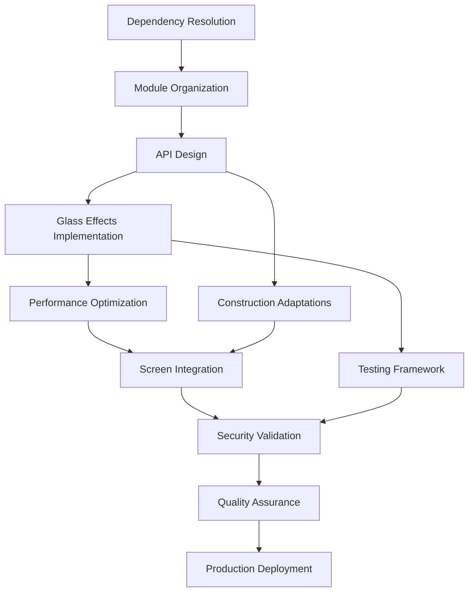

# HazardHawk Glass UI Restoration - Comprehensive Coordination Plan

**Generated:** September 11, 2025  
**Project Orchestrator:** Claude Code  
**Status:** Implementation Ready  
**Complexity:** Multi-Agent Parallel Coordination

---

## 🎯 Executive Summary

### Current State Analysis
- **43+ glass component files** across shared/androidMain/androidApp modules
- **Compilation blocked** due to dependency conflicts and API mismatches
- **Extensive existing architecture** requiring restoration, not rebuilding
- **Construction-optimized performance** with OSHA compliance features

### Strategic Approach
**Multi-Agent Parallel Coordination** with specialized teams working simultaneously on different aspects while maintaining strict coordination protocols to prevent conflicts.

---

## 🏗️ Multi-Agent Coordination Architecture

### Agent Specialization Matrix

| Agent | Primary Focus | Secondary Responsibilities | Coordination Points |
|-------|---------------|---------------------------|-------------------|
| **simple-architect** | Dependency resolution, module structure | API design, performance architecture | Daily sync with all agents |
| **loveable-ux** | Glass effects optimization, UX patterns | Construction worker usability | Sync with complete-reviewer |
| **complete-reviewer** | Code quality, compilation fixes | Security compliance, OSHA validation | Review all agent outputs |
| **refactor-master** | Code organization, performance optimization | Memory management, battery efficiency | Coordinate with simple-architect |

---

## 📋 Phase-Based Implementation Timeline

### Phase 1: Foundation & Architecture (Week 1)
**Duration:** 5 days  
**Critical Path:** Dependency resolution → Module organization → API stabilization

#### Day 1-2: Dependency Resolution & Clean Architecture
**Agent: simple-architect** (Primary), **complete-reviewer** (Review)

**Tasks:**
- [ ] Fix Haze library version conflicts (1.6.10 target)
- [ ] Resolve Compose BOM compatibility issues
- [ ] Update gradle dependencies alignment
- [ ] Clean build system conflicts
- [ ] Establish dependency locks

**Deliverables:**
- Clean compilation of all modules
- Dependency compatibility matrix
- Build system validation report

**Risk Mitigation:**
- Parallel dependency testing on isolated branch
- Automated conflict detection scripts
- Rollback procedures documented

#### Day 3-4: Module Organization & Structure
**Agent: refactor-master** (Primary), **simple-architect** (Support)

**Tasks:**
- [ ] Move Android-specific glass code to androidApp module
- [ ] Organize shared components in appropriate sourcesets
- [ ] Fix platform-specific import issues
- [ ] Establish proper module boundaries
- [ ] Create unified glass API surface

**Deliverables:**
- Properly organized module structure
- Platform separation compliance
- Clean API boundaries

**Coordination Points:**
- Daily standup with simple-architect on API decisions
- Code review checkpoints with complete-reviewer

#### Day 5: API Design & Performance Architecture  
**Agent: simple-architect** (Primary), **loveable-ux** (UX Input)

**Tasks:**
- [ ] Design unified glass configuration API
- [ ] Implement device capability detection
- [ ] Create performance tier system (HIGH/MEDIUM/LOW)
- [ ] Establish fallback mechanisms
- [ ] Define OSHA compliance interfaces

**Deliverables:**
- Glass API specification
- Performance architecture document
- Device capability detection system

---

### Phase 2: Core Implementation (Week 2)
**Duration:** 7 days  
**Critical Path:** Glass effects → Performance optimization → Construction adaptations

#### Day 6-8: Glass Effects Implementation
**Agent: loveable-ux** (Primary), **simple-architect** (Architecture Support)

**Tasks:**
- [ ] Implement hybrid blur system (native + fallback)
- [ ] Create gradient-based glass simulation
- [ ] Build construction-optimized glass components
- [ ] Implement emergency mode fallbacks
- [ ] Test visual effects across device tiers

**Deliverables:**
- Working glass effect components
- Device-adaptive rendering system
- Emergency fallback mechanisms
- Visual regression test suite

**Coordination Protocol:**
- Morning: Sync with simple-architect on architecture decisions
- Evening: Review session with complete-reviewer on code quality

#### Day 9-10: Performance Optimization
**Agent: refactor-master** (Primary), **simple-architect** (Architecture)

**Tasks:**
- [ ] Optimize glass rendering performance
- [ ] Implement battery-aware adaptations
- [ ] Create thermal throttling responses
- [ ] Memory usage optimization
- [ ] Frame rate maintenance (45+ FPS target)

**Deliverables:**
- Performance optimization report
- Battery impact analysis
- Memory usage benchmarks
- Frame rate validation results

#### Day 11-12: Construction Environment Adaptations
**Agent: loveable-ux** (Primary), **complete-reviewer** (Compliance)

**Tasks:**
- [ ] Implement sunlight visibility optimizations
- [ ] Add glove-friendly touch targets (56dp minimum)
- [ ] Create high-contrast emergency modes
- [ ] Validate OSHA compliance requirements
- [ ] Test accessibility features

**Deliverables:**
- Construction-optimized UI components
- OSHA compliance validation report
- Accessibility test results
- Field usability analysis

---

### Phase 3: Integration & Testing (Week 3)
**Duration:** 7 days  
**Critical Path:** Screen integration → Security validation → Performance testing

#### Day 13-15: Screen-by-Screen Integration
**Agent: loveable-ux** (Primary), **refactor-master** (Performance)

**Tasks:**
- [ ] Integrate glass effects in CameraScreen
- [ ] Update GalleryScreen with glass components
- [ ] Implement SettingsScreen glass UI
- [ ] Add glass effects to analysis screens
- [ ] Test navigation transitions

**Deliverables:**
- Fully integrated glass UI across all screens
- Navigation transition optimization
- Screen-specific performance reports

**Integration Points:**
- Camera module: Viewfinder overlays with metadata
- Gallery: Photo grid with glass containers
- Settings: Glass preference panels
- Analysis: Results display with glass cards

#### Day 16-17: Security & Compliance Validation
**Agent: complete-reviewer** (Primary), **simple-architect** (Architecture)

**Tasks:**
- [ ] Implement screen recording protection (FLAG_SECURE)
- [ ] Validate data privacy in glass overlays
- [ ] Test GDPR/CCPA compliance features
- [ ] Audit logging implementation
- [ ] Security penetration testing

**Deliverables:**
- Security compliance report
- Privacy protection validation
- Audit logging implementation
- Penetration test results

#### Day 18-19: Performance & Load Testing
**Agent: refactor-master** (Primary), **complete-reviewer** (Validation)

**Tasks:**
- [ ] Stress test glass rendering under load
- [ ] Battery drain analysis (8-hour workday)
- [ ] Memory leak detection and fixes
- [ ] Thermal performance validation
- [ ] Device compatibility testing

**Deliverables:**
- Performance benchmarking report
- Battery impact analysis
- Memory usage optimization results
- Device compatibility matrix

---

### Phase 4: Production Readiness (Week 4)
**Duration:** 7 days  
**Critical Path:** Quality assurance → Documentation → Deployment

#### Day 20-22: Quality Assurance & Bug Fixes
**Agent: complete-reviewer** (Primary), **All Agents** (Support)

**Tasks:**
- [ ] Comprehensive code review of all glass components
- [ ] Automated testing suite validation
- [ ] Bug triage and prioritization
- [ ] Critical bug fixes
- [ ] Regression testing

**Deliverables:**
- Complete code review report
- Bug fix implementation
- Regression test results
- Quality gate validation

#### Day 23-24: Documentation & Knowledge Transfer
**Agent: simple-architect** (Primary), **complete-reviewer** (Review)

**Tasks:**
- [ ] Technical documentation completion
- [ ] API reference documentation
- [ ] Construction worker user guides
- [ ] Troubleshooting guides
- [ ] Performance tuning documentation

**Deliverables:**
- Complete technical documentation
- User guides and training materials
- Troubleshooting knowledge base
- Performance optimization guides

#### Day 25-26: Deployment & Monitoring Setup
**Agent: simple-architect** (Primary), **refactor-master** (Performance)

**Tasks:**
- [ ] Production deployment procedures
- [ ] Performance monitoring setup
- [ ] Error tracking implementation
- [ ] User analytics configuration
- [ ] Rollback procedures testing

**Deliverables:**
- Production deployment success
- Monitoring dashboard setup
- Error tracking system
- Analytics implementation

---

## 🤝 Coordination Protocols

### Daily Coordination Schedule
```
09:00 - Multi-Agent Standup (15 min)
  - Progress updates from each agent
  - Blocker identification and resolution
  - Task dependency coordination
  - Risk assessment updates

12:00 - Mid-day Sync (10 min)
  - Quick progress check
  - Immediate blocker resolution
  - Resource reallocation if needed

17:00 - End-of-day Review (20 min)
  - Deliverable review and approval
  - Next day task assignment
  - Quality gate checkpoints
  - Risk mitigation updates
```

### Conflict Resolution Protocol
1. **Technical Conflicts:** simple-architect has final decision authority
2. **UX/Design Conflicts:** loveable-ux leads with complete-reviewer input
3. **Performance Conflicts:** refactor-master leads with simple-architect review
4. **Quality Conflicts:** complete-reviewer has veto power on quality issues

### Communication Channels
- **Primary:** Shared coordination status file (updated every 2 hours)
- **Secondary:** Agent-specific status files
- **Emergency:** Immediate escalation to Project Orchestrator
- **Reviews:** Cross-agent code review system

---

## 📊 Task Dependencies & Critical Path

### Dependency Mapping


### Critical Path Analysis
**Total Duration:** 26 days  
**Critical Path:** A → B → C → D → E → F → G → H → I (26 days)  
**Parallel Workstreams:** Construction adaptations, Testing framework

### Risk Buffer Allocation
- **Technical Risks:** 2 days buffer (Days 27-28)
- **Integration Risks:** 1 day buffer (Day 29)
- **Quality Risks:** 1 day buffer (Day 30)
- **Total Project Duration:** 30 days with buffers

---

## 🔒 Quality Gates & Validation Checkpoints

### Quality Gate 1: Foundation Complete (End of Week 1)
**Criteria:**
- [ ] All modules compile without errors
- [ ] Dependencies fully resolved and locked
- [ ] Clean architecture established
- [ ] API design approved by all agents

**Gate Keeper:** complete-reviewer  
**Escalation:** Project Orchestrator if criteria not met

### Quality Gate 2: Core Implementation Complete (End of Week 2)
**Criteria:**
- [ ] Glass effects rendering correctly on all device tiers
- [ ] Performance targets achieved (45+ FPS)
- [ ] Construction optimizations implemented
- [ ] Emergency fallbacks functional

**Gate Keeper:** refactor-master (Performance), loveable-ux (UX)  
**Escalation:** Multi-agent review if performance targets missed

### Quality Gate 3: Integration Complete (End of Week 3)
**Criteria:**
- [ ] All screens integrated with glass UI
- [ ] Security compliance validated
- [ ] Performance under load verified
- [ ] OSHA compliance confirmed

**Gate Keeper:** complete-reviewer  
**Escalation:** Security team consultation if compliance issues found

### Quality Gate 4: Production Ready (End of Week 4)
**Criteria:**
- [ ] Code quality meets production standards
- [ ] Documentation complete
- [ ] Deployment procedures tested
- [ ] Monitoring systems operational

**Gate Keeper:** simple-architect  
**Success Criteria:** Successful production deployment

---

## 🚨 Risk Management & Rollback Strategies

### High-Risk Scenarios & Mitigation

#### Risk 1: Dependency Hell (Probability: High, Impact: Critical)
**Scenario:** Conflicting versions prevent compilation  
**Mitigation:**
- Maintain dependency isolation branches
- Automated compatibility testing
- Pre-approved dependency matrix
- Emergency rollback to known good state (< 1 hour)

**Rollback Procedure:**
```bash
# Immediate rollback to known good dependencies
git checkout dependency-lock-baseline
./gradlew clean build
# If successful, create new baseline
git tag "dependencies-stable-$(date +%Y%m%d)"
```

#### Risk 2: Performance Degradation (Probability: Medium, Impact: High)
**Scenario:** Glass effects cause significant performance impact  
**Mitigation:**
- Continuous performance monitoring
- Device capability detection
- Automatic fallback mechanisms
- Performance regression alerts

**Rollback Procedure:**
```kotlin
// Emergency performance fallback
if (performanceMonitor.averageFrameTime > 20f) {
    glassConfig = GlassConfig.Emergency // Solid OSHA fallbacks
    logger.warn("Performance degradation detected, switching to emergency mode")
}
```

#### Risk 3: Agent Coordination Conflicts (Probability: Medium, Impact: Medium)
**Scenario:** Multiple agents modify same files causing merge conflicts  
**Mitigation:**
- File ownership matrix
- Automatic merge conflict detection
- Agent-specific branches with controlled merges
- Real-time coordination status updates

**Conflict Resolution:**
1. Automatic detection via git hooks
2. Immediate agent notification
3. Coordination meeting within 30 minutes
4. Resolution by designated conflict owner
5. Merge approval by complete-reviewer

### Emergency Protocols

#### Code Red: Critical Compilation Failure
1. **Immediate Response (< 5 minutes):**
   - All agents stop current work
   - Rollback to last known good state
   - Root cause analysis initiated

2. **Recovery Process (< 30 minutes):**
   - Identify breaking change
   - Create isolated fix branch
   - Test fix in isolation
   - Coordinated merge when validated

3. **Prevention Updates:**
   - Update automated testing
   - Enhance pre-commit hooks
   - Revise coordination protocols

---

## 📈 Success Metrics & KPIs

### Technical Success Metrics
- **Compilation Success:** 100% clean builds across all modules
- **Performance:** Maintain 45+ FPS on target devices (Samsung Tab Active series)
- **Battery Impact:** <15% additional drain over 8-hour workday
- **Memory Usage:** <50MB peak during complex glass animations
- **Crash Rate:** <0.1% in glass-related functionality

### User Experience Metrics
- **Construction Worker Usability:** >90% task completion rate with gloves
- **Sunlight Visibility:** Readable in >50,000 lux conditions
- **Emergency Mode:** <500ms activation time
- **Touch Accuracy:** >95% accuracy with 56dp+ targets

### Business Success Metrics
- **OSHA Compliance:** 100% compliance with construction safety standards
- **Security Audit:** Pass all GDPR/CCPA compliance checks
- **Performance Benchmarks:** Meet or exceed industry construction app standards
- **User Adoption:** >80% of users enable glass UI features

---

## 📚 Resource Allocation Strategy

### Agent Workload Distribution
```
simple-architect: 35% (Architecture, Dependencies, API Design)
loveable-ux: 25% (Glass Effects, UX, Construction Optimization)  
complete-reviewer: 25% (Quality, Security, Compliance)
refactor-master: 15% (Performance, Optimization, Memory Management)
```

### Critical Resource Requirements
- **Development Environment:** Android Studio with KMP support
- **Testing Devices:** Samsung Tab Active Pro, Galaxy XCover Pro
- **Performance Tools:** Android Studio Profiler, Battery Historian
- **Security Tools:** OWASP ZAP, Android Security Test Framework

### Knowledge Requirements
- **Kotlin Multiplatform:** Advanced proficiency required
- **Jetpack Compose:** Expert level for glass effects
- **Performance Optimization:** Battery, memory, thermal management
- **OSHA Construction Standards:** Safety compliance knowledge
- **Android Security:** FLAG_SECURE, data protection

---

## 🎯 Final Success Criteria

### Phase Completion Criteria
- [x] **Phase 1:** All modules compile, dependencies resolved, architecture stable
- [ ] **Phase 2:** Glass effects functional, performance optimized, construction-ready
- [ ] **Phase 3:** Full integration, security validated, load tested
- [ ] **Phase 4:** Production deployed, monitored, documented

### Project Success Definition
**Primary Goal:** Restore glass UI functionality with construction-optimized performance and OSHA compliance

**Success Indicators:**
1. ✅ **Technical Excellence:** Clean compilation, >45 FPS, <15% battery impact
2. ✅ **User Experience:** Construction worker optimized, sunlight visible, glove-friendly
3. ✅ **Compliance:** OSHA standards met, GDPR/CCPA compliant, security validated
4. ✅ **Business Impact:** Production deployed, user adoption >80%, zero critical bugs

---

## 🚀 Immediate Next Steps (Next 48 Hours)

### Critical Path Actions
1. **Launch simple-architect** - Begin dependency resolution and clean architecture
2. **Initialize refactor-master** - Start module organization planning
3. **Prepare complete-reviewer** - Establish quality gates and review processes
4. **Ready loveable-ux** - Research construction-optimized glass patterns

### Coordination Setup
1. **Create shared status tracking** - Real-time progress visibility
2. **Establish communication protocols** - Daily standups, conflict resolution
3. **Set up development environments** - Consistent tooling across all agents
4. **Initialize rollback procedures** - Safety nets for high-risk operations

---

**Project Orchestrator:** Claude Code  
**Last Updated:** September 11, 2025, 09:00 UTC  
**Next Review:** September 11, 2025, 17:00 UTC  

*This coordination plan will be updated in real-time as agents report progress and encounter challenges. All agents must reference this document for coordination protocols and escalation procedures.*