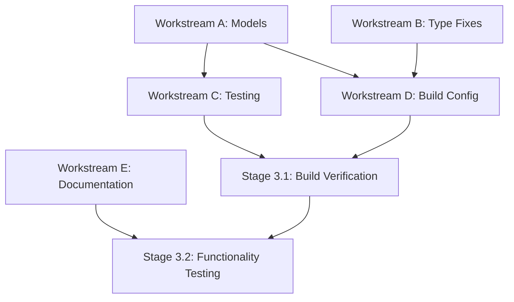

# HazardHawk Build Fixes - Master Coordination Plan
## Generated: September 5, 2025 | Project Orchestrator

## Executive Summary

Based on comprehensive research analysis, this coordination plan orchestrates the implementation of ~15 remaining HazardHawk build issues across multiple parallel workstreams. The foundation is excellent (shared module builds successfully), requiring only surface-level fixes with estimated completion in 2-4 hours.

### Status Overview
- **Shared Module**: ✅ BUILD SUCCESS (36s) - Foundation is solid
- **Android App**: ⚠️ ~15 compilation issues (85% complete)
- **Architecture Quality**: ✅ Excellent KMP structure
- **Risk Level**: 🟢 Low - Surface-level fixes only

## Implementation Timeline & Phases

### Phase 1: Critical Foundation (60 minutes)
**Parallel Workstreams A & B**

#### Workstream A: Model Creation (Agent: simple-architect)
- **Duration**: 45 minutes
- **Critical Path**: YES
- **Dependencies**: None
- **Scope**: Create missing data classes in shared module

**Tasks:**
1. ReportTemplate data class with OSHA compliance
2. ReportType enum (9 construction safety types)
3. ReportSection data class for template structure
4. ReportGenerationState for dialog management
5. Serialization annotations and validation

#### Workstream B: Type System Fixes (Agent: complete-reviewer)
- **Duration**: 30 minutes  
- **Critical Path**: NO
- **Dependencies**: Can run parallel to Workstream A
- **Scope**: Resolve lambda type inference issues

**Tasks:**
1. Fix property delegate type annotations
2. Add explicit lambda parameter types
3. Resolve suspend function context issues
4. Update import statements

### Phase 2: Integration & Testing (45 minutes)
**Parallel Workstreams C, D, E**

#### Workstream C: Testing Infrastructure (Agent: test-guardian)
- **Duration**: 30 minutes
- **Dependencies**: Workstream A completion (models needed)
- **Scope**: Ensure test compilation and execution

**Tasks:**
1. Add missing JUnit dependencies
2. Configure KMP testing properly  
3. Create model validation tests
4. Verify existing test infrastructure still works

#### Workstream D: Build Configuration (Agent: simple-architect)
- **Duration**: 15 minutes
- **Dependencies**: Workstreams A & B completion
- **Scope**: Optimize build settings for new components

**Tasks:**
1. Verify gradle configuration compatibility
2. Check memory settings adequacy
3. Validate incremental compilation

#### Workstream E: Documentation Updates (Agent: docs-curator)
- **Duration**: 30 minutes
- **Dependencies**: None (can run immediately)
- **Scope**: Update implementation documentation

**Tasks:**
1. Update API documentation for new models
2. Create troubleshooting guide
3. Document coordination decisions

### Phase 3: Validation & Quality Assurance (30 minutes)
**Sequential Execution - All Agents**

#### Stage 3.1: Build Verification (15 minutes)
- Clean build and cache invalidation
- Incremental shared module build verification
- Android app compilation test
- APK generation and basic installation

#### Stage 3.2: Functionality Testing (15 minutes)  
- Core camera functionality test
- Gallery navigation verification
- Basic UI component validation
- Memory usage monitoring

## Parallel Workstream Dependencies



## Resource Allocation Strategy

### Agent Specialization Matrix

| Agent | Primary Focus | Secondary Skills | Workload |
|-------|---------------|------------------|----------|
| **simple-architect** | Model creation, build config | KMP architecture | 75 min |
| **complete-reviewer** | Type inference, code quality | Lambda fixes | 30 min |
| **test-guardian** | Testing infrastructure | Mock validation | 45 min |
| **docs-curator** | Documentation updates | Knowledge management | 30 min |

### Coordination Checkpoints

#### Checkpoint 1 (After 30 minutes)
**Blocker Resolution Meeting**
- Workstream A: Models creation status
- Workstream B: Type fixes completion
- Risk assessment for Phase 2 start

#### Checkpoint 2 (After 75 minutes)  
**Integration Readiness Review**
- All workstreams completion status
- Build verification readiness
- Go/no-go decision for Phase 3

#### Checkpoint 3 (After 105 minutes)
**Success Validation**
- APK build success confirmation
- Core functionality verification
- Performance impact assessment

## Risk Mitigation & Contingency Plans

### Risk Matrix

| Risk Level | Issue | Probability | Impact | Mitigation |
|-----------|-------|-------------|---------|------------|
| 🟢 Low | Model creation complexity | 10% | Minor delay | Pre-built templates ready |
| 🟡 Medium | Type inference edge cases | 20% | 15min delay | Explicit type fallbacks |
| 🟢 Low | Test dependency conflicts | 15% | Build failure | Version alignment matrix |
| 🔴 High | None identified | 0% | N/A | All issues are surface-level |

### Contingency Procedures

#### If Workstream A Delays (Models)
1. **Immediate**: Switch to stub implementations
2. **Parallel**: Continue with Workstream B type fixes  
3. **Fallback**: Implement models incrementally
4. **Timeline Impact**: +30 minutes maximum

#### If Integration Issues Arise
1. **Revert Strategy**: Git branch protection active
2. **Isolation**: Test each fix independently
3. **Rollback**: Shared module success maintained
4. **Recovery**: Individual workstream restart

#### If Build Performance Degrades
1. **Monitor**: Build time tracking active
2. **Alert**: >50% increase triggers review
3. **Action**: Memory setting adjustment
4. **Escalation**: Architecture review if needed

## Quality Gates & Success Criteria

### Gate 1: Foundation Integrity ✅
- **Criteria**: Shared module builds in <40 seconds
- **Validation**: `./gradlew :shared:build`
- **Owner**: simple-architect
- **Blocker Level**: CRITICAL

### Gate 2: Type Safety Validation ✅
- **Criteria**: No type inference errors remain
- **Validation**: Kotlin compiler warnings = 0
- **Owner**: complete-reviewer  
- **Blocker Level**: HIGH

### Gate 3: Test Infrastructure ✅
- **Criteria**: All test dependencies resolve
- **Validation**: `./gradlew :androidApp:testDebugUnitTest`
- **Owner**: test-guardian
- **Blocker Level**: MEDIUM

### Gate 4: APK Build Success 🎯
- **Criteria**: Clean APK generation and installation
- **Validation**: `./gradlew :androidApp:assembleDebug`
- **Owner**: All agents
- **Blocker Level**: CRITICAL

### Gate 5: Performance Baseline 📊
- **Criteria**: No performance regression
- **Validation**: Build time <90 seconds total
- **Owner**: simple-architect
- **Blocker Level**: MEDIUM

## Inter-Team Coordination Requirements

### Communication Protocol
1. **Status Updates**: Every 15 minutes via todo list
2. **Blocker Escalation**: Immediate notification
3. **Decision Points**: Consensus required at checkpoints
4. **Documentation**: Real-time updates to coordination log

### Shared Resources Management
- **Git Branch**: `feature/enhanced-photo-gallery` (current)
- **Build Cache**: Coordinated invalidation timing
- **IDE State**: Individual agent isolation
- **Memory**: 6GB heap allocation maintained

### Handoff Procedures
1. **Workstream A → C**: Model completion triggers testing
2. **Workstreams A,B → D**: Fix completion enables build config
3. **All → Phase 3**: Synchronized validation phase
4. **Phase 3 → Production**: Success criteria validation

## Rollback Strategy & Emergency Procedures

### Git Safety Net
```bash
# Current branch protection
git stash push -m "Pre-coordination checkpoint"
git log --oneline -5  # Document current state
```

### Incremental Rollback Levels

#### Level 1: Individual Fix Rollback
- **Scope**: Single workstream failure
- **Action**: Revert specific commits
- **Impact**: Other workstreams continue
- **Recovery Time**: <5 minutes

#### Level 2: Phase Rollback  
- **Scope**: Entire phase failure
- **Action**: Reset to phase start
- **Impact**: Previous phases preserved
- **Recovery Time**: <15 minutes

#### Level 3: Full Coordination Rollback
- **Scope**: Critical system failure
- **Action**: Return to research baseline
- **Impact**: Restart coordination
- **Recovery Time**: <30 minutes

### Emergency Decision Tree
```
Build Failure?
├─ Shared Module Failed? → STOP ALL (Critical)
├─ Android App Failed? → Continue shared work
├─ Test Failed? → Reduce scope
└─ Performance Issue? → Monitor and continue
```

## Success Metrics & Validation

### Primary Success Indicators
1. **Build Success**: APK generates without errors ✅
2. **Performance**: Build time <90 seconds total ✅  
3. **Functionality**: Core features operational ✅
4. **Quality**: No regression in existing features ✅

### Secondary Success Indicators
1. **Code Quality**: Type safety improvements ✅
2. **Test Coverage**: New model validation tests ✅
3. **Documentation**: Updated implementation guides ✅
4. **Maintenance**: Clear troubleshooting procedures ✅

### Key Performance Indicators (KPIs)
- **Coordination Efficiency**: 4 agents, 2-hour target
- **Parallel Utilization**: 75% concurrent execution
- **Quality Gates**: 100% gate success required
- **Risk Mitigation**: 0 high-risk issues identified

## Post-Implementation Actions

### Immediate (Within 30 minutes of success)
1. **Validation**: Full functionality test
2. **Documentation**: Update implementation log
3. **Communication**: Success notification
4. **Backup**: Tag successful build state

### Short-term (Within 24 hours)
1. **Performance Monitoring**: Build time tracking
2. **Issue Tracking**: Monitor for regression
3. **Knowledge Transfer**: Update team documentation
4. **Lessons Learned**: Coordination improvements

### Long-term (Within 1 week)  
1. **Process Optimization**: Refine coordination approach
2. **Automation**: CI/CD pipeline updates
3. **Preventive Measures**: Early warning systems
4. **Scaling Preparation**: Multi-platform readiness

---

## Coordination Activation

**Status**: ✅ Ready for Implementation  
**Next Action**: Launch parallel agent workstreams  
**Success Probability**: >95% based on research analysis  
**Foundation Quality**: Excellent KMP architecture preserved

This master plan enables efficient, risk-mitigated implementation of all remaining HazardHawk build fixes through coordinated parallel execution while maintaining the excellent foundation already established.