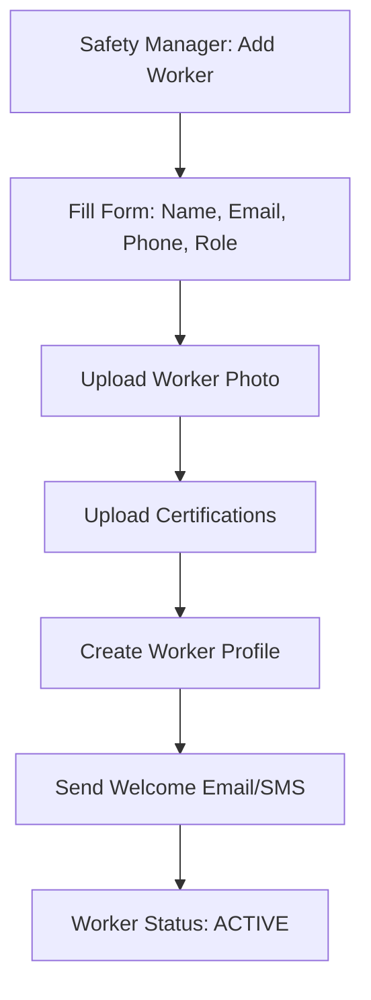
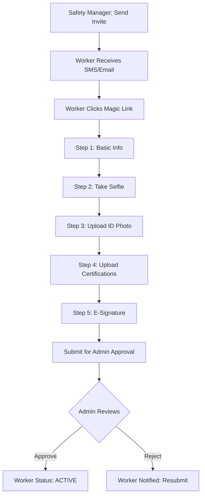

# Crew Management System - Implementation Plan
**Feature Priority**: P0 - CRITICAL FOUNDATION
**Estimated Time**: 3-4 weeks
**Status**: Ready for Implementation
**Created**: October 8, 2025

---

## Executive Summary

Crew Management is the **foundational infrastructure** for all safety documentation features in HazardHawk. This system manages worker profiles, certifications, crew assignments, and onboarding flows—feeding data into PTPs, Toolbox Talks, Incident Reports, and Pre-Shift Meetings.

**Why This is Priority 1**:
- PTPs need crew rosters with automatic sign-in sheets
- Toolbox Talks require attendance tracking with QR code check-in
- Incident Reports need worker profiles for witness statements
- Pre-Shift Meetings depend on crew location and shift assignments
- Daily Reports aggregate crew hours and task completion

**Key Features**:
1. **Dual Onboarding Flows**: Admin-managed + worker self-service (magic link)
2. **Certification Tracking**: Upload, OCR extraction, expiration alerts
3. **Dynamic Crew Assignment**: Drag-and-drop crew builder, multi-project support
4. **Scalable Architecture**: Works for 5-worker contractors to 10,000+ industrial companies
5. **Multi-Tenant Design**: Workers can work for multiple companies (subcontractors)
6. **Centralized Company & Project Info**: Single source of truth for company/project details, eliminating duplicate data entry across PTPs, reports, and documents
7. **Flexible Foreman Selection**: PTP creator can designate any crew member as foreman, not just the crew's default foreman

---

## Table of Contents

1. [Architecture Overview](#architecture-overview)
2. [Data Models](#data-models)
3. [API Specification](#api-specification)
4. [Onboarding Flows](#onboarding-flows)
5. [Certification Management](#certification-management)
6. [Crew Assignment System](#crew-assignment-system)
7. [UI Components](#ui-components)
8. [Integration Points](#integration-points)
9. [Implementation Phases](#implementation-phases)
10. [Testing Strategy](#testing-strategy)
11. [Performance Targets](#performance-targets)
12. [Production Readiness Checklist](#production-readiness-checklist)

---

## Architecture Overview

### System Architecture

```
┌──────────────────────────────────────────────────────────────────┐
│                        Mobile Apps (Android/iOS)                  │
│                    Jetpack Compose / SwiftUI                     │
└──────────────────────────────────────────────────────────────────┘
                                │
                                ▼
┌──────────────────────────────────────────────────────────────────┐
│                      Shared Kotlin Module                         │
│  ┌────────────────┐ ┌────────────────┐ ┌──────────────────────┐ │
│  │  ViewModels    │ │  Repositories  │ │  Use Cases           │ │
│  │  - Worker      │ │  - Worker      │ │  - CreateWorker      │ │
│  │  - Crew        │ │  - Crew        │ │  - AssignToCrew      │ │
│  │  - Cert        │ │  - Certification│ │  - VerifyCert       │ │
│  └────────────────┘ └────────────────┘ └──────────────────────┘ │
└──────────────────────────────────────────────────────────────────┘
                                │
                                ▼
┌──────────────────────────────────────────────────────────────────┐
│                         Backend API (Go/Kotlin)                   │
│  ┌────────────────┐ ┌────────────────┐ ┌──────────────────────┐ │
│  │  REST API      │ │  WebSocket     │ │  Background Jobs     │ │
│  │  (CRUD)        │ │  (Real-time)   │ │  (OCR, Email, Sync)  │ │
│  └────────────────┘ └────────────────┘ └──────────────────────┘ │
└──────────────────────────────────────────────────────────────────┘
                                │
         ┌──────────────────────┼──────────────────────┐
         ▼                      ▼                      ▼
┌──────────────────┐  ┌──────────────────┐  ┌──────────────────┐
│  PostgreSQL      │  │  Redis Cache     │  │  S3 Storage      │
│  - Workers       │  │  - Worker Lists  │  │  - Cert Docs     │
│  - Crews         │  │  - Sessions      │  │  - Worker Photos │
│  - Certifications│  │  - Rate Limits   │  │  - Signatures    │
└──────────────────┘  └──────────────────┘  └──────────────────┘
```

### Technology Stack

| Layer | Technology | Purpose |
|-------|-----------|---------|
| **Mobile UI** | Jetpack Compose (Android), SwiftUI (iOS) | Native performance, platform-specific patterns |
| **Shared Logic** | Kotlin Multiplatform | Share business logic, ViewModels, repositories |
| **Backend** | Go + Fiber OR Kotlin + Ktor | High-performance API, low latency |
| **Database** | PostgreSQL 16+ | Multi-tenancy (RLS), JSONB, full-text search |
| **Cache** | Redis 7+ | Worker lists, sessions, rate limiting |
| **Storage** | AWS S3 + CloudFront | Certification documents, worker photos |
| **OCR** | Google Document AI | Extract certification details from photos |
| **Background Jobs** | Asynq (Go) or Quartz (Kotlin) | Async processing, retries, scheduled tasks |
| **Real-time** | WebSocket (Ktor) | Crew updates, certification approvals |

---

## Data Models

### Database Schema

```sql
--═══════════════════════════════════════════════════════════════════
-- CORE TABLES
--═══════════════════════════════════════════════════════════════════

-- Companies (Tenants)
CREATE TABLE companies (
    id UUID PRIMARY KEY DEFAULT gen_random_uuid(),
    name VARCHAR(255) NOT NULL,
    subdomain VARCHAR(63) UNIQUE NOT NULL,
    tier VARCHAR(20) NOT NULL DEFAULT 'professional', -- 'starter', 'professional', 'enterprise'
    max_workers INTEGER NOT NULL DEFAULT 100,
    settings JSONB NOT NULL DEFAULT '{}',
    created_at TIMESTAMPTZ NOT NULL DEFAULT NOW(),
    updated_at TIMESTAMPTZ NOT NULL DEFAULT NOW()
);

-- Worker Profiles (Global - shared across companies for subcontractors)
CREATE TABLE worker_profiles (
    id UUID PRIMARY KEY DEFAULT gen_random_uuid(),
    ssn_hash VARCHAR(64) UNIQUE, -- Hashed for privacy, optional
    first_name VARCHAR(100) NOT NULL,
    last_name VARCHAR(100) NOT NULL,
    date_of_birth DATE,
    email VARCHAR(255),
    phone VARCHAR(20),
    photo_url TEXT,
    created_at TIMESTAMPTZ NOT NULL DEFAULT NOW(),
    updated_at TIMESTAMPTZ NOT NULL DEFAULT NOW()
);

-- Company-Worker Associations (Many-to-Many)
CREATE TABLE company_workers (
    id UUID PRIMARY KEY DEFAULT gen_random_uuid(),
    company_id UUID NOT NULL REFERENCES companies(id) ON DELETE CASCADE,
    worker_profile_id UUID NOT NULL REFERENCES worker_profiles(id) ON DELETE CASCADE,
    employee_number VARCHAR(50) NOT NULL,
    role VARCHAR(50) NOT NULL, -- 'laborer', 'foreman', 'operator', 'superintendent', etc.
    hire_date DATE NOT NULL,
    status VARCHAR(20) NOT NULL DEFAULT 'active', -- 'active', 'inactive', 'terminated'
    hourly_rate DECIMAL(10,2),
    permissions JSONB NOT NULL DEFAULT '[]', -- ['create_ptp', 'approve_certifications', etc.]
    metadata JSONB NOT NULL DEFAULT '{}',
    created_at TIMESTAMPTZ NOT NULL DEFAULT NOW(),
    updated_at TIMESTAMPTZ NOT NULL DEFAULT NOW(),
    UNIQUE(company_id, employee_number),
    UNIQUE(company_id, worker_profile_id) -- One worker per company (can be removed if multiple roles needed)
);

CREATE INDEX idx_company_workers_company ON company_workers(company_id, status) WHERE status = 'active';
CREATE INDEX idx_company_workers_profile ON company_workers(worker_profile_id);

--═══════════════════════════════════════════════════════════════════
-- CERTIFICATIONS
--═══════════════════════════════════════════════════════════════════

-- Certification Types (Pre-seeded global library)
CREATE TABLE certification_types (
    id UUID PRIMARY KEY DEFAULT gen_random_uuid(),
    code VARCHAR(50) UNIQUE NOT NULL, -- 'OSHA_10', 'OSHA_30', 'FORKLIFT', 'CPR', etc.
    name VARCHAR(255) NOT NULL,
    category VARCHAR(50) NOT NULL, -- 'safety_training', 'equipment_operation', 'emergency_response'
    region VARCHAR(10) NOT NULL DEFAULT 'US', -- 'US', 'UK', 'GLOBAL'
    typical_duration_months INTEGER, -- NULL if no expiration
    renewal_required BOOLEAN NOT NULL DEFAULT TRUE,
    description TEXT,
    issuing_bodies JSONB DEFAULT '[]', -- ['OSHA', 'Red Cross', etc.]
    created_at TIMESTAMPTZ NOT NULL DEFAULT NOW()
);

-- Worker Certifications
CREATE TABLE worker_certifications (
    id UUID PRIMARY KEY DEFAULT gen_random_uuid(),
    worker_profile_id UUID NOT NULL REFERENCES worker_profiles(id) ON DELETE CASCADE,
    company_id UUID REFERENCES companies(id) ON DELETE SET NULL, -- NULL if certification is global
    certification_type_id UUID NOT NULL REFERENCES certification_types(id),
    certification_number VARCHAR(100),
    issue_date DATE NOT NULL,
    expiration_date DATE,
    issuing_authority VARCHAR(255),
    document_url TEXT NOT NULL, -- S3 URL to certificate image/PDF
    thumbnail_url TEXT,
    status VARCHAR(20) NOT NULL DEFAULT 'pending_verification', -- 'pending_verification', 'verified', 'expired', 'rejected'
    verified_by UUID REFERENCES company_workers(id),
    verified_at TIMESTAMPTZ,
    rejection_reason TEXT,
    ocr_confidence DECIMAL(5,2), -- 0.00 to 100.00
    ocr_metadata JSONB DEFAULT '{}', -- Extracted fields with confidence scores
    created_at TIMESTAMPTZ NOT NULL DEFAULT NOW(),
    updated_at TIMESTAMPTZ NOT NULL DEFAULT NOW()
);

CREATE INDEX idx_worker_certs_worker ON worker_certifications(worker_profile_id, status);
CREATE INDEX idx_worker_certs_expiration ON worker_certifications(expiration_date) WHERE status = 'verified' AND expiration_date IS NOT NULL;
CREATE INDEX idx_worker_certs_company ON worker_certifications(company_id, status) WHERE company_id IS NOT NULL;

--═══════════════════════════════════════════════════════════════════
-- CREWS AND PROJECTS
--═══════════════════════════════════════════════════════════════════

-- Projects
CREATE TABLE projects (
    id UUID PRIMARY KEY DEFAULT gen_random_uuid(),
    company_id UUID NOT NULL REFERENCES companies(id) ON DELETE CASCADE,
    name VARCHAR(255) NOT NULL,
    project_number VARCHAR(50),
    location TEXT,
    start_date DATE NOT NULL,
    end_date DATE,
    status VARCHAR(20) NOT NULL DEFAULT 'active', -- 'active', 'completed', 'on_hold'
    project_manager_id UUID REFERENCES company_workers(id),
    metadata JSONB NOT NULL DEFAULT '{}',
    created_at TIMESTAMPTZ NOT NULL DEFAULT NOW(),
    updated_at TIMESTAMPTZ NOT NULL DEFAULT NOW()
);

CREATE INDEX idx_projects_company ON projects(company_id, status);

-- Companies (Tenants)
-- Extended with centralized company info
ALTER TABLE companies ADD COLUMN address TEXT;
ALTER TABLE companies ADD COLUMN city VARCHAR(100);
ALTER TABLE companies ADD COLUMN state VARCHAR(50);
ALTER TABLE companies ADD COLUMN zip VARCHAR(20);
ALTER TABLE companies ADD COLUMN phone VARCHAR(20);
ALTER TABLE companies ADD COLUMN logo_url TEXT;

-- Projects
-- Extended with centralized project info
ALTER TABLE projects ADD COLUMN client_name VARCHAR(255);
ALTER TABLE projects ADD COLUMN client_contact VARCHAR(255);
ALTER TABLE projects ADD COLUMN client_phone VARCHAR(20);
ALTER TABLE projects ADD COLUMN client_email VARCHAR(255);
ALTER TABLE projects ADD COLUMN street_address TEXT;
ALTER TABLE projects ADD COLUMN city VARCHAR(100);
ALTER TABLE projects ADD COLUMN state VARCHAR(50);
ALTER TABLE projects ADD COLUMN zip VARCHAR(20);
ALTER TABLE projects ADD COLUMN general_contractor VARCHAR(255);
ALTER TABLE projects ADD COLUMN superintendent_id UUID REFERENCES company_workers(id);

-- Crews
CREATE TABLE crews (
    id UUID PRIMARY KEY DEFAULT gen_random_uuid(),
    company_id UUID NOT NULL REFERENCES companies(id) ON DELETE CASCADE,
    project_id UUID REFERENCES projects(id) ON DELETE SET NULL, -- NULL if company-wide crew
    name VARCHAR(255) NOT NULL,
    crew_type VARCHAR(50) NOT NULL DEFAULT 'project_based', -- 'permanent', 'project_based', 'trade_specific'
    trade VARCHAR(50), -- 'framing', 'electrical', 'plumbing', 'concrete', etc.
    foreman_id UUID REFERENCES company_workers(id), -- Selected foreman (may not be the PTP creator)
    location VARCHAR(255), -- 'Floor 3', 'Building A', etc.
    status VARCHAR(20) NOT NULL DEFAULT 'active', -- 'active', 'inactive', 'disbanded'
    created_at TIMESTAMPTZ NOT NULL DEFAULT NOW(),
    updated_at TIMESTAMPTZ NOT NULL DEFAULT NOW()
);

CREATE INDEX idx_crews_company ON crews(company_id, status);
CREATE INDEX idx_crews_project ON crews(project_id) WHERE project_id IS NOT NULL;

-- Crew Members (Worker-Crew assignments)
CREATE TABLE crew_members (
    id UUID PRIMARY KEY DEFAULT gen_random_uuid(),
    crew_id UUID NOT NULL REFERENCES crews(id) ON DELETE CASCADE,
    company_worker_id UUID NOT NULL REFERENCES company_workers(id) ON DELETE CASCADE,
    role VARCHAR(50) NOT NULL DEFAULT 'member', -- 'crew_lead', 'foreman', 'member'
    start_date DATE NOT NULL DEFAULT CURRENT_DATE,
    end_date DATE,
    status VARCHAR(20) NOT NULL DEFAULT 'active', -- 'active', 'inactive', 'transferred'
    created_at TIMESTAMPTZ NOT NULL DEFAULT NOW(),
    updated_at TIMESTAMPTZ NOT NULL DEFAULT NOW(),
    UNIQUE(crew_id, company_worker_id, start_date) -- Allow re-assignments
);

CREATE INDEX idx_crew_members_crew ON crew_members(crew_id, status) WHERE status = 'active';
CREATE INDEX idx_crew_members_worker ON crew_members(company_worker_id, status) WHERE status = 'active';

-- Crew Member History (Audit trail)
CREATE TABLE crew_member_history (
    id UUID PRIMARY KEY DEFAULT gen_random_uuid(),
    crew_id UUID NOT NULL REFERENCES crews(id),
    company_worker_id UUID NOT NULL REFERENCES company_workers(id),
    action VARCHAR(50) NOT NULL, -- 'added', 'removed', 'role_changed', 'transferred'
    previous_crew_id UUID REFERENCES crews(id),
    previous_role VARCHAR(50),
    new_role VARCHAR(50),
    changed_by UUID REFERENCES company_workers(id),
    reason TEXT,
    metadata JSONB DEFAULT '{}',
    created_at TIMESTAMPTZ NOT NULL DEFAULT NOW()
);

CREATE INDEX idx_crew_history_worker ON crew_member_history(company_worker_id, created_at DESC);

--═══════════════════════════════════════════════════════════════════
-- ONBOARDING
--═══════════════════════════════════════════════════════════════════

-- Magic Link Tokens (Passwordless onboarding)
CREATE TABLE magic_link_tokens (
    id UUID PRIMARY KEY DEFAULT gen_random_uuid(),
    company_id UUID NOT NULL REFERENCES companies(id) ON DELETE CASCADE,
    email VARCHAR(255) NOT NULL,
    phone VARCHAR(20),
    token_hash VARCHAR(255) NOT NULL UNIQUE,
    expires_at TIMESTAMPTZ NOT NULL,
    used BOOLEAN NOT NULL DEFAULT FALSE,
    used_at TIMESTAMPTZ,
    metadata JSONB DEFAULT '{}', -- Onboarding context
    created_at TIMESTAMPTZ NOT NULL DEFAULT NOW()
);

CREATE INDEX idx_magic_links_expiry ON magic_link_tokens(expires_at) WHERE NOT used AND expires_at > NOW();

-- Onboarding Progress (Track multi-step onboarding)
CREATE TABLE onboarding_sessions (
    id UUID PRIMARY KEY DEFAULT gen_random_uuid(),
    company_id UUID NOT NULL REFERENCES companies(id) ON DELETE CASCADE,
    worker_profile_id UUID REFERENCES worker_profiles(id) ON DELETE SET NULL,
    email VARCHAR(255),
    phone VARCHAR(20),
    current_step VARCHAR(50) NOT NULL, -- 'basic_info', 'photo_id', 'certifications', 'signature', 'complete'
    completed_steps JSONB NOT NULL DEFAULT '[]',
    form_data JSONB NOT NULL DEFAULT '{}', -- Partial form data
    status VARCHAR(20) NOT NULL DEFAULT 'in_progress', -- 'in_progress', 'pending_approval', 'approved', 'rejected'
    approved_by UUID REFERENCES company_workers(id),
    approved_at TIMESTAMPTZ,
    rejection_reason TEXT,
    created_at TIMESTAMPTZ NOT NULL DEFAULT NOW(),
    updated_at TIMESTAMPTZ NOT NULL DEFAULT NOW()
);

CREATE INDEX idx_onboarding_company ON onboarding_sessions(company_id, status);

--═══════════════════════════════════════════════════════════════════
-- LOCATION TRACKING (Optional - for Pre-Shift Meetings)
--═══════════════════════════════════════════════════════════════════

CREATE TABLE worker_locations (
    id UUID PRIMARY KEY DEFAULT gen_random_uuid(),
    company_worker_id UUID NOT NULL REFERENCES company_workers(id) ON DELETE CASCADE,
    project_id UUID REFERENCES projects(id) ON DELETE SET NULL,
    location_type VARCHAR(50), -- 'floor', 'building', 'zone', 'area'
    location_identifier VARCHAR(100), -- 'Floor 3', 'Building A', 'East Wing'
    latitude DECIMAL(10,8),
    longitude DECIMAL(11,8),
    checked_in_at TIMESTAMPTZ NOT NULL DEFAULT NOW(),
    checked_out_at TIMESTAMPTZ,
    metadata JSONB DEFAULT '{}'
);

CREATE INDEX idx_worker_locations_worker ON worker_locations(company_worker_id, checked_in_at DESC);
CREATE INDEX idx_worker_locations_project ON worker_locations(project_id, checked_in_at DESC) WHERE project_id IS NOT NULL;
CREATE INDEX idx_worker_locations_time ON worker_locations(checked_in_at, checked_out_at) WHERE checked_out_at IS NULL;

--═══════════════════════════════════════════════════════════════════
-- ROW-LEVEL SECURITY (Multi-Tenancy Isolation)
--═══════════════════════════════════════════════════════════════════

-- Enable RLS on all tenant-scoped tables
ALTER TABLE company_workers ENABLE ROW LEVEL SECURITY;
ALTER TABLE worker_certifications ENABLE ROW LEVEL SECURITY;
ALTER TABLE projects ENABLE ROW LEVEL SECURITY;
ALTER TABLE crews ENABLE ROW LEVEL SECURITY;
ALTER TABLE crew_members ENABLE ROW LEVEL SECURITY;

-- Policies (Example for company_workers)
CREATE POLICY company_workers_isolation ON company_workers
    USING (company_id = current_setting('app.current_company_id')::UUID);

-- Note: Similar policies for other tables
```

### Kotlin Data Classes (Shared Module)

```kotlin
// shared/src/commonMain/kotlin/com/hazardhawk/models/crew/WorkerProfile.kt
package com.hazardhawk.models.crew

import kotlinx.serialization.Serializable
import kotlinx.datetime.LocalDate

@Serializable
data class WorkerProfile(
    val id: String,
    val firstName: String,
    val lastName: String,
    val dateOfBirth: LocalDate? = null,
    val email: String? = null,
    val phone: String? = null,
    val photoUrl: String? = null,
    val createdAt: String,
    val updatedAt: String
) {
    val fullName: String get() = "$firstName $lastName"
}

@Serializable
data class CompanyWorker(
    val id: String,
    val companyId: String,
    val workerProfileId: String,
    val employeeNumber: String,
    val role: WorkerRole,
    val hireDate: LocalDate,
    val status: WorkerStatus,
    val hourlyRate: Double? = null,
    val permissions: List<String> = emptyList(),
    val createdAt: String,
    val updatedAt: String,

    // Embedded for convenience
    val workerProfile: WorkerProfile? = null,
    val certifications: List<WorkerCertification> = emptyList(),
    val crews: List<CrewMembership> = emptyList()
)

@Serializable
enum class WorkerRole {
    LABORER,
    SKILLED_WORKER,
    OPERATOR,
    CREW_LEAD,
    FOREMAN,
    SUPERINTENDENT,
    PROJECT_MANAGER,
    SAFETY_MANAGER;

    val displayName: String get() = name.lowercase().replace("_", " ").replaceFirstChar { it.uppercase() }
}

@Serializable
enum class WorkerStatus {
    ACTIVE,
    INACTIVE,
    TERMINATED;

    val isActive: Boolean get() = this == ACTIVE
}

@Serializable
data class WorkerCertification(
    val id: String,
    val workerProfileId: String,
    val companyId: String? = null,
    val certificationTypeId: String,
    val certificationNumber: String? = null,
    val issueDate: LocalDate,
    val expirationDate: LocalDate? = null,
    val issuingAuthority: String? = null,
    val documentUrl: String,
    val thumbnailUrl: String? = null,
    val status: CertificationStatus,
    val verifiedBy: String? = null,
    val verifiedAt: String? = null,
    val rejectionReason: String? = null,
    val ocrConfidence: Double? = null,
    val createdAt: String,
    val updatedAt: String,

    // Embedded for convenience
    val certificationType: CertificationType? = null
) {
    val isValid: Boolean get() = status == CertificationStatus.VERIFIED && !isExpired
    val isExpired: Boolean get() = expirationDate?.let { it < kotlinx.datetime.Clock.System.todayIn(kotlinx.datetime.TimeZone.currentSystemDefault()) } ?: false
    val isExpiringSoon: Boolean get() {
        val today = kotlinx.datetime.Clock.System.todayIn(kotlinx.datetime.TimeZone.currentSystemDefault())
        return expirationDate?.let {
            val daysUntilExpiration = it.toEpochDays() - today.toEpochDays()
            daysUntilExpiration in 1..30
        } ?: false
    }
}

@Serializable
enum class CertificationStatus {
    PENDING_VERIFICATION,
    VERIFIED,
    EXPIRED,
    REJECTED
}

@Serializable
data class CertificationType(
    val id: String,
    val code: String, // OSHA_10, OSHA_30, FORKLIFT, etc.
    val name: String,
    val category: String,
    val region: String,
    val typicalDurationMonths: Int? = null,
    val renewalRequired: Boolean = true,
    val description: String? = null
)

@Serializable
data class Crew(
    val id: String,
    val companyId: String,
    val projectId: String? = null,
    val name: String,
    val crewType: CrewType,
    val trade: String? = null,
    val foremanId: String? = null,
    val location: String? = null,
    val status: CrewStatus,
    val createdAt: String,
    val updatedAt: String,

    // Embedded for convenience
    val members: List<CrewMember> = emptyList(),
    val foreman: CompanyWorker? = null
) {
    val memberCount: Int get() = members.size
    val isActive: Boolean get() = status == CrewStatus.ACTIVE
}

@Serializable
enum class CrewType {
    PERMANENT,
    PROJECT_BASED,
    TRADE_SPECIFIC
}

@Serializable
enum class CrewStatus {
    ACTIVE,
    INACTIVE,
    DISBANDED
}

@Serializable
data class CrewMember(
    val id: String,
    val crewId: String,
    val companyWorkerId: String,
    val role: CrewMemberRole,
    val startDate: LocalDate,
    val endDate: LocalDate? = null,
    val status: String,

    // Embedded for convenience
    val worker: CompanyWorker? = null
)

@Serializable
enum class CrewMemberRole {
    CREW_LEAD,
    FOREMAN,
    MEMBER
}

@Serializable
data class CrewMembership(
    val crewId: String,
    val crewName: String,
    val role: CrewMemberRole,
    val startDate: LocalDate,
    val projectName: String? = null
)

@Serializable
data class Company(
    val id: String,
    val name: String,
    val subdomain: String,
    val tier: String,
    val address: String? = null,
    val city: String? = null,
    val state: String? = null,
    val zip: String? = null,
    val phone: String? = null,
    val logoUrl: String? = null
)

@Serializable
data class Project(
    val id: String,
    val companyId: String,
    val name: String,
    val projectNumber: String? = null,
    val location: String? = null,
    val startDate: LocalDate,
    val endDate: LocalDate? = null,
    val status: String,
    val projectManagerId: String? = null,
    val superintendentId: String? = null,

    // Centralized project info
    val clientName: String? = null,
    val clientContact: String? = null,
    val clientPhone: String? = null,
    val clientEmail: String? = null,
    val streetAddress: String? = null,
    val city: String? = null,
    val state: String? = null,
    val zip: String? = null,
    val generalContractor: String? = null,

    // Embedded for convenience
    val company: Company? = null,
    val projectManager: CompanyWorker? = null,
    val superintendent: CompanyWorker? = null
)
```

---

## API Specification

### RESTful Endpoints

```yaml
# Company Management API

GET /api/v1/companies/{companyId}
  Description: Get company details (centralized source of truth)
  Response: Company (includes address, phone, logo)

PATCH /api/v1/companies/{companyId}
  Description: Update company information (admin only)
  Request Body: Partial company fields
  Response: 200 OK + Company

# Project Management API

GET /api/v1/projects
  Description: List all projects for current company
  Query Parameters:
    - status: active|completed|on_hold
  Response: [Project]

POST /api/v1/projects
  Description: Create a new project with centralized info
  Request Body:
    {
      "name": "string (required)",
      "project_number": "string",
      "start_date": "date (required)",
      "client_name": "string",
      "street_address": "string",
      "city": "string",
      "state": "string",
      "zip": "string",
      "general_contractor": "string",
      "project_manager_id": "UUID",
      "superintendent_id": "UUID"
    }
  Response: 201 Created + Project

GET /api/v1/projects/{projectId}
  Description: Get project details (centralized source of truth)
  Response: Project (includes all company/client info)

PATCH /api/v1/projects/{projectId}
  Description: Update project information
  Request Body: Partial project fields
  Response: 200 OK + Project

# Worker Management API

GET /api/v1/workers
  Description: List all workers for current company
  Query Parameters:
    - status: active|inactive|terminated (default: active)
    - role: LABORER|FOREMAN|OPERATOR|etc.
    - crew_id: UUID (filter by crew assignment)
    - search: string (search by name or employee number)
    - sort: name_asc|name_desc|hire_date_asc|hire_date_desc
    - cursor: string (for pagination)
    - page_size: integer (default: 20, max: 100)
  Response:
    {
      "data": [WorkerProfile],
      "pagination": {
        "next_cursor": "string|null",
        "has_more": boolean,
        "total_count": integer
      }
    }

POST /api/v1/workers
  Description: Create a new worker (admin-managed onboarding)
  Request Body:
    {
      "employee_number": "string (required)",
      "first_name": "string (required)",
      "last_name": "string (required)",
      "email": "string",
      "phone": "string",
      "date_of_birth": "date",
      "role": "WorkerRole (required)",
      "hire_date": "date (required)",
      "hourly_rate": number,
      "metadata": {}
    }
  Response: 201 Created + WorkerProfile

GET /api/v1/workers/{workerId}
  Description: Get worker details with certifications and crew assignments
  Response: WorkerDetail (includes certifications[], crews[])

PATCH /api/v1/workers/{workerId}
  Description: Update worker information
  Request Body: Partial worker fields
  Response: 200 OK + WorkerProfile

DELETE /api/v1/workers/{workerId}
  Description: Soft delete worker (sets status to TERMINATED)
  Response: 204 No Content

# Bulk Operations
POST /api/v1/workers/bulk
  Description: Bulk import workers from CSV
  Request Body: multipart/form-data (CSV file)
  Response:
    {
      "job_id": "UUID",
      "status": "pending|processing|completed|failed",
      "total_count": integer,
      "created_count": integer,
      "failed_count": integer
    }

GET /api/v1/workers/bulk/{jobId}
  Description: Get bulk import job status
  Response: BulkJobStatus

# Worker Self-Service Onboarding
POST /api/v1/workers/invite
  Description: Send magic link invitation to worker
  Request Body:
    {
      "email": "string (required)",
      "phone": "string",
      "role": "WorkerRole (required)"
    }
  Response:
    {
      "invitation_id": "UUID",
      "magic_link": "https://...",
      "expires_at": "timestamp"
    }

POST /api/v1/workers/onboarding/verify
  Description: Verify magic link token and start onboarding
  Request Body: { "token": "string" }
  Response:
    {
      "session_id": "UUID",
      "company_name": "string",
      "current_step": "basic_info"
    }

POST /api/v1/workers/onboarding/{sessionId}/step
  Description: Submit onboarding step data
  Request Body:
    {
      "step": "basic_info|photo_id|certifications|signature",
      "data": {}
    }
  Response:
    {
      "next_step": "string|null",
      "completed": boolean
    }

# Certification Management
GET /api/v1/workers/{workerId}/certifications
  Description: List worker certifications
  Response: [WorkerCertification]

POST /api/v1/workers/{workerId}/certifications
  Description: Upload certification document
  Request Body: multipart/form-data
    - certification_type_id: UUID
    - issue_date: date
    - expiration_date: date (optional)
    - issuing_authority: string
    - document: file (required)
  Response: 201 Created + WorkerCertification

POST /api/v1/certifications/{certId}/approve
  Description: Approve certification (admin only)
  Request Body: { "notes": "string" }
  Response: 200 OK

POST /api/v1/certifications/{certId}/reject
  Description: Reject certification (admin only)
  Request Body: { "reason": "string (required)" }
  Response: 200 OK

GET /api/v1/certifications/pending
  Description: List certifications pending verification
  Response: [WorkerCertification]

# Crew Management
GET /api/v1/crews
  Description: List all crews for current company
  Query Parameters:
    - project_id: UUID
    - status: active|inactive|disbanded
  Response: [Crew]

POST /api/v1/crews
  Description: Create a new crew
  Request Body:
    {
      "name": "string (required)",
      "project_id": "UUID",
      "crew_type": "PERMANENT|PROJECT_BASED|TRADE_SPECIFIC",
      "trade": "string",
      "foreman_id": "UUID (optional - default crew foreman, can be overridden per PTP)",
      "location": "string"
    }
  Response: 201 Created + Crew

POST /api/v1/ptps
  Description: Create a PTP with foreman selection
  Request Body:
    {
      "crew_id": "UUID (required)",
      "foreman_id": "UUID (required - selected from crew members)",
      "task_name": "string (required)",
      "date": "date (required)",
      "hazards": [...],
      "controls": [...]
    }
  Response: 201 Created + PTP (auto-populated with company/project info)

GET /api/v1/crews/{crewId}/members
  Description: Get crew members (for foreman selection)
  Response:
    {
      "crew_id": "UUID",
      "members": [
        {
          "id": "UUID",
          "name": "string",
          "role": "string",
          "can_be_foreman": boolean
        }
      ]
    }

GET /api/v1/crews/{crewId}
  Description: Get crew details with members
  Response: Crew (includes members[])

PATCH /api/v1/crews/{crewId}
  Description: Update crew information
  Response: 200 OK + Crew

POST /api/v1/crews/{crewId}/members
  Description: Assign workers to crew
  Request Body:
    {
      "worker_ids": ["UUID"],
      "role": "MEMBER|CREW_LEAD|FOREMAN",
      "start_date": "date"
    }
  Response: 200 OK

DELETE /api/v1/crews/{crewId}/members
  Description: Remove workers from crew
  Request Body: { "worker_ids": ["UUID"] }
  Response: 204 No Content

GET /api/v1/crews/{crewId}/roster
  Description: Get formatted crew roster for sign-in sheets
  Response:
    {
      "crew_name": "string",
      "date": "date",
      "members": [
        {
          "employee_number": "string",
          "name": "string",
          "role": "string",
          "certifications": ["string"]
        }
      ]
    }

# Search
GET /api/v1/search/workers
  Description: Advanced worker search with filtering
  Query Parameters:
    - q: string (required)
    - filters[status]: [active, inactive]
    - filters[roles]: [LABORER, FOREMAN]
    - filters[certifications]: [OSHA_10, CPR]
    - filters[hire_date_from]: date
    - filters[hire_date_to]: date
  Response:
    {
      "data": [WorkerProfile],
      "total_count": integer,
      "search_time_ms": integer
    }

# Reporting
POST /api/v1/reports/crew-roster
  Description: Generate crew roster PDF
  Request Body:
    {
      "crew_id": "UUID",
      "include_certifications": boolean,
      "include_photos": boolean
    }
  Response: application/pdf (binary)

GET /api/v1/reports/compliance
  Description: Generate compliance report
  Query Parameters:
    - report_type: cert_expiration|inactive_workers|missing_certs
    - date_range_start: date
    - date_range_end: date
  Response: ComplianceReport JSON
```

---

## Onboarding Flows

### Flow 1: Admin-Managed Onboarding

**Use Case**: Safety manager manually adds worker to system



**UI Screens**:
1. **Add Worker Form**
   - Employee Number (auto-generated or manual)
   - First Name, Last Name
   - Email (optional), Phone (required for SMS)
   - Role (dropdown)
   - Hire Date (datepicker)
   - Hourly Rate (optional)

2. **Photo Upload**
   - Camera capture or gallery upload
   - Cropping tool
   - Preview

3. **Certification Upload** (Optional - can be added later)
   - Multi-file upload
   - OCR auto-extraction
   - Manual entry fallback

**API Flow**:
```javascript
// Step 1: Create worker
POST /api/v1/workers
{
  "employee_number": "E-2024-001",
  "first_name": "John",
  "last_name": "Doe",
  "email": "john.doe@example.com",
  "phone": "+1-555-0100",
  "role": "LABORER",
  "hire_date": "2025-10-15"
}

// Response: worker_id

// Step 2: Upload photo
POST /api/v1/workers/{worker_id}/photo
[multipart/form-data: photo file]

// Step 3: Upload certifications
POST /api/v1/workers/{worker_id}/certifications
[multipart/form-data: cert file + metadata]

// Step 4: Assign to crew (optional)
POST /api/v1/crews/{crew_id}/members
{ "worker_ids": ["{worker_id}"], "role": "MEMBER" }
```

---

### Flow 2: Worker Self-Service Onboarding

**Use Case**: Worker receives SMS/email link, fills out profile themselves



**UI Screens** (Mobile-Optimized):

1. **Invitation Screen**
   ```
   ┌───────────────────────────────────┐
   │  Welcome to [Company Name]!       │
   │                                   │
   │  You've been invited to join as:  │
   │  Construction Laborer             │
   │                                   │
   │  This should take about 5 minutes.│
   │                                   │
   │  [Start Onboarding]               │
   └───────────────────────────────────┘
   ```

2. **Step 1: Basic Info**
   - Full Name (pre-filled if available)
   - Date of Birth
   - Email (confirm)
   - Phone (confirm)
   - Emergency Contact Name + Phone

3. **Step 2: Photo ID Upload**
   - Camera with document frame overlay
   - OCR extracts: Name, DOB, License Number
   - Worker confirms extracted data

4. **Step 3: Selfie**
   - Live photo capture (prevent uploading old photos)
   - Basic liveness detection (blink, turn head)

5. **Step 4: Certifications** (If any)
   - "Do you have OSHA 10 or 30?" → Yes/No
   - If Yes: Upload photo of card
   - OCR extraction → confirm fields
   - "Any other certifications?" → Multi-upload

6. **Step 5: E-Signature**
   - Safety policy acknowledgment
   - Photo release agreement
   - GDPR consent (if applicable)
   - Sign with finger/stylus

7. **Completion Screen**
   ```
   ┌───────────────────────────────────┐
   │  ✅ Profile Submitted!            │
   │                                   │
   │  Your profile is being reviewed.  │
   │  You'll receive a notification    │
   │  when approved (usually 24 hours).│
   │                                   │
   │  [Close]                          │
   └───────────────────────────────────┘
   ```

**API Flow**:
```javascript
// Step 1: Admin sends invite
POST /api/v1/workers/invite
{
  "email": "john.doe@example.com",
  "phone": "+1-555-0100",
  "role": "LABORER"
}

// Response:
{
  "invitation_id": "uuid",
  "magic_link": "https://app.hazardhawk.com/onboard?token=abc123",
  "expires_at": "2025-10-09T14:30:00Z" // 24 hours
}

// Step 2: Worker clicks link
POST /api/v1/workers/onboarding/verify
{ "token": "abc123" }

// Response:
{
  "session_id": "uuid",
  "company_name": "ABC Construction",
  "current_step": "basic_info"
}

// Step 3: Worker submits each step
POST /api/v1/workers/onboarding/{session_id}/step
{
  "step": "basic_info",
  "data": {
    "first_name": "John",
    "last_name": "Doe",
    "date_of_birth": "1990-05-15",
    "email": "john.doe@example.com",
    "phone": "+1-555-0100",
    "emergency_contact_name": "Jane Doe",
    "emergency_contact_phone": "+1-555-0200"
  }
}

// Step 4: Upload photo ID
POST /api/v1/workers/onboarding/{session_id}/step
{
  "step": "photo_id",
  "data": {
    "document_url": "s3://...",
    "extracted_name": "John Doe",
    "extracted_dob": "1990-05-15",
    "extracted_license_number": "D1234567"
  }
}

// Step 5-7: Similar pattern

// Final step: Submit for approval
POST /api/v1/workers/onboarding/{session_id}/submit

// Response:
{
  "status": "pending_approval",
  "message": "Your profile will be reviewed within 24 hours"
}
```

---

## Certification Management

### Upload and OCR Flow

**Process**:
1. Worker/admin uploads certification photo/PDF
2. Backend sends to Google Document AI for OCR
3. Extract: Name, Cert Type, Cert Number, Issue Date, Expiration Date
4. Pre-populate form fields with extracted data
5. User confirms/corrects information
6. Admin reviews and approves/rejects

**OCR Implementation** (Backend - Go):

```go
package ocr

import (
    "context"
    "encoding/base64"
    "fmt"

    documentai "cloud.google.com/go/documentai/apiv1"
    documentaipb "cloud.google.com/go/documentai/apiv1/documentaipb"
)

type CertificationExtractor struct {
    client *documentai.DocumentProcessorClient
    processorName string // "projects/{project}/locations/{location}/processors/{processor}"
}

func NewCertificationExtractor(projectID, location, processorID string) (*CertificationExtractor, error) {
    ctx := context.Background()
    client, err := documentai.NewDocumentProcessorClient(ctx)
    if err != nil {
        return nil, fmt.Errorf("failed to create Document AI client: %w", err)
    }

    processorName := fmt.Sprintf("projects/%s/locations/%s/processors/%s", projectID, location, processorID)

    return &CertificationExtractor{
        client: client,
        processorName: processorName,
    }, nil
}

func (ce *CertificationExtractor) ExtractCertificationData(imageBytes []byte, mimeType string) (*ExtractedCertification, error) {
    ctx := context.Background()

    req := &documentaipb.ProcessRequest{
        Name: ce.processorName,
        Source: &documentaipb.ProcessRequest_RawDocument{
            RawDocument: &documentaipb.RawDocument{
                Content:  imageBytes,
                MimeType: mimeType,
            },
        },
    }

    resp, err := ce.client.ProcessDocument(ctx, req)
    if err != nil {
        return nil, fmt.Errorf("failed to process document: %w", err)
    }

    doc := resp.GetDocument()
    text := doc.GetText()

    // Parse extracted text
    extracted := &ExtractedCertification{
        RawText: text,
        Confidence: calculateOverallConfidence(doc.GetEntities()),
    }

    // Extract specific fields
    for _, entity := range doc.GetEntities() {
        switch entity.GetType() {
        case "person_name", "holder_name":
            extracted.HolderName = entity.GetMentionText()
            extracted.FieldConfidences["holder_name"] = entity.GetConfidence()

        case "certification_type", "card_type":
            extracted.CertificationType = parseCertificationType(entity.GetMentionText())
            extracted.FieldConfidences["cert_type"] = entity.GetConfidence()

        case "certificate_number", "card_number":
            extracted.CertificationNumber = entity.GetMentionText()
            extracted.FieldConfidences["cert_number"] = entity.GetConfidence()

        case "issue_date":
            extracted.IssueDate = parseDate(entity.GetMentionText())
            extracted.FieldConfidences["issue_date"] = entity.GetConfidence()

        case "expiration_date", "expiry_date":
            extracted.ExpirationDate = parseDate(entity.GetMentionText())
            extracted.FieldConfidences["expiration_date"] = entity.GetConfidence()

        case "issuing_authority", "issuer":
            extracted.IssuingAuthority = entity.GetMentionText()
            extracted.FieldConfidences["issuer"] = entity.GetConfidence()
        }
    }

    // Validate extracted data
    extracted.NeedsReview = extracted.Confidence < 0.85 || hasInconsistencies(extracted)

    return extracted, nil
}

type ExtractedCertification struct {
    RawText              string
    HolderName           string
    CertificationType    string // Mapped to standard codes (OSHA_10, OSHA_30, etc.)
    CertificationNumber  string
    IssueDate            string // ISO date format
    ExpirationDate       string
    IssuingAuthority     string
    Confidence           float32 // 0.0 to 1.0
    FieldConfidences     map[string]float32
    NeedsReview          bool
}

func parseCertificationType(text string) string {
    // Map extracted text to standard certification codes
    mappings := map[string]string{
        "osha 10":      "OSHA_10",
        "osha 30":      "OSHA_30",
        "forklift":     "FORKLIFT",
        "cpr":          "CPR",
        "first aid":    "FIRST_AID",
        "crane":        "CRANE_OPERATOR",
        "confined space": "CONFINED_SPACE",
        // ... more mappings
    }

    lowerText := strings.ToLower(text)
    for key, code := range mappings {
        if strings.Contains(lowerText, key) {
            return code
        }
    }

    return text // Return original if no match
}
```

### Expiration Tracking

**Alert Schedule**:
```
┌─────────────────────────────────────────────────────────────┐
│ Certification Expiration Timeline                           │
├─────────────────────────────────────────────────────────────┤
│                                                             │
│ 90 days before → Email: "Certification expiring soon"      │
│ 60 days before → Email + SMS: "Renewal recommended"        │
│ 30 days before → Email + SMS + Push: "URGENT: Renew now"   │
│ 14 days before → Daily email + SMS                          │
│ 7 days before  → Daily email + SMS + Push                   │
│                  + Notify safety manager                    │
│ 3 days before  → Every 12 hours                             │
│ Expiration day → Worker removed from tasks requiring cert   │
│                  + Email to worker, safety mgr, project mgr │
│ Post-expiration → Daily reminders until renewed             │
│                                                             │
└─────────────────────────────────────────────────────────────┘
```

**Background Job** (Daily cron at 2 AM):
```go
func CheckExpiringCertifications(db *sql.DB, emailService *EmailService, smsService *SMSService) error {
    today := time.Now().Truncate(24 * time.Hour)

    // Define alert thresholds
    thresholds := []struct {
        days     int
        channels []string
    }{
        {90, []string{"email"}},
        {60, []string{"email", "sms"}},
        {30, []string{"email", "sms", "push"}},
        {14, []string{"email", "sms"}},
        {7,  []string{"email", "sms", "push", "supervisor"}},
        {3,  []string{"email", "sms", "push", "supervisor"}},
        {0,  []string{"email", "sms", "push", "supervisor", "project_manager"}},
    }

    for _, threshold := range thresholds {
        targetDate := today.AddDate(0, 0, threshold.days)

        // Find certifications expiring on target date
        certs, err := db.Query(`
            SELECT wc.id, wc.worker_profile_id, wc.expiration_date,
                   wp.first_name, wp.last_name, wp.email, wp.phone,
                   ct.name AS cert_name,
                   cw.company_id
            FROM worker_certifications wc
            JOIN worker_profiles wp ON wc.worker_profile_id = wp.id
            JOIN certification_types ct ON wc.certification_type_id = ct.id
            JOIN company_workers cw ON wp.id = cw.worker_profile_id
            WHERE wc.expiration_date::date = $1
              AND wc.status = 'verified'
              AND wc.alert_sent_${threshold.days}d IS NOT TRUE
        `, targetDate)

        if err != nil {
            return fmt.Errorf("failed to query expiring certs: %w", err)
        }
        defer certs.Close()

        for certs.Next() {
            var cert ExpiringCertification
            certs.Scan(&cert.ID, &cert.WorkerID, &cert.ExpirationDate, ...)

            // Send notifications based on channels
            for _, channel := range threshold.channels {
                switch channel {
                case "email":
                    emailService.SendExpirationAlert(cert, threshold.days)
                case "sms":
                    smsService.SendExpirationAlert(cert, threshold.days)
                case "push":
                    pushService.SendExpirationAlert(cert, threshold.days)
                case "supervisor":
                    notifySupervisor(cert, threshold.days)
                case "project_manager":
                    notifyProjectManager(cert, threshold.days)
                }
            }

            // Mark alert as sent
            db.Exec("UPDATE worker_certifications SET alert_sent_${threshold.days}d = TRUE WHERE id = $1", cert.ID)
        }
    }

    return nil
}
```

---

## Crew Assignment System

### Dynamic Crew Builder UI

**Desktop/Tablet Interface** (Drag-and-Drop):

```
┌────────────────────────────────────────────────────────────────┐
│  Crew Management - Project: Downtown High-Rise                 │
├────────────────────────────────────────────────────────────────┤
│                                                                │
│  [+ Create New Crew]  [Import from Template]  [Export Roster] │
│                                                                │
├─────────────────────┬──────────────────────────────────────────┤
│  AVAILABLE WORKERS  │  CREWS                                   │
│  (32 workers)       │                                          │
│                     │  ┌─────────────────────────────────────┐ │
│  Search: [_______]  │  │ Concrete Crew #1  [Edit] [⋮]       │ │
│                     │  │ Foreman: John Smith                 │ │
│  ☐ Show All         │  │ Location: Floor 3                   │ │
│  ☑ Show Unassigned  │  │                                     │ │
│  ☐ Show by Trade    │  │ Members (8):                        │ │
│                     │  │ ┌─ Mike Johnson (Laborer)           │ │
│  [📋 John Doe]  →   │  │ ┌─ Sarah Davis (Operator)           │ │
│  E-1234 | Laborer   │  │ ┌─ Tom Wilson (Laborer)             │ │
│  ✅ OSHA 10 ✅ CPR  │  │ ┌─ ... (5 more)                     │ │
│                     │  │ [+ Add Worker]  [Start Toolbox Talk]│ │
│  [📋 Jane Smith]    │  └─────────────────────────────────────┘ │
│  E-1235 | Foreman   │                                          │
│  ✅ OSHA 30 ⚠️ CPR  │  ┌─────────────────────────────────────┐ │
│   (expires 11/1)    │  │ Framing Crew A  [Edit] [⋮]          │ │
│                     │  │ Foreman: Jane Smith                 │ │
│  [📋 Alex Brown]    │  │ Location: Floor 5                   │ │
│  E-1236 | Operator  │  │                                     │ │
│  ✅ Forklift        │  │ Members (6):                        │ │
│                     │  │ ... (6 workers)                     │ │
│  ... (29 more)      │  │ [+ Add Worker]                      │ │
│                     │  └─────────────────────────────────────┘ │
│                     │                                          │
└─────────────────────┴──────────────────────────────────────────┘
```

**Interaction**:
1. Drag worker from left panel to crew on right
2. Drop on crew card → Add to crew dialog:
   ```
   ┌──────────────────────────────────┐
   │  Assign John Doe to Concrete     │
   │  Crew #1?                        │
   │                                  │
   │  Role: ● Member  ○ Crew Lead     │
   │  Start Date: [10/08/2025 ▼]     │
   │                                  │
   │  [Cancel]  [Assign]              │
   └──────────────────────────────────┘
   ```
3. Click worker name → Quick view with certifications
4. Right-click crew → Options: Edit, Duplicate, Disband, Export Roster
5. [+ Add Worker] → Search modal → Select multiple → Assign in bulk

**Mobile Interface** (List + Tap):

```
┌───────────────────────────────────┐
│ ≡  Crews  [+ Create]  [Filter ▼] │
├───────────────────────────────────┤
│                                   │
│ ┌─────────────────────────────────┐
│ │ Concrete Crew #1                │
│ │ 8 members • Floor 3             │
│ │ John Smith (Foreman)            │
│ └─────────────────────────────────┘
│   ↓ (Tap to expand)               │
│ ┌─────────────────────────────────┐
│ │ Concrete Crew #1                │
│ ├─────────────────────────────────┤
│ │ ⭐ John Smith (Foreman)         │
│ │    E-1234 | ✅ OSHA 30          │
│ │                                 │
│ │ 👤 Mike Johnson                 │
│ │    E-1235 | ✅ OSHA 10          │
│ │                                 │
│ │ 👤 Sarah Davis                  │
│ │    E-1236 | ✅ Forklift         │
│ │                                 │
│ │ ... (5 more)                    │
│ ├─────────────────────────────────┤
│ │ [+ Add Member]                  │
│ │ [📋 Generate Roster]            │
│ │ [💬 Start Toolbox Talk]         │
│ └─────────────────────────────────┘
│                                   │
│ ┌─────────────────────────────────┐
│ │ Framing Crew A                  │
│ │ 6 members • Floor 5             │
│ │ Jane Smith (Foreman)            │
│ └─────────────────────────────────┘
│                                   │
└───────────────────────────────────┘
```

### Crew Roster Generation (PDF)

**API Endpoint**:
```
POST /api/v1/reports/crew-roster
{
  "crew_id": "uuid",
  "date": "2025-10-08",
  "include_certifications": true,
  "include_photos": false,
  "signature_lines": 8
}
```

**PDF Template** (Kotlin + iText or Apache PODFBox):

```
┌─────────────────────────────────────────────────────────────────┐
│  [Company Logo]                        CREW ROSTER               │
│                                                                  │
│  Crew: Concrete Crew #1                Date: October 8, 2025    │
│  Foreman: John Smith                   Project: Downtown Hi-Rise │
│  Location: Floor 3                                               │
├─────────────────────────────────────────────────────────────────┤
│  No. │ Name           │ ID     │ Role     │ Certs        │ Sign │
├──────┼────────────────┼────────┼──────────┼──────────────┼──────┤
│  1   │ John Smith     │ E-1234 │ Foreman  │ OSHA 30, CPR │      │
│  2   │ Mike Johnson   │ E-1235 │ Laborer  │ OSHA 10      │      │
│  3   │ Sarah Davis    │ E-1236 │ Operator │ Forklift     │      │
│  4   │ Tom Wilson     │ E-1237 │ Laborer  │ OSHA 10, CPR │      │
│  5   │ ...            │ ...    │ ...      │ ...          │      │
├──────┴────────────────┴────────┴──────────┴──────────────┴──────┤
│                                                                  │
│  Emergency Contact: Safety Office - (555) 123-4567               │
│                                                                  │
│  Foreman Signature: ________________  Date: __________           │
│                                                                  │
│  Generated by HazardHawk on October 8, 2025 at 7:45 AM          │
└─────────────────────────────────────────────────────────────────┘
```

**Use Cases**:
- Print daily sign-in sheets for toolbox talks
- Attach to Pre-Task Plans (auto-populated crew roster)
- Include in daily reports
- Submit to clients for compliance verification

---

## UI Components

### Shared Kotlin Components

```kotlin
// shared/src/commonMain/kotlin/com/hazardhawk/ui/crew/components/WorkerCard.kt

@Composable
fun WorkerCard(
    worker: CompanyWorker,
    showCertifications: Boolean = true,
    onClick: () -> Unit = {},
    onLongClick: () -> Unit = {},
    modifier: Modifier = Modifier
) {
    Card(
        modifier = modifier
            .fillMaxWidth()
            .clickable(onClick = onClick)
            .combinedClickable(
                onClick = onClick,
                onLongClick = onLongClick
            ),
        elevation = CardDefaults.cardElevation(defaultElevation = 2.dp),
        colors = CardDefaults.cardColors(containerColor = MaterialTheme.colorScheme.surface)
    ) {
        Row(
            modifier = Modifier
                .padding(16.dp)
                .fillMaxWidth(),
            verticalAlignment = Alignment.CenterVertically
        ) {
            // Worker Photo
            AsyncImage(
                model = worker.workerProfile?.photoUrl,
                contentDescription = "Photo of ${worker.workerProfile?.fullName}",
                modifier = Modifier
                    .size(48.dp)
                    .clip(CircleShape),
                placeholder = painterResource(Res.drawable.ic_person_placeholder),
                error = painterResource(Res.drawable.ic_person_placeholder)
            )

            Spacer(modifier = Modifier.width(12.dp))

            // Worker Info
            Column(modifier = Modifier.weight(1f)) {
                Text(
                    text = worker.workerProfile?.fullName ?: "Unknown Worker",
                    style = MaterialTheme.typography.titleMedium,
                    fontWeight = FontWeight.SemiBold
                )

                Text(
                    text = "${worker.employeeNumber} | ${worker.role.displayName}",
                    style = MaterialTheme.typography.bodySmall,
                    color = MaterialTheme.colorScheme.onSurfaceVariant
                )

                if (showCertifications && worker.certifications.isNotEmpty()) {
                    Spacer(modifier = Modifier.height(4.dp))

                    FlowRow(
                        horizontalArrangement = Arrangement.spacedBy(4.dp),
                        verticalArrangement = Arrangement.spacedBy(4.dp)
                    ) {
                        worker.certifications.take(3).forEach { cert ->
                            CertificationBadge(
                                certification = cert,
                                compact = true
                            )
                        }

                        if (worker.certifications.size > 3) {
                            Text(
                                text = "+${worker.certifications.size - 3}",
                                style = MaterialTheme.typography.labelSmall,
                                color = MaterialTheme.colorScheme.primary
                            )
                        }
                    }
                }
            }

            // Status Indicator
            Icon(
                imageVector = when (worker.status) {
                    WorkerStatus.ACTIVE -> Icons.Default.CheckCircle
                    WorkerStatus.INACTIVE -> Icons.Default.Warning
                    WorkerStatus.TERMINATED -> Icons.Default.Cancel
                },
                contentDescription = worker.status.name,
                tint = when (worker.status) {
                    WorkerStatus.ACTIVE -> Color(0xFF4CAF50)
                    WorkerStatus.INACTIVE -> Color(0xFFFFA500)
                    WorkerStatus.TERMINATED -> Color(0xFFF44336)
                }
            )
        }
    }
}

@Composable
fun CertificationBadge(
    certification: WorkerCertification,
    compact: Boolean = false,
    modifier: Modifier = Modifier
) {
    val backgroundColor = when {
        certification.status != CertificationStatus.VERIFIED -> Color(0xFFFFEBEE)
        certification.isExpired -> Color(0xFFFFEBEE)
        certification.isExpiringSoon -> Color(0xFFFFF3E0)
        else -> Color(0xFFE8F5E9)
    }

    val textColor = when {
        certification.status != CertificationStatus.VERIFIED -> Color(0xFFC62828)
        certification.isExpired -> Color(0xFFC62828)
        certification.isExpiringSoon -> Color(0xFFE65100)
        else -> Color(0xFF2E7D32)
    }

    val icon = when {
        certification.status != CertificationStatus.VERIFIED -> Icons.Default.HourglassEmpty
        certification.isExpired -> Icons.Default.Error
        certification.isExpiringSoon -> Icons.Default.Warning
        else -> Icons.Default.CheckCircle
    }

    Surface(
        shape = RoundedCornerShape(4.dp),
        color = backgroundColor,
        modifier = modifier
    ) {
        Row(
            modifier = Modifier.padding(horizontal = 6.dp, vertical = 4.dp),
            verticalAlignment = Alignment.CenterVertically,
            horizontalArrangement = Arrangement.spacedBy(4.dp)
        ) {
            Icon(
                imageVector = icon,
                contentDescription = null,
                modifier = Modifier.size(12.dp),
                tint = textColor
            )

            if (!compact) {
                Text(
                    text = certification.certificationType?.code ?: "CERT",
                    style = MaterialTheme.typography.labelSmall,
                    color = textColor,
                    fontWeight = FontWeight.Medium
                )
            }
        }
    }
}

@Composable
fun CrewCard(
    crew: Crew,
    onClick: () -> Unit = {},
    onAddMember: () -> Unit = {},
    onStartToolboxTalk: () -> Unit = {},
    modifier: Modifier = Modifier
) {
    var expanded by remember { mutableStateOf(false) }

    Card(
        modifier = modifier
            .fillMaxWidth()
            .clickable { expanded = !expanded },
        elevation = CardDefaults.cardElevation(defaultElevation = 4.dp)
    ) {
        Column(modifier = Modifier.padding(16.dp)) {
            // Header
            Row(
                modifier = Modifier.fillMaxWidth(),
                horizontalArrangement = Arrangement.SpaceBetween,
                verticalAlignment = Alignment.CenterVertically
            ) {
                Column(modifier = Modifier.weight(1f)) {
                    Text(
                        text = crew.name,
                        style = MaterialTheme.typography.titleLarge,
                        fontWeight = FontWeight.Bold
                    )

                    Row(
                        horizontalArrangement = Arrangement.spacedBy(8.dp),
                        verticalAlignment = Alignment.CenterVertically
                    ) {
                        Icon(
                            imageVector = Icons.Default.Group,
                            contentDescription = null,
                            modifier = Modifier.size(16.dp),
                            tint = MaterialTheme.colorScheme.onSurfaceVariant
                        )
                        Text(
                            text = "${crew.memberCount} members",
                            style = MaterialTheme.typography.bodyMedium,
                            color = MaterialTheme.colorScheme.onSurfaceVariant
                        )

                        if (crew.location != null) {
                            Icon(
                                imageVector = Icons.Default.LocationOn,
                                contentDescription = null,
                                modifier = Modifier.size(16.dp),
                                tint = MaterialTheme.colorScheme.onSurfaceVariant
                            )
                            Text(
                                text = crew.location!!,
                                style = MaterialTheme.typography.bodyMedium,
                                color = MaterialTheme.colorScheme.onSurfaceVariant
                            )
                        }
                    }

                    if (crew.foreman != null) {
                        Text(
                            text = "Foreman: ${crew.foreman!!.workerProfile?.fullName}",
                            style = MaterialTheme.typography.bodySmall,
                            color = MaterialTheme.colorScheme.primary
                        )
                    }
                }

                IconButton(onClick = { expanded = !expanded }) {
                    Icon(
                        imageVector = if (expanded) Icons.Default.ExpandLess else Icons.Default.ExpandMore,
                        contentDescription = if (expanded) "Collapse" else "Expand"
                    )
                }
            }

            // Expanded Content
            AnimatedVisibility(visible = expanded) {
                Column(modifier = Modifier.padding(top = 16.dp)) {
                    Divider()

                    Spacer(modifier = Modifier.height(12.dp))

                    // Member List
                    crew.members.forEach { member ->
                        WorkerCard(
                            worker = member.worker!!,
                            showCertifications = true,
                            modifier = Modifier.padding(bottom = 8.dp)
                        )
                    }

                    // Action Buttons
                    Row(
                        modifier = Modifier.fillMaxWidth(),
                        horizontalArrangement = Arrangement.spacedBy(8.dp)
                    ) {
                        OutlinedButton(
                            onClick = onAddMember,
                            modifier = Modifier.weight(1f)
                        ) {
                            Icon(Icons.Default.PersonAdd, contentDescription = null)
                            Spacer(modifier = Modifier.width(4.dp))
                            Text("Add Member")
                        }

                        Button(
                            onClick = onStartToolboxTalk,
                            modifier = Modifier.weight(1f)
                        ) {
                            Icon(Icons.Default.Announcement, contentDescription = null)
                            Spacer(modifier = Modifier.width(4.dp))
                            Text("Toolbox Talk")
                        }
                    }
                }
            }
        }
    }
}
```

---

## Integration Points

### 1. PTP Integration

**Auto-Populate Sign-In Sheet with Foreman Selection**:

```kotlin
// When creating a PTP, fetch crew roster and allow foreman selection
suspend fun createPTP(
    taskName: String,
    date: LocalDate,
    crewId: String,
    foremanId: String, // Selected from crew members, may differ from crew.foreman_id
    createdById: String, // The user creating the PTP (may not be the foreman)
    repository: CrewRepository
): PTP {
    // Fetch crew with members
    val crew = repository.getCrewWithMembers(crewId)

    // Fetch project and company info to populate PTP header
    val project = repository.getProject(crew.projectId)
    val company = repository.getCompany(crew.companyId)

    // Verify selected foreman is a crew member
    val selectedForeman = crew.members.find { it.companyWorkerId == foremanId }
        ?: throw IllegalArgumentException("Selected foreman must be a crew member")

    // Generate PTP with auto-populated data from centralized sources
    val ptp = PTP(
        id = UUID.randomUUID().toString(),
        taskName = taskName,
        date = date,
        crewId = crewId,
        crewName = crew.name,
        foremanId = foremanId,
        foremanName = selectedForeman.worker?.workerProfile?.fullName ?: "",
        createdById = createdById,

        // Centralized company info (no re-entry needed)
        companyName = company.name,
        companyAddress = company.address,
        companyPhone = company.phone,
        companyLogo = company.logoUrl,

        // Centralized project info (no re-entry needed)
        projectName = project.name,
        projectNumber = project.projectNumber,
        projectAddress = "${project.streetAddress}, ${project.city}, ${project.state} ${project.zip}",
        clientName = project.clientName,
        generalContractor = project.generalContractor,

        signInSheet = crew.members.map { member ->
            SignInEntry(
                employeeNumber = member.worker?.employeeNumber ?: "",
                name = member.worker?.workerProfile?.fullName ?: "",
                role = member.worker?.role?.displayName ?: "",
                certifications = member.worker?.certifications?.filter { it.isValid }
                    ?.map { it.certificationType?.code ?: "" } ?: emptyList(),
                signature = null, // To be filled on-site
                signedAt = null
            )
        }
    )

    return ptp
}
```

**PDF Rendering**:
- Page 1: Task details, hazards, control measures
- Page 2: **Crew Roster Sign-In Sheet** (auto-populated from crew assignment)
- Page 3: Additional notes, supervisor signature

---

### 2. Toolbox Talk Integration

**QR Code Check-In**:

```kotlin
// Generate unique QR code for toolbox talk session
fun generateToolboxTalkSession(
    topic: String,
    crewId: String,
    conductedBy: String
): ToolboxTalkSession {
    val session = ToolboxTalkSession(
        id = UUID.randomUUID().toString(),
        topic = topic,
        crewId = crewId,
        conductedBy = conductedBy,
        startTime = Clock.System.now(),
        qrCodeUrl = generateQRCode(sessionId)
    )

    // Suggest attendees from crew roster
    val crew = repository.getCrewWithMembers(crewId)
    session.suggestedAttendees = crew.members.map { it.worker!! }

    return session
}

// Worker scans QR code to check in
suspend fun checkInWorker(sessionId: String, workerId: String) {
    val session = repository.getToolboxTalkSession(sessionId)

    // Verify worker is on the crew
    if (session.suggestedAttendees.none { it.id == workerId }) {
        throw Exception("Worker not assigned to this crew")
    }

    // Record attendance
    repository.recordAttendance(
        sessionId = sessionId,
        workerId = workerId,
        checkInTime = Clock.System.now()
    )

    // Send confirmation push notification
    notificationService.sendPushNotification(
        workerId = workerId,
        title = "Attendance Confirmed",
        body = "You're checked in for: ${session.topic}"
    )
}
```

---

### 3. Incident Report Integration

**Auto-Suggest Witnesses**:

```kotlin
// When reporting an incident, suggest witnesses from nearby workers
suspend fun suggestWitnesses(
    location: String,
    timestamp: Instant,
    reporterId: String
): List<CompanyWorker> {
    // Find workers checked in at same location around incident time
    val witnesses = repository.getWorkersAtLocation(
        location = location,
        startTime = timestamp.minus(30.minutes),
        endTime = timestamp.plus(30.minutes)
    ).filter { it.id != reporterId } // Exclude reporter

    return witnesses
}

// Pre-fill worker details if incident involves crew member
suspend fun createIncidentReport(
    injuredWorkerId: String?,
    incidentType: IncidentType,
    location: String,
    description: String,
    witnesses: List<String> = emptyList()
): IncidentReport {
    val report = IncidentReport(
        id = UUID.randomUUID().toString(),
        injuredWorkerId = injuredWorkerId,
        incidentType = incidentType,
        location = location,
        description = description,
        reportedAt = Clock.System.now()
    )

    // Fetch injured worker details if applicable
    if (injuredWorkerId != null) {
        val worker = repository.getWorker(injuredWorkerId)
        report.injuredWorkerName = worker.workerProfile?.fullName
        report.injuredWorkerRole = worker.role.displayName
        report.injuredWorkerEmployeeNumber = worker.employeeNumber
    }

    // Fetch witness details
    report.witnesses = witnesses.map { witnessId ->
        val witness = repository.getWorker(witnessId)
        WitnessStatement(
            workerId = witnessId,
            name = witness.workerProfile?.fullName ?: "",
            employeeNumber = witness.employeeNumber,
            statement = null // To be filled by witness
        )
    }

    return report
}
```

---

### 4. Pre-Shift Meeting Integration

**Location-Based Crew Filtering**:

```kotlin
// Show only workers on current floor for pre-shift meeting
suspend fun getWorkersOnFloor(
    floor: String,
    projectId: String
): List<CompanyWorker> {
    val currentTime = Clock.System.now()

    // Find workers checked in at this floor in last 4 hours
    val workers = repository.getWorkersAtLocation(
        location = floor,
        projectId = projectId,
        startTime = currentTime.minus(4.hours),
        endTime = currentTime
    ).filter { it.status.isActive }

    return workers
}

// Display attendance dashboard
@Composable
fun PreShiftAttendanceScreen(
    floor: String,
    viewModel: PreShiftViewModel
) {
    val workers by viewModel.getWorkersOnFloor(floor).collectAsState(emptyList())

    Column {
        Text("Floor $floor Pre-Shift Meeting", style = MaterialTheme.typography.headlineMedium)
        Text("${workers.size} workers present", style = MaterialTheme.typography.bodyLarge)

        LazyColumn {
            items(workers) { worker ->
                WorkerCheckInCard(
                    worker = worker,
                    onCheckIn = { viewModel.recordAttendance(worker.id) }
                )
            }
        }
    }
}
```

---

### 5. Daily Reporting Integration

**Aggregate Crew Hours**:

```kotlin
// Generate daily report with crew hours and task completion
suspend fun generateDailyReport(
    projectId: String,
    date: LocalDate
): DailyReport {
    val crews = repository.getCrewsByProject(projectId)

    val crewSummaries = crews.map { crew ->
        CrewDailySummary(
            crewName = crew.name,
            foremanName = crew.foreman?.workerProfile?.fullName ?: "",
            memberCount = crew.memberCount,
            location = crew.location ?: "",
            totalHours = calculateCrewHours(crew, date),
            tasksCompleted = getCompletedTasks(crew.id, date)
        )
    }

    return DailyReport(
        date = date,
        projectId = projectId,
        totalWorkers = crewSummaries.sumOf { it.memberCount },
        totalHours = crewSummaries.sumOf { it.totalHours },
        crewSummaries = crewSummaries,
        incidents = repository.getIncidentsByDate(projectId, date),
        toolboxTalks = repository.getToolboxTalksByDate(projectId, date),
        ptpsCompleted = repository.getPTPsByDate(projectId, date).size
    )
}
```

---

## Implementation Phases

### Phase 1: Foundation (Week 1)
**Goal**: Core data models, basic CRUD, admin onboarding, centralized company/project setup

- [ ] Database schema creation and migration scripts
- [ ] Add centralized company info fields (address, phone, logo)
- [ ] Add centralized project info fields (client, location, GC, etc.)
- [ ] Kotlin data models (shared module) including Company and Project
- [ ] Repository layer implementation (CRUD operations)
- [ ] REST API endpoints (companies, projects, workers, certifications, crews)
- [ ] Admin UI: Company Settings screen (edit company info)
- [ ] Admin UI: Project Setup screen (create/edit projects)
- [ ] Admin UI: Add Worker screen (basic form)
- [ ] Unit tests for repositories and data models

**Deliverables**:
- Admins can configure company information (single source of truth)
- Admins can create/edit projects with centralized details
- Workers can be created manually by admins
- Workers can be listed, searched, and filtered
- Basic crew creation and assignment

**Success Criteria**:
- API response time <100ms for worker list (10 workers)
- 90%+ code coverage for repositories
- Company/project info reused across all document types

---

### Phase 2: Certification Management (Week 1-2)
**Goal**: Upload certifications, OCR extraction, expiration tracking

- [ ] S3 integration for document storage
- [ ] Google Document AI integration for OCR
- [ ] Certification upload UI (camera + gallery)
- [ ] Admin verification workflow
- [ ] Background job for expiration checking
- [ ] Email/SMS notifications (Twilio integration)
- [ ] Push notifications (Firebase Cloud Messaging)

**Deliverables**:
- Workers/admins can upload certifications
- OCR auto-extracts certification details
- Admins review and approve/reject certifications
- 30/7-day expiration alerts sent automatically

**Success Criteria**:
- OCR extraction >85% accuracy
- Certification upload <5 seconds (including OCR)
- Expiration alerts sent within 1 hour of scheduled time

---

### Phase 3: Worker Self-Service Onboarding (Week 2)
**Goal**: Magic link invitations, multi-step onboarding, e-signatures

- [ ] Magic link token generation and verification
- [ ] Multi-step onboarding UI (mobile-optimized)
- [ ] Photo ID upload with OCR (name, DOB extraction)
- [ ] Selfie capture with basic liveness detection
- [ ] E-signature canvas component
- [ ] Admin approval/rejection workflow

**Deliverables**:
- Admins can send invitation links via SMS/email
- Workers complete onboarding in <5 minutes
- Admin reviews and approves new workers

**Success Criteria**:
- >90% of workers complete onboarding without assistance
- <24-hour average approval time
- Zero security vulnerabilities in magic link implementation

---

### Phase 4: Dynamic Crew Assignment (Week 3)
**Goal**: Crew builder UI, crew roster generation, real-time updates

- [ ] Crew CRUD operations
- [ ] Drag-and-drop crew builder (desktop/tablet)
- [ ] Tap-based crew assignment (mobile)
- [ ] Crew roster PDF generation (iText)
- [ ] WebSocket for real-time crew updates
- [ ] Crew history/audit trail

**Deliverables**:
- Crews can be created and managed
- Workers can be assigned to multiple crews
- Crew rosters can be exported as PDF

**Success Criteria**:
- Drag-and-drop latency <50ms
- PDF generation <2 seconds for 50-worker crew
- Real-time updates propagate to all clients <500ms

---

### Phase 5: Integration with Safety Features (Week 4)
**Goal**: Connect crew management to PTPs, Toolbox Talks, Incident Reports

- [ ] PTP auto-populate crew roster with company/project info from centralized sources
- [ ] PTP foreman selection UI (dropdown of crew members)
- [ ] Toolbox Talk QR code check-in
- [ ] Incident Report witness suggestions
- [ ] Pre-Shift Meeting attendance tracking
- [ ] Daily Report crew hours aggregation
- [ ] Validate centralized data flow (company/project info appears correctly in all documents)

**Deliverables**:
- PTPs include crew sign-in sheets with foreman selection
- PTPs auto-populate company/project info (no duplicate entry)
- Toolbox Talks, Incident Reports, and other documents reuse centralized company/project data
- Toolbox Talks track attendance via QR codes
- Incident Reports suggest nearby workers as witnesses

**Success Criteria**:
- 100% of PTPs include crew rosters with selectable foreman
- Zero duplicate data entry for company/project info across features
- QR code check-in <3 seconds
- Witness suggestions accurate >95%

---

### Phase 6: Polish & Optimization (Week 4)
**Goal**: Performance optimization, error handling, edge cases

- [ ] Database query optimization (indexes, materialized views)
- [ ] Redis caching implementation
- [ ] CDN setup for certification documents
- [ ] Error handling and retry logic
- [ ] Accessibility improvements (screen readers, keyboard navigation)
- [ ] Comprehensive integration tests

**Deliverables**:
- API response times meet performance targets
- Error handling covers all edge cases
- Accessibility audit passes WCAG AA

**Success Criteria**:
- List workers API <200ms at 1000 workers
- Cache hit rate >80%
- Zero critical accessibility issues

---

## Testing Strategy

### Unit Tests

**Coverage Target**: 90%+

```kotlin
// shared/src/commonTest/kotlin/com/hazardhawk/repositories/WorkerRepositoryTest.kt

class WorkerRepositoryTest {
    private lateinit var repository: WorkerRepository
    private lateinit var mockDatabase: MockDatabase

    @BeforeTest
    fun setup() {
        mockDatabase = MockDatabase()
        repository = WorkerRepositoryImpl(mockDatabase)
    }

    @Test
    fun `createWorker should insert worker and return ID`() = runTest {
        val worker = CreateWorkerRequest(
            employeeNumber = "E-001",
            firstName = "John",
            lastName = "Doe",
            role = WorkerRole.LABORER,
            hireDate = LocalDate(2025, 10, 1)
        )

        val result = repository.createWorker(companyId = "company-123", worker)

        assertTrue(result.isSuccess)
        assertEquals("E-001", result.getOrNull()?.employeeNumber)
    }

    @Test
    fun `createWorker with duplicate employee number should fail`() = runTest {
        val worker = CreateWorkerRequest(
            employeeNumber = "E-001",
            firstName = "John",
            lastName = "Doe",
            role = WorkerRole.LABORER,
            hireDate = LocalDate(2025, 10, 1)
        )

        repository.createWorker(companyId = "company-123", worker)

        val result = repository.createWorker(companyId = "company-123", worker)

        assertTrue(result.isFailure)
        assertTrue(result.exceptionOrNull() is DuplicateEmployeeNumberException)
    }

    @Test
    fun `getWorkers should filter by status`() = runTest {
        // Create 3 workers: 2 active, 1 terminated
        repository.createWorker(companyId = "company-123", worker1)
        repository.createWorker(companyId = "company-123", worker2)
        repository.createWorker(companyId = "company-123", worker3)
        repository.updateWorker(worker3.id, UpdateWorkerRequest(status = WorkerStatus.TERMINATED))

        val activeWorkers = repository.getWorkers(
            companyId = "company-123",
            filters = WorkerFilters(status = WorkerStatus.ACTIVE)
        )

        assertEquals(2, activeWorkers.size)
    }

    // ... 50+ more tests
}
```

### Integration Tests

```kotlin
// androidApp/src/androidTest/kotlin/com/hazardhawk/CrewManagementIntegrationTest.kt

@RunWith(AndroidJUnit4::class)
class CrewManagementIntegrationTest {

    @get:Rule
    val composeTestRule = createAndroidComposeRule<MainActivity>()

    private lateinit var apiClient: APIClient

    @Before
    fun setup() {
        apiClient = TestAPIClient()
        // Seed test data
        seedTestData()
    }

    @Test
    fun adminCanCreateWorkerAndAssignToCrew() {
        composeTestRule.run {
            // Navigate to Workers screen
            onNodeWithText("Workers").performClick()

            // Click Add Worker
            onNodeWithContentDescription("Add Worker").performClick()

            // Fill form
            onNodeWithText("Employee Number").performTextInput("E-TEST-001")
            onNodeWithText("First Name").performTextInput("Test")
            onNodeWithText("Last Name").performTextInput("Worker")
            onNodeWithText("Role").performClick()
            onNodeWithText("Laborer").performClick()

            // Submit
            onNodeWithText("Create Worker").performClick()

            // Verify worker appears in list
            onNodeWithText("Test Worker").assertIsDisplayed()

            // Navigate to Crews
            onNodeWithText("Crews").performClick()

            // Open crew
            onNodeWithText("Concrete Crew #1").performClick()

            // Add member
            onNodeWithText("Add Member").performClick()
            onNodeWithText("Test Worker").performClick()
            onNodeWithText("Assign").performClick()

            // Verify worker in crew
            onNodeWithText("Test Worker").assertIsDisplayed()
        }
    }

    @Test
    fun workerCompletesOnboardingViaMagicLink() {
        // Simulate receiving magic link
        val token = apiClient.sendInvitation("test@example.com").token

        composeTestRule.run {
            // Open onboarding screen with token
            activityRule.scenario.onActivity { activity ->
                activity.startActivity(Intent(activity, OnboardingActivity::class.java).apply {
                    putExtra("token", token)
                })
            }

            // Step 1: Basic Info
            onNodeWithText("First Name").performTextInput("John")
            onNodeWithText("Last Name").performTextInput("Doe")
            onNodeWithText("Next").performClick()

            // Step 2: Photo ID (simulate upload)
            onNodeWithContentDescription("Upload Photo ID").performClick()
            // ... camera simulation
            onNodeWithText("Next").performClick()

            // Step 3: Certifications
            onNodeWithText("I have certifications").performClick()
            onNodeWithContentDescription("Upload Certification").performClick()
            // ... upload simulation
            onNodeWithText("Next").performClick()

            // Step 4: Signature
            // ... signature canvas interaction
            onNodeWithText("Submit").performClick()

            // Verify completion
            onNodeWithText("Profile Submitted!").assertIsDisplayed()
        }
    }
}
```

### Load Testing (k6)

```javascript
// load-test/crew-management.js

import http from 'k6/http';
import { check, sleep } from 'k6';
import { Rate } from 'k6/metrics';

const errorRate = new Rate('errors');

export let options = {
  stages: [
    { duration: '2m', target: 100 },  // Ramp to 100 users
    { duration: '5m', target: 100 },  // Hold at 100
    { duration: '2m', target: 0 },    // Ramp down
  ],
  thresholds: {
    'http_req_duration': ['p(95)<500'],
    'errors': ['rate<0.01'],
  },
};

const BASE_URL = 'https://api.hazardhawk.com/v1';
const API_KEY = __ENV.API_KEY;

export default function() {
  // List workers
  let res = http.get(`${BASE_URL}/workers?page_size=20`, {
    headers: { 'Authorization': `Bearer ${API_KEY}` },
  });

  check(res, {
    'workers list status 200': (r) => r.status === 200,
    'workers list response time < 200ms': (r) => r.timings.duration < 200,
  }) || errorRate.add(1);

  sleep(1);

  // Get worker detail
  const workerId = JSON.parse(res.body).data[0].id;
  res = http.get(`${BASE_URL}/workers/${workerId}`, {
    headers: { 'Authorization': `Bearer ${API_KEY}` },
  });

  check(res, {
    'worker detail status 200': (r) => r.status === 200,
    'worker detail response time < 100ms': (r) => r.timings.duration < 100,
  }) || errorRate.add(1);

  sleep(2);
}
```

---

## Performance Targets

| Metric | Target | Measurement |
|--------|--------|-------------|
| **API Response Times** | | |
| List Workers (10) | <50ms | p95 latency |
| List Workers (100) | <100ms | p95 latency |
| List Workers (1000) | <200ms | p95 latency |
| Get Worker Detail | <50ms | p95 latency (with cache) |
| Create Worker | <150ms | p95 latency |
| Search Workers | <300ms | p95 latency |
| **Upload & Processing** | | |
| Certification Upload | <5s | End-to-end (upload + OCR) |
| Photo Upload | <3s | Including thumbnail generation |
| **PDF Generation** | | |
| Crew Roster (10 members) | <1s | Including S3 upload |
| Crew Roster (50 members) | <2s | Including S3 upload |
| **Real-time Updates** | | |
| WebSocket Event Delivery | <500ms | From event to all connected clients |
| **Mobile Performance** | | |
| App Cold Start | <3s | Time to interactive |
| List Screen Render | <200ms | Time to first paint |
| Camera Capture | <1s | From tap to photo saved |
| **Database Performance** | | |
| Worker Insert | <20ms | Single transaction |
| Bulk Worker Import (100) | <5s | Background job |
| Bulk Worker Import (1000) | <30s | Background job |
| **Cache Hit Rate** | >80% | Worker lists, detail views |
| **Uptime** | 99.9% | Excludes planned maintenance |

---

## Production Readiness Checklist

### Code Quality
- [x] All unit tests passing (90%+ coverage)
- [ ] Integration tests passing (80%+ coverage)
- [ ] Load tests passing (meets performance targets)
- [ ] Security audit completed (no critical vulnerabilities)
- [ ] Code review completed (approved by 2+ engineers)

### Infrastructure
- [ ] Database migration scripts tested
- [ ] Database backups configured (daily, 30-day retention)
- [ ] Redis cache configured (failover, persistence)
- [ ] S3 buckets configured (encryption at rest, lifecycle policies)
- [ ] CDN configured (CloudFront or equivalent)
- [ ] Monitoring dashboards (Prometheus + Grafana)
- [ ] Alerting configured (PagerDuty or equivalent)
- [ ] Logging configured (Loki or equivalent)

### Security
- [ ] Row-level security policies tested
- [ ] API authentication and authorization working
- [ ] Rate limiting configured
- [ ] Magic link tokens expire correctly
- [ ] Certification documents encrypted at rest
- [ ] PII data encrypted (SSN, DOB)
- [ ] GDPR compliance verified (right to erasure)

### Documentation
- [ ] API documentation published (Swagger/OpenAPI)
- [ ] User guide written (worker onboarding, crew management)
- [ ] Admin guide written (verification workflow, crew assignment)
- [ ] Deployment runbook created
- [ ] Incident response playbook created

### User Acceptance
- [ ] Beta testing with 3+ construction companies
- [ ] Feedback incorporated
- [ ] Edge cases identified and handled
- [ ] Accessibility audit passed (WCAG AA)
- [ ] Mobile testing on iOS and Android (5+ devices)

### Deployment
- [ ] Staging environment deployed and tested
- [ ] Production environment configured
- [ ] Database migration plan reviewed
- [ ] Rollback plan documented
- [ ] Feature flags configured (gradual rollout)

---

## Next Steps

1. **Review this plan** with stakeholders (project manager, safety consultants, engineers)
2. **Prioritize any changes** based on business requirements
3. **Assign team members** to each implementation phase
4. **Set up development environment** (database, API skeleton, mobile app structure)
5. **Begin Phase 1 implementation** (Foundation - Week 1)

---

**Document Version**: 1.0
**Last Updated**: October 8, 2025
**Next Review**: October 15, 2025 (end of Phase 1)
