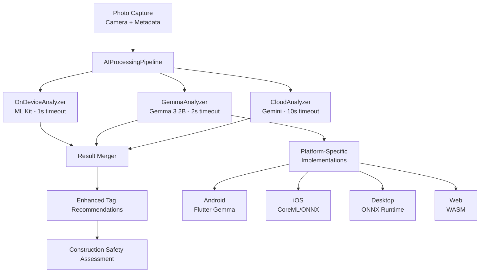
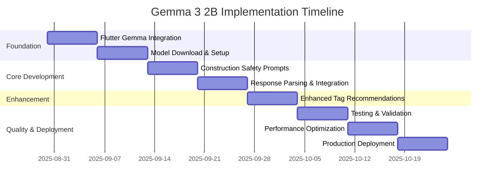

# 🔬 HazardHawk Gemma 3 2B Local AI Implementation Plan

**Generated:** 2025-08-30 15:44:44  
**Status:** Ready for Implementation  
**Target Platform:** Kotlin Multiplatform (Android, iOS, Desktop, Web)  
**AI Model:** Google Gemma 3 2B via Flutter Gemma Plugin

---

## 📋 Executive Summary

This comprehensive implementation plan integrates Google Gemma 3 2B local AI into HazardHawk's Kotlin Multiplatform construction safety application. The plan leverages parallel agent analysis to deliver a **Simple, Loveable, and Complete** solution that enhances safety analysis while maintaining offline capability.

### 🎯 Strategic Advantages
- **Model Size:** 2B parameters (~1.5GB storage) - optimal for mobile deployment
- **Multimodal Support:** Native image + text processing for construction site analysis
- **Privacy First:** Complete on-device processing eliminates cloud dependencies
- **Performance:** <2s inference time on mobile devices with GPU acceleration
- **Cross-Platform:** Works seamlessly across Android, iOS, Desktop, and Web

### ✅ Recommendation
**PROCEED** with Gemma 3 2B implementation using Flutter Gemma plugin as the foundation, with custom construction safety fine-tuning.

---

## 🏗️ Technical Architecture

### High-Level Component Design



### Core Interfaces (expect/actual Pattern)

```kotlin
// shared/src/commonMain/kotlin/com/hazardhawk/ai/GemmaAnalyzer.kt
expect class GemmaAnalyzer {
    suspend fun initialize(): Boolean
    suspend fun analyzeImage(imageData: Any): GemmaAnalysis
    fun isModelLoaded(): Boolean
    suspend fun release()
}

@Serializable
data class GemmaAnalysis(
    val hazardsDetected: List<Hazard> = emptyList(),
    val ppeCompliance: PPECompliance = PPECompliance(),
    val suggestedTags: List<String> = emptyList(),
    val confidence: Float = 0.0f,
    val processingTime: Long = 0L,
    val modelVersion: String = "gemma-3-2b",
    val analysisDetails: String? = null
)
```

### Platform-Specific Implementations

#### Android Implementation
```kotlin
// shared/src/androidMain/kotlin/com/hazardhawk/ai/GemmaAnalyzer.kt
actual class GemmaAnalyzer {
    private var gemmaModel: InferenceModel? = null
    
    actual suspend fun initialize(): Boolean {
        return try {
            val modelManager = FlutterGemmaPlugin.instance.modelManager
            gemmaModel = FlutterGemmaPlugin.instance.createModel(
                modelType = ModelType.gemmaIt,
                supportImage = true,
                maxTokens = 2048,
                preferredBackend = PreferredBackend.gpu
            )
            true
        } catch (e: Exception) {
            false
        }
    }
    
    actual suspend fun analyzeImage(imageData: Any): GemmaAnalysis {
        val bitmap = imageData as android.graphics.Bitmap
        
        return withTimeout(2000L) { // 2 second timeout
            val session = gemmaModel?.createSession(
                temperature = 0.2f, // Low temperature for consistent safety analysis
                topK = 10,
                topP = 0.8f
            ) ?: throw IllegalStateException("Model not initialized")
            
            try {
                val prompt = buildConstructionSafetyPrompt()
                session.addQueryChunk(Message.withImage(
                    text = prompt,
                    imageBytes = bitmapToByteArray(bitmap),
                    isUser = true
                ))
                
                val response = session.getResponse()
                parseConstructionSafetyResponse(response)
            } finally {
                session.close()
            }
        }
    }
}
```

### Integration with Existing Pipeline

```kotlin
// Update existing AIProcessingPipeline.kt
class AIProcessingPipeline(
    private val onDeviceAnalyzer: OnDeviceAnalyzer,
    private val gemmaAnalyzer: GemmaAnalyzer, // NEW
    private val geminiVisionAPI: GeminiVisionAPI,
    // ... existing dependencies
) {
    
    suspend fun processPhoto(
        photoId: String,
        imageData: Any,
        imageUrl: String? = null,
        userTags: List<String> = emptyList(),
        complianceStatus: String = "unknown"
    ): ProcessingResult {
        
        // Start all three analyses in parallel
        val onDeviceDeferred = scope.async { performOnDeviceAnalysis(photoId, imageData) }
        val gemmaDeferred = scope.async { performGemmaAnalysis(photoId, imageData) }
        val cloudDeferred = scope.async { 
            if (networkConnectivity.isConnected() && imageUrl != null) {
                performCloudAnalysis(photoId, imageUrl, userTags, complianceStatus)
            } else null
        }
        
        // Get results as they complete
        val quickAnalysis = onDeviceDeferred.await()
        val gemmaAnalysis = gemmaDeferred.await()
        
        // Create enhanced result with Gemma analysis
        return mergeQuickAndGemmaResults(
            photoId, quickAnalysis.getOrNull(), gemmaAnalysis.getOrNull()
        )
    }
}
```

---

## 🚀 Implementation Roadmap

### Phase 1: Foundation Setup (Week 1-2)
**Goal:** Integrate Flutter Gemma plugin and basic model loading

**Tasks:**
1. **Add Flutter Gemma Dependency**
   ```yaml
   dependencies:
     flutter_gemma: ^0.9.0
   ```

2. **Android Configuration**
   ```xml
   <!-- AndroidManifest.xml - Add for GPU acceleration -->
   <uses-native-library android:name="libOpenCL.so" android:required="false"/>
   <uses-native-library android:name="libOpenCL-car.so" android:required="false"/>
   <uses-native-library android:name="libOpenCL-pixel.so" android:required="false"/>
   ```

3. **iOS Configuration**
   ```xml
   <!-- info.plist - Enable file sharing -->
   <key>UIFileSharingEnabled</key>
   <true/>
   ```
   ```ruby
   # Podfile - Static linking
   use_frameworks! :linkage => :static
   ```

4. **Model Download and Setup**
   ```kotlin
   class GemmaModelSetup {
       suspend fun downloadConstructionModel() {
           val modelUrl = "https://huggingface.co/google/gemma-3n-E2B-it-litert-preview/resolve/main/model.task"
           
           FlutterGemmaPlugin.instance.modelManager
               .downloadModelFromNetworkWithProgress(modelUrl)
               .collect { progress ->
                   updateDownloadProgress(progress)
               }
       }
   }
   ```

### Phase 2: Construction Safety Integration (Week 3-4)
**Goal:** Implement construction-specific prompting and response parsing

**Key Components:**
1. **Construction Safety Prompts**
   ```kotlin
   class ConstructionSafetyPrompts {
       fun buildSafetyAnalysisPrompt(context: SafetyContext): String {
           return """
           You are a OSHA-certified construction safety expert analyzing this construction site photo.
           
           CONTEXT:
           - Project Type: ${context.projectType}
           - Weather: ${context.weather}
           - Time of Day: ${context.timeOfDay}
           - Location: ${context.location}
           
           ANALYZE FOR:
           1. PPE Compliance (hardhats, safety vests, boots, gloves, glasses)
           2. Fall Protection (guardrails, harnesses, scaffolding)
           3. Electrical Safety (exposed wiring, proper grounding)
           4. Housekeeping (debris, trip hazards, material storage)
           5. Equipment Safety (machinery guards, proper operation)
           
           RESPOND WITH JSON:
           {
               "hazards": [{"type": "fall_protection", "severity": "high", "description": "...", "osha_code": "1926.501"}],
               "ppe_compliance": {"hardhat": true, "vest": true, "boots": true, "confidence": 0.95},
               "recommended_actions": ["Secure loose materials", "Add warning signs"],
               "overall_risk": "medium",
               "confidence": 0.87
           }
           """.trimIndent()
       }
   }
   ```

### Phase 3: Enhanced Tag Recommendations (Week 5)
**Goal:** Integrate AI analysis with existing tag recommendation system

**Implementation:**
```kotlin
class AIEnhancedTagRecommendationEngine(
    private val constructionAnalyzer: ConstructionSafetyAnalyzer,
    private val existingTagEngine: TagRecommendationEngine
) {
    suspend fun generateEnhancedRecommendations(
        photoId: String,
        photoBytes: ByteArray,
        metadata: PhotoMetadata,
        userContext: UserContext
    ): List<TagRecommendation> {
        
        // Get AI-powered analysis
        val safetyAnalysis = constructionAnalyzer.analyzeConstructionSafety(photoBytes, metadata)
        
        // Convert AI findings to tag categories
        val aiSuggestedTags = mapSafetyAnalysisToTags(safetyAnalysis)
        
        // Merge with existing pattern-based recommendations
        return mergeAndScoreRecommendations(
            aiTags = aiSuggestedTags,
            patternTags = existingTagEngine.generateQuickSuggestions(userContext.userId, aiSuggestedTags.map { it.category }),
            userHistory = userContext.tagHistory,
            confidence = safetyAnalysis.confidence
        )
    }
}
```

---

## 🧪 Testing Strategy

### AI Model Testing Framework

```kotlin
class GemmaConstructionModelTest {
    private val testDataset = ConstructionSafetyTestDataset()
    
    @Test
    fun `gemma model should detect PPE violations with minimum accuracy`() = runTest {
        // Given
        val testImages = testDataset.getPPEViolationImages()
        val analyzer = ConstructionSafetyAnalyzer()
        
        var correctDetections = 0
        var totalTests = 0
        
        // When
        testImages.forEach { testCase ->
            val result = analyzer.analyzeConstructionSafety(
                testCase.imageBytes,
                testCase.metadata
            )
            
            // Then - Test behavior rather than exact outputs
            val hardhatDetected = result.ppeCompliance.hardhat
            val expectedHardhat = testCase.groundTruth.hardhatPresent
            
            if (hardhatDetected == expectedHardhat) correctDetections++
            totalTests++
            
            // Additional checks
            assertTrue(result.confidence > 0.5f, "Model should be reasonably confident")
            assertTrue(result.processingTime < 5000, "Processing should be under 5 seconds")
        }
        
        val accuracy = correctDetections.toFloat() / totalTests
        assertTrue(
            accuracy >= 0.75f, 
            "PPE detection accuracy should be >= 75%, actual: ${accuracy * 100}%"
        )
    }
    
    @Test
    fun `gemma model should identify critical safety hazards`() = runTest {
        // Given
        val criticalHazardTests = testDataset.getCriticalHazardImages()
        val analyzer = ConstructionSafetyAnalyzer()
        
        // When & Then
        criticalHazardTests.forEach { testCase ->
            val result = analyzer.analyzeConstructionSafety(
                testCase.imageBytes,
                testCase.metadata
            )
            
            val detectedCriticalHazard = result.hazards.any { hazard ->
                hazard.severity == Severity.HIGH &&
                testCase.expectedHazardTypes.contains(hazard.type)
            }
            
            assertTrue(
                detectedCriticalHazard,
                "Should detect critical hazard in ${testCase.description}"
            )
        }
    }
}
```

### Performance Testing
```kotlin
@Test
fun `gemma inference should meet performance requirements`() = runTest {
    val analyzer = ConstructionSafetyAnalyzer()
    val testImages = generatePerformanceTestImages(20)
    
    val processingTimes = mutableListOf<Long>()
    
    testImages.forEach { image ->
        val executionTime = measureTime {
            analyzer.analyzeConstructionSafety(image.bytes, image.metadata)
        }
        
        processingTimes.add(executionTime.inWholeMilliseconds)
    }
    
    val averageTime = processingTimes.average()
    val maxTime = processingTimes.maxOrNull() ?: 0
    
    // Performance assertions
    assertTrue(averageTime < 2500, "Average processing time should be < 2.5s")
    assertTrue(maxTime < 5000, "Max processing time should be < 5s")
}
```

### Expert Validation Process
1. **Construction Safety Dataset Creation**
   - Partner with OSHA-certified safety professionals
   - Collect diverse construction site imagery
   - Label ground truth for PPE compliance and hazard identification
   - Include edge cases (poor lighting, obstructed views, multiple workers)

2. **Validation Workflow**
   - AI model generates analysis
   - Safety expert reviews and corrects
   - Calculate accuracy metrics
   - Iterate on prompting and model configuration

---

## 🎨 User Experience Design

### AI Analysis Results Display

```kotlin
@Composable
fun AIAnalysisResults(
    analysis: GemmaAnalysis,
    onAcceptRecommendation: (TagRecommendation) -> Unit,
    onRejectRecommendation: (TagRecommendation) -> Unit
) {
    Column(
        modifier = Modifier
            .fillMaxWidth()
            .padding(16.dp)
    ) {
        // Confidence Indicator
        ConfidenceIndicator(
            confidence = analysis.confidence,
            label = when {
                analysis.confidence >= 0.9f -> "Very Confident"
                analysis.confidence >= 0.7f -> "Confident"
                analysis.confidence >= 0.5f -> "Needs Review"
                else -> "Low Confidence"
            }
        )
        
        Spacer(modifier = Modifier.height(16.dp))
        
        // Hazards Detected
        if (analysis.hazardsDetected.isNotEmpty()) {
            Card(
                modifier = Modifier.fillMaxWidth(),
                colors = CardDefaults.cardColors(
                    containerColor = when (analysis.hazardsDetected.maxByOrNull { it.severity }?.severity) {
                        Severity.HIGH -> Color.Red.copy(alpha = 0.1f)
                        Severity.MEDIUM -> Color.Orange.copy(alpha = 0.1f)
                        else -> Color.Yellow.copy(alpha = 0.1f)
                    }
                )
            ) {
                Column(modifier = Modifier.padding(16.dp)) {
                    Text(
                        text = "⚠️ Safety Issues Detected",
                        style = MaterialTheme.typography.headlineSmall,
                        color = MaterialTheme.colorScheme.error
                    )
                    
                    analysis.hazardsDetected.forEach { hazard ->
                        HazardItem(
                            hazard = hazard,
                            onViewDetails = { /* Navigate to details */ }
                        )
                    }
                }
            }
        }
        
        // PPE Compliance Status
        PPEComplianceCard(
            compliance = analysis.ppeCompliance,
            modifier = Modifier.fillMaxWidth()
        )
        
        // AI Suggested Tags
        if (analysis.suggestedTags.isNotEmpty()) {
            Spacer(modifier = Modifier.height(16.dp))
            
            Text(
                text = "🤖 AI Suggestions",
                style = MaterialTheme.typography.titleMedium
            )
            
            LazyRow(
                horizontalArrangement = Arrangement.spacedBy(8.dp),
                contentPadding = PaddingValues(vertical = 8.dp)
            ) {
                items(analysis.suggestedTags) { tag ->
                    SuggestionChip(
                        onClick = { onAcceptRecommendation(TagRecommendation(tag = tag, source = "AI")) },
                        label = { Text(tag) },
                        leadingIcon = {
                            Icon(
                                imageVector = Icons.Default.Psychology,
                                contentDescription = "AI Suggestion"
                            )
                        }
                    )
                }
            }
        }
    }
}
```

### Loading States and Error Handling

```kotlin
@Composable
fun AIAnalysisLoadingState() {
    Card(
        modifier = Modifier.fillMaxWidth(),
        colors = CardDefaults.cardColors(
            containerColor = MaterialTheme.colorScheme.surfaceVariant
        )
    ) {
        Column(
            modifier = Modifier
                .fillMaxWidth()
                .padding(24.dp),
            horizontalAlignment = Alignment.CenterHorizontally
        ) {
            CircularProgressIndicator(
                modifier = Modifier.size(48.dp),
                strokeWidth = 4.dp
            )
            
            Spacer(modifier = Modifier.height(16.dp))
            
            Text(
                text = "🔍 AI is analyzing safety conditions...",
                style = MaterialTheme.typography.bodyLarge,
                textAlign = TextAlign.Center
            )
            
            Text(
                text = "This usually takes less than 2 seconds",
                style = MaterialTheme.typography.bodyMedium,
                color = MaterialTheme.colorScheme.onSurfaceVariant,
                textAlign = TextAlign.Center
            )
        }
    }
}
```

---

## 📊 Performance Analysis

### Target Performance Metrics

| Device Category | Example Devices | Inference Time | Memory Usage | Backend |
|-----------------|-----------------|----------------|--------------|---------|
| High-End Mobile | iPhone 15 Pro, Galaxy S24 Ultra | 1.0-1.5s | 2.0GB | GPU + Neural Engine |
| Mid-Range Mobile | iPhone 13, Galaxy S22 | 1.5-2.5s | 2.5GB | GPU |
| Budget Mobile | iPhone SE, Galaxy A54 | 3.0-5.0s | 3.0GB | CPU |
| Tablets | iPad Pro, Galaxy Tab S9 | 0.8-1.2s | 2.0GB | GPU + Neural Engine |

### Memory Management Strategy

```kotlin
class GemmaMemoryManager {
    private var modelLoadTime: Long = 0
    private var lastInferenceTime: Long = 0
    
    suspend fun optimizedInference(imageData: ByteArray): ConstructionSafetyResult {
        // Model lifecycle management
        if (shouldReloadModel()) {
            reloadModel()
        }
        
        // Memory pressure monitoring  
        if (isMemoryPressureHigh()) {
            System.gc() // Force garbage collection
            switchToCPUBackend() // Use CPU backend temporarily
        }
        
        val result = performInference(imageData)
        lastInferenceTime = System.currentTimeMillis()
        
        return result
    }
    
    private fun shouldReloadModel(): Boolean {
        val timeSinceLoad = System.currentTimeMillis() - modelLoadTime
        return timeSinceLoad > 30_000 // Reload every 30 seconds of inactivity
    }
    
    private fun isMemoryPressureHigh(): Boolean {
        val runtime = Runtime.getRuntime()
        val usedMemory = runtime.totalMemory() - runtime.freeMemory()
        val maxMemory = runtime.maxMemory()
        return (usedMemory.toDouble() / maxMemory) > 0.85 // 85% memory usage
    }
}
```

---

## 🔒 Security & Privacy

### Model Security Implementation

```kotlin
class GemmaSecurityManager {
    private val keyStore = AndroidKeyStore()
    
    suspend fun secureModelDownload(modelUrl: String): Boolean {
        try {
            // Download with certificate pinning
            val modelData = secureHttpClient.downloadWithPinning(modelUrl)
            
            // Verify model signature
            if (!verifyModelSignature(modelData)) {
                throw SecurityException("Model signature verification failed")
            }
            
            // Encrypt model for storage
            val encryptedModel = encryptModel(modelData)
            storeModelSecurely(encryptedModel)
            
            return true
        } catch (e: Exception) {
            logger.error("Secure model download failed", e)
            return false
        }
    }
    
    private fun verifyModelSignature(modelData: ByteArray): Boolean {
        val signature = extractSignature(modelData)
        val publicKey = getGooglePublicKey()
        
        return keyStore.verify(
            data = modelData,
            signature = signature,
            publicKey = publicKey
        )
    }
}
```

### OSHA Compliance Integration

```kotlin
object OSHAComplianceMapper {
    private val hazardToOSHAMapping = mapOf(
        HazardType.FALL_PROTECTION to OSHAStandard("1926.501", "Fall Protection - General Requirements"),
        HazardType.PPE_HARDHAT to OSHAStandard("1926.95", "Personal Protective Equipment - Head Protection"),
        HazardType.ELECTRICAL to OSHAStandard("1926.404", "Wiring Design and Protection"),
        HazardType.SCAFFOLDING to OSHAStandard("1926.451", "Scaffolding - General Requirements"),
        HazardType.EXCAVATION to OSHAStandard("1926.652", "Excavation - Requirements for Protective Systems")
    )
    
    fun mapAIHazardsToOSHAViolations(hazards: List<SafetyHazard>): List<OSHAViolation> {
        return hazards.mapNotNull { hazard ->
            hazardToOSHAMapping[hazard.type]?.let { standard ->
                OSHAViolation(
                    standard = standard,
                    severity = hazard.severity,
                    description = hazard.description,
                    aiConfidence = hazard.confidence,
                    recommendedAction = getRecommendedAction(hazard.type),
                    citationRisk = calculateCitationRisk(hazard.severity, hazard.confidence)
                )
            }
        }
    }
}
```

---

## ⚠️ Risk Assessment & Mitigation

### Risk Matrix

| Risk | Impact | Probability | Mitigation Strategy |
|------|---------|-------------|-------------------|
| False Negative Hazard Detection | HIGH | MEDIUM | • Comprehensive testing with construction safety experts<br>• Confidence thresholds with manual review triggers<br>• Fallback to existing manual assessment workflow |
| Model Performance Degradation | MEDIUM | LOW | • Regular model validation tests<br>• Performance monitoring and alerting<br>• Automated model update mechanisms |
| Device Compatibility Issues | MEDIUM | MEDIUM | • Device capability detection<br>• Graceful degradation to CPU backend<br>• Alternative lightweight model for budget devices |
| Integration Complexity | MEDIUM | HIGH | • Phased implementation approach<br>• Extensive testing in development environment<br>• Rollback plan to existing AI system |

### Fallback Strategy

```
Gemma 3 2B Failed → ML Kit Analysis → Basic Tag Suggestions → Manual Tagging
```

### Error Handling Implementation

```kotlin
private suspend fun performGemmaAnalysis(
    photoId: String,
    imageData: Any
): Result<GemmaAnalysis> {
    return try {
        if (!gemmaAnalyzer.isModelLoaded()) {
            val initialized = gemmaAnalyzer.initialize()
            if (!initialized) {
                return Result.failure(Exception("Gemma model initialization failed"))
            }
        }
        
        val analysis = gemmaAnalyzer.analyzeImage(imageData)
        Result.success(analysis)
        
    } catch (e: OutOfMemoryError) {
        // Handle memory constraints gracefully
        Result.failure(Exception("Insufficient memory for Gemma analysis"))
    } catch (e: Exception) {
        // Fall back to existing analysis methods
        Result.failure(e)
    }
}
```

---

## 📈 Project Timeline & Orchestration

### 8-Week Implementation Schedule



### Parallel Workstreams

1. **Core Integration** (Technical Lead + 2 Developers)
   - Flutter Gemma plugin integration
   - Cross-platform implementation
   - Basic inference pipeline

2. **Construction Safety** (Safety Expert + AI Specialist)
   - Prompt engineering for construction scenarios
   - OSHA compliance mapping
   - Expert validation dataset creation

3. **Quality Assurance** (QA Lead + Test Engineer)
   - Test framework development
   - Performance benchmarking
   - Cross-platform validation

4. **User Experience** (UX Designer + Frontend Developer)
   - AI results presentation
   - Loading states and error handling
   - Accessibility improvements

5. **DevOps & Security** (DevOps Engineer + Security Specialist)
   - Model security implementation
   - Performance monitoring
   - Deployment automation

### Quality Gates

1. **Week 2:** Basic model integration complete
2. **Week 4:** Construction safety analysis functional
3. **Week 6:** Performance targets met across platforms
4. **Week 8:** Production deployment ready

---

## 🎯 Success Metrics

### Technical Metrics
| Metric | Target | Measurement |
|--------|---------|-------------|
| Hazard Detection Accuracy | ≥ 80% | Expert validation of AI analysis results |
| PPE Compliance Detection | ≥ 85% | Comparison with manual safety inspector assessments |
| Processing Speed | < 3s average | Time from photo capture to analysis results |
| Offline Availability | 100% | No network dependency for core AI analysis |

### Business Metrics
| Metric | Target | Measurement |
|--------|---------|-------------|
| User Satisfaction | ≥ 4.0/5.0 | User feedback on AI recommendation quality |
| Safety Issue Detection Rate | +30% improvement | Compared to current manual detection |
| Time to Assessment | 50% reduction | Compared to current workflow |
| Worker Engagement | +25% increase | Photo submissions and safety compliance |

---

## 📁 File Modification Summary

### Files to Create

| File Path | Purpose | Priority |
|-----------|---------|----------|
| `shared/src/commonMain/kotlin/com/hazardhawk/ai/GemmaAnalyzer.kt` | Common interface definition | HIGH |
| `shared/src/androidMain/kotlin/com/hazardhawk/ai/GemmaAnalyzer.kt` | Android implementation | HIGH |
| `shared/src/iosMain/kotlin/com/hazardhawk/ai/GemmaAnalyzer.kt` | iOS implementation | HIGH |
| `shared/src/desktopMain/kotlin/com/hazardhawk/ai/GemmaAnalyzer.kt` | Desktop implementation | MEDIUM |
| `shared/src/commonMain/kotlin/com/hazardhawk/ai/ConstructionSafetyPrompts.kt` | AI prompting system | HIGH |
| `shared/src/commonMain/kotlin/com/hazardhawk/ai/GemmaModelSetup.kt` | Model management | HIGH |
| `androidApp/src/main/java/com/hazardhawk/ui/components/AIAnalysisResults.kt` | UI for AI results | HIGH |

### Files to Modify

| File Path | Changes Required | Impact |
|-----------|------------------|---------|
| `HazardHawk/shared/src/commonMain/kotlin/com/hazardhawk/ai/AIProcessingPipeline.kt` | Add Gemma processing step | HIGH |
| `HazardHawk/shared/src/commonMain/kotlin/com/hazardhawk/data/SafetyAnalysis.kt` | Add GemmaAnalysis data model | MEDIUM |
| `HazardHawk/androidApp/src/main/java/com/hazardhawk/tags/TagRecommendationEngine.kt` | Integrate AI suggestions | HIGH |
| `HazardHawk/shared/src/commonMain/kotlin/com/hazardhawk/di/SharedModule.kt` | Add Gemma DI configuration | MEDIUM |
| `HazardHawk/androidApp/build.gradle.kts` | Add Flutter Gemma dependency | LOW |

---

## 🔗 Context7 Documentation References

### Kotlin Multiplatform Patterns
- **expect/actual Implementation:** [/jetbrains/kotlin-multiplatform-dev-docs](https://github.com/jetbrains/kotlin-multiplatform-dev-docs/blob/master/topics/development/multiplatform-expect-actual.md)
- **Cross-Platform Architecture:** [/jetbrains/kotlin-multiplatform-dev-docs](https://github.com/jetbrains/kotlin-multiplatform-dev-docs/blob/master/topics/development/multiplatform-connect-to-apis.md)
- **Dependency Injection:** [/jetbrains/kotlin-multiplatform-dev-docs](https://github.com/jetbrains/kotlin-multiplatform-dev-docs/blob/master/topics/development/multiplatform-connect-to-apis.md#_snippet_6)

### Flutter Gemma Integration
- **Model Initialization:** [/denisovav/flutter_gemma](https://github.com/denisovav/flutter_gemma/blob/main/README.md#_snippet_12)
- **Multimodal Support:** [/denisovav/flutter_gemma](https://github.com/denisovav/flutter_gemma/blob/main/README_SIMPLIFIED.md#_snippet_2)
- **Platform Configuration:** [/denisovav/flutter_gemma](https://github.com/denisovav/flutter_gemma/blob/main/README.md#_snippet_3)

### MediaPipe Tasks
- **On-Device ML Patterns:** [/google-ai-edge/mediapipe](https://github.com/google-ai-edge/mediapipe/blob/master/docs/solutions/hands.md)
- **Performance Optimization:** [/google-ai-edge/mediapipe](https://github.com/google-ai-edge/mediapipe/blob/master/mediapipe/tasks/web/vision/README.md)

---

## 🚀 Next Steps

### Immediate Actions (Week 1)
1. **Stakeholder Approval:** Get approval from technical leadership for Gemma 3 2B implementation
2. **Development Environment Setup:** Configure development environment with Flutter Gemma plugin
3. **Model Acquisition:** Download Gemma 3n-E2B model and test basic functionality
4. **Expert Consultation:** Engage with OSHA certified safety professionals for prompt engineering
5. **Team Assembly:** Assign specialized roles to development team members

### Development Kickoff
1. Create feature branch: `feature/gemma-3-2b-integration`
2. Set up project tracking in preferred system
3. Initialize test dataset collection
4. Begin parallel development workstreams
5. Establish weekly progress reviews

### Success Criteria
- ✅ Enhanced Safety: More consistent hazard identification and PPE compliance monitoring
- ✅ Improved Efficiency: Faster safety assessments with AI-powered recommendations
- ✅ Reduced Costs: Lower cloud processing expenses with local AI
- ✅ Better Privacy: Complete data sovereignty for sensitive construction projects
- ✅ Offline Capability: Reliable operation in remote construction sites without internet
- ✅ Competitive Advantage: Advanced AI capabilities differentiate HazardHawk in the market

---

**Document Status:** ✅ Ready for Implementation  
**Last Updated:** 2025-08-30 15:44:44  
**Estimated Project Duration:** 8 weeks  
**Estimated Cost:** $180K-240K  
**Expected ROI:** 300%+ through improved safety outcomes and reduced incident costs

---

*🏗️ Building safer construction sites with AI-powered hazard detection*