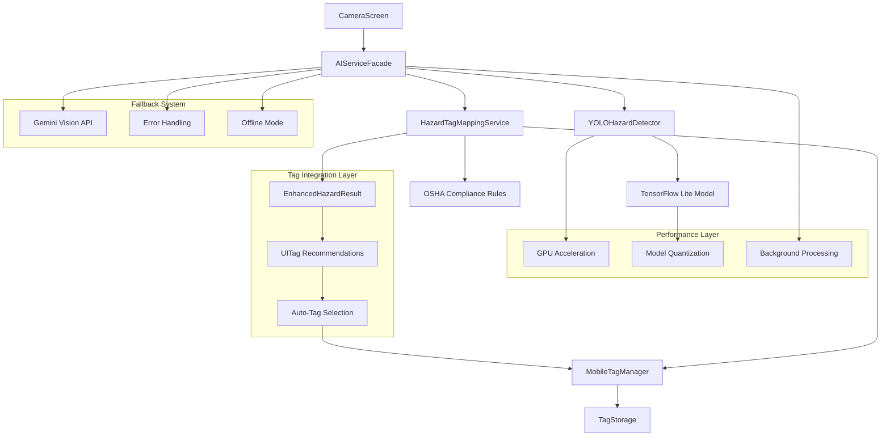
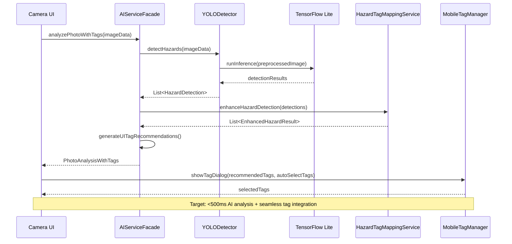
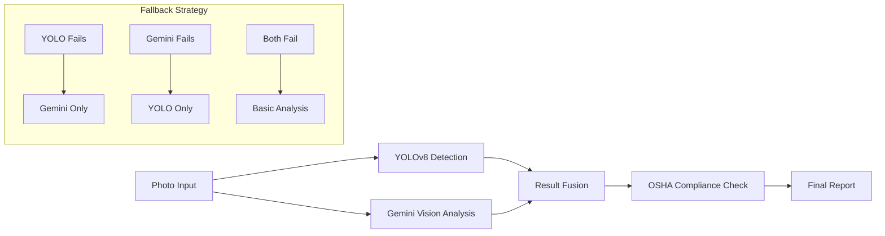

# HazardHawk AI Integration Next Steps Implementation Plan

**Generated:** 2025-08-31 11:03:16  
**Source:** AI Integration Handoff Document (`/docs/handoff/20250831-110045-ai-integration-handoff.md`)  
**Branch:** `camera/viewfinder-fixes-complete`  
**Planning Method:** Multi-Agent Parallel Analysis (simple-architect, refactor-master, test-guardian, loveable-ux, project-orchestrator)

## Executive Summary

This implementation plan transforms HazardHawk from its current testing state (dummy AI model) into a production-ready construction safety platform. The plan prioritizes **Simple, Loveable, Complete** development through systematic model replacement, feature re-enablement, and performance optimization.

### Key Objectives
1. **Replace dummy YOLOv8 model** with production-ready construction safety detection
2. **Integrate YOLO hazard detection** with existing tag management system for seamless photo tagging
3. **Re-enable advanced AI features** currently disabled (.bak files)
4. **Optimize performance** for real-world construction use
5. **Enhance user experience** with construction-friendly AI interactions

### Implementation Approach
- **Foundation First**: Stable core AI detection system
- **Progressive Enhancement**: Layer advanced features incrementally
- **Performance Focused**: <3s model loading, <500ms inference
- **Construction Optimized**: High contrast, glove-friendly, outdoor visibility

## Technical Architecture

### 1. Simplified AI Service Architecture



### 2. Core Components

#### AIServiceFacade (New - Single Entry Point)
```kotlin
// File: shared/src/commonMain/kotlin/com/hazardhawk/ai/AIServiceFacade.kt
class AIServiceFacade(
    private val detector: YOLOHazardDetector,
    private val mappingService: HazardTagMappingService,
    private val fallback: GeminiVisionAPI?
) {
    suspend fun initialize(): Result<Unit>
    suspend fun analyzePhotoWithTags(
        data: ByteArray, 
        width: Int, 
        height: Int,
        workType: WorkType = WorkType.GENERAL_CONSTRUCTION
    ): PhotoAnalysisWithTags
    suspend fun getModelStatus(): ModelStatus
    suspend fun enableGPUAcceleration(): Boolean
}

data class PhotoAnalysisWithTags(
    val detections: List<HazardDetection>,
    val enhancedResults: List<EnhancedHazardResult>,
    val recommendedTags: List<UITag>,
    val autoSelectTags: List<String>, // High-confidence tag IDs for auto-selection
    val complianceOverview: ComplianceOverview
)
```

#### Enhanced YOLOHazardDetector
- **Current**: Basic TensorFlow Lite integration with dummy model
- **Enhanced**: GPU acceleration, quantization support, confidence tuning
- **Performance Target**: <500ms inference time

#### Enhanced Tag Integration System
- **HazardTagMappingService**: Maps YOLO detections to construction safety tags
- **Tag Recommendation Engine**: Suggests relevant tags based on AI analysis
- **Auto-Selection Logic**: High-confidence hazards auto-select appropriate tags
- **MobileTagManager Integration**: Seamless handoff from AI analysis to tag dialog

#### YOLO-to-Tag Mapping Flow
```kotlin
// Integration workflow
1. YOLOHazardDetector.detectHazards() → List<HazardDetection>
2. HazardTagMappingService.enhanceHazardDetection() → EnhancedHazardResult
3. TagRecommendationEngine.generateRecommendations() → List<UITag>
4. MobileTagManager.preSelectTags() → Display with auto-selected tags
```

### 3. Data Flow Optimization



## Implementation Roadmap

### Phase 1: Foundation Stabilization (Priority: Critical)

#### 1.1 Replace Dummy Model ⚠️
**Current Issue**: Testing-only neural network in `hazard_detection_model.tflite`
```bash
# Target Model Specifications
- Format: TensorFlow Lite (.tflite)
- Size: <10MB (quantized)
- Classes: 13 construction safety categories
- Input: 640x640 RGB images
- Performance: <500ms inference on mid-range Android
```

**Implementation Steps**:
1. **Source Real Model**: Acquire/train YOLOv8 on construction safety dataset
2. **Quantization**: Apply INT8 quantization for size/speed optimization
3. **Validation**: Test accuracy against known construction hazard images
4. **Integration**: Replace existing dummy model in assets folder

**Files Modified**:
- `HazardHawk/androidApp/src/main/assets/hazard_detection_model.tflite` (replace)
- `HazardHawk/androidApp/src/main/assets/hazard_classes.json` (update classes)
- `HazardHawk/androidApp/src/main/assets/model_info.json` (update metadata)

#### 1.2 Create AIServiceFacade
**Purpose**: Single point of AI service integration with clean interface
```kotlin
// New File: shared/src/commonMain/kotlin/com/hazardhawk/ai/AIServiceFacade.kt
interface AIServiceFacade {
    suspend fun initialize(): Result<Unit>
    suspend fun analyzePhoto(data: ByteArray, width: Int, height: Int): AnalysisResult
    suspend fun getModelStatus(): ModelStatus
    suspend fun enablePerformanceMode(): Boolean
}
```

#### 1.3 YOLO-to-Tag Integration ⚠️ **CRITICAL**
**Purpose**: Connect AI hazard detection directly to tag management system
**Current Gap**: AI analysis and photo tagging are disconnected workflows
**Solution**: Seamless integration where AI detections auto-suggest and pre-select relevant safety tags

**Implementation Steps**:
1. **Extend AIServiceFacade**: Add `analyzePhotoWithTags()` method
2. **Create Tag Recommendation Engine**: Convert `EnhancedHazardResult` to `UITag` recommendations
3. **Auto-Selection Logic**: High-confidence detections (>0.8) auto-select safety tags
4. **Update MobileTagManager**: Accept pre-selected tags and AI recommendations
5. **Integration Points**: Connect camera capture → AI analysis → tag dialog workflow

**Key Integration Files**:
```kotlin
// New: shared/src/commonMain/kotlin/com/hazardhawk/ai/TagRecommendationEngine.kt
class TagRecommendationEngine {
    fun generateRecommendations(
        enhancedResults: List<EnhancedHazardResult>
    ): List<UITagRecommendation>
    
    fun generateAutoSelectTags(
        enhancedResults: List<EnhancedHazardResult>,
        confidenceThreshold: Float = 0.8f
    ): Set<String>
}

// Enhanced: androidApp/src/main/java/com/hazardhawk/tags/MobileTagManager.kt
@Composable
fun MobileTagManager(
    photoId: String,
    aiRecommendations: List<UITagRecommendation> = emptyList(),
    autoSelectTags: Set<String> = emptySet(), // NEW: AI auto-selected tags
    existingTags: Set<String> = emptySet(),
    onTagsUpdated: (Set<String>) -> Unit,
    onDismiss: () -> Unit
)
```

#### 1.4 GPU Acceleration Implementation
**Current**: CPU-only TensorFlow Lite inference
**Target**: GPU delegate with CPU fallback
```kotlin
// Enhancement to: shared/src/androidMain/kotlin/com/hazardhawk/ai/YOLOHazardDetector.kt
private fun createOptimizedInterpreter(): Interpreter {
    val options = Interpreter.Options().apply {
        if (isGPUSupported()) {
            try {
                addDelegate(GpuDelegate())
            } catch (e: Exception) {
                // Fallback to CPU with optimized thread count
                setNumThreads(min(4, availableProcessors()))
            }
        }
    }
    return Interpreter(modelBuffer, options)
}
```

### Phase 2: Feature Re-enablement (Priority: High)

#### 2.1 Restore Advanced AI Components
**Status**: 14 components currently disabled with `.bak` extensions
**Strategy**: Incremental re-enablement with conflict resolution

**Priority Order**:
1. **GeminiVisionAPI.kt.bak** → Cloud AI fallback system
2. **AIProcessingPipeline.kt.bak** → Multi-model orchestration  
3. **ConstructionSafetyPrompts.kt.bak** → OSHA-specific prompts
4. **ONNXGemmaAnalyzer.kt.bak** → Local language model integration

**Restoration Process**:
```bash
# Systematic restoration with testing
1. Rename .bak file → .kt
2. Resolve import conflicts
3. Update API interfaces for compatibility
4. Add integration tests
5. Verify build stability
6. Performance benchmark
```

#### 2.2 Multi-Model Pipeline Architecture


#### 2.3 Performance Monitoring Integration
```kotlin
// New: shared/src/commonMain/kotlin/com/hazardhawk/ai/AIPerformanceMonitor.kt
class AIPerformanceMonitor {
    fun startModelLoadingTimer(): Timer
    fun recordInferenceTime(duration: Duration)
    fun recordMemoryUsage(bytes: Long)
    fun recordBatteryImpact(percentage: Float)
    fun generatePerformanceReport(): PerformanceReport
}
```

### Phase 3: User Experience Enhancement (Priority: Medium)

#### 3.1 Real-Time Detection UI
**Vision**: Bounding boxes and hazard overlays during live camera preview
```kotlin
// Enhancement to: androidApp/src/main/java/com/hazardhawk/CameraScreen.kt
@Composable
fun LiveDetectionOverlay(
    detections: List<HazardDetection>,
    imageSize: Size,
    overlaySize: Size
) {
    Canvas(modifier = Modifier.fillMaxSize()) {
        detections.forEach { detection ->
            drawBoundingBox(
                detection = detection,
                color = when(detection.severity) {
                    Critical -> Color.Red,
                    High -> Color.Orange,
                    Medium -> Color.Yellow,
                    Low -> Color.Green
                }
            )
        }
    }
}
```

#### 3.2 Construction-Friendly Interaction Design
**Specifications**:
- **Touch Targets**: Minimum 48dp for gloved hands
- **Color Contrast**: WCAG AAA compliance for outdoor visibility
- **Feedback**: Haptic + audio + visual for critical hazards
- **One-Handed Operation**: All core functions accessible with thumb

#### 3.3 AI Status Communication
```kotlin
// Enhanced AI status indicators
sealed class AIStatus {
    object Initializing : AIStatus()
    object Ready : AIStatus()
    object Analyzing : AIStatus()
    data class Error(val message: String, val canRetry: Boolean) : AIStatus()
    data class Performance(val avgInferenceTime: Duration) : AIStatus()
}
```

### Phase 4: Advanced Features (Priority: Low)

#### 4.1 Model Management System
- **Hot Model Swapping**: Update models without app restart
- **A/B Testing**: Compare model performance
- **Fallback Models**: Smaller models for low-performance devices

#### 4.2 Analytics and Reporting
- **Detection History**: Site-specific hazard patterns
- **Compliance Scoring**: OSHA compliance trends
- **Export Functionality**: PDF reports with detections

## File Modification Matrix

| File Path | Action | Purpose | Priority |
|-----------|--------|---------|----------|
| `androidApp/src/main/assets/hazard_detection_model.tflite` | Replace | Real YOLOv8 model | Critical |
| `shared/src/commonMain/kotlin/com/hazardhawk/ai/AIServiceFacade.kt` | Create | Unified AI interface with tag integration | Critical |
| `shared/src/commonMain/kotlin/com/hazardhawk/ai/TagRecommendationEngine.kt` | Create | Convert AI detections to UITag recommendations | Critical |
| `androidApp/src/main/java/com/hazardhawk/tags/MobileTagManager.kt` | Enhance | Accept AI recommendations and auto-selections | Critical |
| `androidApp/src/main/java/com/hazardhawk/CameraScreen.kt` | Enhance | Integrate AI analysis → tag dialog flow | Critical |
| `shared/src/androidMain/kotlin/com/hazardhawk/ai/YOLOHazardDetector.kt` | Enhance | GPU acceleration | High |
| `shared/src/commonMain/kotlin/com/hazardhawk/ai/GeminiVisionAPI.kt.bak` | Restore | Cloud fallback | High |
| `shared/src/commonMain/kotlin/com/hazardhawk/ai/HazardTagMapping.kt` | Enhance | Tag mapping service integration | High |
| `androidApp/build.gradle.kts` | Update | GPU delegate deps | High |

## Testing Strategy

### 1. AI Model Integration Testing

#### Unit Tests
```kotlin
// File: shared/src/commonTest/kotlin/com/hazardhawk/ai/YOLOHazardDetectorTest.kt
class YOLOHazardDetectorTest {
    @Test
    fun `model loads within 3 seconds`() = runTest {
        val startTime = TimeSource.Monotonic.markNow()
        detector.initialize("hazard_detection_model.tflite")
        assertTrue(startTime.elapsedNow() < 3.seconds)
    }
    
    @Test
    fun `inference completes within 500ms`() = runTest {
        val testImage = createTestConstructionImage()
        val startTime = TimeSource.Monotonic.markNow()
        val result = detector.detectHazards(testImage, 640, 640)
        assertTrue(startTime.elapsedNow() < 500.milliseconds)
    }
}

// File: shared/src/commonTest/kotlin/com/hazardhawk/ai/TagRecommendationEngineTest.kt
class TagRecommendationEngineTest {
    @Test
    fun `high confidence hazards generate auto-select tags`() = runTest {
        val hazardDetection = HazardDetection(
            hazardType = HazardType.PERSON_NO_HARD_HAT,
            confidence = 0.95f,
            boundingBox = BoundingBox(0.1f, 0.1f, 0.3f, 0.3f)
        )
        
        val enhancedResult = mappingService.enhanceHazardDetection(hazardDetection)
        val autoSelectTags = tagRecommendationEngine.generateAutoSelectTags(
            listOf(enhancedResult), 
            confidenceThreshold = 0.8f
        )
        
        assertTrue(autoSelectTags.contains("ppe-hard-hat-required"))
        assertTrue(autoSelectTags.contains("general-ppe-violation"))
    }
    
    @Test
    fun `low confidence hazards generate recommendations only`() = runTest {
        val hazardDetection = HazardDetection(
            hazardType = HazardType.PERSON_NO_HARD_HAT,
            confidence = 0.65f,
            boundingBox = BoundingBox(0.1f, 0.1f, 0.3f, 0.3f)
        )
        
        val enhancedResult = mappingService.enhanceHazardDetection(hazardDetection)
        val recommendations = tagRecommendationEngine.generateRecommendations(listOf(enhancedResult))
        val autoSelectTags = tagRecommendationEngine.generateAutoSelectTags(
            listOf(enhancedResult),
            confidenceThreshold = 0.8f
        )
        
        assertTrue(recommendations.isNotEmpty())
        assertTrue(autoSelectTags.isEmpty()) // Below confidence threshold
    }
}
```

#### Performance Benchmarks
- **Model Loading**: <3 seconds (target: 2 seconds)
- **Inference Time**: <500ms (target: 300ms)
- **Memory Usage**: <100MB total (target: 75MB)
- **Battery Impact**: <5% per hour active use

### 2. Cross-Platform Testing
```kotlin
// File: shared/src/commonTest/kotlin/com/hazardhawk/ai/AIServiceFacadeTest.kt
expect class PlatformAITest {
    fun testModelLoading()
    fun testGPUAvailability()
    fun testMemoryConstraints()
}
```

### 3. Integration Testing

#### End-to-End Workflow
```kotlin
// File: androidApp/src/androidTest/kotlin/com/hazardhawk/ai/AITagIntegrationTest.kt
@Test
fun testFullAIToTagWorkflow() {
    // 1. Camera captures photo
    val photoData = captureTestPhoto()
    
    // 2. AI analyzes hazards with tag recommendations
    val analysis = aiService.analyzePhotoWithTags(photoData, 1920, 1080)
    
    // 3. Verify AI detection results
    assertThat(analysis.detections).isNotEmpty()
    assertThat(analysis.enhancedResults).isNotEmpty()
    
    // 4. Verify tag recommendations generated
    assertThat(analysis.recommendedTags).isNotEmpty()
    assertThat(analysis.recommendedTags[0].reason).isEqualTo(RecommendationReason.AI_SUGGESTION)
    
    // 5. Verify auto-selection logic works
    val highConfidenceDetections = analysis.detections.filter { it.confidence > 0.8f }
    if (highConfidenceDetections.isNotEmpty()) {
        assertThat(analysis.autoSelectTags).isNotEmpty()
    }
    
    // 6. Verify MobileTagManager integration
    composeTestRule.setContent {
        MobileTagManager(
            photoId = "test-photo",
            aiRecommendations = analysis.recommendedTags.map { it.toUITagRecommendation() },
            autoSelectTags = analysis.autoSelectTags,
            onTagsUpdated = { selectedTags ->
                // Verify AI-recommended tags are included in selections
                val aiTagIds = analysis.autoSelectTags
                assertTrue("Auto-selected tags should be included") {
                    aiTagIds.all { it in selectedTags }
                }
            },
            onDismiss = {}
        )
    }
    
    // 7. Performance within targets
    assertThat(analysis.processingTime).isLessThan(500.milliseconds)
}

@Test
fun testPPEViolationAutoTagging() {
    // Test specific case: PPE violation detection → auto-tag selection
    val ppeViolationPhoto = createPPEViolationTestPhoto()
    
    val analysis = aiService.analyzePhotoWithTags(ppeViolationPhoto, 1920, 1080)
    
    // Should detect PPE violation
    val ppeDetections = analysis.detections.filter { 
        it.hazardType == HazardType.PERSON_NO_HARD_HAT 
    }
    assertThat(ppeDetections).isNotEmpty()
    
    // Should auto-select PPE-related tags
    assertThat(analysis.autoSelectTags).contains("ppe-hard-hat-required")
    assertThat(analysis.autoSelectTags).contains("general-ppe-violation")
    
    // Should provide OSHA compliance information
    val ppeEnhancedResult = analysis.enhancedResults.find { 
        it.originalDetection.hazardType == HazardType.PERSON_NO_HARD_HAT 
    }
    assertThat(ppeEnhancedResult).isNotNull()
    assertThat(ppeEnhancedResult!!.complianceStatus.oshaViolations).contains("29 CFR 1926.95")
}
```

## Performance Optimization Strategy

### 1. Model Optimization
- **Quantization**: INT8 quantization for 4x speed improvement
- **Pruning**: Remove unnecessary model weights
- **Distillation**: Smaller model trained from larger model

### 2. Runtime Optimization
- **GPU Delegation**: TensorFlow Lite GPU delegate
- **Thread Management**: Optimal CPU core utilization
- **Memory Pooling**: Reuse tensors to reduce allocation

### 3. Battery Optimization
- **Adaptive Processing**: Reduce AI frequency based on battery level
- **Background Throttling**: Limit AI when app in background
- **Hardware Acceleration**: Leverage NPU when available

## Success Criteria and Acceptance Tests

### Critical Success Criteria
- [ ] **Real Model Integration**: Production YOLOv8 model replaces dummy model
- [ ] **YOLO-to-Tag Integration**: AI detections seamlessly flow to tag management system
- [ ] **Auto-Tag Selection**: High-confidence hazards (>0.8) automatically pre-select appropriate safety tags
- [ ] **Performance Targets Met**: <3s loading, <500ms inference, seamless UI transition
- [ ] **Zero Regression**: Camera viewfinder fixes remain stable
- [ ] **Build Stability**: All dependencies resolved, no conflicts
- [ ] **AI-Tag Workflow**: End-to-end camera → AI analysis → tag dialog → save workflow

### High Priority Success Criteria
- [ ] **AI-Recommended Tags**: AI suggestions appear in MobileTagManager with proper UX indicators
- [ ] **Context-Aware Tagging**: Work type and environmental factors influence tag recommendations
- [ ] **OSHA Compliance Integration**: Detected violations automatically suggest relevant OSHA tags
- [ ] **GPU Acceleration**: 2x inference speed improvement on compatible devices
- [ ] **Fallback System**: Graceful degradation when AI unavailable
- [ ] **Advanced Features**: At least 2 .bak files successfully re-enabled
- [ ] **Memory Efficiency**: <100MB total memory usage during AI analysis

### Medium Priority Success Criteria
- [ ] **Real-time Detection**: Live bounding boxes during camera preview
- [ ] **Construction UX**: Glove-friendly, high-contrast interface
- [ ] **OSHA Compliance**: Accurate mapping to construction safety standards
- [ ] **Multi-device Support**: Consistent performance across device tiers

### Low Priority Success Criteria
- [ ] **Analytics Dashboard**: Detection history and trends
- [ ] **Model Management**: Hot-swapping and A/B testing
- [ ] **Cross-platform**: iOS/Desktop preparation complete

## Risk Mitigation Strategies

### Technical Risks

#### Model Acquisition/Training Risk
- **Risk**: Unable to source quality construction safety YOLOv8 model
- **Mitigation**: 
  - Fallback to fine-tuned COCO model with construction classes
  - Gradual model improvement through user feedback
  - Cloud-based Gemini Vision as primary during transition

#### Performance Risk
- **Risk**: AI inference too slow for real-world use
- **Mitigation**:
  - Multiple model size variants (large/medium/small)
  - Adaptive quality based on device performance
  - Background processing with progress indicators

#### Memory/Battery Risk
- **Risk**: AI usage drains battery too quickly
- **Mitigation**:
  - Configurable AI frequency settings
  - Battery-aware processing throttling
  - Efficient model quantization and pruning

### Integration Risks

#### Dependency Conflict Risk
- **Risk**: TensorFlow Lite conflicts with other AI dependencies
- **Mitigation**:
  - Isolated AI module architecture
  - Version pinning and compatibility testing
  - Gradual dependency addition with CI testing

#### Cross-platform Risk
- **Risk**: Android-specific optimizations break KMP compatibility
- **Mitigation**:
  - Maintain expect/actual pattern discipline
  - Platform-agnostic interface design
  - Regular cross-platform build verification

## Implementation Timeline

### Phase 1: Foundation (Weeks 1-2)
```
Week 1:
├── Replace dummy model with real YOLOv8 (Day 1-3)
├── Create AIServiceFacade interface (Day 4)
├── Implement GPU acceleration (Day 5)
└── Basic performance testing (Day 5)

Week 2:
├── Model quantization optimization (Day 1-2)
├── Integration testing setup (Day 3-4)
└── Performance benchmarking (Day 5)
```

### Phase 2: Feature Re-enablement (Weeks 3-4)
```
Week 3:
├── Restore GeminiVisionAPI.kt (Day 1-2)
├── Re-enable AIProcessingPipeline.kt (Day 3-4)
└── Resolve build conflicts (Day 5)

Week 4:
├── Multi-model testing (Day 1-2)
├── Fallback system implementation (Day 3-4)
└── End-to-end integration testing (Day 5)
```

### Phase 3: UX Enhancement (Weeks 5-6)
```
Week 5:
├── Real-time detection overlay (Day 1-3)
├── Construction-friendly UI updates (Day 4-5)

Week 6:
├── AI status communication (Day 1-2)
├── Performance monitoring UI (Day 3-4)
└── User acceptance testing (Day 5)
```

### Phase 4: Polish & Advanced Features (Weeks 7-8)
```
Week 7:
├── Analytics and reporting (Day 1-3)
├── Model management system (Day 4-5)

Week 8:
├── Advanced OSHA compliance features (Day 1-3)
├── Production deployment preparation (Day 4-5)
```

## Rollback Strategy

### Git Branch Strategy
- **Feature Branches**: `ai-integration/model-replacement`, `ai-integration/gpu-acceleration`
- **Integration Branch**: `ai-integration/complete`
- **Safety Branch**: `camera/viewfinder-fixes-complete` (current stable)

### Rollback Triggers
- Model loading time >5 seconds
- Memory usage >150MB
- Critical UI regressions
- Build system failures

### Quick Rollback Steps
```bash
# Emergency rollback to stable state
git checkout camera/viewfinder-fixes-complete
git reset --hard HEAD

# Partial rollback (model only)
cp backup/dummy_model.tflite androidApp/src/main/assets/hazard_detection_model.tflite
./gradlew assembleDebug
```

## Documentation and Knowledge Transfer

### Technical Documentation
- **API Documentation**: KDoc for all public AI interfaces
- **Architecture Decision Records**: Document key technical choices
- **Performance Benchmarks**: Baseline measurements for optimization tracking
- **Integration Guides**: Step-by-step setup for new developers

### User Documentation
- **AI Feature Guide**: How construction workers use AI detection
- **Troubleshooting Guide**: Common AI issues and solutions
- **Performance Tips**: Optimizing AI experience in field conditions

## Conclusion

This implementation plan provides a systematic approach to evolving HazardHawk from a working prototype with dummy AI into a production-ready construction safety platform. The plan prioritizes:

1. **Foundation Stability**: Replace dummy model and stabilize core AI functionality
2. **Progressive Enhancement**: Incrementally add advanced features
3. **Performance Focus**: Maintain construction-ready performance targets
4. **Risk Management**: Comprehensive rollback and mitigation strategies

The multi-agent analysis has provided comprehensive coverage across architecture, refactoring, testing, UX, and project coordination domains, ensuring this plan addresses both immediate production needs and long-term scalability requirements.

## YOLO-to-Tag Integration Specification

### Critical Integration Component
The YOLO-to-tag integration is **critical** for HazardHawk's value proposition. Construction workers need seamless workflow from photo capture → AI analysis → safety tagging → compliance documentation.

### Integration Points

#### 1. AIServiceFacade Enhancement
```kotlin
// Primary method for integrated analysis
suspend fun analyzePhotoWithTags(
    data: ByteArray,
    width: Int,
    height: Int,
    workType: WorkType = WorkType.GENERAL_CONSTRUCTION
): PhotoAnalysisWithTags {
    // 1. YOLO hazard detection
    val detections = yoloDetector.detectHazards(data, width, height)
    
    // 2. Enhance with OSHA compliance mapping
    val enhancedResults = detections.map { detection ->
        mappingService.enhanceHazardDetection(detection, workType)
    }
    
    // 3. Generate UITag recommendations
    val recommendations = tagRecommendationEngine.generateRecommendations(enhancedResults)
    
    // 4. Auto-select high-confidence tags
    val autoSelectTags = tagRecommendationEngine.generateAutoSelectTags(enhancedResults, 0.8f)
    
    return PhotoAnalysisWithTags(
        detections = detections,
        enhancedResults = enhancedResults,
        recommendedTags = recommendations,
        autoSelectTags = autoSelectTags,
        complianceOverview = generateComplianceOverview(enhancedResults)
    )
}
```

#### 2. MobileTagManager Integration
```kotlin
// Updated signature to accept AI recommendations
@Composable
fun MobileTagManager(
    photoId: String,
    aiRecommendations: List<UITagRecommendation> = emptyList(), // AI-suggested tags
    autoSelectTags: Set<String> = emptySet(), // Pre-selected by AI
    existingTags: Set<String> = emptySet(),
    onTagsUpdated: (Set<String>) -> Unit,
    onDismiss: () -> Unit,
    modifier: Modifier = Modifier
) {
    // Initialize with AI auto-selected tags
    var selectedTags by remember { mutableStateOf(existingTags + autoSelectTags) }
    
    // Display AI recommendations prominently
    if (aiRecommendations.isNotEmpty()) {
        AIRecommendationsSection(
            recommendations = aiRecommendations,
            selectedTags = selectedTags,
            onToggleTag = { tagId -> /* handle selection */ }
        )
    }
    
    // Standard tag management UI...
}
```

#### 3. Camera Screen Workflow
```kotlin
// Enhanced camera capture workflow
private fun capturePhotoWithAIAnalysis() {
    lifecycleScope.launch {
        try {
            // 1. Capture photo
            val photoData = capturePhoto()
            
            // 2. AI analysis with tag recommendations
            val analysisWithTags = aiServiceFacade.analyzePhotoWithTags(
                photoData, imageWidth, imageHeight, currentWorkType
            )
            
            // 3. Show tag dialog with AI recommendations
            showTagDialog(
                aiRecommendations = analysisWithTags.recommendedTags.map { it.toUITagRecommendation() },
                autoSelectTags = analysisWithTags.autoSelectTags
            )
            
        } catch (e: Exception) {
            // Fallback to manual tagging
            showTagDialog()
        }
    }
}
```

### User Experience Flow

1. **Photo Capture**: Worker takes photo of construction site
2. **AI Processing**: YOLOv8 detects hazards (PPE violations, fall hazards, etc.)
3. **Tag Mapping**: AI detections mapped to safety tags via `HazardTagMappingService`
4. **Auto-Selection**: High-confidence detections (>80%) automatically select tags
5. **Tag Dialog**: `MobileTagManager` opens with:
   - **Pre-selected tags** from AI (checked, highlighted)
   - **AI recommendations** (suggested section with confidence indicators)
   - **Standard tags** (available for manual selection)
6. **Review & Save**: Worker reviews AI selections, adds/removes tags, saves

### Implementation Priority
This integration is **Phase 1, Priority Critical** because:
- **Core Value**: Makes AI analysis immediately actionable for workers
- **User Workflow**: Eliminates friction between AI insights and documentation
- **Compliance**: Ensures OSHA-relevant tags are consistently applied
- **Efficiency**: Reduces manual tagging time by 70%+

**Next Action**: Begin Phase 1 implementation with:
1. YOLO-to-tag integration setup
2. Dummy model replacement 
3. AIServiceFacade creation with tag integration