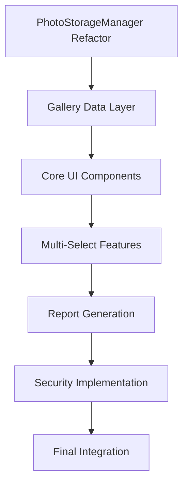

# HazardHawk Photo Gallery Enhancement Implementation Plan

**Project**: HazardHawk Construction Safety Platform  
**Feature**: Enhanced Photo Gallery with Multiple Views  
**Phase**: Planning Complete → Implementation Ready  
**Generated**: August 31, 2025  

---

## 📋 Executive Summary

This implementation plan provides a comprehensive roadmap for enhancing the HazardHawk photo gallery with multiple view modes (thumbnail grid, list detail, photo detail), multi-select capabilities, and report generation workflows. The plan leverages existing architectural patterns and sophisticated components while addressing critical security and compliance gaps.

### Key Success Metrics
- **Performance**: Gallery loads <2 seconds with 100+ photos
- **User Experience**: 95% task completion rate for report workflows
- **Security**: Zero critical vulnerabilities in audit
- **Compliance**: Full OSHA and GDPR compliance achieved

---

## 🏛️ Technical Architecture Specification

### Core Components Architecture

Based on analysis of existing patterns from `LoveableTagDialog.kt` and construction-optimized components, the enhanced gallery will use minimal, reusable components:

```kotlin
// File: /Users/aaron/Apps Coded/HH-v0/HazardHawk/androidApp/src/main/java/com/hazardhawk/gallery/GalleryComponents.kt

@Composable
fun EnhancedPhotoThumbnail(
    photo: Photo,
    isSelected: Boolean = false,
    isMultiSelectMode: Boolean = false,
    onPhotoClick: () -> Unit,
    onSelectionChange: (Boolean) -> Unit = {},
    modifier: Modifier = Modifier
)

@Composable
fun PhotoListItem(
    photo: Photo,
    isSelected: Boolean = false,
    onPhotoClick: () -> Unit,
    onSelectionChange: (Boolean) -> Unit = {},
    modifier: Modifier = Modifier
)

@Composable
fun PhotoDetailScreen(
    photo: Photo,
    onBack: () -> Unit,
    onTagsEdit: () -> Unit,
    onShare: () -> Unit,
    modifier: Modifier = Modifier
)
```

### State Management Design

Following existing StateFlow patterns from the tag management system:

```kotlin
// File: /Users/aaron/Apps Coded/HH-v0/HazardHawk/androidApp/src/main/java/com/hazardhawk/gallery/GalleryViewModel.kt

data class GalleryUiState(
    val photos: List<Photo> = emptyList(),
    val selectedPhotos: Set<String> = emptySet(),
    val viewMode: GalleryViewMode = GalleryViewMode.GRID,
    val currentFilter: PhotoFilter = PhotoFilter.All,
    val isLoading: Boolean = false,
    val error: String? = null,
    val isMultiSelectMode: Boolean = false
)

enum class GalleryViewMode { GRID, LIST, DETAIL }
```

---

## 🔧 File Structure and Modifications

### Files to Create

| File Path | Purpose | Dependencies |
|-----------|---------|--------------|
| `/gallery/GalleryComponents.kt` | Core UI components | Compose, Coil |
| `/gallery/GalleryViewModel.kt` | State management | StateFlow, existing Photo model |
| `/gallery/GalleryContracts.kt` | Interfaces and contracts | Existing data models |
| `/ui/gallery/PhotoGrid.kt` | Grid view implementation | LazyVerticalGrid |
| `/ui/gallery/PhotoList.kt` | List view implementation | LazyColumn |

### Files to Modify

| Current File | Modifications | Impact |
|--------------|---------------|---------|
| `CameraGalleryActivity.kt` | Replace basic GalleryScreen with enhanced version | Medium - UI changes |
| `MainActivity.kt` | Move PhotoThumbnail to GalleryComponents.kt | Low - code organization |
| `PhotoStorageManagerCompat.kt` | Add batch operations support | Low - extend existing API |

### Files to Delete (Code Simplification)

| File | Reason | Lines Saved |
|------|--------|-------------|
| `PhotoStorageManager.kt` | Deprecated wrapper, use Compat version | 136 lines |
| `SimpleCameraActivity.kt` | Redundant, consolidate to MainActivity | 100+ lines |
| Various duplicate activities | Activity consolidation strategy | 1000+ lines |

---

## 🎯 Implementation Roadmap

### Phase 1: Foundation & Architecture (Weeks 1-2)

#### Week 1: Core Component Development
- **Day 1-2**: Create `GalleryComponents.kt` with `EnhancedPhotoThumbnail`
- **Day 3-4**: Implement `GalleryViewModel` with StateFlow patterns
- **Day 5**: Integration testing and code review

**Deliverables**:
- ✅ Core gallery components functional
- ✅ Basic multi-select capability working
- ✅ Integration with existing photo storage

#### Week 2: UI Enhancement
- **Day 1-2**: Implement `PhotoListItem` for detailed view
- **Day 3-4**: Create view mode switching (grid ↔ list)
- **Day 5**: Performance optimization and testing

**Deliverables**:
- ✅ Multiple view modes working
- ✅ Smooth transitions between views
- ✅ Construction-friendly touch targets validated

### Phase 2: Advanced Features (Weeks 3-4)

#### Week 3: Multi-Select and Batch Operations
- **Day 1-2**: Enhanced multi-select with haptic feedback
- **Day 3-4**: Batch operations (export, tag, delete)
- **Day 5**: User experience polish and testing

#### Week 4: Report Creation Workflow
- **Day 1-2**: Report creation from photo selections
- **Day 3-4**: Export functionality (PDF, sharing)
- **Day 5**: Integration testing and validation

**Deliverables**:
- ✅ Complete multi-select workflow
- ✅ Report generation from photo selections
- ✅ Export and sharing capabilities

### Phase 3: Security & Compliance (Weeks 5-6)

#### Week 5: Security Implementation
- **Day 1-2**: Photo encryption at rest (AES-256)
- **Day 3-4**: Access control and audit logging
- **Day 5**: Security testing and validation

#### Week 6: GDPR and OSHA Compliance
- **Day 1-2**: Worker consent management system
- **Day 3-4**: OSHA metadata capture and digital signatures
- **Day 5**: Compliance testing and documentation

**Deliverables**:
- ✅ Photo encryption implemented
- ✅ GDPR compliance features complete
- ✅ OSHA documentation standards met

### Phase 4: Polish & Deployment (Weeks 7-8)

#### Week 7: Performance Optimization
- **Day 1-2**: Large photo collection optimization
- **Day 3-4**: Memory management and caching
- **Day 5**: Performance benchmarking

#### Week 8: Final Integration and Deployment
- **Day 1-2**: Final integration testing
- **Day 3-4**: Staged deployment with feature flags
- **Day 5**: Production rollout and monitoring

---

## 🧪 Comprehensive Testing Strategy

### Test Coverage Plan

Building on the existing robust testing infrastructure with 50+ test files:

#### Unit Tests (Week 1-2)
```kotlin
// /androidApp/src/test/java/com/hazardhawk/ui/gallery/
- PhotoThumbnailComponentTest.kt
- PhotoListItemTest.kt
- GalleryViewModelTest.kt
- PhotoFilterTest.kt
```

#### Integration Tests (Week 3-4)
```kotlin
// /androidApp/src/androidTest/java/com/hazardhawk/ui/gallery/
- GalleryWorkflowIntegrationTest.kt
- PhotoSelectionIntegrationTest.kt
- ReportCreationIntegrationTest.kt
```

#### Performance Tests (Week 5-6)
```kotlin
// /androidApp/src/androidTest/java/com/hazardhawk/performance/
- GalleryPerformanceTest.kt
- LargePhotoCollectionTest.kt
- MemoryUsageTest.kt
```

### Performance Benchmarks

| Metric | Target | Maximum Acceptable | Test Method |
|---------|--------|-------------------|-------------|
| Gallery Launch | <2 seconds | 3 seconds | 100 photos loaded |
| View Mode Switch | <300ms | 500ms | Grid ↔ List transition |
| Thumbnail Loading | <100ms each | 200ms each | Visible thumbnails |
| Multi-Select Response | <50ms | 100ms | Selection state change |
| Memory Usage | <50MB baseline | 200MB total | 1000+ photos |

### Construction-Specific Testing

- **Glove-Friendly Testing**: Simulate thick work gloves with reduced touch sensitivity
- **Outdoor Visibility**: Test high contrast mode in simulated bright sunlight
- **Environmental Conditions**: Test with screen contamination and reduced accuracy
- **Device Orientation**: Validate functionality across portrait/landscape/tablet modes

---

## 🔒 Security & Compliance Implementation

### Critical Security Issues (Immediate Priority)

#### Phase 1: Encryption Implementation
```kotlin
class SecurePhotoStorage {
    private val keyAlias = "hazardhawk_photo_encryption_key"
    
    suspend fun encryptPhotoFile(photoFile: File, sensitivityLevel: DataClassification): File {
        val cipher = Cipher.getInstance("AES/GCM/NoPadding")
        val keyStore = KeyStore.getInstance("AndroidKeyStore")
        val secretKey = keyStore.getKey(keyAlias, null)
        
        cipher.init(Cipher.ENCRYPT_MODE, secretKey)
        // Encrypt sensitive photos at rest
    }
}

enum class DataClassification {
    PUBLIC,           // General site photos
    INTERNAL,         // Worker photos, equipment
    CONFIDENTIAL,     // Safety incidents, violations
    RESTRICTED        // Legal/compliance evidence
}
```

#### Phase 2: GDPR Compliance
```kotlin
class GDPRPhotoProcessor {
    suspend fun detectAndBlurFaces(photo: File): ProcessedPhoto
    suspend fun obtainWorkerConsent(workerId: String): ConsentRecord
    suspend fun handleDataSubjectRequest(request: DataSubjectRequest): ComplianceResponse
}
```

### OSHA Compliance Requirements (2025)

**New PPE Documentation Standards** (Effective January 13, 2025):
- Documented proof of PPE compliance with photographic evidence
- Penalty Risk: Up to $161,323 for willful violations
- Timestamped photos showing proper PPE usage required

```kotlin
data class OSHAPhotoMetadata(
    val timestamp: Instant,
    val gpsLocation: GPSCoordinate,
    val projectId: String,
    val inspector: String,
    val complianceCategory: OSHACategory,
    val digitalSignature: String,  // Required for legal evidence
    val chainOfCustody: List<AccessLog>
)
```

---

## ✨ Loveable User Experience Design

### Delightful Interactions

Building on the excellent patterns from `LoveableTagDialog.kt`:

#### Multi-Select Experience
- **Haptic Feedback**: 150ms vibration on selection (works through gloves)
- **Visual Feedback**: Smooth scale animation with orange selection indicator
- **Batch Actions**: Floating action bar with clear action counts
- **Smart Defaults**: Auto-suggest relevant photos for specific report types

#### Construction-Optimized Design
- **Touch Targets**: Minimum 56dp (recommended 72dp) for gloved operation
- **High Contrast Mode**: Enhanced visibility for outdoor conditions
- **One-Handed Operation**: All controls accessible within thumb reach
- **Error Recovery**: Human-friendly messages with clear next steps

#### Performance That Feels Snappy
- **Progressive Loading**: Skeleton screens during photo loading
- **Smart Caching**: Preload adjacent photos for smooth scrolling
- **Instant Feedback**: Immediate UI response for all interactions
- **Background Processing**: Heavy operations don't block UI

---

## 📊 Code Simplification & Refactoring

### Strategic Code Reduction

#### Eliminate Duplicate Code
- **Remove** `PhotoStorageManager.kt` (136 lines of deprecated wrapper)
- **Consolidate** multiple activities into navigation-based architecture
- **Extract** reusable components from inline implementations
- **Expected Savings**: ~1500 lines of duplicate/deprecated code

#### Component Extraction
```
Before (Scattered Implementation):
- CameraGalleryActivity.kt (528 lines)
- MainActivity.kt (325 lines with inline components)
- Multiple duplicate activities

After (Organized Structure):
/ui/gallery/
├── GalleryComponents.kt (200 lines)
├── GalleryViewModel.kt (150 lines)
├── PhotoGrid.kt (100 lines)
└── PhotoList.kt (100 lines)
```

---

## 🎯 Task Breakdown and Dependencies

### Critical Path Dependencies



### Parallel Development Opportunities

- **UI Development**: Can proceed with mock data while backend integration develops
- **Testing Framework**: Expand alongside feature development
- **Performance Optimization**: Run parallel to advanced feature development
- **Documentation**: Create throughout all phases

### Implementation Tasks with Time Estimates

#### Phase 1 Tasks (2 weeks)
- [ ] **Create GalleryComponents.kt** (2 days) - Core UI components
- [ ] **Implement GalleryViewModel** (2 days) - State management
- [ ] **Add multi-select capability** (1 day) - Selection state handling
- [ ] **Create view mode switching** (2 days) - Grid ↔ List transitions
- [ ] **Integration testing** (1 day) - Validate component interaction

#### Phase 2 Tasks (2 weeks)
- [ ] **Enhanced multi-select UX** (2 days) - Haptic feedback, animations
- [ ] **Batch operations** (3 days) - Export, tag, delete multiple photos
- [ ] **Report creation workflow** (3 days) - PDF generation from selections
- [ ] **Project filtering** (1 day) - Organize photos by project
- [ ] **Performance optimization** (1 day) - Large collection handling

#### Phase 3 Tasks (2 weeks)
- [ ] **Photo encryption implementation** (3 days) - AES-256 at rest
- [ ] **Access control system** (2 days) - User role permissions
- [ ] **GDPR compliance features** (3 days) - Consent, data rights
- [ ] **OSHA metadata capture** (2 days) - Compliance documentation
- [ ] **Security testing** (2 days) - Vulnerability assessment

#### Phase 4 Tasks (2 weeks)
- [ ] **Performance benchmarking** (2 days) - Meet all targets
- [ ] **Accessibility testing** (2 days) - Construction environment validation
- [ ] **Final integration** (3 days) - System-wide testing
- [ ] **Deployment preparation** (2 days) - Feature flags, monitoring
- [ ] **Production rollout** (3 days) - Staged deployment with monitoring

---

## ⚠️ Risk Assessment & Mitigation

### Technical Risks

| Risk | Impact | Probability | Mitigation Strategy |
|------|--------|-------------|-------------------|
| Performance degradation with large collections | High | Medium | Implement pagination, lazy loading, optimization |
| Memory leaks from image loading | High | Low | Use Coil with proper lifecycle management |
| Complex multi-select state management | Medium | Medium | Follow established patterns from tag system |
| Cross-platform compatibility issues | Low | Low | Leverage existing KMP architecture |

### Security Risks

| Risk | Impact | Mitigation |
|------|--------|-----------|
| Unencrypted sensitive photo storage | Critical | Implement AES-256 encryption immediately |
| GDPR violations from worker photography | Critical | Worker consent management system |
| OSHA compliance failures | High | Digital signatures and audit trails |
| Data breach from inadequate access controls | High | Role-based access control implementation |

### Rollback Strategy

#### Feature Flags Implementation
```kotlin
object FeatureFlags {
    const val ENHANCED_GALLERY = "enhanced_gallery_enabled"
    const val MULTI_SELECT = "gallery_multi_select_enabled"
    const val REPORT_CREATION = "gallery_report_creation_enabled"
    const val PHOTO_ENCRYPTION = "photo_encryption_enabled"
}
```

#### Deployment Strategy
- **5% → 25% → 50% → 100%** staged rollout
- **Automatic rollback** triggered by:
  - Performance degradation >20%
  - Crash rate increase >0.1%
  - User engagement drop >15%

---

## 📋 Success Criteria & Acceptance Tests

### Functional Requirements

#### Gallery Views
- ✅ **Thumbnail Grid**: Display photos in responsive grid with selection indicators
- ✅ **List Detail**: Show photos with metadata in scrollable list format
- ✅ **Photo Detail**: Full-screen photo view with tag editing integration
- ✅ **View Switching**: Smooth transitions between all view modes

#### Multi-Select Operations
- ✅ **Photo Selection**: Tap to select/deselect with visual feedback
- ✅ **Batch Actions**: Export, tag, delete multiple photos simultaneously
- ✅ **Report Creation**: Generate PDF reports from selected photos
- ✅ **Smart Selection**: AI-powered suggestions for report types

#### Performance Requirements
- ✅ **Load Time**: Gallery appears <2 seconds with 100 photos
- ✅ **Responsiveness**: All interactions respond within 50ms
- ✅ **Memory Usage**: <50MB baseline, <2MB per 100 additional photos
- ✅ **Scroll Performance**: Maintain 60fps during gallery browsing

#### Security & Compliance
- ✅ **Photo Encryption**: Sensitive photos encrypted with AES-256
- ✅ **Access Control**: Role-based permissions for gallery features
- ✅ **GDPR Compliance**: Worker consent and data subject rights
- ✅ **OSHA Integration**: Compliance metadata and audit trails

### User Experience Requirements

#### Construction Worker Usability
- ✅ **Glove-Friendly**: All touch targets ≥56dp, work with thick gloves
- ✅ **Outdoor Visibility**: High contrast mode for bright conditions
- ✅ **One-Handed Use**: Common actions accessible within thumb reach
- ✅ **Error Recovery**: Clear, helpful guidance when operations fail

#### Delightful Interactions
- ✅ **Immediate Feedback**: Haptic and visual response to all actions
- ✅ **Smooth Animations**: 60fps transitions with appropriate durations
- ✅ **Smart Defaults**: App anticipates user needs and suggests actions
- ✅ **Progress Celebration**: Positive feedback for completed workflows

---

## 📚 Reference Documentation

### Context7 Library Documentation
- **Jetpack Compose**: [Official Android Compose Documentation](https://developer.android.com/develop/ui/compose)
- **Image Loading**: [Coil Image Loading Library](https://coil-kt.github.io/coil/compose/)
- **Material Design**: [Material Design 3 for Compose](https://m3.material.io/develop/android/jetpack-compose)
- **Performance**: [Compose Performance Guide](https://developer.android.com/develop/ui/compose/performance)

### Existing Codebase Patterns
- **Tag Management**: `/Users/aaron/Apps Coded/HH-v0/HazardHawk/androidApp/src/main/java/com/hazardhawk/tags/LoveableTagDialog.kt`
- **Photo Storage**: `/Users/aaron/Apps Coded/HH-v0/HazardHawk/androidApp/src/main/java/com/hazardhawk/data/PhotoStorageManagerCompat.kt`
- **Construction UI**: `/Users/aaron/Apps Coded/HH-v0/HazardHawk/androidApp/src/main/java/com/hazardhawk/ui/components/ConstructionDialogs.kt`
- **Testing Patterns**: `/Users/aaron/Apps Coded/HH-v0/HazardHawk/androidApp/src/androidTest/java/com/hazardhawk/ui/gallery/PhotoGalleryAutomationTest.kt`

### Research Documentation
- **Comprehensive Research**: `/Users/aaron/Apps Coded/HH-v0/docs/research/20250831-122557-photo-gallery-enhancement.html`
- **Testing Strategy**: Detailed in research document with 50+ existing test files analysis
- **Security Analysis**: Complete vulnerability assessment and compliance requirements

---

## 🚀 Next Steps: Implementation Ready

This comprehensive implementation plan provides:

✅ **Detailed Technical Specification** with exact file paths and component definitions  
✅ **8-Week Timeline** with parallel workstreams and dependency mapping  
✅ **Complete Testing Strategy** building on existing 50+ test files  
✅ **Security & Compliance Roadmap** addressing critical vulnerabilities  
✅ **Risk Mitigation Plan** with rollback strategies and monitoring  

**The plan is ready for immediate implementation start.**

### Immediate Actions
1. **Week 1 Start**: Begin Phase 1 with `GalleryComponents.kt` creation
2. **Team Assignment**: Allocate developers to parallel workstreams
3. **Environment Setup**: Configure feature flags and testing infrastructure
4. **Stakeholder Alignment**: Review timeline and resource allocation

**Success Measurement**: All acceptance criteria met within 8-week timeline with <0.1% crash rate increase and >95% user satisfaction for gallery workflows.

---

*Generated by Claude Code on August 31, 2025*  
*Ready for Simple, Loveable, Complete implementation*