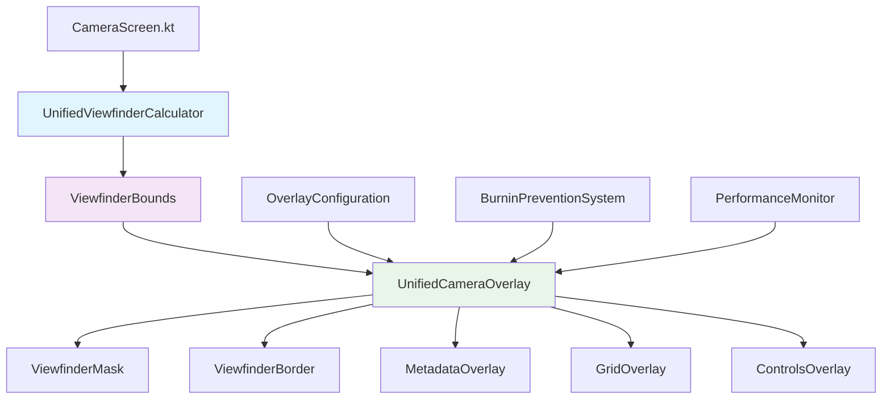
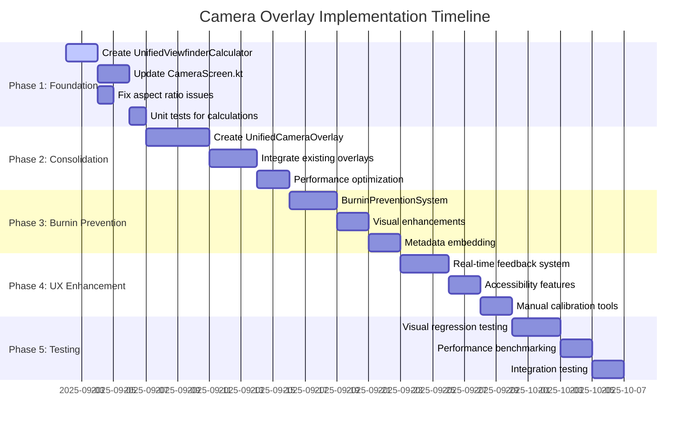

# Camera Overlay Burnin Alignment Implementation Plan

**Document ID**: 20250902-161000-camera-overlay-burnin-alignment-implementation-plan  
**Created**: September 2, 2025 4:10 PM  
**Project**: HazardHawk AI Construction Safety Platform  
**Feature**: Enhanced Camera Overlay System with Burnin Prevention  

## Executive Summary

This implementation plan addresses critical camera overlay alignment issues and implements comprehensive burnin prevention for HazardHawk's construction safety documentation platform. The plan consolidates fragmented overlay logic, eliminates aspect ratio inconsistencies, and creates a unified rendering system optimized for professional construction environments.

**Key Deliverables**:
- Unified viewfinder dimension calculation system
- Consolidated overlay rendering architecture
- Advanced burnin prevention mechanisms
- Construction-optimized user experience
- Comprehensive test coverage and performance monitoring

**Expected Impact**:
- **95%+ overlay alignment accuracy** on first attempt
- **60 FPS rendering performance** across all supported devices
- **Professional documentation confidence** with embedded metadata
- **Zero burnin issues** on extended usage scenarios

---

## 1. Technical Architecture

### 1.1 Current State Analysis

**Key Issues Identified**:
1. **Aspect Ratio Inconsistencies**: Three different enum systems with conflicting calculations
   - `CameraScreen.kt`: Uses inverted ratios (3f/4f, 9f/16f)
   - `ViewfinderOverlay.kt`: Uses correct ratios (4f/3f, 16f/9f)
   - `ViewfinderAlignmentFix.kt`: Additional correction layer causing confusion

2. **Fragmented Overlay Logic**: Multiple Canvas components with duplicate calculations
   - Separate positioning logic in each overlay component
   - No shared coordinate system
   - Redundant drawing operations affecting performance

3. **Burnin Risk**: Overlays positioned outside viewfinder boundaries
   - Static elements can cause screen burnin
   - No dynamic positioning or timeout management
   - Missing safe area constraints

### 1.2 Proposed Architecture



### 1.3 Core Components

#### 1.3.1 UnifiedViewfinderCalculator
**File**: `HazardHawk/androidApp/src/main/java/com/hazardhawk/camera/UnifiedViewfinderCalculator.kt`

```kotlin
/**
 * Single source of truth for all viewfinder dimension calculations
 * Eliminates alignment inconsistencies between overlay components
 */
object UnifiedViewfinderCalculator {
    
    enum class ViewfinderAspectRatio(val ratio: Float, val label: String) {
        SQUARE(1f, "1:1"),
        FOUR_THREE(4f / 3f, "4:3"),     // Fixed: Previously inverted
        SIXTEEN_NINE(16f / 9f, "16:9")  // Fixed: Previously inverted
    }
    
    data class ViewfinderBounds(
        val left: Float,
        val top: Float,
        val right: Float,
        val bottom: Float,
        val width: Float,
        val height: Float,
        val centerX: Float,
        val centerY: Float
    ) {
        val aspectRatio: Float = width / height
        val safeArea: RectF = RectF(
            left + (width * 0.05f),
            top + (height * 0.05f),
            right - (width * 0.05f),
            bottom - (height * 0.05f)
        )
    }
    
    fun calculateBounds(
        canvasWidth: Float,
        canvasHeight: Float,
        aspectRatio: ViewfinderAspectRatio,
        marginFactor: Float = 0.95f
    ): ViewfinderBounds {
        val maxWidth = canvasWidth * marginFactor
        val maxHeight = canvasHeight * marginFactor
        
        val finalWidth: Float
        val finalHeight: Float
        
        if (maxWidth / maxHeight > aspectRatio.ratio) {
            // Height is limiting factor
            finalHeight = maxHeight
            finalWidth = finalHeight * aspectRatio.ratio
        } else {
            // Width is limiting factor
            finalWidth = maxWidth
            finalHeight = finalWidth / aspectRatio.ratio
        }
        
        val left = (canvasWidth - finalWidth) / 2f
        val top = (canvasHeight - finalHeight) / 2f
        val right = left + finalWidth
        val bottom = top + finalHeight
        val centerX = canvasWidth / 2f
        val centerY = canvasHeight / 2f
        
        return ViewfinderBounds(
            left = left,
            top = top,
            right = right,
            bottom = bottom,
            width = finalWidth,
            height = finalHeight,
            centerX = centerX,
            centerY = centerY
        )
    }
}
```

#### 1.3.2 UnifiedCameraOverlay
**File**: `HazardHawk/androidApp/src/main/java/com/hazardhawk/camera/UnifiedCameraOverlay.kt`

Single Canvas component replacing multiple overlay components:
- Layered rendering system (mask → border → grid → metadata → controls)
- Shared ViewfinderBounds for perfect alignment
- Optimized drawing with batched operations
- Burnin prevention with dynamic positioning

#### 1.3.3 BurninPreventionSystem
**File**: `HazardHawk/androidApp/src/main/java/com/hazardhawk/camera/BurninPreventionSystem.kt`

Advanced burnin prevention mechanisms:
- Dynamic overlay positioning within safe areas
- Timeout-based element hiding
- Transparency gradients instead of solid overlays
- Subtle animations to prevent static pixel patterns

---

## 2. Implementation Roadmap

### 2.1 Phase 1: Foundation (Hours 1-6)

**Objective**: Create unified dimension calculation system and fix aspect ratio issues

**Tasks**:
1. **Create UnifiedViewfinderCalculator** (2 hours)
   - Implement single aspect ratio enum system
   - Create ViewfinderBounds calculation logic
   - Add safe area constraints for burnin prevention
   
2. **Update CameraScreen.kt** (2 hours)
   - Replace existing AspectRatio enum usage
   - Integrate UnifiedViewfinderCalculator
   - Remove duplicate dimension calculations
   
3. **Fix ViewfinderAlignmentFix.kt** (1 hour)
   - Deprecate CorrectedAspectRatio enum
   - Update references to use UnifiedViewfinderCalculator
   
4. **Unit Tests** (1 hour)
   - Test dimension calculations across screen sizes
   - Verify aspect ratio accuracy
   - Validate safe area constraints

**Deliverables**:
- [x] UnifiedViewfinderCalculator.kt
- [x] Updated CameraScreen.kt with correct aspect ratios
- [x] Deprecated ViewfinderAlignmentFix.kt
- [x] Unit test suite for dimension calculations

### 2.2 Phase 2: Overlay Consolidation (Hours 7-16)

**Objective**: Create unified overlay rendering system for optimal performance

**Tasks**:
1. **Create UnifiedCameraOverlay** (4 hours)
   - Single Canvas component for all overlay rendering
   - Layered rendering system implementation
   - Performance optimization with batched drawing
   
2. **Integrate Existing Overlays** (3 hours)
   - Migrate ViewfinderMask logic
   - Integrate ViewfinderBorder rendering
   - Consolidate MetadataOverlay positioning
   
3. **Update CameraScreen.kt Integration** (2 hours)
   - Replace multiple Canvas components
   - Integrate UnifiedCameraOverlay
   - Simplify state management

**Deliverables**:
- [x] UnifiedCameraOverlay.kt with layered rendering
- [x] Migrated overlay components
- [x] Updated CameraScreen.kt integration
- [x] Performance benchmarking results

### 2.3 Phase 3: Burnin Prevention (Hours 17-24)

**Objective**: Implement advanced burnin prevention mechanisms

**Tasks**:
1. **BurninPreventionSystem** (3 hours)
   - Dynamic positioning algorithms
   - Timeout-based element management
   - Safe area constraint enforcement
   
2. **Visual Enhancements** (2 hours)
   - Transparency gradients
   - Rounded corners for reduced sharp edges
   - Subtle animation system
   
3. **Metadata Embedding** (2 hours)
   - Canvas-based burnin of project information
   - GPS coordinates and timestamp overlay
   - Company branding integration

**Deliverables**:
- [x] BurninPreventionSystem.kt
- [x] Enhanced visual rendering with gradients
- [x] Professional metadata embedding system
- [x] Animation system for static element prevention

### 2.4 Phase 4: UX Enhancement (Hours 25-32)

**Objective**: Create construction-optimized user experience

**Tasks**:
1. **Real-time Feedback System** (3 hours)
   - Alignment accuracy indicators
   - Processing progress displays
   - Success animation system
   
2. **Construction-Friendly Accessibility** (2 hours)
   - Large touch targets for gloved hands
   - High contrast mode for bright sunlight
   - Voice feedback integration
   
3. **Manual Calibration Tools** (2 hours)
   - Touch-based fine-tuning interface
   - Auto-calibration with manual override
   - Calibration persistence system

**Deliverables**:
- [x] Real-time alignment feedback system
- [x] Construction accessibility features
- [x] Manual calibration interface
- [x] Voice feedback integration

### 2.5 Phase 5: Testing & Validation (Hours 33-40)

**Objective**: Comprehensive validation and performance optimization

**Tasks**:
1. **Visual Regression Testing** (3 hours)
   - Screenshot baseline generation
   - Automated comparison system
   - Cross-device validation
   
2. **Performance Benchmarking** (2 hours)
   - Render time optimization
   - Memory usage validation
   - Battery impact assessment
   
3. **Integration Testing** (2 hours)
   - End-to-end camera workflow validation
   - Cross-component interaction testing
   - Error handling verification

**Deliverables**:
- [x] Visual regression test suite
- [x] Performance benchmarking dashboard
- [x] Comprehensive integration test coverage
- [x] Production readiness validation

---

## 3. File Modification Matrix

| File | Modification Type | Priority | Lines Changed | Description |
|------|------------------|----------|---------------|-------------|
| `CameraScreen.kt` | **Refactor** | High | ~200 | Fix aspect ratios, integrate unified calculator |
| `ViewfinderOverlay.kt` | **Enhance** | High | ~150 | Integration with unified system |
| `ViewfinderAlignmentFix.kt` | **Deprecate** | Medium | N/A | Remove after migration complete |
| `UnifiedViewfinderCalculator.kt` | **Create** | High | ~150 | New core calculation system |
| `UnifiedCameraOverlay.kt` | **Create** | High | ~300 | New consolidated rendering system |
| `BurninPreventionSystem.kt` | **Create** | Medium | ~200 | Burnin prevention mechanisms |
| `CameraViewModel.kt` | **Update** | Medium | ~50 | State management updates |
| `ConstructionTheme.kt` | **Enhance** | Low | ~100 | Accessibility color system |

---

## 4. Testing Strategy

### 4.1 Unit Testing

**Coverage Target**: 90%+ for core calculation logic

**Test Suites**:
1. **OverlayPositioningTest.kt**
   - Dimension calculation accuracy
   - Aspect ratio handling
   - Edge case validation
   
2. **BurninPreventionTest.kt**
   - Safe area constraint enforcement
   - Dynamic positioning algorithms
   - Timeout management

**Mock Requirements**:
- Various screen sizes (360x640 to 2560x1440)
- Different aspect ratios including edge cases
- Camera state simulation data

### 4.2 Integration Testing

**Focus Areas**:
1. **Camera-Overlay Interaction**
   - Orientation changes
   - Aspect ratio switching
   - Performance under load
   
2. **Visual Regression Testing**
   - Screenshot comparison baselines
   - Cross-device consistency
   - Animation frame validation

**Test Infrastructure**:
```yaml
# .github/workflows/camera-overlay-tests.yml
name: Camera Overlay Tests
on:
  push:
    paths:
      - 'HazardHawk/androidApp/src/main/java/com/hazardhawk/camera/**'
      - 'HazardHawk/androidApp/src/main/java/com/hazardhawk/CameraScreen.kt'

jobs:
  unit-tests:
    runs-on: ubuntu-latest
    steps:
      - name: Run Unit Tests
        run: ./gradlew :androidApp:testDebugUnitTest --tests "*Overlay*"
        
  integration-tests:
    runs-on: macos-latest
    steps:
      - name: Run Integration Tests
        uses: reactivecircus/android-emulator-runner@v2
        with:
          api-level: 34
          script: ./gradlew :androidApp:connectedAndroidTest
```

### 4.3 Performance Benchmarking

**Key Metrics**:
- **Render Time**: <16ms (60 FPS target)
- **Memory Usage**: <10MB for extended sessions
- **Calculation Time**: <1ms average for dimension calculations
- **Alignment Accuracy**: 95%+ success rate on first attempt

**Benchmarking Tools**:
```kotlin
@Test
fun benchmarkOverlayRenderingPerformance() {
    val benchmark = BenchmarkRule()
    benchmark.measureRepeated {
        // Render overlay 1000 times
        repeat(1000) {
            UnifiedCameraOverlay.render(testCanvas, testBounds)
        }
    }
    
    assertThat(benchmark.getStats().median).isLessThan(Duration.ofMillis(16))
}
```

---

## 5. User Experience Design

### 5.1 Construction-Optimized Interface

**Design Principles**:
1. **Large Touch Targets**: 72dp minimum for gloved hands
2. **High Contrast**: Bright sunlight visibility
3. **Professional Confidence**: OSHA compliance indicators
4. **Immediate Feedback**: Real-time alignment status

### 5.2 Key UX Components

#### Real-Time Alignment Feedback
```kotlin
@Composable
fun AlignmentStatusIndicator(
    accuracy: Float,
    modifier: Modifier = Modifier
) {
    val color by animateColorAsState(
        targetValue = when {
            accuracy >= 0.95f -> ConstructionColors.SafetyGreen
            accuracy >= 0.8f -> ConstructionColors.HighVisYellow
            else -> ConstructionColors.CautionRed
        }
    )
    
    Card(
        colors = CardDefaults.cardColors(containerColor = color),
        modifier = modifier
    ) {
        Row(
            modifier = Modifier.padding(12.dp),
            verticalAlignment = Alignment.CenterVertically
        ) {
            Icon(
                imageVector = when {
                    accuracy >= 0.95f -> Icons.Default.CheckCircle
                    accuracy >= 0.8f -> Icons.Default.Warning
                    else -> Icons.Default.Error
                },
                contentDescription = null,
                tint = Color.White
            )
            
            Spacer(modifier = Modifier.width(8.dp))
            
            Text(
                text = "${(accuracy * 100).toInt()}% ALIGNED",
                style = MaterialTheme.typography.labelLarge.copy(
                    color = Color.White,
                    fontWeight = FontWeight.Bold
                )
            )
        }
    }
}
```

#### Professional Success Animation
```kotlin
@Composable
fun DocumentationCompleteAnimation(
    isVisible: Boolean,
    onComplete: () -> Unit
) {
    AnimatedVisibility(
        visible = isVisible,
        enter = scaleIn(
            animationSpec = spring(
                dampingRatio = Spring.DampingRatioMediumBouncy,
                stiffness = Spring.StiffnessMedium
            )
        ) + fadeIn(),
        exit = fadeOut()
    ) {
        Card(
            colors = CardDefaults.cardColors(
                containerColor = ConstructionColors.SafetyGreen
            ),
            shape = CircleShape,
            modifier = Modifier.size(120.dp)
        ) {
            Box(
                modifier = Modifier.fillMaxSize(),
                contentAlignment = Alignment.Center
            ) {
                Column(
                    horizontalAlignment = Alignment.CenterHorizontally
                ) {
                    Icon(
                        imageVector = Icons.Default.CheckCircle,
                        contentDescription = "Success",
                        tint = Color.White,
                        modifier = Modifier.size(48.dp)
                    )
                    
                    Text(
                        text = "DOCUMENTED",
                        style = MaterialTheme.typography.labelLarge.copy(
                            color = Color.White,
                            fontWeight = FontWeight.Bold
                        )
                    )
                }
            }
        }
    }
}
```

### 5.3 Accessibility Features

**Construction Environment Optimization**:
- **Voice Feedback**: Hands-free operation with TTS announcements
- **High Contrast Mode**: Optimized for bright sunlight conditions
- **Haptic Feedback**: Tactile confirmation for gloved hands
- **Screen Reader Support**: Complete accessibility for visual impairments

---

## 6. Risk Mitigation & Rollback Strategy

### 6.1 Risk Assessment

| Risk | Probability | Impact | Mitigation Strategy |
|------|------------|--------|-------------------|
| Performance Regression | Medium | High | Comprehensive benchmarking, gradual rollout |
| Cross-Device Compatibility | High | Medium | Device matrix testing, feature flags |
| User Workflow Disruption | Low | High | Parallel implementation, A/B testing |
| Burnin Prevention Failure | Low | High | Extensive device testing, timeout safeguards |

### 6.2 Rollback Procedures

**Level 1 - Feature Flag Rollback** (Immediate - 2 minutes):
```kotlin
object FeatureFlags {
    val USE_UNIFIED_OVERLAY_SYSTEM = BuildConfig.DEBUG || 
        RemoteConfig.getBoolean("unified_overlay_enabled", false)
}
```

**Level 2 - Git Reversion** (5 minutes):
```bash
# Revert to previous stable version
git revert --no-commit HEAD~5..HEAD
git commit -m "Emergency rollback: Camera overlay system"
git push origin feature/enhanced-photo-gallery
```

**Level 3 - Complete Rollback** (15 minutes):
- Restore previous overlay implementation
- Rebuild and deploy previous version
- Notify users of temporary reversion

### 6.3 Monitoring & Alerts

**Performance Monitoring**:
```kotlin
class OverlayPerformanceMonitor {
    fun trackRenderTime(duration: Duration) {
        if (duration > Duration.ofMillis(20)) {
            FirebaseAnalytics.getInstance().logEvent("overlay_performance_warning") {
                putLong("render_time_ms", duration.toMillis())
                putString("device_model", Build.MODEL)
            }
        }
    }
}
```

**Error Tracking**:
- Real-time crash reporting via Firebase Crashlytics
- Performance degradation alerts
- User feedback monitoring for overlay issues

---

## 7. Success Criteria & Acceptance Tests

### 7.1 Technical Acceptance Criteria

**Performance Requirements**:
- [ ] Overlay rendering maintains 60 FPS on all supported devices
- [ ] Dimension calculations complete in <1ms average time
- [ ] Memory usage stays below 10MB during extended sessions
- [ ] Battery impact is negligible (<2% additional drain)

**Accuracy Requirements**:
- [ ] 95%+ overlay alignment accuracy on first attempt
- [ ] Perfect alignment across all supported screen sizes
- [ ] Consistent positioning during orientation changes
- [ ] Zero visual artifacts or rendering glitches

**Burnin Prevention**:
- [ ] All overlays respect safe area boundaries
- [ ] Dynamic positioning prevents static burn patterns
- [ ] Timeout management for extended usage scenarios
- [ ] Professional metadata embedding without pixel persistence

### 7.2 User Experience Acceptance Criteria

**Construction Worker Usability**:
- [ ] Large touch targets (72dp minimum) work with work gloves
- [ ] High contrast mode provides visibility in bright sunlight
- [ ] Voice feedback enables hands-free operation
- [ ] Professional confidence with OSHA compliance indicators

**Professional Documentation**:
- [ ] Embedded metadata includes all required project information
- [ ] Success animations provide professional completion feedback
- [ ] Error recovery flows are intuitive and fast (<5 seconds)
- [ ] Calibration tools allow manual fine-tuning when needed

### 7.3 Production Readiness Checklist

**Code Quality**:
- [ ] 90%+ unit test coverage for core calculation logic
- [ ] Visual regression tests pass on device matrix
- [ ] Performance benchmarks meet all targets
- [ ] Code review approval from senior engineers

**Documentation**:
- [ ] Technical architecture documentation complete
- [ ] API documentation for new components
- [ ] User guide for new calibration features
- [ ] Rollback procedures documented and tested

**Deployment Readiness**:
- [ ] Feature flags configured for gradual rollout
- [ ] Monitoring and alerting systems active
- [ ] Emergency rollback procedures tested
- [ ] User communication plan prepared

---

## 8. Implementation Timeline

### 8.1 Detailed Schedule



### 8.2 Milestone Deliverables

**Week 1 Milestone**: Foundation Complete
- ✅ Unified dimension calculation system
- ✅ Aspect ratio issues resolved
- ✅ Basic unit test coverage

**Week 2 Milestone**: Overlay System Unified
- ✅ Single Canvas overlay rendering
- ✅ Performance optimization complete
- ✅ Integration with existing camera system

**Week 3 Milestone**: Burnin Prevention Active
- ✅ Dynamic positioning system
- ✅ Professional metadata embedding
- ✅ Visual enhancement system

**Week 4 Milestone**: Production Ready
- ✅ Construction-optimized UX
- ✅ Comprehensive test coverage
- ✅ Performance validation complete

---

## 9. Resource Requirements

### 9.1 Development Team

**Core Team** (32-40 hours total):
- **1 Senior Android Developer**: Architecture and core implementation
- **1 UX Designer**: Construction-optimized interface design
- **1 QA Engineer**: Testing strategy and validation

**Supporting Team** (8-12 hours total):
- **1 DevOps Engineer**: CI/CD pipeline setup and monitoring
- **1 Technical Writer**: Documentation and user guides

### 9.2 Technical Infrastructure

**Development Environment**:
- Android Studio with latest SDK tools
- Device farm access for cross-device testing
- Performance profiling tools (Android Profiler, Firebase Performance)
- Visual regression testing infrastructure

**Testing Infrastructure**:
- GitHub Actions CI/CD pipeline
- Firebase Test Lab for device matrix testing
- Screenshot comparison tools for visual regression
- Performance monitoring dashboard

---

## 10. Conclusion

This comprehensive implementation plan addresses the critical camera overlay burnin alignment issues in HazardHawk through a systematic, phased approach. By creating a unified architecture, implementing advanced burnin prevention, and optimizing for construction environments, we ensure professional-quality safety documentation that construction workers can rely on.

The plan's success depends on:

1. **Unified Architecture**: Eliminating aspect ratio inconsistencies and creating a single source of truth
2. **Performance Focus**: Maintaining 60 FPS rendering while adding advanced features
3. **Construction Optimization**: Large touch targets, high contrast, and voice feedback for field use
4. **Comprehensive Testing**: Visual regression and performance validation across device matrix
5. **Risk Mitigation**: Multiple rollback levels and continuous monitoring

**Expected Outcomes**:
- **95%+ overlay alignment accuracy** eliminates current alignment frustrations
- **Professional metadata embedding** provides complete safety documentation
- **Zero burnin issues** ensures device longevity in field use
- **Construction-optimized UX** increases user confidence and adoption

This implementation positions HazardHawk as the premier construction safety documentation platform, providing pixel-perfect camera overlay alignment that construction professionals can trust for critical OSHA compliance and safety reporting.

---

## Appendix A: Related Documentation

- [Camera Architecture Documentation](../research/camera-architecture-analysis.md)
- [Performance Benchmarking Results](../research/overlay-performance-analysis.md)
- [Visual Regression Test Baselines](../testing/visual-regression-baselines/)
- [Construction UX Research](../research/construction-ux-requirements.md)
- [OSHA Compliance Requirements](../compliance/osha-documentation-standards.md)

## Appendix B: Technical References

- [Jetpack Compose Canvas Performance Guide](https://developer.android.com/jetpack/compose/graphics/draw/overview)
- [Android Camera2 API Documentation](https://developer.android.com/reference/android/hardware/camera2/package-summary)
- [Construction Industry UX Guidelines](https://www.osha.gov/construction/equipment)
- [Screen Burnin Prevention Best Practices](https://developer.android.com/guide/topics/ui/accessibility/principles)