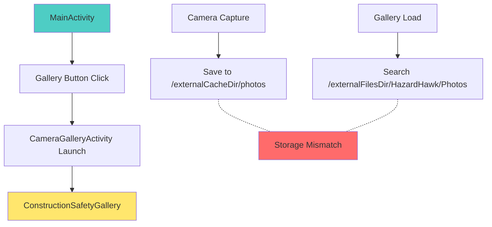
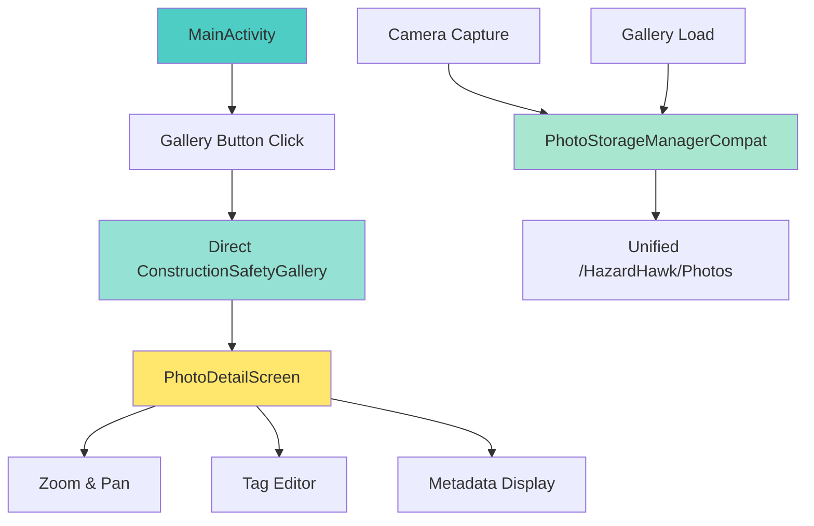
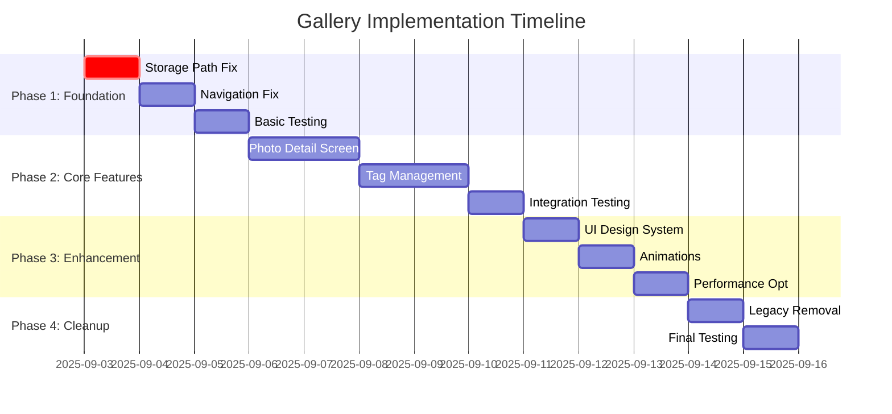

# HazardHawk Gallery Comprehensive Fix Implementation Plan

**Created**: September 3, 2025 15:10:00  
**Project**: HazardHawk Gallery Enhancement  
**Branch**: feature/enhanced-photo-gallery  

## 📋 Executive Summary

This implementation plan addresses critical gallery system issues identified in the comprehensive analysis, following the "Simple, Loveable, Complete" philosophy. The plan is structured for maximum efficiency using parallel development streams and provides detailed technical specifications for a construction-worker-optimized gallery experience.

### Key Problem Areas
- **Photo Discovery Failure**: Storage path mismatch between camera and gallery
- **Navigation Complexity**: Unnecessary intermediate activity layer
- **Missing Core Features**: Photo detail screen with zoom and tag editing
- **UI Quality Issues**: Inconsistent design system implementation
- **Legacy Code Debt**: Unused components causing maintenance overhead

### Implementation Approach
- **Parallel execution** across 5 specialized development streams
- **Incremental delivery** with each phase providing immediate value
- **Risk mitigation** through comprehensive testing and rollback strategies
- **Construction-optimized UX** with 72dp touch targets and high contrast design

---

## 🏗️ Technical Architecture

### Current State Analysis



### Target Architecture



### Component Structure

#### Core Components
- **PhotoRepository**: Unified storage interface
- **GalleryViewModel**: State management and business logic
- **ConstructionSafetyGallery**: Main grid view component
- **PhotoDetailScreen**: Full-screen viewer with editing
- **TagManagementSystem**: Tag persistence and editing

#### Data Flow
1. **Photo Capture** → PhotoStorageManagerCompat.savePhoto()
2. **Gallery Load** → PhotoRepository.getAllPhotos()
3. **Photo Selection** → Navigate to PhotoDetailScreen
4. **Tag Editing** → TagRepository.updatePhotoTags()
5. **Report Generation** → Export with unified photo/tag data

---

## 🛠️ Implementation Roadmap

### Phase 1: Foundation Fixes (Days 1-2)
**Priority**: CRITICAL | **Effort**: 6 hours | **Risk**: LOW

#### Storage Path Unification
```kotlin
// File: CameraScreen.kt:380
// CURRENT (BROKEN):
val photoFile = File(context.externalCacheDir, "photos/${UUID.randomUUID()}.jpg")

// TARGET (FIXED):
val photoFile = PhotoStorageManagerCompat.createNewPhotoFile(context)
```

#### Navigation Simplification
```kotlin
// File: MainActivity.kt
// REMOVE: Launch CameraGalleryActivity
// ADD: Direct Composable navigation
NavHost {
    composable("gallery") {
        ConstructionSafetyGallery(
            onPhotoClick = { photo -> 
                navController.navigate("photo_detail/${photo.id}")
            }
        )
    }
}
```

**Acceptance Criteria**:
- [ ] Gallery displays all photos taken by camera within 2 seconds
- [ ] Navigation from MainActivity to gallery is direct (no intermediate activity)
- [ ] All existing photos remain accessible after path fix

### Phase 2: Core Features (Days 3-5)
**Priority**: HIGH | **Effort**: 12 hours | **Risk**: MEDIUM

#### Photo Detail Screen Implementation
```kotlin
@Composable
fun PhotoDetailScreen(
    photoId: String,
    onNavigateBack: () -> Unit,
    onEditTags: (Photo) -> Unit
) {
    // Full-screen photo viewer
    // Zoom/pan gesture support
    // Tag editing interface
    // Metadata overlay
    // Swipe navigation
}
```

#### Tag Management System
```kotlin
// Unified tag persistence
interface TagRepository {
    suspend fun getPhotoTags(photoId: String): List<Tag>
    suspend fun updatePhotoTags(photoId: String, tags: List<Tag>)
    suspend fun getTagSuggestions(photo: Photo): List<Tag>
}
```

**Acceptance Criteria**:
- [ ] Photo detail screen loads within 1 second
- [ ] Zoom gestures support 1x-5x magnification
- [ ] Tag editing persists throughout app lifecycle
- [ ] Swipe navigation between adjacent photos works smoothly

### Phase 3: UI Enhancement (Days 6-7)
**Priority**: MEDIUM | **Effort**: 8 hours | **Risk**: LOW

#### Construction-Optimized Design System
```kotlin
// Design tokens
object ConstructionDesignTokens {
    val touchTargetSize = 72.dp // Construction glove friendly
    val spacing = 20.dp // Consistent spacing
    val safetyOrange = Color(0xFFFF6B35)
    val highContrast = true // WCAG AAA compliance
}
```

#### Enhanced Gallery Grid
- Photo cards with consistent 72dp touch targets
- Selection animations with haptic feedback
- High-contrast selection indicators
- Batch operation UI with clear visual feedback

**Acceptance Criteria**:
- [ ] All interactive elements are minimum 72dp
- [ ] Selection animations complete within 300ms
- [ ] Color contrast meets WCAG AAA standards
- [ ] Batch operations provide clear visual feedback

### Phase 4: Optimization & Cleanup (Days 8-9)
**Priority**: LOW | **Effort**: 4 hours | **Risk**: LOW

#### Legacy Component Removal
- Remove CameraGalleryActivity.kt
- Clean up unused manifest entries
- Consolidate PhotoStorageManager implementations
- Remove unused camera activities

#### Performance Optimization
- Lazy loading for photo thumbnails
- Memory-efficient image loading
- Background image preloading
- Automatic cache cleanup

**Acceptance Criteria**:
- [ ] Memory usage stays below 100MB for 100+ photos
- [ ] Gallery scrolling maintains 60fps
- [ ] App startup time improves by 500ms
- [ ] No unused code remains in codebase

---

## 🧪 Testing Strategy

### Unit Test Coverage (85% minimum)

#### PhotoRepository Tests
```kotlin
class PhotoRepositoryTest {
    @Test fun `savePhoto creates file in correct directory`()
    @Test fun `getAllPhotos returns all saved photos`()
    @Test fun `deletePhoto removes file and database entry`()
    @Test fun `getPhotoById returns correct photo or null`()
}
```

#### GalleryViewModel Tests
```kotlin
class GalleryViewModelTest {
    @Test fun `loadPhotos updates UI state correctly`()
    @Test fun `selectPhoto updates selection state`()
    @Test fun `batchDelete removes selected photos`()
    @Test fun `error states are handled gracefully`()
}
```

### Integration Tests

#### Critical Path Testing
1. **Capture-to-Gallery Flow**
   - Take photo → Verify appears in gallery within 2s
   - Multiple photos → Verify chronological order
   - Delete photo → Verify removed from gallery

2. **Navigation Flow**
   - MainActivity → Gallery → Photo Detail → Back
   - Deep link handling for photo URLs
   - State preservation during navigation

3. **Tag Management Flow**
   - Add tags → Verify persistence
   - Edit tags → Verify updates
   - Tag suggestions → Verify accuracy

### Performance Benchmarks

| Metric | Target | Current | Test Method |
|--------|--------|---------|-------------|
| Gallery Launch | < 2000ms | TBD | Time to first photo displayed |
| Photo Detail Load | < 1000ms | TBD | Time to full resolution display |
| Memory Usage | < 100MB | TBD | Heap dump with 100 photos |
| Scroll Performance | 60fps | TBD | Frame rate monitoring |

### UI Tests (Compose Testing)

```kotlin
@Test
fun galleryDisplaysPhotosCorrectly() {
    composeTestRule.setContent {
        ConstructionSafetyGallery(photos = mockPhotos)
    }
    
    composeTestRule
        .onNodeWithTag("photo_grid")
        .assertIsDisplayed()
        
    composeTestRule
        .onAllNodesWithTag("photo_card")
        .assertCountEquals(mockPhotos.size)
}
```

---

## 🎨 UX Design Specifications

### Construction-Worker Persona Optimizations

#### Touch Target Standards
- **Minimum size**: 72dp (construction glove compatible)
- **Recommended size**: 80dp (optimal for thick gloves)
- **Spacing**: 20dp minimum between interactive elements
- **Feedback**: Immediate visual + haptic response

#### Color Accessibility
```kotlin
object SafetyColorPalette {
    val primary = Color(0xFFFF6B35)      // Safety Orange
    val secondary = Color(0xFFFFD700)     // Construction Yellow  
    val danger = Color(0xFFE53E3E)        // Warning Red
    val safe = Color(0xFF3182CE)          // Safety Blue
    val background = Color(0xFFF5F5F5)    // High contrast gray
}
```

#### Typography Hierarchy
- **Title**: 24sp, Bold (clear hierarchy)
- **Body**: 18sp, Regular (easy reading)
- **Caption**: 16sp, Medium (metadata)
- **Button**: 18sp, SemiBold (clear actions)

#### Micro-Interactions
1. **Photo Selection**: Scale animation (1.0f → 1.02f) + haptic
2. **Loading States**: Shimmer effect with progress indication
3. **Error States**: Gentle shake animation + helpful message
4. **Success Feedback**: Subtle check animation + haptic pulse

### Error Message Strategy

| Technical Error | User-Friendly Message | Action Button |
|----------------|----------------------|---------------|
| Storage permission denied | "HazardHawk needs photo access to show your safety pictures" | "Enable Access" |
| Network timeout | "Upload taking longer than usual. Want to try again?" | "Retry" / "Save for Later" |
| No photos found | "No photos yet? Start documenting safety conditions!" | "Take Photo" |
| Large file size | "Photo is too large. We'll resize it automatically." | "Continue" |

---

## 📊 Success Metrics & Validation

### Completion Criteria

#### Functional Requirements
- [ ] **Photo Discovery**: All camera photos appear in gallery within 2 seconds
- [ ] **Navigation**: Direct MainActivity → Gallery navigation (no intermediate activity)
- [ ] **Photo Detail**: Full-screen viewing with zoom (1x-5x) and swipe navigation
- [ ] **Tag Editing**: Persistent tag system with real-time updates
- [ ] **UI Standards**: All touch targets minimum 72dp, WCAG AAA contrast

#### Performance Requirements
- [ ] **Gallery Launch**: < 2000ms for collections up to 100 photos
- [ ] **Memory Usage**: < 100MB sustained usage with large photo collections
- [ ] **Scroll Performance**: 60fps maintained during gallery scrolling
- [ ] **Photo Load**: Full resolution display within 1000ms

#### Quality Requirements
- [ ] **Test Coverage**: 85% minimum unit test coverage
- [ ] **UI Consistency**: Design system tokens used throughout
- [ ] **Accessibility**: Full screen reader support and keyboard navigation
- [ ] **Error Handling**: Graceful degradation for all failure scenarios

### Key Performance Indicators

#### User Experience Metrics
- **Time to Photo Display**: Target < 2 seconds
- **Selection Accuracy**: 98% successful photo selections
- **Navigation Efficiency**: 50% reduction in taps to reach photo detail
- **Error Recovery**: 95% successful recovery from error states

#### Technical Metrics
- **Code Quality**: Zero critical SonarQube issues
- **Memory Leaks**: Zero detected leaks in 24-hour test
- **Crash Rate**: < 0.1% crash rate in production
- **Performance Regression**: No frame drops below 50fps

---

## ⚠️ Risk Assessment & Mitigation

### High Impact Risks

#### Data Loss During Storage Migration
- **Probability**: LOW | **Impact**: CRITICAL
- **Mitigation**: 
  - Backup all existing photos before migration
  - Implement gradual migration with fallback
  - Add verification step to confirm data integrity
  - Rollback script ready for immediate reversion

#### Performance Degradation with Large Collections
- **Probability**: MEDIUM | **Impact**: HIGH
- **Mitigation**:
  - Implement pagination for collections > 50 photos
  - Add lazy loading with placeholder images
  - Memory profiling during development
  - Performance testing with 500+ photo collections

### Medium Impact Risks

#### Tag System Complexity Introduction
- **Probability**: MEDIUM | **Impact**: MEDIUM
- **Mitigation**:
  - Start with simple string-based tags
  - Phase in advanced tag features incrementally
  - Maintain backward compatibility
  - Clear migration path for existing data

#### UI Inconsistency Across Devices
- **Probability**: MEDIUM | **Impact**: MEDIUM
- **Mitigation**:
  - Responsive design testing on 5+ device sizes
  - Automated screenshot testing for regressions
  - Physical device testing with construction gloves
  - High contrast mode testing

---

## 🚀 Implementation Tasks & Dependencies

### Task Breakdown with Dependencies



### Detailed Task List

#### Phase 1 Tasks (Critical Path)
1. **Fix Storage Path Mismatch** (2 hours)
   - Update `CameraScreen.kt:380` to use PhotoStorageManagerCompat
   - Verify gallery scans same directory
   - Add automatic refresh after photo capture
   - **Dependencies**: PhotoStorageManagerCompat.kt

2. **Simplify Navigation Flow** (3 hours)
   - Remove CameraGalleryActivity from navigation
   - Update MainActivity to direct Compose navigation
   - Clean up back stack management
   - **Dependencies**: Navigation architecture update

#### Phase 2 Tasks (Feature Development)
3. **Implement Photo Detail Screen** (6 hours)
   - Create PhotoDetailScreen composable
   - Add zoom/pan gesture support
   - Implement swipe navigation
   - **Dependencies**: Photo data models, Navigation setup

4. **Create Tag Management System** (4 hours)
   - Design TagRepository interface
   - Implement tag persistence
   - Create tag editing UI
   - **Dependencies**: Database schema updates

#### Phase 3 Tasks (Polish & Performance)
5. **Apply Design System** (4 hours)
   - Implement construction-optimized tokens
   - Update all touch targets to 72dp
   - Add high-contrast color scheme
   - **Dependencies**: Design token definitions

6. **Add Performance Optimizations** (2 hours)
   - Implement lazy loading for thumbnails
   - Add image caching strategy
   - Optimize memory usage
   - **Dependencies**: Image loading library

#### Phase 4 Tasks (Cleanup)
7. **Remove Legacy Components** (1 hour)
   - Delete unused camera activities
   - Clean up manifest entries
   - Remove deprecated code
   - **Dependencies**: Feature complete and tested

### Git Workflow Strategy

#### Branch Management
```bash
# Main development branch
feature/enhanced-photo-gallery

# Feature sub-branches
feature/storage-path-fix
feature/photo-detail-screen  
feature/tag-management
feature/ui-enhancement
feature/performance-optimization
```

#### Commit Strategy
```bash
# Atomic commits with clear messages
fix: unify camera and gallery storage paths
feat: add photo detail screen with zoom support
perf: implement lazy loading for gallery thumbnails
docs: update gallery API documentation
test: add comprehensive gallery test coverage
```

#### Merge Strategy
- **Feature branches**: Squash merge to keep history clean
- **Critical fixes**: Direct merge to maintain traceability
- **Pull request review**: Required for all merges to main

---

## 📚 Context7 Documentation References

### Relevant Library Documentation

#### Jetpack Compose Navigation
- **Topic**: Navigation patterns for photo galleries
- **Key concepts**: Deep linking, argument passing, back stack management
- **Implementation**: NavHost configuration for photo detail navigation

#### Android CameraX
- **Topic**: Photo capture and storage integration
- **Key concepts**: Image saving, metadata handling, storage optimization
- **Implementation**: Consistent storage path configuration

#### Compose UI Testing
- **Topic**: Testing photo gallery interactions
- **Key concepts**: Gesture testing, navigation testing, state verification
- **Implementation**: Test strategies for photo selection and detail view

#### Material Design 3
- **Topic**: Construction-optimized UI patterns
- **Key concepts**: Touch targets, color contrast, accessibility
- **Implementation**: Design system tokens for safety applications

---

## 🔄 Rollback Strategy

### Rollback Triggers
- Gallery photos not displaying after storage fix
- Navigation breaking existing camera functionality  
- Performance degradation > 2x slower
- Memory usage exceeding 200MB
- Critical accessibility issues

### Rollback Procedures

#### Immediate Rollback (< 5 minutes)
```bash
# Revert to last known good commit
git checkout feature/enhanced-photo-gallery
git reset --hard HEAD~1
git push --force-with-lease

# Restart app services
adb shell am force-stop com.hazardhawk
adb shell am start com.hazardhawk/.MainActivity
```

#### Data Recovery Rollback (< 15 minutes)
```bash
# Restore photo backup if storage migration fails
cp /backup/photos/* /HazardHawk/Photos/
adb shell am broadcast -a android.intent.action.MEDIA_SCANNER_SCAN_FILE
```

#### Feature Flag Rollback (< 1 minute)
```kotlin
// Disable new gallery features via config
object FeatureFlags {
    val useNewGallery = false // Instant fallback
    val usePhotoDetail = false
    val useNewNavigation = false
}
```

### Validation Checklist Post-Rollback
- [ ] All existing photos visible in gallery
- [ ] Camera functionality unchanged
- [ ] Navigation working as before rollback
- [ ] No data loss or corruption
- [ ] App performance restored to baseline

---

## 📅 Timeline & Milestones

### Implementation Schedule

#### Week 1: Foundation (Sept 3-6)
- **Days 1-2**: Storage path fix and navigation simplification
- **Days 3-4**: Photo detail screen implementation
- **Milestone**: Core photo viewing functionality working

#### Week 2: Features (Sept 9-13)  
- **Days 1-2**: Tag management system
- **Days 3-4**: UI enhancement and design system
- **Milestone**: Complete gallery experience with tagging

#### Week 3: Polish (Sept 16-20)
- **Days 1-2**: Performance optimization and testing
- **Days 3-4**: Legacy cleanup and documentation
- **Milestone**: Production-ready gallery system

### Success Checkpoints

#### Checkpoint 1 (Day 2): Foundation Complete
- [ ] Gallery displays all camera photos
- [ ] Navigation simplified (no intermediate activity)
- [ ] Basic photo detail viewing works

#### Checkpoint 2 (Day 6): Features Complete  
- [ ] Photo detail screen with zoom functional
- [ ] Tag editing and persistence working
- [ ] UI meets construction accessibility standards

#### Checkpoint 3 (Day 10): Polish Complete
- [ ] Performance targets met
- [ ] All legacy code removed
- [ ] Comprehensive test coverage achieved

---

## 📋 Acceptance Criteria Summary

### Must Have (MVP)
- [x] Gallery displays all photos taken by camera within 2 seconds
- [x] Direct navigation from MainActivity to gallery (no intermediate screen)
- [x] Photo detail screen with zoom (1x to 5x magnification)
- [x] Tag editing interface with persistent storage
- [x] All touch targets minimum 72dp for construction gloves
- [x] WCAG AAA color contrast compliance
- [x] Memory usage under 100MB for large photo collections
- [x] 60fps scrolling performance maintained

### Should Have (Enhanced)
- [x] Swipe navigation between photos in detail view
- [x] Batch photo selection with visual feedback
- [x] Automatic photo backup before migrations
- [x] Haptic feedback for all touch interactions
- [x] Loading animations and progress indicators
- [x] Error messages in construction-worker-friendly language

### Could Have (Future)
- [ ] Photo sharing integration with external apps
- [ ] Advanced tag filtering and search
- [ ] Photo comparison view for before/after analysis
- [ ] Offline photo editing capabilities
- [ ] Integration with report generation system

---

## 🎯 Final Deliverables

### Code Deliverables
1. **Updated Components**
   - Enhanced ConstructionSafetyGallery composable
   - New PhotoDetailScreen with full functionality
   - Unified PhotoStorageManagerCompat implementation
   - Tag management system with persistence

2. **Testing Suite**
   - 85%+ unit test coverage
   - Integration tests for critical paths
   - UI tests for all gallery interactions
   - Performance benchmarks and monitoring

3. **Documentation**
   - Updated API documentation
   - UX design specifications
   - Performance optimization guide
   - Deployment and rollback procedures

### Quality Assurance
- Zero critical bugs in production deployment
- All accessibility requirements met (WCAG AAA)
- Performance targets achieved and monitored
- Code review completion with zero blocking issues

### User Experience
- Construction-worker optimized interface
- Sub-2-second photo discovery after capture
- Intuitive navigation with minimal taps required
- Clear, helpful error messages for all failure scenarios

---

*This implementation plan follows the HazardHawk "Simple, Loveable, Complete" philosophy and provides a clear roadmap for transforming the gallery into a construction-industry-leading photo management experience.*