# 🤖 HazardHawk AI Integration Implementation Plan

**Project:** Activate AI functionality in HazardHawk construction safety app  
**Created:** September 3, 2025  
**Based on:** [AI Integration Research Analysis](/docs/research/20250903-153000-ai-integration-comprehensive-analysis.html)

## 📊 Executive Summary

### Current State
- ✅ **Well-designed AI architecture** with Facade, Strategy, and Repository patterns
- ❌ **AI not activating** due to placeholder model files and missing implementations
- ✅ **Photo quality enhanced** to 92% JPEG quality (from 80%)
- ✅ **Time format fixed** to 12-hour format throughout app

### Critical Path to AI Activation
1. **Replace placeholder models** with trained construction safety detection models
2. **Complete Android YOLO detector** actual implementation 
3. **Add user feedback** for AI status and error handling
4. **Validate performance** with real construction images

### Success Metrics
- AI activation success rate: **>95%** of photos analyzed
- Analysis speed: **<3 seconds** per photo
- User satisfaction: **>4.5/5** rating for AI accuracy
- Hazard detection accuracy: **>85%** for common construction hazards

---

## 🏗️ Technical Architecture (Gemma 3N E2B Multimodal)

### Core Components (Multimodal AI Implementation)


### Key Interface Contracts

```kotlin
// Primary AI Service Contract (Existing - Simplify)
interface AIServiceFacade {
    suspend fun initialize(): Result<Unit>
    suspend fun analyzePhotoWithTags(
        data: ByteArray, 
        width: Int, 
        height: Int, 
        workType: WorkType = WorkType.GENERAL_CONSTRUCTION
    ): PhotoAnalysisWithTags
}

// Platform-Specific Implementation Contract (Gemma 3N E2B)  
actual class GemmaVisionAnalyzer(private val context: Context) {
    private var ortSession: OrtSession? = null
    private var visionEncoder: OrtSession? = null
    private var decoder: OrtSession? = null
    private var modelLoaded = false
    
    actual suspend fun initialize(
        modelPath: String,
        confidenceThreshold: Float = 0.6f
    ): Boolean {
        // Load ONNX models from assets (vision_encoder.onnx, decoder_model_merged_q4.onnx)
        // Initialize ONNX Runtime with GPU acceleration (Android Neural Networks API)
        // Validate multimodal model format and capabilities
    }
    
    actual suspend fun analyzeConstructionSafety(
        imageData: ByteArray,
        width: Int,
        height: Int,
        analysisPrompt: String = "Identify construction safety hazards in this image. List any OSHA violations, unsafe practices, missing PPE, and equipment hazards."
    ): SafetyAnalysisResult {
        // Encode image through vision encoder
        // Generate safety analysis text through decoder
        // Parse results into structured SafetyAnalysisResult
        // Extract hazard detections and OSHA compliance items
    }
}
```

### Multimodal Data Flow

1. **Photo Capture** → `CameraScreen.kt` captures photo
2. **Vision Encoding** → Gemma 3N E2B vision encoder processes image
3. **Safety Analysis** → Decoder generates comprehensive safety assessment text
4. **Tag Extraction** → `HazardTagMapper` extracts structured data from AI analysis
5. **OSHA Compliance** → Maps findings to specific OSHA 1926 standards
6. **UI Feedback** → Results displayed with confidence indicators and detailed explanations

---

## 🔧 Refactoring Strategy (Technical Debt Resolution)

### Immediate Simplifications

#### 1. Consolidate Duplicate Definitions
```kotlin
// REMOVE: /HazardHawk/shared/src/commonMain/kotlin/com/hazardhawk/ai/HazardTagMapping.kt
// KEEP: /shared/src/commonMain/kotlin/com/hazardhawk/ai/HazardTagMapper.kt

// Unified WorkType enum in single location
enum class WorkType {
    GENERAL_CONSTRUCTION,
    ELECTRICAL_WORK, 
    ROOFING,
    EXCAVATION,
    CONCRETE_WORK,
    STEEL_WORK
}
```

#### 2. Simplify AI Service Facade (Gemma 3N E2B Version)
```kotlin
// Multimodal implementation focusing on comprehensive safety analysis
class GemmaAIServiceFacade(
    private val gemmaAnalyzer: GemmaVisionAnalyzer,
    private val tagMapper: HazardTagMapper
) : AIServiceFacade {
    
    override suspend fun initialize(): Result<Unit> {
        return try {
            gemmaAnalyzer.initialize(
                modelPath = "gemma-3n-e2b-construction-safety",
                confidenceThreshold = 0.6f
            )
            Result.success(Unit)
        } catch (e: Exception) {
            Result.failure(e)
        }
    }
    
    override suspend fun analyzePhotoWithTags(
        data: ByteArray, width: Int, height: Int, workType: WorkType
    ): PhotoAnalysisWithTags {
        return try {
            val safetyAnalysis = gemmaAnalyzer.analyzeConstructionSafety(
                imageData = data, 
                width = width, 
                height = height,
                analysisPrompt = buildWorkTypePrompt(workType)
            )
            
            val tags = tagMapper.mapFromAIAnalysis(safetyAnalysis, workType)
            
            PhotoAnalysisWithTags(
                analysisText = safetyAnalysis.detailedAssessment,
                oshaViolations = safetyAnalysis.oshaViolations,
                safetyRecommendations = safetyAnalysis.recommendations,
                recommendedTags = tags,
                analysisType = AnalysisType.MULTIMODAL_AI,
                processingTimeMs = safetyAnalysis.processingTimeMs,
                confidenceScore = safetyAnalysis.overallConfidence
            )
        } catch (e: Exception) {
            // Fallback to basic recommendations
            generateBasicRecommendations(workType)
        }
    }
    
    private fun buildWorkTypePrompt(workType: WorkType): String {
        return when (workType) {
            WorkType.ELECTRICAL_WORK -> "Analyze this construction site focusing on electrical safety hazards, OSHA 1926 Subpart K violations, proper PPE usage, and lockout/tagout procedures."
            WorkType.ROOFING -> "Examine this roofing work for fall protection violations, proper safety equipment, OSHA 1926 Subpart M compliance, and edge protection measures."
            else -> "Identify construction safety hazards including OSHA 1926 violations, missing PPE, unsafe practices, and equipment hazards."
        }
    }
}
```

### File Modifications Required

| File | Action | Priority |
|------|--------|----------|
| `/shared/src/androidMain/kotlin/com/hazardhawk/ai/GemmaVisionAnalyzer.kt` | **Implement** Android-specific Gemma 3N E2B inference | **Critical** |
| `/androidApp/src/main/assets/vision_encoder.onnx` | **Add** Gemma 3N E2B vision encoder | **Critical** |
| `/androidApp/src/main/assets/decoder_model_merged_q4.onnx` | **Add** Gemma 3N E2B decoder (quantized) | **Critical** |
| `/androidApp/src/main/assets/model_metadata.json` | **Update** with Gemma model specifications | **Critical** |
| `/shared/src/commonMain/kotlin/com/hazardhawk/ai/AIServiceFacade.kt` | **Update** for multimodal analysis | **High** |
| `/shared/src/commonMain/kotlin/com/hazardhawk/ai/HazardTagMapper.kt` | **Enhance** to parse AI-generated text | **High** |
| `/HazardHawk/androidApp/src/main/java/com/hazardhawk/CameraScreen.kt` | **Add** AI status indicators | **Medium** |

---

## 🧪 Testing Strategy (Quality Assurance)

### Testing Pyramid

```mermaid
graph TD
    A[Unit Tests - 60%] --> B[Integration Tests - 30%]
    B --> C[E2E Tests - 10%]
    
    A --> A1[Model Loading Tests]
    A --> A2[YOLO Detector Tests]
    A --> A3[Tag Mapping Tests]
    A --> A4[Error Handling Tests]
    
    B --> B1[Camera → AI → UI Flow]
    B --> B2[Performance Benchmarks]
    B --> B3[Device Compatibility]
    
    C --> C1[Real Construction Photos]
    C --> C2[Field Testing Scenarios]
```



### Critical Test Scenarios

#### 1. Model Replacement Validation
```kotlin
@Test
fun `model loading succeeds with real tflite file`() {
    // Verify trained model loads without errors
    // Validate model input/output dimensions
    // Check class count matches HazardType enum
}

@Test
fun `model inference produces valid detections`() {
    // Test with sample construction images
    // Verify detection format and confidence values
    // Ensure performance meets <3 second target
}
```

#### 2. End-to-End Workflow Testing
```kotlin
@Test
fun `complete photo analysis workflow`() {
    // Photo capture → AI analysis → tag recommendations → UI display
    // Verify each stage completes successfully
    // Test error handling and fallback scenarios
}
```

#### 3. Performance Benchmarks
```kotlin
@Test
fun `ai analysis performance meets targets`() {
    // Analysis speed: <3 seconds per photo
    // Memory usage: <200MB during inference  
    // Battery impact: <2% per analysis
    // Success rate: >95% of photos
}
```

### Test Execution Commands
```bash
# Run AI-specific unit tests
./gradlew :shared:testDebugUnitTest --tests "*AI*" --tests "*YOLO*" --tests "*Hazard*"

# Run Android AI integration tests
./gradlew :androidApp:connectedDebugAndroidTest --tests "*AI*" --tests "*Camera*"

# Run performance benchmarks
./gradlew :shared:test --tests "*Performance*" --tests "*Benchmark*"

# Complete AI test suite
./gradlew :shared:allTests :androidApp:connectedAndroidTest --tests "*AI*"
```

---

## 🎨 User Experience Design (Delightful AI)

### AI Status Communication

#### Processing States
```kotlin
@Composable
fun AIAnalysisIndicator(
    status: AIAnalysisStatus,
    progress: Float,
    processingStep: String
) {
    Card(
        modifier = Modifier.fillMaxWidth(),
        colors = CardDefaults.cardColors(
            containerColor = ConstructionColors.SafetyOrange.copy(alpha = 0.1f)
        )
    ) {
        Column(modifier = Modifier.padding(16.dp)) {
            Row(verticalAlignment = Alignment.CenterVertically) {
                when (status) {
                    AIAnalysisStatus.INITIALIZING -> {
                        CircularProgressIndicator(
                            modifier = Modifier.size(20.dp),
                            color = ConstructionColors.SafetyOrange
                        )
                        Spacer(modifier = Modifier.width(12.dp))
                        Text("🔧 Starting AI Analysis...")
                    }
                    AIAnalysisStatus.ANALYZING -> {
                        CircularProgressIndicator(
                            progress = progress,
                            modifier = Modifier.size(20.dp),
                            color = ConstructionColors.SafetyBlue
                        )
                        Spacer(modifier = Modifier.width(12.dp))
                        Text("🔍 $processingStep")
                    }
                    AIAnalysisStatus.COMPLETED -> {
                        Icon(
                            imageVector = Icons.Default.CheckCircle,
                            contentDescription = "Complete",
                            tint = ConstructionColors.SafetyGreen,
                            modifier = Modifier.size(20.dp)
                        )
                        Spacer(modifier = Modifier.width(12.dp))
                        Text("✅ AI Analysis Complete")
                    }
                    AIAnalysisStatus.FAILED -> {
                        Icon(
                            imageVector = Icons.Default.Warning,
                            contentDescription = "Failed",
                            tint = ConstructionColors.SafetyRed,
                            modifier = Modifier.size(20.dp)
                        )
                        Spacer(modifier = Modifier.width(12.dp))
                        Text("⚠️ Using Basic Safety Tags")
                    }
                }
            }
        }
    }
}
```

#### Error Recovery UX
```kotlin
@Composable
fun AIErrorRecoveryCard(
    error: AIAnalysisError,
    onRetryAI: () -> Unit,
    onProceedManually: () -> Unit
) {
    val (friendlyMessage, actionText) = when (error) {
        is AIAnalysisError.ModelLoadFailed -> 
            "AI model needs updating. You can still add safety tags manually." to "Try Again Later"
        is AIAnalysisError.InferenceTimeout -> 
            "Analysis taking longer than usual. Try manual tagging for now." to "Retry AI"
        is AIAnalysisError.OutOfMemory -> 
            "Device memory low. Closing other apps may help AI performance." to "Retry Now"
        else -> 
            "AI temporarily unavailable. Manual safety tagging is ready." to "Try Again"
    }
    
    Card(
        modifier = Modifier.fillMaxWidth(),
        colors = CardDefaults.cardColors(
            containerColor = ConstructionColors.CautionYellow.copy(alpha = 0.1f)
        ),
        border = BorderStroke(1.dp, ConstructionColors.CautionYellow)
    ) {
        Column(modifier = Modifier.padding(16.dp)) {
            Text(
                text = friendlyMessage,
                style = MaterialTheme.typography.bodyLarge,
                color = MaterialTheme.colorScheme.onSurface
            )
            
            Spacer(modifier = Modifier.height(12.dp))
            
            Row(horizontalArrangement = Arrangement.spacedBy(12.dp)) {
                ConstructionSecondaryButton(
                    onClick = onRetryAI,
                    text = actionText,
                    modifier = Modifier.weight(1f)
                )
                
                ConstructionPrimaryButton(
                    onClick = onProceedManually,
                    text = "Continue Manually",
                    modifier = Modifier.weight(1f)
                )
            }
        }
    }
}
```

### Construction-Optimized Design
- **High Contrast Mode** for outdoor visibility
- **Large Touch Targets** (72dp+) for gloved operation  
- **Haptic Feedback** for confirmation in noisy environments
- **Clear Progress Indicators** showing AI is working

---

## 📅 Implementation Timeline (4-Week Orchestrated Plan)

### Week 1: Foundation & Model Integration


### Daily Task Breakdown

#### **Week 1: Foundation (Days 1-7)**
- **Day 1-2**: Download Gemma 3N E2B ONNX models from HuggingFace Hub
- **Day 2-4**: Implement Android Gemma Vision Analyzer with ONNX Runtime Mobile
- **Day 3**: Replace model assets with ONNX files and update metadata
- **Day 4-5**: Basic multimodal integration testing and validation
- **Day 6-7**: Performance optimization and Android Neural Networks API acceleration

#### **Week 2: Integration (Days 8-14)**  
- **Day 8-9**: Add AI status indicators to camera screen
- **Day 10-11**: Implement comprehensive error handling
- **Day 12-13**: Integrate with existing photo capture workflow
- **Day 14**: End-to-end testing and debugging

#### **Week 3: Polish (Days 15-21)**
- **Day 15-16**: UX improvements and delightful interactions
- **Day 17-18**: Field testing with construction scenarios
- **Day 19-20**: Performance benchmarking and optimization
- **Day 21**: Documentation and user training materials

#### **Week 4: Deployment (Days 22-28)**
- **Day 22-23**: Production validation and testing
- **Day 24-25**: Staged rollout preparation and monitoring setup
- **Day 26-27**: Final testing and deployment
- **Day 28**: Go-live monitoring and support

### Resource Allocation
- **40%** Architecture & Implementation (Android YOLO detector, model integration)
- **25%** Testing & Validation (unit, integration, performance testing)
- **20%** UX & Polish (status indicators, error handling, delightful interactions)
- **15%** Documentation & Training (implementation guides, user training)

---

## ✅ Implementation Tasks (Detailed Checklist)

### Phase 1: Critical Path (Week 1) 🔴

#### Gemma 3N E2B Model Integration
- [ ] **Download Gemma 3N E2B ONNX models**
  - Source from HuggingFace: `onnx-community/gemma-3n-E2B-it-ONNX`
  - Download `vision_encoder.onnx` (~500MB) and `decoder_model_merged_q4.onnx` (~1.5GB)
  - Verify ONNX model format and compatibility with ONNX Runtime Mobile
  - Test inference speed (<3 seconds for multimodal analysis on mid-range Android)

- [ ] **Replace placeholder model assets**
  - Add `/androidApp/src/main/assets/vision_encoder.onnx`
  - Add `/androidApp/src/main/assets/decoder_model_merged_q4.onnx`
  - Update `/androidApp/src/main/assets/model_metadata.json` with Gemma specifications:
    ```json
    {
      "model_name": "gemma-3n-e2b-construction-safety",
      "version": "1.0.0",
      "vision_input_size": [224, 224, 3],
      "max_sequence_length": 2048,
      "supports_multimodal": true,
      "memory_footprint_mb": 2048,
      "confidence_threshold": 0.6
    }
    ```

#### Android Gemma Vision Analyzer Implementation
- [ ] **Complete Android actual class implementation**
  ```kotlin
  // File: /shared/src/androidMain/kotlin/com/hazardhawk/ai/GemmaVisionAnalyzer.kt
  actual class GemmaVisionAnalyzer(private val context: Context) {
      private var ortEnvironment: OrtEnvironment? = null
      private var visionSession: OrtSession? = null
      private var decoderSession: OrtSession? = null
      private val inputSize = 224
      
      actual suspend fun initialize(
          modelPath: String,
          confidenceThreshold: Float
      ): Boolean {
          return try {
              ortEnvironment = OrtEnvironment.getEnvironment()
              val sessionOptions = OrtSession.SessionOptions().apply {
                  addNnapi() // Android Neural Networks API acceleration
                  setIntraOpNumThreads(4)
              }
              
              val visionModelBuffer = loadAssetFile(context, "vision_encoder.onnx")
              val decoderModelBuffer = loadAssetFile(context, "decoder_model_merged_q4.onnx")
              
              visionSession = ortEnvironment!!.createSession(visionModelBuffer, sessionOptions)
              decoderSession = ortEnvironment!!.createSession(decoderModelBuffer, sessionOptions)
              true
          } catch (e: Exception) {
              Log.e("Gemma", "Model initialization failed", e)
              false
          }
      }
      
      actual suspend fun analyzeConstructionSafety(
          imageData: ByteArray,
          width: Int,
          height: Int,
          analysisPrompt: String
      ): SafetyAnalysisResult {
          // Multimodal implementation details...
          // 1. Preprocess image for vision encoder
          // 2. Run vision encoding
          // 3. Prepare text prompt with image features
          // 4. Run decoder for safety analysis
          // 5. Parse structured results
      }
  }
  ```

- [ ] **Add ONNX Runtime Mobile with Android Neural Networks API acceleration**
- [ ] **Implement proper error handling and memory management**
- [ ] **Add multimodal input preprocessing and output parsing**

### Phase 2: Integration (Week 2) 🟡

#### UI Integration
- [ ] **Add AI status indicators to CameraScreen.kt**
  - Processing indicator during analysis
  - Success/failure feedback
  - Progress bar with estimated completion time

- [ ] **Implement comprehensive error handling**
  - User-friendly error messages
  - Recovery action buttons
  - Fallback to manual tagging

- [ ] **Update CameraGalleryActivity integration**
  - Initialize AI service on app startup
  - Handle AI analysis in photo capture workflow
  - Display results in user-friendly format

### Phase 3: Testing & Validation (Week 3) 🟢

#### Automated Testing
- [ ] **Unit tests for Gemma Vision Analyzer**
  ```bash
  ./gradlew :shared:testDebugUnitTest --tests "*Gemma*" --tests "*Vision*"
  ```

- [ ] **Integration tests for multimodal AI workflow**
  ```bash
  ./gradlew :androidApp:connectedDebugAndroidTest --tests "*AI*" --tests "*Multimodal*"
  ```

- [ ] **Performance benchmark testing**
  - Memory usage during inference
  - Analysis speed across device types
  - Battery impact measurement

#### Manual Testing
- [ ] **Real construction photo testing**
  - Test with 50+ construction site photos
  - Validate multimodal safety analysis accuracy
  - Verify OSHA compliance recommendations and tag mapping
  - Test construction-specific prompt variations

- [ ] **Field testing scenarios**
  - Outdoor lighting conditions
  - Various construction work types
  - Edge cases and error scenarios

### Phase 4: Production Readiness (Week 4) ⚫

#### Deployment Preparation
- [ ] **Production configuration validation**
- [ ] **Staged rollout strategy implementation** 
- [ ] **Monitoring and analytics setup**
- [ ] **User training documentation**
- [ ] **Go-live support and monitoring**

---

## 🎯 Success Criteria & Validation

### Technical Requirements
- [ ] **AI Activation Rate**: >95% of photos successfully analyzed with Gemma 3N E2B
- [ ] **Analysis Performance**: <3 seconds average processing time for multimodal analysis
- [ ] **Memory Efficiency**: <2GB peak usage during inference (as designed for mobile)
- [ ] **Battery Impact**: <3% battery drain per analysis (acceptable for comprehensive AI)
- [ ] **Error Recovery**: >99% of failures handled gracefully with fallback to basic tags

### User Experience Requirements
- [ ] **Clear Status Communication**: Users always know AI processing status
- [ ] **Helpful Error Messages**: Construction-friendly language, actionable recovery
- [ ] **Trust Building**: Confidence indicators and transparent AI explanations
- [ ] **Field Optimization**: Works reliably in outdoor construction environments

### Business Requirements  
- [ ] **Safety Compliance**: OSHA-compliant recommendations with specific regulation references
- [ ] **Analysis Quality**: >90% accuracy for construction safety assessment and recommendations
- [ ] **User Adoption**: >80% of users actively use multimodal AI features after 2 weeks
- [ ] **Documentation Quality**: PDF reports with comprehensive AI analysis pass safety audits
- [ ] **Cost Efficiency**: Eliminate $0.25/image Gemini API costs through on-device processing

---

## 🚨 Risk Management & Rollback Strategy

### High-Risk Areas & Mitigation

#### 1. Gemma Model Performance Risk
- **Risk**: Gemma 3N E2B doesn't meet construction safety analysis requirements
- **Mitigation**: Fine-tune prompts for construction context, test multiple prompt variations
- **Rollback**: Revert to basic tag recommendations if multimodal analysis fails

#### 2. ONNX Runtime Integration Risk  
- **Risk**: ONNX Runtime Mobile integration issues on various Android versions/devices
- **Mitigation**: Comprehensive device testing, fallback to CPU execution providers
- **Rollback**: Feature flag to disable multimodal AI, maintain manual workflow

#### 3. Memory/Performance Risk
- **Risk**: 2GB memory footprint too large for older/budget Android devices
- **Mitigation**: Dynamic memory checks, device capability detection, model quantization
- **Rollback**: Automatically disable Gemma AI on devices with <4GB RAM

### Rollback Strategy (3 Levels)

#### Level 1: Quick Disable (Immediate)
```kotlin
// Feature flag in remote config
object AIFeatureFlags {
    var enableGemmaAnalysis: Boolean = RemoteConfig.getBoolean("gemma_analysis_enabled", true)
    var requireGemmaSuccess: Boolean = RemoteConfig.getBoolean("require_gemma_success", false)
    var minDeviceRamMb: Int = RemoteConfig.getInt("min_device_ram_mb", 4096)
    var enableMultimodalFeatures: Boolean = RemoteConfig.getBoolean("multimodal_features", true)
}
```

#### Level 2: Gradual Rollback (1 hour)
- Roll back to previous app version for affected users
- Maintain photo capture and manual tagging functionality
- Send degraded experience notifications

#### Level 3: Complete Rollback (4 hours)
- Full application rollback to pre-AI integration version
- Database migration reversal if needed
- User communication about temporary service restoration

---

## 📚 References & Resources

### Technical Documentation
- [HazardHawk AI Integration Research](/docs/research/20250903-153000-ai-integration-comprehensive-analysis.html)
- [Gemma 3N Developer Guide](https://ai.google.dev/gemma/docs/gemma-3n)
- [ONNX Runtime Mobile Documentation](https://onnxruntime.ai/docs/get-started/mobile/)
- [Gemma 3N ONNX Models](https://huggingface.co/onnx-community/gemma-3n-E2B-it-ONNX)
- [Android Neural Networks API](https://developer.android.com/ndk/guides/neuralnetworks)
- [Kotlin Multiplatform Mobile Documentation](https://kotlinlang.org/docs/multiplatform-mobile-getting-started.html)

### Construction Safety Resources
- [OSHA 1926 Construction Standards](https://osha.gov/laws-regs/regulations/standardnumber/1926)
- [Construction Safety Hazard Classification](https://osha.gov/construction)
- [Construction AI Safety Best Practices](https://www.cpwr.com/research/ai-construction-safety/)

### AI/ML Integration Guides
- [Gemma 3N Multimodal Integration](https://ai.google.dev/gemma)
- [ONNX Runtime Mobile Performance](https://onnxruntime.ai/docs/performance/)
- [Mobile Multimodal AI Best Practices](https://developers.googleblog.com/en/introducing-gemma-3n/)
- [Android AI Acceleration](https://developer.android.com/ndk/guides/neuralnetworks)

---

## 👥 Implementation Team Structure

### Core Development Team (4 developers)
- **AI Integration Lead** (35%): Gemma 3N E2B integration, ONNX Runtime implementation
- **Android Developer** (30%): UI integration, camera workflow, multimodal testing
- **Backend Developer** (20%): Data persistence, cost optimization, monitoring  
- **UX Designer** (15%): Multimodal interface design, error handling, field optimization

### External Dependencies
- **Construction Safety Expert**: Prompt engineering, OSHA compliance validation
- **Mobile AI Specialist**: ONNX optimization and device compatibility (if needed)
- **QA Engineer**: Comprehensive multimodal testing, performance validation

### Communication Plan
- **Daily standups** for coordination and blocker resolution
- **Bi-weekly demos** to stakeholders showing AI integration progress
- **Weekly architecture reviews** to ensure clean, maintainable implementation
- **Real-time chat channel** for immediate issue escalation and resolution

---

## 📈 Monitoring & Success Metrics

### Real-Time Monitoring Dashboard
```kotlin
object AIIntegrationMetrics {
    // Technical Performance
    val avgAnalysisTimeMs: Gauge
    val aiActivationSuccessRate: Counter
    val modelLoadFailureRate: Counter
    val memoryUsageDuringInference: Histogram
    
    // User Experience  
    val userRetryRate: Counter
    val manualTagOverrideRate: Counter
    val aiFeatureUsageRate: Counter
    val userSatisfactionScore: Gauge
    
    // Business Impact
    val oshaComplianceImprovementRate: Gauge
    val safetyIncidentReductionRate: Gauge
    val documentationQualityScore: Gauge
}
```

### Success Benchmarks (30-day tracking)
- **Technical**: 95% AI activation, <3s analysis time, <5% error rate
- **UX**: 4.5/5 user satisfaction, <10% manual override rate
- **Business**: 20% improvement in OSHA compliance documentation

---

*This implementation plan provides a comprehensive roadmap for integrating Gemma 3N E2B multimodal AI into HazardHawk, delivering on-device construction safety analysis while eliminating cloud API costs. The plan leverages the existing architecture and focuses on implementing cutting-edge mobile AI capabilities for comprehensive safety assessment and OSHA compliance.*