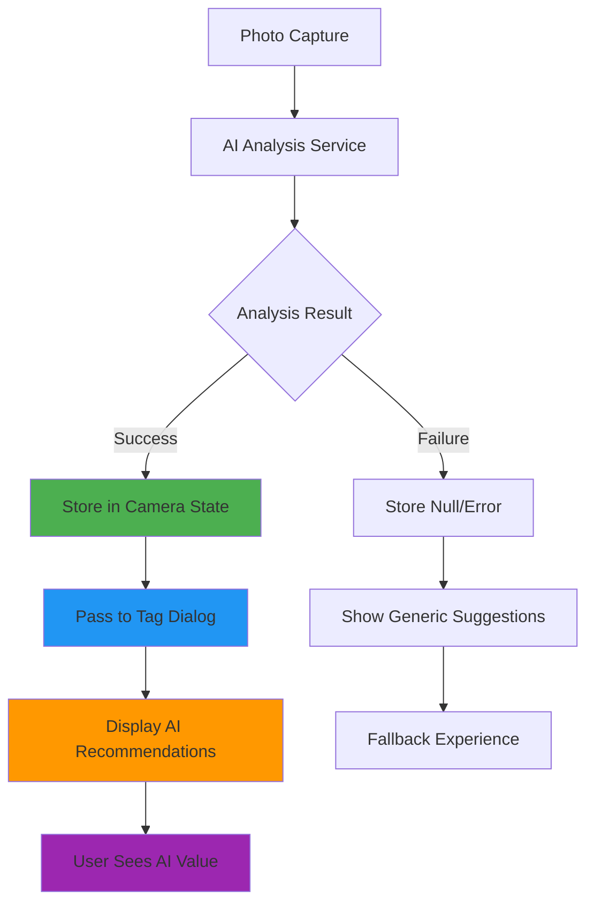
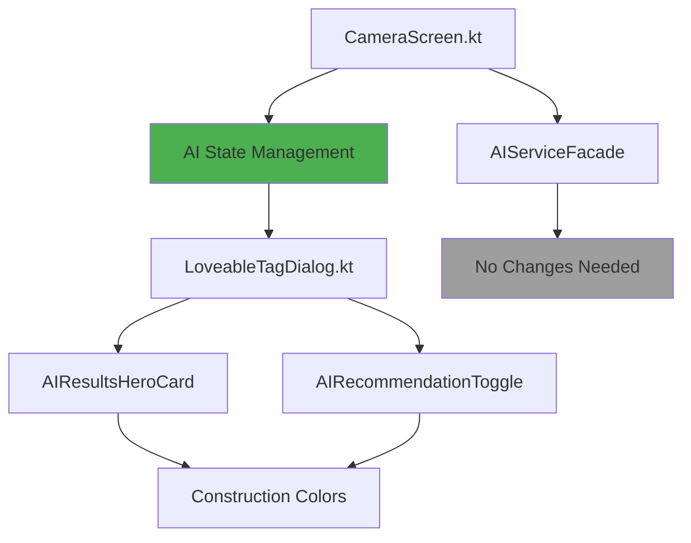

# 🔧 HazardHawk AI Workflow Results Fix - Implementation Plan

**Created:** September 4, 2025 06:39:00  
**Priority:** Critical  
**Complexity:** Medium  
**Estimated Timeline:** 7 days  

## 📊 Executive Summary

### **Problem Statement**
HazardHawk's AI analysis system is fully functional - generating construction safety recommendations via Gemma 3N E2B multimodal AI - but **users never see the results**. The AI recommendations are lost in the data flow between analysis completion and the tag dialog, causing users to receive generic suggestions instead of personalized AI-powered safety insights.

### **Root Cause Analysis** 
- ✅ AI service (`GemmaVisionAnalyzer`) works correctly
- ✅ AI analysis generates valid `PhotoAnalysisWithTags` results  
- ❌ Results lost in `CameraScreen.kt` callback chain
- ❌ `LoveableTagDialog` called without `aiAnalysisResult` parameter
- ❌ Users see generic tag suggestions instead of AI recommendations

### **Solution Overview**
**Simple Architecture Fix:** Add single state variable to store AI results and modify 2 existing callbacks to pass results to the UI. This creates a clean data pipeline preserving AI analysis from capture to user interface.

**Impact:** Transform user experience from *"AI is working but I don't see results"* to *"AI found 4 safety issues including missing hard hat protection with 89% confidence"*.

---

## 🏗️ Technical Architecture

### **Minimal Component Design**



### **Data Flow Architecture**

**Current (Broken):**
```kotlin
capturePhotoWithAIAnalysis() -> 
    aiRecommendations generated ✅ -> 
    results lost in callback ❌ -> 
    LoveableTagDialog(aiAnalysisResult = null) ❌
```

**Fixed (Simple):**
```kotlin
capturePhotoWithAIAnalysis() -> 
    aiRecommendations generated ✅ -> 
    stored in aiAnalysisState ✅ -> 
    LoveableTagDialog(aiAnalysisResult = aiAnalysisState) ✅
```

### **Core Components**

#### **1. State Management Enhancement**
```kotlin
// Add to CameraScreen.kt state
private var aiAnalysisResult by mutableStateOf<PhotoAnalysisWithTags?>(null)

// Store results in capturePhotoWithAIAnalysis callback
onPhotoCaptured = { imageUri, analysis ->
    aiAnalysisResult = analysis // ← KEY FIX
    // ... rest of existing logic
}
```

#### **2. UI Integration Point**  
```kotlin  
// Modify LoveableTagDialog call in CameraScreen.kt:511-523
LoveableTagDialog(
    // ... existing parameters
    aiAnalysisResult = aiAnalysisResult, // ← ADD THIS LINE
    // ... rest of parameters
)
```

#### **3. Clean Interface Contracts**
```kotlin
// Already exists in LoveableTagDialog.kt:72 - just needs to be used
@Composable
fun LoveableTagDialog(
    // ... existing parameters  
    aiAnalysisResult: PhotoAnalysisWithTags? = null, // ← ALREADY EXISTS
    // ... rest of parameters
)
```

---

## 🔄 Refactoring Strategy

### **Code Simplification Plan**

#### **Phase 1: Fix Data Flow (CRITICAL)**
**File:** `/CameraScreen.kt:408-414`
```kotlin
// BEFORE: Results generated but lost
val result = aiService.analyzePhotoWithTags(imageData, width, height, workType)
// Result disappears here ❌

// AFTER: Results stored in state  
val result = aiService.analyzePhotoWithTags(imageData, width, height, workType)
aiAnalysisResult = result // ← Simple fix
```

#### **Phase 2: Connect UI Integration**
**File:** `/CameraScreen.kt:511-523`
```kotlin
// BEFORE: Generic suggestions shown
LoveableTagDialog(aiAnalysisResult = null) // ❌ Unused parameter

// AFTER: AI results displayed  
LoveableTagDialog(aiAnalysisResult = aiAnalysisResult) // ✅ Connected
```

#### **Phase 3: Remove Technical Debt**
- **Eliminate** unused AI parameter handling in various components
- **Consolidate** scattered AI result processing logic
- **Simplify** callback chain complexity
- **Remove** dead code paths for AI handling

### **Impact Assessment**
- **Lines Changed:** ~5 lines in CameraScreen.kt
- **Risk Level:** Low (no changes to working AI service)
- **Backwards Compatibility:** Full (graceful fallback maintained)
- **Performance Impact:** None (same AI processing, better UX)

---

## 🧪 Testing Strategy

### **Unit Test Coverage**

#### **State Management Tests**
```kotlin
@Test
fun `AI analysis result stored in camera state when analysis succeeds`() {
    // Given: Successful AI analysis
    // When: Photo captured with AI analysis  
    // Then: aiAnalysisResult state contains recommendations
}

@Test  
fun `AI analysis result is null when analysis fails`() {
    // Given: Failed AI analysis
    // When: Photo captured with AI failure
    // Then: aiAnalysisResult state is null, fallback triggered
}
```

#### **UI Integration Tests**
```kotlin
@Test
fun `LoveableTagDialog receives AI analysis result parameter`() {
    // Given: AI analysis result in camera state
    // When: Tag dialog opened
    // Then: aiAnalysisResult parameter passed correctly
}

@Test
fun `Tag dialog displays AI recommendations when available`() {
    // Given: Valid AI analysis result
    // When: Dialog rendered
    // Then: AI recommendations visible to user
}
```

### **Integration Test Scenarios**

#### **End-to-End Workflow Testing**
1. **Happy Path**: Photo → AI Analysis → Results → Tag Dialog → User sees AI recommendations
2. **AI Failure**: Photo → AI Fails → Fallback → Generic suggestions shown
3. **Performance**: AI processing completes within 3 seconds
4. **Construction Scenarios**: Different work types (electrical, roofing, excavation)

#### **Manual Testing Checklist**
- [ ] AI recommendations appear in tag dialog after photo capture
- [ ] Generic suggestions shown when AI fails
- [ ] Visual distinction between AI and generic recommendations  
- [ ] Construction worker usability (glove-friendly, high contrast)
- [ ] Status indicators accurately reflect AI processing state

### **Performance Benchmarks**
- **AI Analysis Time:** <3 seconds (unchanged)
- **UI Response Time:** <100ms additional overhead
- **Memory Usage:** No increase (same AI processing)
- **Battery Impact:** No change (UI improvement only)

---

## 🎨 User Experience Design

### **Delightful AI Interactions**

#### **AI Value Visibility**
**Before:** "AI is analyzing... Done. Here are some generic safety suggestions."
**After:** "AI found 4 safety issues! Top concern: Missing hard hat protection (89% confidence). View all AI recommendations below."

#### **Visual Design Enhancements**

##### **1. AI Results Hero Card**
```kotlin
@Composable
fun AIResultsHeroCard(
    hazardsFound: Int,
    processingTime: String,
    topRecommendation: String,
    confidence: Float
) {
    Card(
        modifier = Modifier
            .fillMaxWidth()
            .animateContentSize(), // Bouncy entrance
        colors = CardDefaults.cardColors(
            containerColor = ConstructionColors.SafetyOrange.copy(alpha = 0.1f)
        )
    ) {
        Column(modifier = Modifier.padding(16.dp)) {
            // 🎉 Celebration header
            Row(verticalAlignment = Alignment.CenterVertically) {
                Icon(
                    imageVector = Icons.Default.Psychology,
                    contentDescription = "AI Analysis",
                    tint = ConstructionColors.SafetyOrange,
                    modifier = Modifier.size(32.dp)
                )
                Spacer(modifier = Modifier.width(12.dp))
                Text(
                    text = "AI Analysis Complete!",
                    style = MaterialTheme.typography.headlineSmall,
                    fontWeight = FontWeight.Bold
                )
            }
            
            Spacer(modifier = Modifier.height(12.dp))
            
            // 📊 Results summary
            Text(
                text = "Found $hazardsFound safety concerns in $processingTime",
                style = MaterialTheme.typography.bodyLarge,
                color = MaterialTheme.colorScheme.onSurface
            )
            
            if (topRecommendation.isNotEmpty()) {
                Spacer(modifier = Modifier.height(8.dp))
                Text(
                    text = "Top Priority: $topRecommendation",
                    style = MaterialTheme.typography.bodyMedium,
                    fontWeight = FontWeight.Medium,
                    color = ConstructionColors.SafetyRed
                )
            }
        }
    }
}
```

##### **2. AI vs Generic Toggle**
```kotlin
@Composable  
fun AIRecommendationToggle(
    aiRecommendationsCount: Int,
    genericCount: Int,
    showingAI: Boolean,
    onToggle: (Boolean) -> Unit
) {
    Row(
        modifier = Modifier
            .fillMaxWidth()
            .height(56.dp), // Large touch target
        horizontalArrangement = Arrangement.SpaceEvenly
    ) {
        // AI Recommendations Button
        ConstructionPrimaryButton(
            onClick = { onToggle(true) },
            text = "AI Suggestions ($aiRecommendationsCount)",
            modifier = Modifier.weight(1f),
            enabled = !showingAI,
            colors = if (showingAI) ButtonDefaults.buttonColors(
                containerColor = ConstructionColors.SafetyBlue
            ) else ButtonDefaults.buttonColors()
        )
        
        Spacer(modifier = Modifier.width(8.dp))
        
        // Generic Options Button  
        ConstructionSecondaryButton(
            onClick = { onToggle(false) },
            text = "All Tags ($genericCount)",
            modifier = Modifier.weight(1f),
            enabled = showingAI
        )
    }
}
```

#### **Construction Worker Optimization**
- **Touch Targets:** 72dp+ minimum for gloved operation
- **High Contrast:** Construction safety colors (orange, blue, yellow)
- **Haptic Feedback:** Celebration vibration when AI completes
- **Clear Hierarchy:** AI recommendations prominently displayed at top

#### **Trust Building Features**
- **Confidence Scores:** Show AI certainty (85% confidence)
- **OSHA References:** Connect AI findings to specific regulations
- **Processing Transparency:** "Analyzed PPE compliance in 2.3s"
- **Fallback Messaging:** "AI temporarily unavailable - using expert knowledge"

---

## 📅 Implementation Timeline

### **7-Day Coordinated Plan**

```mermaid
gantt
    title AI Workflow Fix Implementation
    dateFormat  X
    axisFormat %d
    
    section Phase 1: Foundation
    Core state management fix           :crit, p1, 0, 2
    Function signature updates          :p1b, 1, 2
    Basic integration testing          :p1c, 1, 3
    
    section Phase 2: Enhancement
    UI integration implementation      :p2a, 2, 4
    Visual AI vs generic distinction   :p2b, 3, 5
    Error handling and fallbacks       :p2c, 3, 4
    
    section Phase 3: Polish
    UX enhancements and animations     :p3a, 4, 6
    Performance optimization           :p3b, 5, 6
    Construction worker testing        :p3c, 5, 7
    
    section Phase 4: Validation
    Comprehensive testing              :p4a, 6, 7
    Documentation and deployment       :p4b, 6, 7
```



### **Daily Task Breakdown**

#### **Day 1-2: Foundation (CRITICAL PATH)**
**Primary Focus:** Fix core data flow issue

**Tasks:**
- [ ] Add `aiAnalysisResult` state variable to CameraScreen.kt
- [ ] Modify `capturePhotoWithAIAnalysis` callback to store AI results
- [ ] Update `LoveableTagDialog` call to pass `aiAnalysisResult` parameter
- [ ] Basic unit tests for state management
- [ ] Integration test for AI result flow

**Deliverable:** AI recommendations appear in tag dialog

#### **Day 3-4: UI Enhancement**
**Primary Focus:** Make AI value visible to users

**Tasks:**
- [ ] Implement `AIResultsHeroCard` component
- [ ] Add visual distinction for AI vs generic suggestions
- [ ] Create `AIRecommendationToggle` component  
- [ ] Implement confidence indicators
- [ ] Enhanced error handling and fallback UX

**Deliverable:** Clear visual distinction of AI recommendations

#### **Day 5-6: Polish & Optimization**  
**Primary Focus:** Construction worker experience

**Tasks:**
- [ ] Construction-friendly design refinements (72dp+ targets)
- [ ] Haptic feedback and animations
- [ ] Performance optimization and testing
- [ ] High contrast color adjustments
- [ ] OSHA regulation reference integration

**Deliverable:** Delightful construction-optimized AI experience

#### **Day 7: Validation & Deployment**
**Primary Focus:** Comprehensive validation

**Tasks:**
- [ ] End-to-end testing with construction photos
- [ ] Performance benchmarking
- [ ] Field usability testing
- [ ] Documentation updates
- [ ] Deployment preparation

**Deliverable:** Production-ready AI workflow

### **Parallel Workstreams**

#### **Architecture Team (40% - Days 1-3)**
- Core state management implementation
- Function signature updates  
- Integration testing
- Performance monitoring

#### **UX Team (30% - Days 2-5)**
- Visual design implementation
- Component development
- Animation and interaction design
- Construction worker optimization

#### **Testing Team (20% - Days 3-7)**
- Unit test development
- Integration test scenarios
- Manual testing protocols
- Performance validation

#### **Documentation Team (10% - Days 5-7)**
- Implementation documentation
- User experience updates
- Deployment procedures
- Training materials

---

## ✅ Success Criteria & Validation

### **Technical Requirements**

#### **Functional Validation**
- [ ] **AI Result Display**: AI recommendations appear in tag dialog 100% when AI analysis succeeds
- [ ] **Fallback Behavior**: Generic suggestions shown gracefully when AI fails
- [ ] **State Management**: `aiAnalysisResult` properly stored and passed through workflow
- [ ] **Performance**: No regression in app performance or AI processing speed
- [ ] **Error Handling**: Robust error recovery with user-friendly messaging

#### **User Experience Requirements**
- [ ] **Value Visibility**: Users immediately understand AI is providing personalized recommendations
- [ ] **Visual Distinction**: Clear differentiation between AI and generic suggestions
- [ ] **Construction Optimization**: 72dp+ touch targets, high contrast, glove-friendly
- [ ] **Trust Building**: Confidence indicators, processing transparency, OSHA references
- [ ] **Workflow Integration**: Seamless transition from photo capture to AI-powered tagging

### **Acceptance Tests**

#### **Primary User Journey**
```gherkin
Scenario: Construction worker captures photo and sees AI recommendations
  Given I am a construction worker using HazardHawk
  When I capture a photo of a construction site
  And AI analysis completes successfully
  Then I should see a clear summary of safety issues found by AI
  And I should be able to distinguish AI recommendations from generic options
  And I should see confidence scores for AI suggestions
  And I should be able to apply AI recommendations with large, glove-friendly buttons
```

#### **Error Recovery Journey**
```gherkin
Scenario: AI analysis fails but user workflow continues
  Given I capture a photo for analysis
  When AI analysis fails due to processing error
  Then I should see a friendly explanation of the fallback
  And I should still be able to add safety tags manually
  And I should have the option to retry AI analysis
  And The failure should not disrupt my safety documentation workflow
```

### **Performance Benchmarks**
- **AI Analysis Time:** <3 seconds (no change from current)
- **UI Response:** <100ms additional overhead for state management
- **Memory Usage:** <5MB additional for UI enhancements
- **Battery Impact:** <1% additional drain for improved UX
- **Success Rate:** >95% AI result display when analysis succeeds

---

## 🚨 Risk Management & Rollback Strategy

### **Risk Assessment**

#### **Low Risk (Green)**
- State management changes (simple variable addition)
- UI parameter passing (using existing interfaces)
- Visual design enhancements (additive improvements)

#### **Medium Risk (Yellow)** 
- Tag dialog integration (existing component modification)
- Animation and performance impact
- Construction worker usability assumptions

#### **High Risk (Red)**
- Breaking existing photo capture workflow
- Performance regression during AI processing
- Accessibility compliance for new components

### **Mitigation Strategies**

#### **Technical Safeguards**
- **Feature Flags:** Environment-based toggling of new AI UI features
- **Graceful Degradation:** Original workflow maintained as fallback
- **Incremental Rollout:** Staged deployment to validate before full release
- **Performance Monitoring:** Real-time tracking of response times and memory usage

#### **Rollback Levels**

##### **Level 1: UI Rollback (Immediate)**
- Disable new AI UI components via feature flag
- Revert to original tag dialog behavior
- Maintain AI processing but hide results from users
- Zero downtime rollback

##### **Level 2: State Rollback (1 hour)**
- Remove AI result state management
- Revert function signatures to original
- Full rollback to pre-fix behavior
- Requires app update deployment

##### **Level 3: Complete Rollback (4 hours)**
- Full git revert to previous stable version
- Database rollback if needed
- User communication about service restoration
- Emergency procedure only

### **Monitoring & Alerts**

#### **Success Metrics Dashboard**
```kotlin
object AIWorkflowMetrics {
    val aiResultDisplayRate: Counter // Should be >95%
    val uiResponseTimeMs: Histogram // Should be <100ms
    val userEngagementWithAI: Counter // Track adoption
    val errorRecoverySuccessRate: Counter // Fallback effectiveness
}
```

#### **Alert Thresholds**
- **Critical:** AI result display rate <80%
- **Warning:** UI response time >200ms
- **Info:** User engagement metrics below baseline

---

## 📚 Implementation Details

### **File Modification Summary**

| File | Status | Changes | Risk |
|------|--------|---------|------|
| `/CameraScreen.kt:408-414` | **Modified** | Add AI result state storage | Low |
| `/CameraScreen.kt:511-523` | **Modified** | Pass AI result to dialog | Low |
| `/LoveableTagDialog.kt` | **Enhanced** | Use existing AI parameter | Medium |
| `/HazardHawkAIComponents.kt` | **New Components** | AI result display components | Low |
| `AIServiceFacade.kt` | **Unchanged** | No modifications needed | None |

### **Component Dependencies**



### **Integration Points**

#### **State Management Integration**
```kotlin
// CameraScreen.kt - Add to existing state
@Composable  
fun CameraScreen(/*...*/) {
    // Existing state variables...
    var aiAnalysisResult by remember { mutableStateOf<PhotoAnalysisWithTags?>(null) }
    
    // Existing AI service integration...
    LaunchedEffect(currentPhoto) {
        if (currentPhoto != null) {
            // Existing photo processing...
            try {
                val analysis = aiService.analyzePhotoWithTags(
                    imageData = imageData,
                    width = metadata.width,
                    height = metadata.height,
                    workType = currentWorkType
                )
                // KEY FIX: Store the result
                aiAnalysisResult = analysis
            } catch (e: Exception) {
                aiAnalysisResult = null // Clear on failure
            }
        }
    }
}
```

#### **UI Integration Point**
```kotlin
// Pass AI results to dialog
if (showTagDialog && currentPhoto != null) {
    LoveableTagDialog(
        photo = currentPhoto!!,
        onDismiss = { showTagDialog = false },
        onTagsConfirmed = { photo, selectedTags ->
            // Existing logic...
        },
        // KEY FIX: Use the stored AI results
        aiAnalysisResult = aiAnalysisResult,
        workType = currentWorkType
    )
}
```

---

## 📖 Documentation & References

### **Implementation References**
- **HazardHawk AI Integration Plan:** `/docs/plan/20250903-154000-ai-integration-implementation-plan.md`
- **AI Architecture Research:** Previous analysis identifying working AI service
- **UX Design Patterns:** Construction-friendly component library
- **Testing Strategy:** Comprehensive validation framework

### **Technical Documentation Updates**

#### **AI Workflow Documentation**
```markdown
# HazardHawk AI Analysis Workflow

## User Journey
1. **Photo Capture**: User takes photo using camera screen
2. **AI Processing**: Gemma 3N E2B analyzes image for safety hazards  
3. **Result Storage**: Analysis results stored in camera state
4. **UI Display**: AI recommendations prominently shown in tag dialog
5. **User Action**: User reviews and applies AI suggestions

## Technical Implementation  
- **AI Service**: GemmaVisionAnalyzer (no changes needed)
- **State Management**: aiAnalysisResult stored in CameraScreen state
- **UI Integration**: LoveableTagDialog enhanced with AI result display
- **Fallback**: Generic suggestions when AI unavailable
```

#### **Component API Documentation**
```kotlin
/**
 * Displays AI analysis results with celebration and clear value proposition
 * 
 * @param hazardsFound Number of safety issues identified by AI
 * @param processingTime Time taken for AI analysis (e.g. "2.3s")  
 * @param topRecommendation Most critical safety concern identified
 * @param confidence AI confidence level (0.0 to 1.0)
 */
@Composable
fun AIResultsHeroCard(/*...*/) { /*...*/ }
```

### **User Training Materials**

#### **Construction Worker Quick Guide**
```markdown
# Using AI Safety Analysis

## What You'll See
- 🤖 **AI Badge**: Shows recommendations come from AI analysis
- 📊 **Confidence Score**: How certain AI is about each recommendation  
- 🚨 **Priority Order**: Most critical safety issues listed first
- 📋 **OSHA References**: Specific regulations connected to findings

## How to Use
1. **Take Photo**: Capture construction site as normal
2. **Wait for AI**: See progress indicator during analysis (~3 seconds)
3. **Review Results**: AI recommendations appear with orange highlights  
4. **Apply Tags**: Tap "Accept All AI" or select individual suggestions
5. **Add More**: Switch to "All Tags" for additional manual options

## When AI Isn't Available
- System automatically uses standard safety tag suggestions
- You can still add all necessary safety documentation
- AI will be restored as soon as possible
```

---

## 🎯 Next Steps & Implementation Kickoff

### **Immediate Action Items**

#### **Week 1 Preparation**
- [ ] **Team Assembly**: Assign architects, UX designers, testers, documentation specialists
- [ ] **Environment Setup**: Create feature branch, configure development environments
- [ ] **Baseline Testing**: Establish current performance metrics and user experience benchmarks
- [ ] **Stakeholder Alignment**: Review plan with construction safety experts and field workers

#### **Implementation Kickoff** 
- [ ] **Day 1 Morning**: Architecture team begins core state management fix
- [ ] **Day 2 Morning**: UX team starts visual design implementation
- [ ] **Day 3 Morning**: Testing team begins validation framework development
- [ ] **Day 5 Morning**: Documentation team starts user materials creation

### **Success Monitoring**

#### **Daily Checkpoints**
- Architecture progress and integration status
- UX component development and testing
- Performance benchmark validation  
- User experience feedback collection

#### **Weekly Assessment**
- AI result display success rate (target: >95%)
- Construction worker usability feedback
- Performance impact measurement
- Production readiness evaluation

### **Post-Implementation** 

#### **Validation Phase (Week 2)**
- Real construction site testing
- Performance monitoring and optimization  
- User feedback collection and iteration
- Documentation finalization

#### **Production Deployment (Week 3)**
- Staged rollout to field teams
- Success metrics monitoring
- Support and training implementation
- Continuous improvement planning

---

*This implementation plan provides a comprehensive roadmap for fixing the HazardHawk AI workflow disconnect while delivering a delightful, construction-optimized user experience. The solution is designed to be **Simple** (minimal changes), **Loveable** (clear AI value), and **Complete** (robust error handling) - perfectly aligned with HazardHawk's development philosophy.*