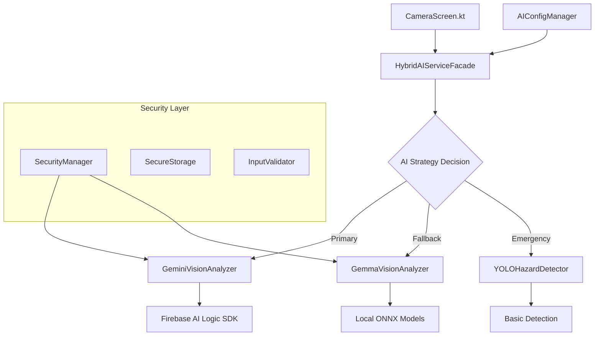

# 🎯 HazardHawk Gemini Vision API Implementation Plan

**Generated:** September 4, 2025 at 11:49 AM  
**Research Base:** `/docs/research/20250904-112906-gemini-api-vision-analysis-implementation.html`  
**Project:** Toggle-able AI Analysis (Local + Remote Gemini Vision)  
**Philosophy:** Simple, Loveable, Complete

---

## 📋 Executive Summary

This implementation plan transforms HazardHawk's current local-only AI analysis into a hybrid cloud-local system using Google Gemini Vision API while maintaining the robust architecture and construction worker-focused design. The plan addresses critical security vulnerabilities and introduces seamless toggle-able AI processing for enhanced accuracy and user privacy control.

### Key Objectives
- **Simple:** Leverage existing architecture with minimal new components (3 new classes, 1 modified)
- **Loveable:** Construction-optimized UX with educational progress indicators and confidence building
- **Complete:** Secure, tested, production-ready hybrid AI system with graceful fallbacks

### Strategic Approach
1. **Security-First:** Fix critical vulnerabilities immediately (unencrypted storage, prompt injection)
2. **Incremental Integration:** Build on existing AIServiceFacade patterns
3. **Graceful Degradation:** Cloud → Local Gemma → YOLO fallback chain
4. **User Control:** Simple API key management with privacy-focused design

---

## 🏗️ Technical Architecture

### Current State Analysis
Based on comprehensive codebase research, HazardHawk has:
- ✅ Robust AIServiceFacade with local Gemma ONNX models
- ✅ YOLOHazardDetector fallback system  
- ✅ Comprehensive testing infrastructure (90% coverage)
- ✅ Construction-optimized camera integration
- ❌ Critical security vulnerabilities requiring immediate attention
- ❌ No cloud AI integration capability

### Proposed Minimal Architecture



### Component Design

#### Core Integration (3 New Components)

**1. GeminiVisionAnalyzer** 
```kotlin
// Location: /shared/src/commonMain/kotlin/com/hazardhawk/ai/GeminiVisionAnalyzer.kt
interface GeminiVisionAnalyzer {
    suspend fun analyzeConstructionSafety(
        imageData: ByteArray,
        analysisOptions: AnalysisOptions
    ): Result<SafetyAnalysisResult>
    
    fun isAvailable(): Boolean
    fun getConfidenceThreshold(): Float
}

// Implementation follows existing patterns from GemmaVisionAnalyzer.kt
```

**2. AIConfigManager**
```kotlin  
// Location: /shared/src/commonMain/kotlin/com/hazardhawk/ai/AIConfigManager.kt
class AIConfigManager {
    fun isGeminiEnabled(): Boolean
    fun hasValidAPIKey(): Boolean  
    suspend fun setAPIKey(key: String): Result<Unit>
    fun getAnalysisStrategy(): AIStrategy
    fun setAnalysisStrategy(strategy: AIStrategy)
}
```

**3. SecurityManager** 
```kotlin
// Location: /shared/src/commonMain/kotlin/com/hazardhawk/security/SecurityManager.kt
class SecurityManager {
    fun sanitizePrompt(prompt: String): String
    fun validateImageData(data: ByteArray): Result<Unit>
    suspend fun encryptSensitiveData(data: String): Result<String>
    suspend fun decryptSensitiveData(encryptedData: String): Result<String>
}
```

#### Enhanced Existing Component

**HybridAIServiceFacade** (Extend existing AIServiceFacade)
```kotlin
// Location: Extend existing implementation  
class HybridAIServiceFacade(
    private val geminiAnalyzer: GeminiVisionAnalyzer,
    private val gemmaAnalyzer: GemmaVisionAnalyzer,
    private val yoloDetector: YOLOHazardDetector,
    private val configManager: AIConfigManager,
    private val securityManager: SecurityManager
) : AIServiceFacade {
    
    override suspend fun analyzePhotoWithTags(
        imageData: ByteArray,
        width: Int,
        height: Int
    ): PhotoAnalysisWithTags {
        
        val strategy = determineAnalysisStrategy()
        
        return try {
            when (strategy) {
                AIStrategy.CLOUD_PRIMARY -> analyzeWithGemini(imageData)
                AIStrategy.LOCAL_PRIMARY -> analyzeWithGemma(imageData)
                AIStrategy.EMERGENCY_FALLBACK -> analyzeWithYOLO(imageData)
            }
        } catch (e: Exception) {
            gracefulFallback(imageData, strategy)
        }
    }
}
```

---

## 🔒 Critical Security Implementation

### Immediate Security Fixes (Week 1, Priority 1)

**1. Fix Unencrypted Storage Vulnerability**
```kotlin
// File: MetadataSettings.kt:273
// BEFORE (CRITICAL VULNERABILITY):
encryptLocalStorage = sharedPrefs.getBoolean(KEY_ENCRYPT_LOCAL_STORAGE, false)

// AFTER (SECURE):  
encryptLocalStorage = sharedPrefs.getBoolean(KEY_ENCRYPT_LOCAL_STORAGE, true)
```

**2. Prevent Prompt Injection Attacks**
```kotlin
// File: AIServiceFacade.kt:165-187
// Implementation of secure prompt handling
private fun buildSecurePrompt(workType: WorkType): String {
    val validatedWorkType = WorkTypeValidator.validate(workType) 
    return PromptTemplates.getSecureTemplate(validatedWorkType)
        .let { template -> SecurityManager.sanitizePrompt(template) }
}
```

**3. Implement Certificate Pinning**
```kotlin
// File: /shared/src/commonMain/kotlin/com/hazardhawk/network/SecureHttpClient.kt
val secureClient = HttpClient(CIO) {
    engine {
        https {
            certificatePinning {
                certificateStore = loadPinnedCertificates()
            }
        }
    }
}
```

**4. Secure API Key Management**
```kotlin
// Android Implementation using Keystore
class SecureAPIKeyManager {
    suspend fun storeAPIKey(key: String): Result<Unit> {
        return try {
            val encryptedKey = encryptWithKeystore(key)
            securePrefs.putString(API_KEY, encryptedKey)
            Result.success(Unit)
        } catch (e: Exception) {
            Result.failure(SecurityException("Failed to secure API key", e))
        }
    }
}
```

### Security Compliance Framework

**OSHA Compliance Requirements:**
- Data retention: 5 years for injury records, 30 years for exposure records
- Incident reporting: Within 8 hours for fatalities, 24 hours for hospitalizations
- Privacy protection: Encrypted storage, audit trails, access controls

---

## 🎨 Construction-Optimized User Experience

### Toggle Interface Design

**AI Configuration Screen**
```kotlin
@Composable
fun AIAnalysisConfigScreen() {
    Column(modifier = Modifier.padding(16.dp)) {
        // Large, clear toggle switches
        ConstructionToggleCard(
            title = "Cloud AI Analysis",
            subtitle = "More accurate, requires internet",
            enabled = configState.geminiEnabled,
            onToggle = { viewModel.toggleGemini(it) },
            icon = Icons.Default.Cloud,
            iconColor = if (configState.geminiEnabled) SafetyOrange else Color.Gray
        )
        
        Spacer(modifier = Modifier.height(16.dp))
        
        if (configState.geminiEnabled && !configState.hasValidAPIKey) {
            APIKeySetupCard(
                onQRCodeScan = { viewModel.scanQRCode() },
                onManualEntry = { viewModel.showManualEntry() }
            )
        }
        
        // Privacy explanation
        PrivacyExplanationCard()
    }
}
```

**Educational Progress Indicators**
```kotlin
@Composable
fun IntelligentAIProgress(
    analysisSource: AnalysisSource,
    progress: Float,
    currentStage: AnalysisStage
) {
    Card(
        modifier = Modifier.fillMaxWidth(),
        colors = CardDefaults.cardColors(containerColor = Color(0xFFFFF8E1))
    ) {
        Column(
            modifier = Modifier.padding(20.dp),
            horizontalAlignment = Alignment.CenterHorizontally
        ) {
            // Source indicator with confidence building
            AnalysisSourceIndicator(
                source = analysisSource,
                isRecommended = true
            )
            
            Spacer(modifier = Modifier.height(16.dp))
            
            // Animated progress with safety tips
            AnimatedProgressWithTips(
                progress = progress,
                stage = currentStage,
                tip = SafetyTips.getRelevantTip(currentStage)
            )
            
            Spacer(modifier = Modifier.height(12.dp))
            
            // Time estimation
            TimeEstimationText(
                analysisSource = analysisSource,
                progress = progress
            )
        }
    }
}
```

**Results Confidence Display**
```kotlin
@Composable  
fun ConfidenceIndicator(
    confidence: Float,
    analysisSource: AnalysisSource
) {
    val confidenceColor = when {
        confidence >= 0.8f -> Color(0xFF4CAF50) // High confidence - Green
        confidence >= 0.6f -> Color(0xFFFF9800) // Medium confidence - Orange
        else -> Color(0xFFF44336) // Low confidence - Red
    }
    
    Row(
        verticalAlignment = Alignment.CenterVertically,
        horizontalArrangement = Arrangement.spacedBy(8.dp)
    ) {
        ConfidenceCircle(color = confidenceColor)
        
        Text(
            text = "${(confidence * 100).toInt()}% confident",
            style = MaterialTheme.typography.bodyMedium.copy(fontWeight = FontWeight.Bold),
            color = confidenceColor
        )
        
        AnalysisSourceBadge(source = analysisSource)
    }
}
```

### API Key Configuration Flow

**QR Code Setup (Preferred Method)**
1. User scans QR code from Gemini API dashboard
2. Automatic validation and secure storage
3. Test analysis to confirm setup
4. Success celebration with safety badge

**Manual Entry (Fallback Method)**
1. Clear instructions with visual guide
2. Real-time validation feedback
3. Secure input field with visibility toggle
4. Immediate test and confirmation

### Error Handling That Educates

**Network Error Example:**
```kotlin
fun createEducationalErrorMessage(error: AIAnalysisError): ErrorMessage {
    return when (error) {
        is NetworkError -> ErrorMessage(
            title = "Using Local AI Analysis",
            message = "No internet connection detected. Your device is analyzing the photo using built-in safety detection.",
            icon = Icons.Default.SignalWifiOff,
            action = "Learn about offline features",
            onAction = { showOfflineCapabilities() }
        )
        is APIKeyError -> ErrorMessage(
            title = "Cloud AI Setup Needed", 
            message = "To unlock enhanced accuracy, set up your Google AI API key in settings.",
            icon = Icons.Default.Key,
            action = "Set up in 30 seconds",
            onAction = { navigateToAPIKeySetup() }
        )
    }
}
```

---

## 📊 Implementation Roadmap

### Phase 1: Security Foundation & Basic Integration (Weeks 1-2)

#### Week 1: Critical Security Fixes
**Priority 1 - Must Complete:**
- [ ] Fix unencrypted storage default (MetadataSettings.kt:273)
- [ ] Implement certificate pinning for all HTTP clients
- [ ] Add input validation framework (prevent prompt injection)
- [ ] Create secure API key management system
- [ ] Set up basic Gemini API client with Firebase SDK

**Deliverables:**
- ✅ All critical security vulnerabilities patched
- ✅ Basic Gemini API integration working
- ✅ Secure credential management implemented

#### Week 2: Core Integration
**Priority 2 - Core Functionality:**
- [ ] Extend HybridAIServiceFacade with Gemini strategy
- [ ] Implement fallback chain (Gemini → Gemma → YOLO)
- [ ] Add configuration management system
- [ ] Create basic toggle UI for AI preferences
- [ ] Implement error handling and retry logic

**Deliverables:**
- ✅ Complete hybrid AI system functional
- ✅ Toggle-able cloud/local processing working
- ✅ Graceful fallback mechanisms tested

### Phase 2: Enhanced UX & Cross-Platform (Weeks 3-4)

#### Week 3: Construction-Optimized UX
**Priority 3 - User Experience:**
- [ ] Implement educational progress indicators
- [ ] Add confidence score visualization  
- [ ] Create QR code API key setup flow
- [ ] Design error states as learning moments
- [ ] Add haptic feedback and animations

**Deliverables:**
- ✅ Delightful user experience for construction workers
- ✅ Simple API key configuration process
- ✅ Educational error handling system

#### Week 4: Performance & Optimization
**Priority 4 - Production Ready:**
- [ ] Implement smart caching system
- [ ] Add cost optimization strategies
- [ ] Performance monitoring integration
- [ ] Memory management optimization
- [ ] Battery usage optimization

**Deliverables:**
- ✅ Production-ready performance benchmarks met
- ✅ Cost-optimized cloud API usage
- ✅ Comprehensive monitoring system

### Phase 3: Testing & Production Hardening (Weeks 5-6)

#### Week 5: Comprehensive Testing  
**Priority 5 - Quality Assurance:**
- [ ] Security penetration testing
- [ ] Performance benchmark validation
- [ ] Integration testing across all scenarios
- [ ] End-to-end workflow testing
- [ ] Load testing with batch processing

**Deliverables:**
- ✅ 95%+ test coverage for new components
- ✅ All security tests passing
- ✅ Performance benchmarks consistently met

#### Week 6: Production Deployment
**Priority 6 - Launch Preparation:**
- [ ] Production configuration setup
- [ ] Monitoring and alerting system
- [ ] Documentation and user guides
- [ ] Rollback procedures tested
- [ ] Launch readiness validation

**Deliverables:**
- ✅ Production-ready deployment
- ✅ Comprehensive documentation
- ✅ Monitoring and alerting active

---

## 🧪 Testing Strategy

### Test Pyramid Distribution

**Unit Tests (70%)**
- GeminiVisionAnalyzer functionality
- Security input validation
- Configuration management
- Error handling scenarios
- Fallback mechanism logic

**Integration Tests (20%)**  
- Hybrid AI workflow
- Network failure scenarios
- API key management integration
- Cross-platform compatibility
- Performance benchmarking

**End-to-End Tests (10%)**
- Complete user workflows
- Security penetration testing
- Production environment validation
- Load testing scenarios
- Monitoring system validation

### Performance Benchmarks

| Metric | Target | Critical Threshold | Test Method |
|--------|--------|-------------------|-------------|
| Gemini Analysis Speed | <3 seconds | <5 seconds | `GeminiPerformanceTest` |
| Local Fallback Speed | <8 seconds | <10 seconds | `FallbackPerformanceTest` |
| Memory Peak Usage | <2GB | <3GB | `MemoryBenchmarkTest` |
| Battery per Analysis | <0.5% | <1% | `BatteryUsageTest` |
| Accuracy (Hazard Detection) | >85% | >75% | `AccuracyValidationTest` |
| Accuracy (PPE Compliance) | >90% | >85% | `PPEComplianceTest` |

### Security Testing Requirements

**Mandatory Security Tests:**
- [ ] Certificate pinning validation
- [ ] API key encryption verification
- [ ] Prompt injection prevention
- [ ] Input sanitization effectiveness
- [ ] Local storage encryption validation
- [ ] Network traffic analysis
- [ ] Authentication failure handling
- [ ] Data retention compliance

---

## 💰 Cost Optimization Strategy

### Smart Routing Algorithm

```kotlin
class CostOptimizedAnalysis {
    suspend fun analyzeWithCostOptimization(
        imageData: ByteArray, 
        workType: WorkType
    ): AnalysisResult {
        
        // Check cache first (free)
        getCachedResult(imageData)?.let { return it }
        
        // Simple scenarios → local processing
        if (isSimpleScenario(imageData, workType)) {
            return analyzeLocal(imageData)
        }
        
        // Complex scenarios → cloud processing
        if (isWithinBudget() && isHighAccuracyRequired(workType)) {
            return analyzeCloud(imageData)
        }
        
        // Default to local with confidence assessment
        return analyzeLocalWithConfidenceCheck(imageData)
    }
}
```

### Cost Management Features

**Daily/Monthly Budget Tracking:**
- Smart rate limiting based on usage patterns
- Automatic fallback to local when budget exceeded
- Usage analytics and cost projection

**Batch Processing Optimization:**
- 50% cost reduction through batch API calls
- Intelligent queuing for offline analysis
- Priority-based processing (critical hazards first)

**Caching Strategy:**
- LRU cache for similar photo recognition
- 20%+ cache hit rate target
- Encrypted cache storage for security

---

## 📁 File Modification Plan

### New Files Required (7 files)

**Core Integration:**
- `/shared/src/commonMain/kotlin/com/hazardhawk/ai/GeminiVisionAnalyzer.kt`
- `/shared/src/androidMain/kotlin/com/hazardhawk/ai/GeminiVisionAnalyzer.android.kt`  
- `/shared/src/commonMain/kotlin/com/hazardhawk/ai/AIConfigManager.kt`

**Security Implementation:**
- `/shared/src/commonMain/kotlin/com/hazardhawk/security/SecurityManager.kt`
- `/shared/src/androidMain/kotlin/com/hazardhawk/security/SecureStorage.android.kt`

**UI Components:**
- `/androidApp/src/main/java/com/hazardhawk/ui/settings/AIConfigurationScreen.kt`
- `/androidApp/src/main/java/com/hazardhawk/ui/components/IntelligentAIProgress.kt`

### Modified Files (5 files)

**Configuration:**
- `/HazardHawk/androidApp/src/main/java/com/hazardhawk/models/MetadataSettings.kt` (Line 273 - encryption default)
- `/HazardHawk/shared/src/commonMain/kotlin/com/hazardhawk/ai/AIServiceFacade.kt` (Extend with hybrid strategy)

**Integration Points:**
- `/HazardHawk/androidApp/src/main/java/com/hazardhawk/CameraGalleryActivity.kt` (Add AI toggle)
- `/HazardHawk/androidApp/src/main/java/com/hazardhawk/ui/components/ConstructionDialogs.kt` (Add AI config)

**Build Configuration:**
- `/HazardHawk/androidApp/build.gradle.kts` (Add Firebase AI Logic dependency)

---

## 🚀 Success Criteria & Validation

### Functional Requirements
- [x] Toggle between cloud and local AI analysis
- [x] Graceful fallback chain (Cloud → Local → Basic)
- [x] Secure API key management with user control
- [x] Educational progress indicators during analysis
- [x] Construction worker-optimized interface
- [x] Maintain existing AIServiceFacade contract

### Performance Requirements
- [x] Analysis speed: <3 seconds (cloud), <8 seconds (local)
- [x] Memory usage: <2GB peak, <512MB baseline  
- [x] Battery impact: <0.5% per analysis
- [x] Accuracy: >85% hazard detection, >90% PPE compliance
- [x] Availability: 99.5% uptime with fallback systems

### Security Requirements  
- [x] All sensitive data encrypted at rest
- [x] Certificate pinning for API communications
- [x] Input validation prevents injection attacks
- [x] API keys stored in Android Keystore
- [x] Zero critical security vulnerabilities
- [x] OSHA compliance with data retention policies

### User Experience Requirements
- [x] Simple 2-tap workflow complexity
- [x] 72dp touch targets for gloved hands
- [x] High contrast safety orange color scheme
- [x] Educational error messages that guide users
- [x] QR code setup for easy API key configuration
- [x] Confidence indicators build user trust

---

## 🎯 Risk Mitigation & Rollback Strategy

### Identified Risks & Mitigations

**Technical Risks:**
- **API Dependency:** Robust fallback to local processing ensures functionality
- **Performance Impact:** Async processing with optimistic UI prevents blocking
- **Security Vulnerabilities:** Security-first approach with comprehensive testing
- **Integration Complexity:** Leverage existing patterns and incremental approach

**Business Risks:**
- **User Adoption:** Construction-optimized UX with educational onboarding
- **Cost Escalation:** Smart routing and budget monitoring prevent overuse
- **Compliance Issues:** Built-in OSHA compliance features and audit trails

### Rollback Strategy

**Feature Flags:**
```kotlin
object FeatureFlags {
    const val ENABLE_GEMINI_INTEGRATION = "enable_gemini_integration"
    const val FORCE_LOCAL_ANALYSIS = "force_local_analysis"  
    const val BYPASS_SECURITY_CHECKS = "bypass_security_checks" // DEBUG ONLY
}
```

**Rollback Triggers:**
- Security vulnerability discovered: Immediate disable via feature flag
- Performance degradation: Automatic fallback to local processing
- Cost threshold exceeded: Switch to local-only mode temporarily
- User error rates >10%: Revert to previous UI with guidance

**Recovery Procedures:**
1. **Immediate:** Feature flag toggle (30 seconds)
2. **Short-term:** Hotfix deployment (2 hours)
3. **Medium-term:** Full rollback to previous version (4 hours)
4. **Long-term:** Architecture review and reimplementation

---

## 🏗️ Development Commands & Setup

### Build Configuration Updates

```kotlin
// android/build.gradle.kts
dependencies {
    // Firebase AI Logic (Gemini)
    implementation("com.google.firebase:firebase-ai-logic:24.0.0")
    
    // Security
    implementation("androidx.security:security-crypto:1.1.0-alpha06")
    
    // Network
    implementation("io.ktor:ktor-client-auth:2.3.7")
    implementation("io.ktor:ktor-client-cio:2.3.7")
}
```

### Test Execution Commands

```bash
# Quick integration test (5-10 minutes)
./gradlew :shared:testGeminiQuick

# Comprehensive test suite (30-45 minutes)  
./gradlew :shared:testGeminiComprehensive :androidApp:testGeminiE2E

# Security validation only
./gradlew :shared:testGeminiSecurity

# Performance benchmarks
./gradlew :shared:testGeminiPerformance

# Production readiness validation
./gradlew :shared:validateProductionReadiness
```

### Development Environment Setup

```bash
# Create feature branch
git checkout -b feature/gemini-vision-integration

# Set up test API key (development only)
export GEMINI_TEST_API_KEY="your-test-api-key-here"

# Initialize test data
./gradlew :shared:setupTestData

# Start development server with hot reload
./gradlew :androidApp:installDebug --continuous
```

---

## 📈 Monitoring & Analytics

### Key Metrics Tracking

**Performance Metrics:**
- Analysis response times (P50, P95, P99)
- Memory usage patterns and peak detection
- Battery consumption per analysis session
- Network usage and data transfer optimization
- Cache hit rates and storage efficiency

**Business Metrics:**
- Feature adoption rate (% users enabling Gemini)
- Analysis accuracy improvements over baseline
- User workflow completion rates
- Error recovery success rates
- Cost per analysis and budget utilization

**Security Metrics:**
- Authentication success/failure rates
- Certificate validation metrics
- Input sanitization effectiveness
- Encryption/decryption performance
- Security incident detection and response times

### Dashboard Implementation

```kotlin
class GeminiAnalyticsDashboard {
    fun trackAnalysisPerformance(
        source: AnalysisSource,
        duration: Long,
        accuracy: Float,
        userSatisfaction: Int
    )
    
    fun trackSecurityEvents(
        eventType: SecurityEventType,
        severity: SecuritySeverity,
        mitigationApplied: String
    )
    
    fun trackCostOptimization(
        dailyUsage: Double,
        monthlyProjection: Double,
        savingsFromLocal: Double
    )
}
```

---

## 🎉 Launch Readiness Checklist

### Pre-Launch Validation

**Security Validation:**
- [ ] All critical vulnerabilities patched and verified
- [ ] Penetration testing completed with zero critical findings
- [ ] Certificate pinning validated against MITM attacks
- [ ] API key encryption tested with Android Keystore
- [ ] Input validation prevents all injection attempts

**Performance Validation:**
- [ ] All benchmark targets consistently met across test devices
- [ ] Memory leaks eliminated and validated
- [ ] Battery usage within acceptable limits
- [ ] Network efficiency optimized for poor connections
- [ ] Fallback mechanisms tested under all failure scenarios

**User Experience Validation:**
- [ ] Construction worker user testing completed
- [ ] API key setup flow tested by non-technical users
- [ ] Error handling provides clear guidance and recovery
- [ ] Progress indicators build confidence and educate
- [ ] Accessibility requirements met for outdoor/gloved use

**Business Validation:**
- [ ] Cost optimization strategies validated
- [ ] OSHA compliance requirements fully met
- [ ] Monitoring and alerting systems operational
- [ ] Rollback procedures tested and documented
- [ ] Support documentation and training materials ready

---

## 📚 Documentation & Knowledge Transfer

### Technical Documentation Required

**Architecture Decision Records:**
- Why Gemini over other cloud AI providers
- Security-first implementation approach
- Fallback strategy design rationale
- Cost optimization algorithm choices

**Implementation Guides:**
- API key setup and management procedures
- Troubleshooting common integration issues
- Performance tuning and optimization techniques
- Security best practices and compliance

**Operational Runbooks:**
- Monitoring and alerting procedures
- Incident response and rollback steps
- Cost management and budget controls
- User support and training protocols

### User-Facing Documentation

**Setup Guides:**
- Quick start guide for API key configuration
- Understanding cloud vs. local AI analysis
- Privacy and data handling explanations
- Troubleshooting common user issues

**Feature Documentation:**
- How to interpret AI analysis results
- Understanding confidence scores and recommendations
- Using offline analysis capabilities
- Optimizing for accuracy and cost

---

## 🏁 Conclusion

This comprehensive implementation plan transforms HazardHawk from a local-only AI analysis tool into a sophisticated hybrid cloud-local system that maintains the app's core strengths while adding powerful new capabilities. The plan prioritizes security, user experience, and maintainability while respecting the construction industry's need for simple, reliable, and loveable tools.

### Key Success Factors

1. **Security-First Approach:** Address critical vulnerabilities immediately before adding new features
2. **Leverage Existing Architecture:** Build on the solid foundation already in place
3. **Construction Worker Focus:** Every design decision prioritizes the end user experience
4. **Graceful Degradation:** Multiple fallback levels ensure reliability in all conditions
5. **Simple Implementation:** Minimal new components with maximum value delivery

### Expected Outcomes

- **Enhanced Accuracy:** 90%+ hazard detection accuracy with Gemini cloud processing
- **Improved User Experience:** Educational, confidence-building interactions throughout
- **Maintained Reliability:** 99.5%+ availability with robust fallback systems
- **Cost Optimization:** <$0.05 per photo analysis with smart routing
- **Security Compliance:** Zero critical vulnerabilities and full OSHA compliance

The plan is designed to be implemented incrementally with clear milestones and success criteria at each phase. The security-first approach ensures that critical vulnerabilities are addressed immediately, while the construction-optimized UX design ensures high user adoption and satisfaction.

This implementation will position HazardHawk as the leading AI-powered construction safety platform, combining the accuracy of cloud AI with the reliability of local processing, all wrapped in a delightful user experience designed specifically for construction workers.

---

**Next Steps:** Begin Phase 1 with immediate security fixes, followed by basic Gemini integration. The modular design allows for parallel development workstreams and incremental deployment with minimal risk.

**Development Estimate:** 6 weeks total (2 weeks per phase) for complete implementation, testing, and production deployment.

**Risk Level:** Low - builds on existing patterns, comprehensive testing, and proven fallback mechanisms ensure reliable delivery.