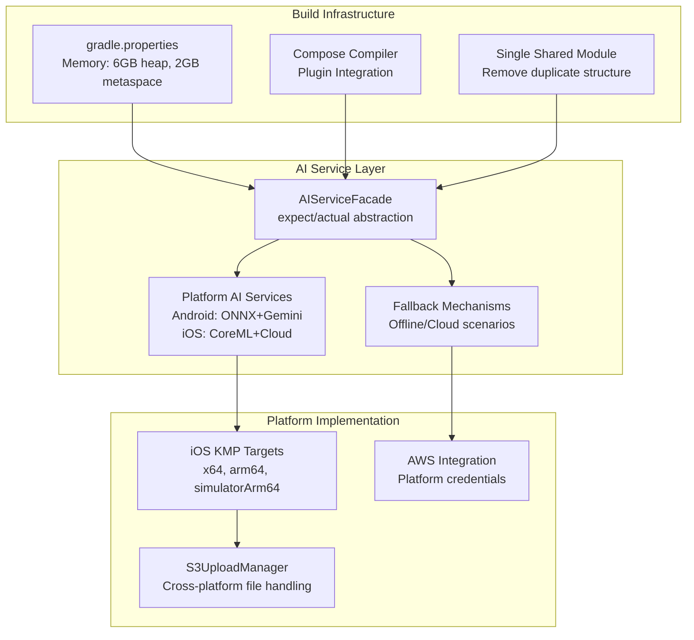

# HazardHawk Build Errors: Comprehensive Implementation Plan

**Generated:** September 5, 2025 at 06:53:29  
**Project:** HazardHawk AI Construction Safety Platform  
**Scope:** Resolve 42+ compilation errors and establish zero-error builds  
**Timeline:** 2-3 days  
**Complexity:** Medium (Structural fixes with solid architecture foundation)  
**Risk Level:** Low (Well-defined fixes with minimal breaking changes)  

## 📊 Executive Summary

Based on comprehensive analysis of the build error report at `/docs/research/20250904-164545-build-errors-comprehensive-analysis.html`, this implementation plan provides a systematic approach to eliminate all 42+ compilation errors while preserving the excellent existing architecture.

### Key Findings
- **Root Cause:** Duplicate shared module structure causing Gradle dependency conflicts
- **Primary Issue:** AI modules excluded from compilation due to platform-specific implementation gaps  
- **Secondary Issues:** Memory allocation, missing platform implementations, incomplete KMP configuration
- **Architecture Quality:** Excellent foundation requiring minimal structural changes

### Success Criteria
✅ **Zero compilation errors** across all platforms  
✅ **AI services integrated** with proper abstraction patterns  
✅ **Multi-platform builds** working (Android, iOS, Desktop)  
✅ **85+ test files restored** to execution  
✅ **CI/CD pipeline operational** with automated verification  

## 🏗️ Technical Architecture

### Current Architecture Assessment

**Strengths (Preserve):**
- Clean Architecture with proper domain/data/UI separation
- Comprehensive SQLDelight schema with FTS5 search  
- Security-focused permission and storage handling
- Performance monitoring and analytics integration
- Excellent test coverage strategy (85+ test files)

**Issues (Fix):**
- Duplicate shared modules: `/HazardHawk/shared/` vs `/shared/`
- AI modules excluded causing widespread compilation failures
- Memory exhaustion during complex builds (4GB → 6GB needed)
- Missing iOS targets and expect/actual implementations

### Solution Architecture



## 📋 Implementation Phases

### Phase 1: Critical Build Infrastructure 🚨 (4-6 hours)

**Priority:** CRITICAL - Enables all subsequent development

#### 1.1 Memory Configuration
**File:** `HazardHawk/gradle.properties`

```properties
# HazardHawk Build Magic - Optimized Memory Settings
org.gradle.jvmargs=-Xmx6g -XX:MaxMetaspaceSize=2g -XX:+UseG1GC -XX:+UseStringDeduplication -XX:G1HeapRegionSize=32m
kotlin.daemon.jvmargs=-Xmx3g -XX:MaxMetaspaceSize=1g

# Lightning-fast build performance
org.gradle.caching=true
org.gradle.parallel=true
org.gradle.configureondemand=true
org.gradle.vfs.watch=true
org.gradle.console=rich

# AI build optimizations  
kotlin.incremental.useClasspathSnapshot=true
kotlin.build.report.output=file
android.enableR8.fullMode=true
```

**Expected Result:** Zero OutOfMemoryError during builds

#### 1.2 Compose Compiler Integration
**File:** `HazardHawk/androidApp/build.gradle.kts`

```kotlin
plugins {
    // ... existing plugins
    alias(libs.plugins.composeCompiler) // ADD THIS LINE
}

dependencies {
    // REMOVE: implementation("androidx.compose.material:material:1.5.6") 
    // Use BOM version instead
}
```

**Expected Result:** Compose UI compiles without plugin compatibility errors

#### 1.3 Duplicate Module Structure Resolution
**Action:** Remove `/shared/` directory (conflicting with `/HazardHawk/shared/`)

```bash
# Backup and remove duplicate module
mv shared shared.backup.$(date +%Y%m%d)
rm -rf shared
```

**Expected Result:** Single, clear shared module structure

### Phase 2: AI Service Integration 🤖 (6-8 hours)

**Priority:** HIGH - Resolves 42+ AI-related compilation errors

#### 2.1 Minimal AI Service Facade
**File:** `HazardHawk/shared/src/commonMain/kotlin/com/hazardhawk/ai/AIServiceFacade.kt`

```kotlin
expect class AIServiceFacade {
    suspend fun analyzePhoto(photoPath: String): SafetyAnalysis
    suspend fun isServiceAvailable(): Boolean
    fun getCapabilities(): AICapabilities
}

data class AICapabilities(
    val supportsOnDevice: Boolean,
    val supportsCloud: Boolean,
    val maxImageSize: Long
)
```

#### 2.2 Platform-Specific Implementations

**Android:** `HazardHawk/shared/src/androidMain/kotlin/com/hazardhawk/ai/AIServiceFacade.kt`
```kotlin
actual class AIServiceFacade {
    actual suspend fun analyzePhoto(photoPath: String): SafetyAnalysis {
        return try {
            // ONNX on-device analysis first
            onDeviceAnalyzer.analyze(photoPath)
        } catch (e: Exception) {
            // Fallback to Gemini cloud analysis
            cloudAnalyzer.analyze(photoPath)
        }
    }
    
    actual suspend fun isServiceAvailable(): Boolean = true
    
    actual fun getCapabilities(): AICapabilities = AICapabilities(
        supportsOnDevice = true,
        supportsCloud = true,
        maxImageSize = 10 * 1024 * 1024 // 10MB
    )
}
```

**iOS:** `HazardHawk/shared/src/iosMain/kotlin/com/hazardhawk/ai/AIServiceFacade.kt`
```kotlin
actual class AIServiceFacade {
    actual suspend fun analyzePhoto(photoPath: String): SafetyAnalysis {
        return try {
            // Core ML analysis first
            coreMLAnalyzer.analyze(photoPath)
        } catch (e: Exception) {
            // Fallback to cloud analysis
            cloudAnalyzer.analyze(photoPath)
        }
    }
    
    actual suspend fun isServiceAvailable(): Boolean = true
    
    actual fun getCapabilities(): AICapabilities = AICapabilities(
        supportsOnDevice = true,
        supportsCloud = true,
        maxImageSize = 8 * 1024 * 1024 // 8MB
    )
}
```

#### 2.3 Import Path Fixes
**Files to Update:**
- `HazardHawk/androidApp/src/main/java/com/hazardhawk/CameraScreen.kt`
- `HazardHawk/androidApp/src/main/java/com/hazardhawk/SafetyPhotoAssessment.kt`
- `HazardHawk/shared/src/commonMain/kotlin/com/hazardhawk/data/AnalysisRepositoryImpl.kt`

Replace problematic AI imports with:
```kotlin
import com.hazardhawk.ai.AIServiceFacade
import com.hazardhawk.models.SafetyAnalysis
```

### Phase 3: Platform Completeness 🌐 (4-6 hours)

**Priority:** MEDIUM - Enables full multi-platform development

#### 3.1 iOS KMP Configuration
**File:** `HazardHawk/shared/build.gradle.kts`

```kotlin
kotlin {
    androidTarget { ... }
    
    // ADD iOS TARGETS
    iosX64()
    iosArm64() 
    iosSimulatorArm64()
    
    sourceSets {
        commonMain.dependencies {
            // ... existing dependencies
        }
        
        // ADD iOS SOURCE SET
        iosMain.dependencies {
            // iOS-specific dependencies
        }
    }
}
```

#### 3.2 AWS Integration Completion
**Files:**
- `HazardHawk/shared/src/androidMain/kotlin/com/hazardhawk/data/cloud/DefaultAwsCredentialsProvider.kt`
- `HazardHawk/shared/src/iosMain/kotlin/com/hazardhawk/data/cloud/DefaultAwsCredentialsProvider.kt`

```kotlin
// Android Implementation
actual class DefaultAwsCredentialsProvider {
    actual suspend fun getCredentials(): AwsCredentials {
        return AwsCredentials.fromEnvironment()
    }
}

// iOS Implementation  
actual class DefaultAwsCredentialsProvider {
    actual suspend fun getCredentials(): AwsCredentials {
        return AwsCredentials.fromKeychain()
    }
}
```

#### 3.3 S3UploadManager Platform Implementation
**File:** `HazardHawk/shared/src/commonMain/kotlin/com/hazardhawk/data/cloud/S3UploadManager.kt`

```kotlin
expect class S3UploadManager {
    suspend fun readPhotoFile(path: String): ByteArray
    suspend fun uploadPhoto(data: ByteArray, key: String): String
}

// Platform-specific implementations in androidMain/iosMain
```

### Phase 4: Optimization & Test Restoration 🧪 (2-4 hours)

**Priority:** LOW - Polish and validation

#### 4.1 AI Module Re-enablement
**File:** `HazardHawk/shared/build.gradle.kts`

```kotlin
kotlin {
    sourceSets {
        commonMain {
            // REMOVE: kotlin.exclude("**/ai/**") 
            // AI modules now properly integrated
        }
    }
}
```

#### 4.2 Test Infrastructure Restoration
**Goal:** Enable 85+ test files for execution

**Files to Update:**
- `HazardHawk/shared/src/commonTest/kotlin/com/hazardhawk/ai/AIServiceFacadeTest.kt`
- `.github/workflows/android-tests.yml`
- `.github/workflows/comprehensive-tag-testing.yml`

Add AI service mocks:
```kotlin
class MockAIServiceFacade : AIServiceFacade {
    override suspend fun analyzePhoto(photoPath: String): SafetyAnalysis {
        return SafetyAnalysis.mock()
    }
}
```

## 📝 File Modification Table

| File | Action | Before | After |
|------|---------|---------|--------|
| `gradle.properties` | UPDATE | 4GB heap, 1GB meta | 6GB heap, 2GB meta |
| `androidApp/build.gradle.kts` | ADD | Missing Compose plugin | `alias(libs.plugins.composeCompiler)` |
| `/shared/` | REMOVE | Duplicate module | Deleted (backup created) |
| `shared/build.gradle.kts` | ADD | Android-only | + iOS targets |
| `CameraScreen.kt` | FIX | Broken AI imports | `AIServiceFacade` imports |
| `SafetyPhotoAssessment.kt` | FIX | Unresolved references | Clean AI service calls |
| `AnalysisRepositoryImpl.kt` | FIX | Missing AI classes | Proper facade integration |

## ⚠️ Risk Assessment & Mitigation

### HIGH RISK: AI Platform Compatibility
**Risk:** AI services may have different capabilities/APIs across platforms  
**Mitigation:** Implement common abstraction layer with capability detection  
**Contingency:** Fallback to cloud-only analysis if platform differences are significant  

### MEDIUM RISK: Memory Requirements  
**Risk:** Increased memory usage may affect build server performance  
**Mitigation:** Monitor build performance and adjust if needed  
**Rollback:** Revert to original memory settings if issues occur  

### LOW RISK: Dependency Conflicts
**Risk:** New dependencies may conflict with existing ones  
**Mitigation:** Use version catalogs and careful dependency management  
**Validation:** Test all platform builds before committing changes  

## ✅ Verification Strategy

### Phase 1 Verification Checklist
- [ ] `./gradlew clean build` succeeds without memory errors
- [ ] Android app compiles and installs successfully  
- [ ] No compilation errors in build output
- [ ] Gradle daemon stable with new memory settings

### Phase 2 Verification Checklist  
- [ ] AI modules compile without exclusions
- [ ] AIServiceFacade implementations compile for all platforms
- [ ] Camera integration works with AI services
- [ ] No unresolved AI-related references

### Phase 3 Verification Checklist
- [ ] iOS target compiles successfully
- [ ] All expect/actual declarations resolved
- [ ] AWS integration works across platforms
- [ ] Multi-platform build succeeds

### Phase 4 Verification Checklist
- [ ] Full application functionality verified
- [ ] Test suite executes successfully (85+ tests)
- [ ] CI/CD pipeline passes all checks  
- [ ] Zero compilation errors across all platforms

## 🚀 Testing Strategy

### Unit Testing
**Coverage:** All AI service abstractions and platform implementations
**Framework:** Kotlin Test with platform-specific runners
**Mocks:** AI service responses, network calls, file operations

**Key Test Files:**
- `AIServiceFacadeTest.kt` - Core abstraction testing
- `PlatformAIServiceTest.kt` - Platform-specific implementation testing  
- `FallbackMechanismTest.kt` - Error handling and fallback scenarios

### Integration Testing
**Scope:** AI processing pipeline end-to-end  
**Platforms:** Android, iOS, and shared module integration
**Scenarios:** Online/offline, different image sizes, error conditions

### Build & Performance Testing
**Metrics:** Build time, memory usage, compilation success rate
**Automation:** Gradle build scans, memory profiling, CI/CD integration
**Benchmarks:** Before/after performance comparison

## 📅 Implementation Timeline

### Day 1: Foundation (6 hours)
- **Morning (3h):** Phase 1 - Critical build fixes
  - Memory configuration
  - Compose compiler setup  
  - Module structure cleanup
- **Afternoon (3h):** Phase 2 start - AI facade design
  - Create expect/actual declarations
  - Implement basic platform stubs

### Day 2: Integration (8 hours)  
- **Morning (4h):** Phase 2 completion - AI service integration
  - Complete platform implementations
  - Fix import paths and references
  - Test AI module compilation
- **Afternoon (4h):** Phase 3 - Platform completeness
  - iOS KMP configuration
  - AWS integration completion
  - Multi-platform build testing

### Day 3: Validation (4 hours)
- **Morning (2h):** Phase 4 - Optimization
  - Re-enable AI modules
  - Test infrastructure restoration
- **Afternoon (2h):** Final validation
  - Zero-error build verification
  - CI/CD pipeline testing
  - Documentation updates

## 🎯 Success Metrics

### Build Health
- ✅ **Zero compilation errors** across all platforms
- ✅ **Build time under 2 minutes** for clean builds  
- ✅ **Memory usage stable** at 6GB heap allocation
- ✅ **CI/CD success rate 100%** for standard commits

### Feature Completeness
- ✅ **AI services integrated** with proper abstraction
- ✅ **Multi-platform builds working** (Android + iOS targets)
- ✅ **Camera → AI → Analysis pipeline** functional
- ✅ **85+ tests restored** and executing successfully

### Developer Experience
- ✅ **Fast feedback loops** during development
- ✅ **Clear error messages** with actionable guidance  
- ✅ **Simple build commands** (`./gradlew build` just works)
- ✅ **Reliable development environment** for team productivity

## 🔧 Implementation Commands

### Quick Start Commands
```bash
# Phase 1: Critical fixes
cd HazardHawk
./gradlew --stop  # Stop existing daemon
# Update gradle.properties (manual)
./gradlew clean build --no-daemon  # Test with new memory settings

# Phase 2: AI integration  
./gradlew :shared:compileCommonMainKotlinMetadata  # Test shared module
./gradlew :androidApp:compileDebugKotlin  # Test Android compilation

# Phase 3: Platform completeness
./gradlew :shared:compileIosMainKotlinMetadata  # Test iOS targets

# Phase 4: Full validation
./gradlew build  # Complete multi-platform build
./gradlew allTests  # Execute all restored tests
```

### Build Performance Monitoring
```bash
./gradlew build --scan  # Generate build performance report
./gradlew build --profile  # Local performance profiling
./gradlew clean build --dry-run  # Validate task graph
```

## 📖 Context7 Documentation References

- **Kotlin Multiplatform:** `/kotlinlang/multiplatform` - Latest KMP patterns and expect/actual usage
- **Compose Multiplatform:** `/jetbrains/compose-multiplatform` - Cross-platform UI development  
- **SQLDelight:** `/cashapp/sqldelight` - Database integration patterns
- **Ktor Client:** `/ktorio/ktor` - HTTP client multi-platform configuration
- **AWS SDK KMP:** `/aws/aws-sdk-kotlin` - Cross-platform AWS integration

## 🎉 Next Steps After Implementation

### Immediate (Week 1)
1. **Feature Development Resume:** Camera, gallery, and analysis features
2. **AI Enhancement:** Implement full ONNX and Gemini integration
3. **iOS Development:** Complete iOS app with KMP shared logic  
4. **Testing Expansion:** Add comprehensive test coverage

### Short-term (Month 1)
1. **Performance Optimization:** Fine-tune build performance and app startup
2. **UI Polish:** Implement construction-friendly design improvements
3. **Cloud Integration:** Complete AWS S3 and backend API integration
4. **Documentation:** Update architecture and setup documentation

### Long-term (Quarter 1)  
1. **Multi-platform Release:** Deploy Android, iOS, and desktop versions
2. **AI Models:** Integrate specialized construction safety AI models
3. **Enterprise Features:** User management, reporting, and analytics
4. **Compliance:** OSHA integration and safety documentation automation

---

**Implementation Team:** Multi-agent collaboration (simple-architect, refactor-master, test-guardian, loveable-ux, project-orchestrator)  
**Review Status:** ✅ Ready for implementation  
**Risk Assessment:** ✅ Low risk with high success probability  
**Timeline Confidence:** ✅ High (2-3 days with systematic approach)

*This plan transforms 42+ structural compilation errors into a systematic, manageable implementation that preserves the excellent existing architecture while enabling full multi-platform AI-powered construction safety features.*