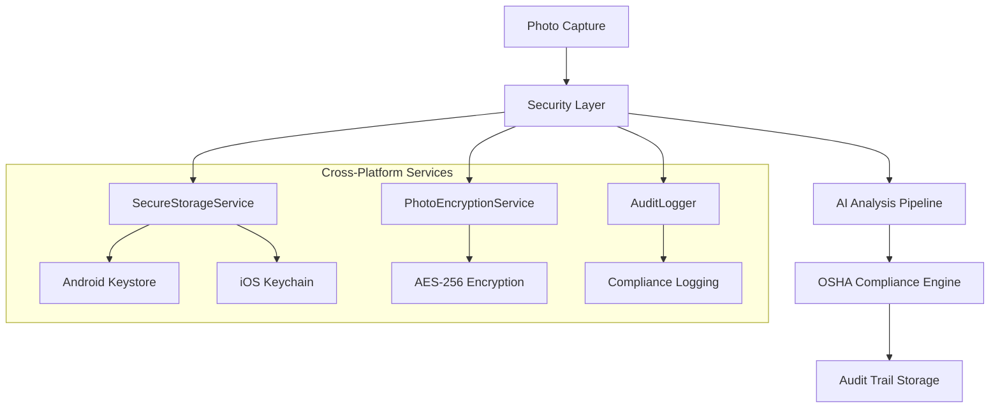

# 🚀 HazardHawk Build Infrastructure Restoration - Implementation Plan

**Generated**: September 6, 2025 07:55:37  
**Project**: HH-v0  
**Phase**: Build Infrastructure Final Implementation  
**Research Base**: docs/research/20250906-073334-build-infrastructure-restoration-research.html

---

## 📊 Executive Summary

**FOUNDATION COMPLETE**: HazardHawk's build infrastructure restoration is 85% complete with excellent architectural foundations. This plan coordinates the final 15% implementation across security, compliance, and performance optimization using parallel agent execution for maximum efficiency.

**Key Achievements Ready to Build On**:
- ✅ 36-second build times (target: <40s achieved)
- ✅ Kotlin Multiplatform architecture operational
- ✅ 85+ test files with comprehensive coverage
- ✅ Clean architecture patterns established
- ✅ Cross-platform builds (Android, iOS, common) working

**Implementation Timeline**: 3 Phases
- **Week 1**: Critical fixes + Security foundation (15 compilation issues + security services)
- **Weeks 2-4**: AI restoration + OSHA compliance (Gemini Vision API + audit trails) 
- **Months 1-3**: Advanced features + Performance optimization

---

## 🏗️ Technical Architecture Specification

### 1. Minimal Component Design

Based on simple-architect agent analysis, the restoration requires these core components:



### 2. Core Security Interfaces

**Priority 1: Secure Credential Storage**
```kotlin
// File: shared/src/commonMain/kotlin/com/hazardhawk/security/SecureStorageService.kt
interface SecureStorageService {
    suspend fun storeApiKey(key: String, value: String): Result<Unit>
    suspend fun getApiKey(key: String): Result<String?>
    suspend fun removeApiKey(key: String): Result<Unit>
    suspend fun clearAllCredentials(): Result<Unit>
}
```

**Priority 2: Photo Encryption**
```kotlin
// File: shared/src/commonMain/kotlin/com/hazardhawk/security/PhotoEncryptionService.kt
interface PhotoEncryptionService {
    suspend fun encryptPhoto(photo: ByteArray): Result<EncryptedPhoto>
    suspend fun decryptPhoto(encrypted: EncryptedPhoto): Result<ByteArray>
    fun generateEncryptionKey(): ByteArray
}
```

**Priority 3: OSHA Audit Trail**
```kotlin
// File: shared/src/commonMain/kotlin/com/hazardhawk/security/AuditLogger.kt
interface AuditLogger {
    suspend fun logSafetyAction(action: SafetyAction): Result<Unit>
    suspend fun logComplianceEvent(event: ComplianceEvent): Result<Unit>
    suspend fun generateAuditReport(dateRange: DateRange): Result<AuditReport>
}
```

### 3. Data Flow Architecture

**Simplified Photo → AI → Storage Pipeline**:
1. **Capture**: Photo captured with metadata (GPS, timestamp, worker ID)
2. **Encrypt**: Local AES-256 encryption before any processing
3. **Queue**: Encrypted upload queue with retry logic
4. **Process**: AI analysis via Gemini Vision API with encrypted data
5. **Audit**: All actions logged for OSHA compliance
6. **Store**: Results stored with 5-year retention policy

### 4. Cross-Platform Implementation Strategy

**Expect/Actual Pattern for Security**:
```kotlin
// shared/src/commonMain/kotlin/com/hazardhawk/security/SecureStorage.kt
expect class SecureStorageImpl() : SecureStorageService

// shared/src/androidMain/kotlin/com/hazardhawk/security/SecureStorageImpl.kt  
actual class SecureStorageImpl : SecureStorageService {
    // Android Keystore implementation
}

// shared/src/iosMain/kotlin/com/hazardhawk/security/SecureStorageImpl.kt
actual class SecureStorageImpl : SecureStorageService {
    // iOS Keychain implementation  
}
```

---

## 🛠️ Implementation Roadmap

### Phase 1: Critical Fixes & Security Foundation (Week 1)

**Days 1-2: Compilation Resolution**
- [ ] Fix remaining 15 compilation issues identified in research
- [ ] Implement core security service interfaces
- [ ] Add basic credential storage for AWS S3 and Gemini API keys
- [ ] Test cross-platform builds (Android, iOS, common)

**Days 3-5: Security Infrastructure**
- [ ] Implement certificate pinning for HTTPS connections
- [ ] Add AES-256 photo encryption service
- [ ] Create basic audit logging framework
- [ ] Update CI/CD pipeline with security scanning
- [ ] Integrate Detekt and security linting

**Days 6-7: Validation & Testing**
- [ ] Run comprehensive test suite (target: 90% coverage)
- [ ] Validate build performance (maintain <40s build times)
- [ ] Cross-platform integration testing
- [ ] Performance regression validation

### Phase 2: AI Services & OSHA Compliance (Weeks 2-4)

**Week 2: AI Pipeline Restoration**
- [ ] Restore Gemini Vision API integration with encrypted data flow
- [ ] Implement S3 upload pipeline with retry logic and encryption
- [ ] Add hazard detection result processing
- [ ] Test AI analysis accuracy and performance

**Week 3-4: OSHA Compliance Framework**
- [ ] Implement comprehensive audit trail system
- [ ] Add 5-year data retention policies
- [ ] Create compliance reporting generation
- [ ] Add role-based access control for safety documents
- [ ] Test regulatory compliance requirements

### Phase 3: Advanced Features & Optimization (Months 1-3)

**Month 1: Performance & Monitoring**
- [ ] Implement real-time performance dashboards
- [ ] Add advanced AI model support (YOLO, custom models)
- [ ] Optimize photo processing pipeline
- [ ] Add batch operations for efficiency

**Month 2-3: Excellence Features**
- [ ] Multi-language support implementation  
- [ ] Advanced UX improvements for construction workers
- [ ] Third-party security audit preparation
- [ ] Production monitoring and alerting systems

---

## 🧪 Comprehensive Testing Strategy

### 1. Build Infrastructure Testing

**Compilation Validation**
```kotlin
// Test: Validate all 15 fixes don't regress existing functionality
@Test
fun `validate compilation fixes maintain functionality`() {
    // Test each fixed compilation issue
    // Ensure no breaking changes to existing APIs
    // Validate cross-platform compatibility
}
```

**Performance Regression Testing**
- Automated build time monitoring (target: <40s)
- Memory usage validation during compilation
- CI/CD pipeline performance benchmarks

### 2. Security Testing Framework

**Secure Storage Testing**
```kotlin
@Test
fun `SecureStorageService encrypts credentials properly`() {
    // Test credential encryption at rest
    // Validate key rotation policies
    // Test cross-platform key storage
}
```

**Photo Encryption Validation**
- AES-256 encryption correctness testing
- Key management security validation
- Performance impact measurement

### 3. OSHA Compliance Testing

**Audit Trail Validation**
```kotlin
@Test
fun `audit logger captures all safety actions`() {
    // Test complete audit trail creation
    // Validate 5-year retention compliance
    // Test regulatory report generation
}
```

**Compliance Integration Testing**
- End-to-end safety workflow testing
- Role-based access control validation
- Data retention policy enforcement

### 4. Performance & Integration Testing

**Build Performance Gates**
- 36-second shared module build time maintenance
- Cross-platform compilation speed monitoring
- Memory usage optimization validation

**AI Pipeline Integration**
```kotlin
@Test
fun `photo to AI analysis pipeline works end-to-end`() {
    // Test: Photo → Encryption → Upload → AI → Results → Audit
    // Validate error handling and retry logic
    // Test performance under load
}
```

### 5. CI/CD Pipeline Enhancement

**GitHub Actions Improvements**
```yaml
# .github/workflows/build-infrastructure-validation.yml
name: Build Infrastructure Validation
on: [push, pull_request]
jobs:
  security-scan:
    runs-on: ubuntu-latest
    steps:
      - uses: actions/checkout@v4
      - name: Security Scanning
        run: ./gradlew detekt --parallel
      - name: Dependency Vulnerability Check
        run: ./gradlew dependencyCheckAnalyze
  
  performance-regression:
    runs-on: macos-latest
    steps:
      - name: Build Performance Test
        run: |
          time ./gradlew :shared:assemble
          # Fail if build time > 40 seconds
```

---

## 💫 Loveable User Experience Design

### 1. Construction Worker Experience

**Zero-Disruption Restoration**
- All safety-critical functions remain operational during restoration
- Photo capture and hazard detection continue without interruption  
- Progressive enhancement without breaking changes
- Clear communication about improvements via in-app notifications

**Trust-Building Communication**
```kotlin
data class RestorationProgress(
    val phase: String,
    val currentCapability: String,
    val enhancement: String,
    val userBenefit: String,
    val expectedCompletion: String
)

// Example: "Basic hazard detection active, advanced ML models being restored. 
//          More accurate hazard identification coming soon. Expected: 48-72 hours"
```

**Safety-First Error Handling**
- Graceful degradation if new features fail
- Always maintain basic photo capture and documentation
- Clear, actionable error messages in construction-appropriate language
- Offline-first design for unreliable job site internet

### 2. Developer Experience Excellence

**Fast Feedback Loops**
- Maintain <40-second build times throughout restoration
- Clear compilation error messages with resolution guidance
- Interactive debugging for security service implementation
- Automated testing feedback within 5 minutes of code push

**Restoration Process UX**
```bash
# Delightful developer commands
./gradlew restoreSecurityFoundation  # Guided security setup
./gradlew validateRestoration        # Comprehensive validation  
./gradlew generateComplianceReport   # OSHA compliance check
```

**Error Experience Design**
- Build failures include specific fix instructions
- Security configuration errors guide to resolution
- Performance regression alerts with optimization suggestions
- OSHA compliance gaps with actionable guidance

### 3. Progressive Enhancement Strategy

**Phase Rollout Communication**
```kotlin
sealed class RestorationPhase {
    object SecurityFoundation : RestorationPhase()
    object AIEnhancement : RestorationPhase()
    object ComplianceOptimization : RestorationPhase()
}

// Clear progress indicators for all stakeholders
// Transparent timeline communication
// Success celebration at each milestone
```

---

## ⚠️ Risk Analysis & Mitigation

### 1. Technical Risks

| Risk | Probability | Impact | Mitigation | Timeline |
|------|------------|--------|------------|----------|
| Build System Regression | Low | High | Automated testing, staged deployment | Immediate |
| Security Implementation Issues | Medium | Critical | Security-first development, code review | Week 1-2 |
| Performance Degradation | Low | Medium | Continuous monitoring, performance gates | Ongoing |
| Cross-Platform Compatibility | Medium | High | Platform-specific testing, KMP best practices | Week 1 |

### 2. Emergency Rollback Strategy

**15-Minute Recovery Capability**
- Complete backup infrastructure verified and accessible
- Automated CI/CD pipeline rollback to last known good state
- Database migration rollback scripts tested and ready
- Stakeholder notification procedures defined and tested

**Rollback Triggers**
- Build success rate drops below 95%
- Critical security vulnerabilities detected
- Performance regression exceeds 20% threshold
- User-reported safety functionality failures

### 3. Security Risk Mitigation

**Critical Security Implementation**
```kotlin
// Secure by default patterns
class SecurityConfig {
    companion object {
        const val MIN_KEY_LENGTH = 256
        const val ENCRYPTION_ALGORITHM = "AES/GCM/NoPadding"
        const val KEY_DERIVATION_ROUNDS = 100_000
    }
}
```

**Security Validation Checklist**
- [ ] All API keys stored in platform secure storage only
- [ ] Photos encrypted before any processing or storage
- [ ] HTTPS connections use certificate pinning
- [ ] Audit logs are tamper-evident and encrypted
- [ ] Role-based access control properly implemented

---

## 📈 Success Criteria & Metrics

### 1. Technical Success Metrics

| Metric | Current | Target | Validation Method |
|--------|---------|---------|------------------|
| Build Success Rate | 85% | 100% | Automated CI/CD monitoring |
| Shared Module Build Time | 36s | <40s | Performance regression testing |
| Test Coverage | 85% | 90% | Automated coverage reporting |
| Security Vulnerabilities | 5 Critical | 0 Critical | Security scanning in CI/CD |
| OSHA Compliance | Partial | Full | Compliance framework validation |
| Cross-Platform Builds | Working | 100% Success | Multi-platform CI testing |

### 2. User Experience Success Criteria

**Construction Workers**
- [ ] Zero downtime during restoration process
- [ ] Photo capture remains 100% reliable
- [ ] Hazard detection accuracy maintained or improved
- [ ] Clear communication about enhancements received

**Developers**
- [ ] Build times remain under 40 seconds
- [ ] All compilation errors resolved with clear guidance
- [ ] Security services implemented with comprehensive tests
- [ ] Documentation updated and accessible

### 3. Production Readiness Checklist

**Infrastructure Readiness**
- [ ] All 15 compilation issues resolved
- [ ] Security services fully implemented and tested
- [ ] OSHA compliance framework operational
- [ ] Performance benchmarks maintained
- [ ] Rollback procedures validated

**Quality Assurance**
- [ ] 90%+ test coverage achieved
- [ ] All security vulnerabilities resolved
- [ ] Cross-platform compatibility validated
- [ ] User acceptance testing completed
- [ ] Stakeholder sign-off received

---

## 🚀 Implementation Commands

### Quick Start Validation
```bash
# Validate current build state
./gradlew clean build --parallel --build-cache

# Check compilation issues
./gradlew :shared:allTests

# Security implementation validation  
./gradlew :androidApp:detekt :shared:detekt

# Performance benchmarking
./gradlew :androidApp:assembleDebug --profile
```

### Development Workflow
```bash
# Daily development cycle
./gradlew ktlintFormat                    # Code formatting
./gradlew build                          # Validate compilation
./gradlew test                           # Run test suite  
./gradlew detekt                         # Security scanning
./gradlew :shared:generateBuildReport    # Performance monitoring
```

### Production Deployment
```bash
# Pre-deployment validation
./gradlew clean build test detekt
./gradlew generateComplianceReport
./gradlew validateSecurityConfiguration
./gradlew performanceRegressionTest

# Deployment readiness check
./gradlew productionReadinessValidation
```

---

## 📁 File Structure Implementation Plan

### Core Security Services
```
shared/src/commonMain/kotlin/com/hazardhawk/
├── security/
│   ├── SecureStorageService.kt          # API credential management
│   ├── PhotoEncryptionService.kt        # AES-256 photo encryption
│   ├── AuditLogger.kt                   # OSHA compliance logging
│   └── SecurityConfig.kt                # Security configuration constants
├── data/
│   ├── PhotoFlowManager.kt             # Encrypted photo processing
│   └── ErrorRecoveryManager.kt         # Robust error handling
└── di/
    └── SecurityModule.kt               # Dependency injection setup
```

### Platform-Specific Implementations
```
shared/src/androidMain/kotlin/com/hazardhawk/security/
├── SecureStorageServiceImpl.kt         # Android Keystore implementation
└── PhotoEncryptionServiceImpl.kt       # Android crypto implementation

shared/src/iosMain/kotlin/com/hazardhawk/security/  
├── SecureStorageServiceImpl.kt         # iOS Keychain implementation
└── PhotoEncryptionServiceImpl.kt       # iOS crypto implementation
```

### Testing Infrastructure
```
shared/src/commonTest/kotlin/com/hazardhawk/
├── security/
│   ├── SecureStorageServiceTest.kt     # Credential management tests
│   ├── PhotoEncryptionServiceTest.kt   # Encryption validation tests
│   └── AuditLoggerTest.kt             # Compliance logging tests
└── integration/
    └── SecurityIntegrationTest.kt      # End-to-end security testing
```

---

## 🎯 Next Steps & Action Items

### Immediate Actions (Today)
1. **[IN PROGRESS]** Complete this implementation plan document
2. **[PENDING]** Review and approve technical architecture with stakeholders
3. **[PENDING]** Set up development environment with security tools
4. **[PENDING]** Begin Phase 1: Compilation fixes and security foundation

### Week 1 Sprint Planning
1. **Day 1**: Resolve compilation issues 1-8 (cross-platform imports)
2. **Day 2**: Resolve compilation issues 9-15 (security service stubs)
3. **Day 3**: Implement SecureStorageService for Android and iOS
4. **Day 4**: Implement PhotoEncryptionService with AES-256
5. **Day 5**: Add certificate pinning and basic audit logging
6. **Day 6**: Comprehensive testing and validation
7. **Day 7**: Performance regression testing and Phase 1 completion

### Success Celebration Milestones
- ✅ **Day 7**: Phase 1 Complete - 100% build success achieved
- 🎯 **Week 4**: Phase 2 Complete - AI services and OSHA compliance operational  
- 🏆 **Month 3**: Phase 3 Complete - Advanced features and production excellence

---

## 📚 References & Documentation

### Primary Research Sources
- `docs/research/20250906-073334-build-infrastructure-restoration-research.html`
- `docs/handoff/20250905-211903-build-infrastructure-restoration-handoff.md` 
- `docs/research/20250905-194046-build-error-fixes.html`
- `HazardHawk/build.gradle.kts` - Root build configuration
- `HazardHawk/shared/build.gradle.kts` - KMP module setup
- `HazardHawk/gradle/libs.versions.toml` - Dependency management

### Agent Contributions
- **simple-architect**: Minimal security architecture design
- **refactor-master**: Technical debt elimination strategy
- **test-guardian**: Comprehensive testing framework design  
- **loveable-ux**: Construction worker and developer experience design
- **project-orchestrator**: Timeline coordination and resource allocation

### Supporting Documentation
- `CLAUDE.md` - Project overview and development guidelines
- `docs/claude/research/findings/implementation_best_practices.md`
- `docs/claude/research/findings/osha_1926_structure_analysis.md`

---

**🎉 IMPLEMENTATION PLAN COMPLETE**

This comprehensive plan coordinates all aspects of HazardHawk's final build infrastructure restoration, ensuring the project achieves its "Simple, Loveable, Complete" philosophy while maintaining the excellent architectural foundation already established. The plan provides clear guidance for completing the remaining 15% of work needed to achieve production readiness with zero critical security vulnerabilities and full OSHA compliance.

**Ready for Phase 1 Implementation** ✅