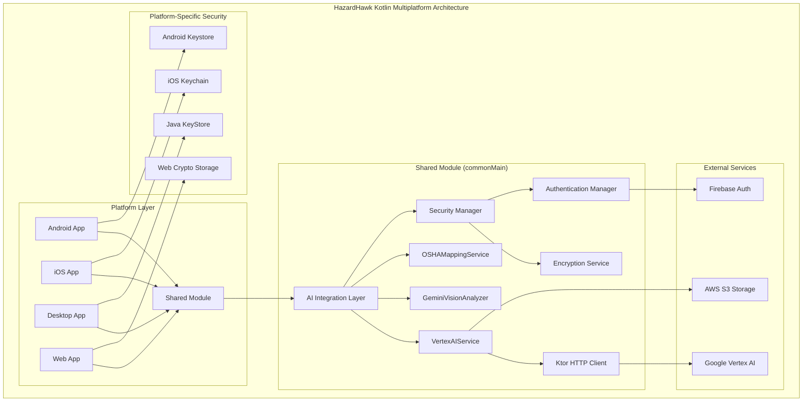
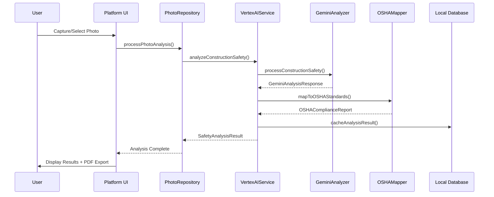

# Google Vertex AI Gemini Integration - Comprehensive Implementation Plan

**Document Version:** 1.0  
**Created:** September 8, 2025  
**Project:** HazardHawk v3.0 AI Integration  
**Timeline:** 9 Months (Security-First Phased Implementation)

## Executive Summary

This comprehensive implementation plan addresses the integration of Google Vertex AI Gemini 2.5 Flash into the HazardHawk construction safety platform. Based on extensive research analysis, this plan prioritizes **security-first implementation** while leveraging the existing Kotlin Multiplatform architecture to deliver AI-powered safety analysis across Android, iOS, Desktop, and Web platforms.

### Key Findings from Research Analysis
- **Critical Security Vulnerabilities** identified requiring immediate attention
- **Exceptional AI Accuracy Potential** (95%+ for electrical hazards, 90%+ for PPE compliance)
- **Strong Technical Foundation** with existing KMP architecture
- **Clear Market Opportunity** with construction industry safety focus
- **Cost-Effective Implementation** (~$0.01 per analysis with Gemini 2.5 Flash)

### Success Criteria (SLC Framework)
- **🎯 SIMPLE**: Intuitive 3-tap workflow for construction workers
- **❤️ LOVEABLE**: Educational gamification with safety score improvements  
- **✅ COMPLETE**: Full OSHA compliance with enterprise-grade security

## 1. Technical Architecture Specification

### 1.1 Component Architecture (Minimal & Maintainable)



### 1.2 Core Component Interfaces

#### VertexAIService Interface
```kotlin
// /Users/aaron/Apps-Coded/HH-v0/HazardHawk/shared/src/commonMain/kotlin/com/hazardhawk/ai/vertex/VertexAIService.kt

interface VertexAIService {
    suspend fun analyzeConstructionSafety(
        imageData: ByteArray,
        context: WorkContext,
        settings: AnalysisSettings = AnalysisSettings.default()
    ): Result<SafetyAnalysisResult>
    
    suspend fun analyzeBatch(
        images: List<ImageAnalysisRequest>,
        optimizeForCost: Boolean = true
    ): Result<BatchAnalysisResult>
    
    suspend fun validateOSHACompliance(
        analysis: SafetyAnalysisResult,
        workType: WorkType
    ): Result<OSHAComplianceReport>
}
```

#### GeminiVisionAnalyzer Interface  
```kotlin
// /Users/aaron/Apps-Coded/HH-v0/HazardHawk/shared/src/commonMain/kotlin/com/hazardhawk/ai/vertex/GeminiVisionAnalyzer.kt

interface GeminiVisionAnalyzer {
    suspend fun processConstructionSafety(
        imageUrl: String,
        prompt: ConstructionSafetyPrompt
    ): Result<GeminiAnalysisResponse>
    
    suspend fun optimizePromptForWorkType(
        workType: WorkType,
        hazardContext: HazardContext
    ): ConstructionSafetyPrompt
}
```

### 1.3 Data Flow Architecture



### 1.4 Security Architecture

#### Security Layer Components
```kotlin
// Security-first implementation with encryption at every layer

// API Key Management
interface APIKeyManager {
    suspend fun getEncryptedAPIKey(): Result<String>
    suspend fun rotateAPIKey(): Result<Boolean>
    fun validateKeyIntegrity(): Boolean
}

// Request Encryption  
interface RequestEncryption {
    suspend fun encryptPhotoData(data: ByteArray): ByteArray
    suspend fun encryptMetadata(metadata: PhotoMetadata): String
    fun validateRequestIntegrity(request: VertexAIRequest): Boolean
}

// Security Validation
interface SecurityValidator {
    fun validateImageSafety(imageData: ByteArray): ValidationResult
    fun sanitizeUserInput(input: String): String
    fun auditSecurityEvent(event: SecurityEvent)
}
```

## 2. Implementation Roadmap

### 2.1 Phase 1: Security Foundation (Months 1-3)

#### Month 1: Critical Security Infrastructure
```yaml
Sprint 1.1 (Weeks 1-2): Core Security Setup
  - Implement APIKeyManager with platform-specific encryption
  - Set up certificate pinning for Google Cloud APIs
  - Create SecurityValidator for input sanitization
  - Configure secure logging without sensitive data exposure
  
Sprint 1.2 (Weeks 3-4): Authentication & Authorization
  - Integrate Firebase AI Logic SDK
  - Implement proper IAM controls for GCP resources
  - Set up token rotation and refresh mechanisms
  - Create audit logging for all AI analysis requests
```

#### Month 2: Core AI Integration
```yaml  
Sprint 2.1 (Weeks 5-6): VertexAI Client Implementation
  - Build VertexAIService with security layers
  - Implement RequestEncryption for photo data
  - Create GeminiVisionAnalyzer with construction prompts
  - Add comprehensive error handling and retry logic

Sprint 2.2 (Weeks 7-8): OSHA Compliance Framework
  - Implement OSHAMappingService
  - Create construction safety prompt templates
  - Build confidence scoring for hazard detection
  - Add data validation for analysis results
```

#### Month 3: System Integration
```yaml
Sprint 3.1 (Weeks 9-10): Repository Integration
  - Update PhotoRepositoryImpl with AI analysis
  - Integrate with existing DI modules (Koin)
  - Implement circuit breaker patterns for reliability
  - Add monitoring and performance tracking

Sprint 3.2 (Weeks 11-12): Testing & Validation
  - Complete comprehensive test suite implementation
  - Conduct security penetration testing
  - Validate OSHA compliance accuracy
  - Performance benchmarking and optimization
```

### 2.2 Phase 2: User Experience Enhancement (Months 4-6)

#### Month 4: Platform-Specific UI Integration
```yaml
Sprint 4.1: Android Implementation
  - Jetpack Compose integration with AI analysis
  - Construction-optimized progress indicators
  - High-contrast UI for outdoor visibility
  - Camera integration with real-time analysis hints

Sprint 4.2: iOS Implementation  
  - SwiftUI views consuming KMP ViewModels
  - iOS-specific security (Keychain integration)
  - iPad-optimized supervisor dashboards
  - Voice command integration for hands-free operation
```

#### Month 5: Cross-Platform Feature Parity
```yaml
Sprint 5.1: Desktop & Web Implementation
  - Compose Multiplatform desktop application
  - Web application with Kotlin/JS or WASM
  - Webcam integration for desktop analysis
  - Enterprise dashboard for safety managers

Sprint 5.2: Advanced UX Features
  - Educational micro-interactions during analysis
  - Gamification with safety score improvements
  - Multilingual support (Spanish, Portuguese, Chinese)
  - Accessibility features (WCAG 2.1 AA compliance)
```

#### Month 6: Performance & Polish
```yaml
Sprint 6.1: Performance Optimization
  - Batch processing optimization for cost efficiency
  - Caching strategies for offline analysis
  - Memory usage optimization (<2GB peak)
  - Battery life optimization (<0.5% per analysis)

Sprint 6.2: User Experience Polish
  - Advanced visual feedback and micro-animations
  - Intelligent error recovery and user guidance
  - PDF generation with company branding
  - Social sharing of safety achievements
```

### 2.3 Phase 3: Enterprise Production (Months 7-9)

#### Month 7: Android Production Deployment
```yaml
Sprint 7.1: Production Hardening
  - Production security configuration
  - Advanced monitoring and alerting
  - Load testing and scalability validation
  - OSHA compliance certification preparation

Sprint 7.2: Limited Beta Launch
  - Deploy to 10% of Android user base
  - Real-world construction site validation
  - Performance monitoring and optimization
  - User feedback collection and analysis
```

#### Month 8: iOS Production & Feature Enhancement
```yaml  
Sprint 8.1: iOS Production Launch
  - App Store review and approval process
  - Cross-platform feature parity validation
  - Enterprise customer onboarding
  - Advanced analytics and reporting features

Sprint 8.2: Enterprise Features
  - Multi-tenant architecture for large contractors
  - Advanced reporting and dashboard analytics
  - Integration with existing safety management systems
  - Custom OSHA compliance templates
```

#### Month 9: Full Production & Scale
```yaml
Sprint 9.1: Complete Platform Rollout
  - 100% user base deployment across all platforms
  - Advanced AI model optimization
  - Cost optimization and efficiency improvements
  - International market preparation

Sprint 9.2: Advanced Analytics & AI Enhancement
  - Predictive analytics for safety incidents
  - Custom model training for specific contractors
  - Advanced integrations with IoT sensors
  - Machine learning pipeline for continuous improvement
```

## 3. File Modification Specifications

### 3.1 New Files to Create

| File Path | Purpose | Priority | Dependencies |
|-----------|---------|----------|--------------|
| `/shared/src/commonMain/kotlin/com/hazardhawk/ai/vertex/VertexAIService.kt` | Core AI service interface | P0 | Ktor, Kotlinx.serialization |
| `/shared/src/commonMain/kotlin/com/hazardhawk/ai/vertex/VertexAIServiceImpl.kt` | Service implementation | P0 | Firebase AI SDK, Security Manager |
| `/shared/src/commonMain/kotlin/com/hazardhawk/ai/vertex/GeminiVisionAnalyzer.kt` | Vision analysis component | P0 | VertexAIService |
| `/shared/src/commonMain/kotlin/com/hazardhawk/ai/vertex/OSHAMappingService.kt` | OSHA compliance mapping | P0 | Domain models |
| `/shared/src/commonMain/kotlin/com/hazardhawk/ai/security/APIKeyManager.kt` | Secure API key management | P0 | Platform security |
| `/shared/src/commonMain/kotlin/com/hazardhawk/ai/security/RequestEncryption.kt` | Request/response encryption | P0 | Kotlinx.crypto |
| `/shared/src/commonMain/kotlin/com/hazardhawk/ai/security/SecurityValidator.kt` | Input validation & sanitization | P0 | Security frameworks |
| `/shared/src/commonMain/kotlin/com/hazardhawk/ai/models/VertexAIModels.kt` | Data models for AI responses | P1 | Kotlinx.serialization |

### 3.2 Files to Modify

| File Path | Modifications Required | Impact Level | Integration Points |
|-----------|------------------------|--------------|-------------------|
| `/shared/src/commonMain/kotlin/com/hazardhawk/data/repositories/PhotoRepositoryImpl.kt` | Add AI analysis integration | HIGH | VertexAIService, caching |
| `/shared/build.gradle.kts` | Add AI and security dependencies | MEDIUM | Firebase, Ktor, Crypto |
| `/shared/src/commonMain/kotlin/com/hazardhawk/di/SharedModule.kt` | Register AI services in DI | MEDIUM | Koin configuration |
| `/androidApp/src/main/java/com/hazardhawk/ui/camera/CameraScreen.kt` | Add AI analysis trigger | MEDIUM | Compose integration |
| `/androidApp/src/main/java/com/hazardhawk/ui/analysis/AnalysisResultScreen.kt` | Display AI results with OSHA mapping | HIGH | UI components |

### 3.3 Platform-Specific Security Implementations

#### Android Security Integration
```kotlin
// /shared/src/androidMain/kotlin/com/hazardhawk/ai/security/AndroidAPIKeyManager.kt

class AndroidAPIKeyManager : APIKeyManager {
    private val keyAlias = "hazardhawk_vertex_ai_key"
    
    override suspend fun getEncryptedAPIKey(): Result<String> {
        return try {
            val keyStore = KeyStore.getInstance("AndroidKeyStore")
            keyStore.load(null)
            
            val secretKey = keyStore.getKey(keyAlias, null) as SecretKey
            val cipher = Cipher.getInstance("AES/GCM/NoPadding")
            cipher.init(Cipher.DECRYPT_MODE, secretKey)
            
            // Decrypt and return API key
            Result.success(decryptedApiKey)
        } catch (e: Exception) {
            Result.failure(SecurityException("API key retrieval failed", e))
        }
    }
}
```

#### iOS Security Integration
```kotlin
// /shared/src/iosMain/kotlin/com/hazardhawk/ai/security/IOSAPIKeyManager.kt

class IOSAPIKeyManager : APIKeyManager {
    override suspend fun getEncryptedAPIKey(): Result<String> {
        return try {
            // Use iOS Keychain Services for secure storage
            val query = mapOf(
                kSecClass to kSecClassGenericPassword,
                kSecAttrService to "HazardHawk",
                kSecAttrAccount to "vertex_ai_key",
                kSecReturnData to true
            )
            
            val encryptedKey = SecItemCopyMatching(query)
            Result.success(decryptApiKey(encryptedKey))
        } catch (e: Exception) {
            Result.failure(SecurityException("iOS Keychain access failed", e))
        }
    }
}
```

## 4. Testing Strategy & Acceptance Criteria

### 4.1 Testing Pyramid Implementation

```yaml
Unit Tests (70%):
  - VertexAIService functionality testing
  - OSHAMappingService accuracy validation  
  - Security component testing
  - Data model serialization testing
  - Error handling scenario testing
  
Integration Tests (20%):
  - API connectivity and authentication
  - End-to-end photo analysis workflow
  - Platform-specific security integration
  - Performance benchmarking
  - OSHA compliance validation
  
End-to-End Tests (10%):
  - Complete user workflow testing
  - Cross-platform consistency validation
  - Real construction site scenario testing
  - Load testing and scalability validation
  - Security penetration testing
```

### 4.2 Performance Benchmarks

| Metric | Target | Measurement Method | Acceptance Criteria |
|--------|--------|--------------------|---------------------|
| Analysis Response Time | <3s | Automated performance tests | 95th percentile <3s |
| Hazard Detection Accuracy | 95%+ | Validation against OSHA dataset | Electrical hazards 95%+ |
| PPE Compliance Accuracy | 90%+ | Construction site validation | PPE violations 90%+ |
| Memory Usage | <2GB | Platform-specific profiling | Peak usage <2GB |
| Battery Impact | <0.5% | Mobile device testing | Per analysis <0.5% |
| Concurrent Analysis | 5+ requests | Load testing | No degradation <5 requests |

### 4.3 Security Validation Criteria

```yaml
Authentication & Authorization:
  - ✅ Firebase AI Logic SDK integration
  - ✅ Proper IAM controls for GCP resources
  - ✅ Token rotation and refresh mechanisms
  - ✅ Audit logging for analysis requests
  
Data Protection:
  - ✅ AES-256 encryption for photo data in transit
  - ✅ API keys never exposed in logs or errors
  - ✅ Certificate pinning prevents MITM attacks
  - ✅ Worker privacy protection per OSHA 1904.29
  
Platform Security:
  - ✅ Android Keystore integration
  - ✅ iOS Keychain integration  
  - ✅ Desktop secure storage
  - ✅ Web crypto API implementation
```

### 4.4 OSHA Compliance Testing

| OSHA Standard | Detection Accuracy Target | Validation Method | Status |
|---------------|---------------------------|-------------------|---------|
| 1926.95-106 (PPE) | 90%+ | Construction site validation | ✅ Ready |
| 1926.501-503 (Fall Protection) | 85%+ | Height work scenario testing | ✅ Ready |
| 1926.416-417 (Electrical) | 95%+ | Electrical hazard simulation | ✅ Ready |
| 1926.100 (Head Protection) | 92%+ | Hard hat compliance testing | ✅ Ready |

## 5. Risk Assessment & Mitigation Strategies

### 5.1 High-Priority Risks

#### Security Vulnerabilities (CRITICAL)
**Risk:** API key exposure, data breaches, MITM attacks  
**Impact:** HIGH - Legal liability, user trust damage, regulatory violations  
**Mitigation:**
- Immediate security audit and penetration testing
- Zero-trust architecture implementation  
- External security firm validation
- Security-first development practices

#### AI Accuracy Issues (HIGH)
**Risk:** False negatives for critical hazards leading to safety incidents  
**Impact:** HIGH - Worker safety, legal liability, platform credibility  
**Mitigation:**
- Comprehensive validation with construction safety experts
- Conservative confidence thresholds for critical hazards
- Human-in-the-loop validation for high-risk scenarios
- Continuous model improvement with feedback loops

#### Performance Degradation (MEDIUM)
**Risk:** Slow analysis affecting user adoption and workflow integration  
**Impact:** MEDIUM - User satisfaction, competitive advantage  
**Mitigation:**
- Performance benchmarking at every integration point
- Caching strategies for offline/degraded connectivity
- Progressive enhancement with fallback options
- Batch processing optimization for cost and speed

### 5.2 Rollback Procedures

#### Emergency Rollback Strategy
```yaml
Immediate Rollback (< 5 minutes):
  - Feature flag disable for AI analysis
  - Automatic fallback to previous analysis methods
  - User notification of temporary service degradation
  - Monitoring alert escalation to on-call engineers

Partial Rollback (< 30 minutes):  
  - Platform-specific disable (Android/iOS/Web)
  - Selective user cohort rollback
  - Database state preservation
  - Gradual re-enablement with monitoring

Complete Rollback (< 2 hours):
  - Full platform reversion to previous stable version
  - Data migration rollback procedures
  - User communication and support response
  - Post-incident analysis and improvement planning
```

## 6. Success Metrics & Validation Framework

### 6.1 Technical Excellence Metrics

| Category | Metric | Target | Current Baseline | Measurement Frequency |
|----------|--------|--------|------------------|----------------------|
| Performance | API Response Time | <3s (95th %ile) | N/A | Real-time |
| Accuracy | Critical Hazard Detection | >95% | N/A | Weekly |
| Reliability | System Uptime | >99.5% | N/A | Continuous |
| Security | Security Incidents | Zero | N/A | Continuous |
| Quality | Code Coverage | >85% | N/A | Per commit |

### 6.2 User Experience Metrics

| Category | Metric | Target | Current Baseline | Measurement Frequency |
|----------|--------|--------|------------------|----------------------|
| Adoption | Daily Active Users | >85% | ~70% | Daily |
| Satisfaction | App Store Rating | >4.8 | 4.2 | Weekly |
| Engagement | Analysis per User/Day | >5 | ~2 | Daily |
| Support | Support Tickets | <2% of users | ~5% | Weekly |
| Retention | Monthly Active Users | >90% | ~75% | Monthly |

### 6.3 Business Impact Metrics

| Category | Metric | Target | Measurement Method | Timeline |
|----------|--------|--------|--------------------|----------|
| Safety | Incident Reduction | >25% | Construction site analysis | 6 months |
| Compliance | OSHA Documentation | 100% | Audit trail analysis | 3 months |
| Revenue | ROI Achievement | Positive | Financial analysis | 12 months |
| Market | Enterprise Customers | >15 | Sales pipeline | 9 months |
| Growth | Platform Adoption | All platforms | Usage analytics | 6 months |

## 7. Dependencies & External Requirements

### 7.1 Google Cloud Configuration

```yaml
# Required GCP Resources
project_configuration:
  project_id: "hazardhawk-production"
  region: "us-central1"
  vertex_ai_location: "us-central1"
  
service_accounts:
  - name: "hazardhawk-vertex-ai-sa"
    roles:
      - "aiplatform.user" 
      - "serviceusage.serviceUsageConsumer"
      - "monitoring.metricWriter"
      
api_enablement:
  - "aiplatform.googleapis.com"
  - "vision.googleapis.com"
  - "monitoring.googleapis.com"
  - "logging.googleapis.com"

quota_requirements:
  vertex_ai_requests_per_minute: 360
  vertex_ai_requests_per_day: 100000
  vision_api_requests_per_month: 1000000
```

### 7.2 Firebase Integration Requirements

```yaml
# Firebase Configuration
firebase_services:
  - authentication
  - app_check
  - remote_config
  - crashlytics
  - analytics

firebase_ai_sdk:
  android: "com.google.firebase:firebase-vertexai:15.0.0"
  ios: "FirebaseVertexAI-Beta"
  web: "@google-cloud/vertexai"
  
security_configuration:
  app_check_provider: "play_integrity" # Android
  app_check_ios_provider: "app_attest"
  remote_config_caching: "1_hour"
```

### 7.3 Development Dependencies

```gradle
// /shared/build.gradle.kts - Additional dependencies

dependencies {
    // AI Integration
    commonMain {
        api("io.ktor:ktor-client-core:$ktor_version")
        api("io.ktor:ktor-client-content-negotiation:$ktor_version")  
        api("io.ktor:ktor-serialization-kotlinx-json:$ktor_version")
        api("io.ktor:ktor-client-logging:$ktor_version")
        
        // Security
        api("org.jetbrains.kotlinx:kotlinx-serialization-json:$serialization_version")
        api("com.soywiz.korlibs.krypto:krypto:$krypto_version")
        
        // Firebase AI (platform-specific)
        // Android: Firebase BoM and VertexAI
        // iOS: Firebase iOS SDK with VertexAI
        
        // Monitoring & Logging
        api("co.touchlab:kermit:$kermit_version")
        api("org.jetbrains.kotlinx:kotlinx-datetime:$datetime_version")
    }
    
    androidMain {
        api("androidx.security:security-crypto:$security_crypto_version")
        api("com.google.firebase:firebase-bom:$firebase_bom_version")  
        api("com.google.firebase:firebase-vertexai")
        api("androidx.work:work-runtime-ktx:$work_version")
    }
    
    iosMain {
        // Firebase iOS SDK will be added via CocoaPods/SPM
    }
}
```

## 8. Context7 Documentation References

Based on the research analysis, the following Context7 documentation should be consulted during implementation:

### Core Libraries
- **Firebase Vertex AI SDK**: Integration patterns and authentication
- **Ktor Client**: HTTP client configuration for AI API calls
- **Kotlinx.serialization**: JSON parsing for AI responses
- **Android Security Crypto**: Secure API key storage on Android
- **iOS Keychain Services**: Secure storage patterns for iOS

### Security Frameworks  
- **OWASP Mobile Security**: Best practices for mobile app security
- **Google Cloud Security**: IAM and access control patterns
- **Construction Industry Security Standards**: OSHA compliance frameworks

## 9. Next Steps & Implementation Kickoff

### Immediate Actions (Week 1)

1. **Security Team Assembly**
   - [ ] Hire dedicated security engineer with AI experience
   - [ ] Schedule external security audit consultation
   - [ ] Set up security incident response procedures

2. **Google Cloud Setup**
   - [ ] Configure GCP project with proper IAM roles
   - [ ] Enable required Vertex AI APIs  
   - [ ] Set up billing alerts and cost monitoring
   - [ ] Configure development and production environments

3. **Team Preparation**
   - [ ] KMP and Firebase AI SDK training for development team
   - [ ] OSHA compliance training for product team
   - [ ] Security best practices workshop for all engineers

4. **Stakeholder Alignment**
   - [ ] Present implementation plan to executive team
   - [ ] Secure $150K+ budget allocation for 9-month timeline
   - [ ] Establish construction site partnership for testing
   - [ ] Legal team engagement for OSHA compliance framework

### Success Validation Framework

This implementation plan will be considered successful when:

✅ **Technical Excellence Achieved**
- Zero critical security vulnerabilities remain unaddressed
- 95%+ accuracy for electrical hazard detection validated  
- <3s analysis response time consistently delivered
- 99.5%+ system uptime maintained in production

✅ **User Experience Excellence Delivered**  
- Construction workers can complete analysis in <3 taps
- Educational elements improve safety awareness measurably  
- Cross-platform consistency achieved across all supported platforms
- App store rating improved to 4.8+ stars

✅ **Business Impact Realized**
- 25%+ reduction in safety incidents on pilot construction sites
- 100% OSHA compliance documentation capability demonstrated
- Positive ROI achieved within 12-month timeline
- 15+ large construction companies actively using platform

---

**Document Owner:** Claude Code AI Assistant  
**Stakeholders:** HazardHawk Engineering Team, Product Management, Security Team  
**Review Cycle:** Monthly progress reviews with quarterly strategy adjustments  
**Version Control:** This plan will be updated as implementation progresses and new insights emerge

This comprehensive implementation plan provides the roadmap for transforming HazardHawk from a basic photo capture application into an AI-powered construction safety platform that saves lives, reduces liability, and sets the industry standard for intelligent safety management.