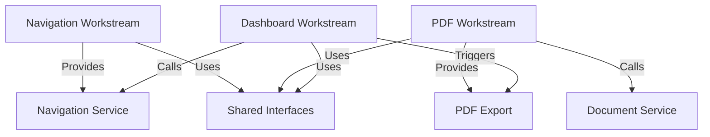

# 🔗 Interface Specifications for Parallel Development

**Generated**: 2025-09-08 13:02:00  
**Purpose**: Ensure consistent naming, interfaces, and contracts across parallel workstreams  
**Scope**: Dashboard, PDF Generation, and Navigation components  

---

## 📋 Development Contract Overview

This document defines **exactly** what each parallel workstream must implement, ensuring seamless integration without coordination conflicts.

### **Parallel Workstream Dependencies**


---

## 🎯 Shared Data Models & Enums

### **Core Enums (Implementation Priority: Day 1, Hour 1)**
```kotlin
// File: /shared/src/commonMain/kotlin/com/hazardhawk/models/UserRole.kt
enum class UserRole(val displayName: String, val permissions: Set<Permission>) {
    FIELD_ACCESS(
        displayName = "Field Worker",
        permissions = setOf(
            Permission.CAPTURE_PHOTOS,
            Permission.VIEW_ANALYSIS,
            Permission.VIEW_DOCUMENTS
        )
    ),
    SAFETY_LEAD(
        displayName = "Safety Lead", 
        permissions = setOf(
            Permission.CAPTURE_PHOTOS,
            Permission.VIEW_ANALYSIS,
            Permission.VIEW_DOCUMENTS,
            Permission.GENERATE_PTP,
            Permission.GENERATE_TOOLBOX_TALK,
            Permission.GENERATE_INCIDENT_REPORT,
            Permission.EXPORT_PDF
        )
    ),
    PROJECT_ADMIN(
        displayName = "Project Administrator",
        permissions = setOf(*Permission.values()) // All permissions
    )
}

enum class Permission {
    CAPTURE_PHOTOS,
    VIEW_ANALYSIS,
    VIEW_DOCUMENTS,
    GENERATE_PTP,
    GENERATE_TOOLBOX_TALK,
    GENERATE_INCIDENT_REPORT,
    EXPORT_PDF,
    MANAGE_USERS,
    VIEW_ANALYTICS
}
```

### **Navigation Data Models**
```kotlin
// File: /shared/src/commonMain/kotlin/com/hazardhawk/models/NavigationModels.kt
sealed class HazardHawkDestination(val route: String) {
    object Dashboard : HazardHawkDestination("dashboard")
    object Camera : HazardHawkDestination("camera")
    object Gallery : HazardHawkDestination("gallery")
    
    data class PDFExport(
        val documentId: String,
        val documentType: DocumentType
    ) : HazardHawkDestination("pdf_export/{documentId}/{documentType}") {
        companion object {
            const val ROUTE_TEMPLATE = "pdf_export/{documentId}/{documentType}"
        }
    }
    
    data class DocumentGeneration(
        val documentType: DocumentType
    ) : HazardHawkDestination("document_generation/{documentType}") {
        companion object {
            const val ROUTE_TEMPLATE = "document_generation/{documentType}"
        }
    }
}

enum class DocumentType(val displayName: String) {
    PTP("Pre-Task Plan"),
    TOOLBOX_TALK("Toolbox Talk"),
    INCIDENT_REPORT("Incident Report")
}
```

### **PDF Export Data Models**
```kotlin
// File: /shared/src/commonMain/kotlin/com/hazardhawk/models/PDFModels.kt
data class PDFExportRequest(
    val documentId: String,
    val documentType: DocumentType,
    val includePhotos: Boolean = true,
    val includeSignature: Boolean = true,
    val metadata: PDFMetadata
)

data class PDFMetadata(
    val projectName: String,
    val location: String,
    val generatedBy: String,
    val generatedDate: Long,
    val companyLogo: String? = null
)

data class SignatureData(
    val signaturePath: String, // Path to signature image
    val signerName: String,
    val signerRole: String,
    val signedDate: Long
)

sealed class PDFExportState {
    object Idle : PDFExportState()
    data class Loading(val progress: Float, val message: String) : PDFExportState()
    data class Success(val filePath: String, val fileName: String) : PDFExportState()
    data class Error(val message: String, val exception: Throwable? = null) : PDFExportState()
}
```

---

## 🏗️ Component Interface Contracts

### **1. Dashboard Component Interfaces**

#### **DashboardViewModel Interface**
```kotlin
// File: /androidApp/src/main/java/com/hazardhawk/ui/dashboard/DashboardViewModel.kt
// REQUIRED INTERFACE - Other components depend on this

interface DashboardViewModelContract {
    val uiState: StateFlow<DashboardUiState>
    val userRole: StateFlow<UserRole>
    
    fun onNavigateToCamera()
    fun onNavigateToGallery()
    fun onNavigateToDocumentGeneration(documentType: DocumentType)
    fun onNavigateToPDFExport(documentId: String, documentType: DocumentType)
    fun hasPermission(permission: Permission): Boolean
}

data class DashboardUiState(
    val isLoading: Boolean = false,
    val userRole: UserRole = UserRole.FIELD_ACCESS,
    val recentActivity: List<RecentActivityItem> = emptyList(),
    val quickActions: List<QuickAction> = emptyList(),
    val error: String? = null
)

data class RecentActivityItem(
    val id: String,
    val title: String,
    val subtitle: String,
    val timestamp: Long,
    val type: ActivityType,
    val onClick: () -> Unit
)

enum class ActivityType {
    PHOTO_ANALYZED, DOCUMENT_GENERATED, PDF_EXPORTED, USER_ACTION
}

data class QuickAction(
    val id: String,
    val title: String,
    val icon: Int, // Drawable resource ID
    val enabled: Boolean,
    val onClick: () -> Unit
)
```

#### **Role-Based Menu Interface**
```kotlin
// REQUIRED: Menu items must match these exact specs
data class MenuGroup(
    val title: String,
    val items: List<MenuItem>,
    val requiredPermission: Permission?
)

data class MenuItem(
    val id: String,
    val title: String,
    val icon: Int,
    val destination: HazardHawkDestination,
    val requiredPermission: Permission,
    val badge: Int? = null
)

// EXACT menu structure that Navigation component expects:
object MenuStructure {
    fun getMenuGroups(userRole: UserRole): List<MenuGroup> = listOf(
        MenuGroup(
            title = "Capture",
            items = listOf(
                MenuItem("camera", "Camera", R.drawable.ic_camera, 
                        HazardHawkDestination.Camera, Permission.CAPTURE_PHOTOS),
                MenuItem("gallery", "Gallery", R.drawable.ic_gallery,
                        HazardHawkDestination.Gallery, Permission.VIEW_ANALYSIS)
            ),
            requiredPermission = Permission.CAPTURE_PHOTOS
        ),
        MenuGroup(
            title = "Documents", 
            items = buildDocumentMenuItems(userRole),
            requiredPermission = Permission.VIEW_DOCUMENTS
        ),
        MenuGroup(
            title = "Management",
            items = buildManagementMenuItems(userRole),
            requiredPermission = Permission.VIEW_ANALYTICS
        )
    )
}
```

### **2. PDF Component Interfaces**

#### **PDF Export Service Interface**
```kotlin
// File: /androidApp/src/main/java/com/hazardhawk/ui/pdf/PDFExportService.kt
// REQUIRED INTERFACE - Dashboard and Navigation depend on this

interface PDFExportServiceContract {
    suspend fun exportDocument(request: PDFExportRequest): Flow<PDFExportState>
    suspend fun saveSignature(signatureData: SignatureData): Result<String>
    fun isExportInProgress(): Boolean
    fun cancelCurrentExport()
}

// EXACT function signatures for PDF Dialog:
interface PDFExportDialogContract {
    fun showExportDialog(
        documentId: String,
        documentType: DocumentType,
        onSuccess: (filePath: String) -> Unit,
        onError: (error: String) -> Unit,
        onDismiss: () -> Unit
    )
    
    fun showSignatureCapture(
        onSignatureCaptured: (SignatureData) -> Unit,
        onCancel: () -> Unit
    )
}
```

#### **Signature Capture Interface**
```kotlin
// REQUIRED: Exact interface for signature component
interface SignatureCaptureContract {
    val signatureState: StateFlow<SignatureCaptureState>
    
    fun startCapture()
    fun clearSignature()
    fun saveSignature(signerName: String, signerRole: String): SignatureData?
    fun hasSignature(): Boolean
}

sealed class SignatureCaptureState {
    object Idle : SignatureCaptureState()
    object Capturing : SignatureCaptureState()
    data class HasSignature(val previewPath: String) : SignatureCaptureState()
    data class Saved(val signatureData: SignatureData) : SignatureCaptureState()
}
```

### **3. Navigation Component Interfaces**

#### **Navigation Service Interface**
```kotlin
// File: /androidApp/src/main/java/com/hazardhawk/ui/navigation/NavigationService.kt
// REQUIRED INTERFACE - Dashboard depends on this

interface NavigationServiceContract {
    fun navigateTo(destination: HazardHawkDestination, clearBackStack: Boolean = false)
    fun navigateBack()
    fun canNavigateBack(): Boolean
    fun getCurrentDestination(): HazardHawkDestination?
    
    // Specific navigation functions that Dashboard will call:
    fun navigateToCamera()
    fun navigateToGallery(preselectedPhotoId: String? = null)
    fun navigateToDocumentGeneration(documentType: DocumentType)
    fun navigateToPDFExport(documentId: String, documentType: DocumentType)
    fun navigateToDashboard()
}

// Deep link handler interface
interface DeepLinkHandlerContract {
    fun handleDeepLink(uri: String): Boolean
    fun createDeepLink(destination: HazardHawkDestination): String
}
```

---

## 🔧 Integration Point Specifications

### **Dashboard → Navigation Integration**
```kotlin
// EXACT implementation required in DashboardViewModel:
class DashboardViewModel(
    private val navigationService: NavigationServiceContract
) : ViewModel(), DashboardViewModelContract {
    
    override fun onNavigateToCamera() {
        navigationService.navigateToCamera()
    }
    
    override fun onNavigateToDocumentGeneration(documentType: DocumentType) {
        navigationService.navigateToDocumentGeneration(documentType)
    }
    
    override fun onNavigateToPDFExport(documentId: String, documentType: DocumentType) {
        navigationService.navigateToPDFExport(documentId, documentType)
    }
}
```

### **Dashboard → PDF Integration**
```kotlin
// EXACT implementation required in DashboardScreen:
@Composable
fun DashboardScreen(
    viewModel: DashboardViewModelContract,
    pdfExportDialog: PDFExportDialogContract
) {
    // When user wants to export recent document:
    LaunchedEffect(viewModel.uiState.collectAsState().value.exportRequest) {
        val exportRequest = viewModel.uiState.value.exportRequest
        if (exportRequest != null) {
            pdfExportDialog.showExportDialog(
                documentId = exportRequest.documentId,
                documentType = exportRequest.documentType,
                onSuccess = { filePath -> 
                    viewModel.onPDFExportSuccess(filePath)
                },
                onError = { error -> 
                    viewModel.onPDFExportError(error)
                },
                onDismiss = { 
                    viewModel.onDismissPDFDialog()
                }
            )
        }
    }
}
```

### **PDF → Gallery Integration**
```kotlin
// EXACT function signature required in ConstructionSafetyGallery:
fun addPDFExportAction() {
    // This function must be added to existing gallery
    FloatingActionButton(
        onClick = {
            if (selectedPhotos.isNotEmpty()) {
                onPDFExportRequested(selectedPhotos.map { it.id })
            }
        },
        modifier = Modifier.padding(16.dp)
    ) {
        Icon(Icons.Default.PictureAsPdf, contentDescription = "Export to PDF")
    }
}

// Required callback in gallery's parent:
val onPDFExportRequested: (photoIds: List<String>) -> Unit = { photoIds ->
    pdfExportDialog.showExportDialog(
        documentId = "gallery_export_${System.currentTimeMillis()}",
        documentType = DocumentType.INCIDENT_REPORT, // Default for photo export
        onSuccess = { filePath -> /* Handle success */ },
        onError = { error -> /* Handle error */ },
        onDismiss = { /* Handle dismiss */ }
    )
}
```

---

## 📦 Dependency Injection Configuration

### **Koin Module Updates**
```kotlin
// File: /androidApp/src/main/java/com/hazardhawk/di/AppModule.kt
// EXACT DI configuration required:

val appModule = module {
    
    // Navigation components
    single<NavigationServiceContract> { 
        NavigationService(get()) // NavController injected
    }
    
    single<DeepLinkHandlerContract> { 
        DeepLinkHandler(get()) 
    }
    
    // Dashboard components  
    viewModel<DashboardViewModelContract> { 
        DashboardViewModel(
            navigationService = get(),
            userRepository = get(),
            analyticsService = get()
        )
    }
    
    // PDF components
    single<PDFExportServiceContract> { 
        PDFExportService(
            documentService = get(), // Existing DocumentGenerationService
            reportManager = get()    // Existing ReportGenerationManager
        )
    }
    
    single<PDFExportDialogContract> { 
        PDFExportDialog()
    }
    
    single<SignatureCaptureContract> { 
        SignatureCaptureService(context = androidContext())
    }
}
```

---

## 🎯 Implementation Sequence for Parallel Development

### **Hour 1: Interface Foundation (ALL WORKSTREAMS)**
Every developer must implement these files first, in this exact order:

1. **EVERYONE IMPLEMENTS**:
   ```kotlin
   /shared/src/commonMain/kotlin/com/hazardhawk/models/UserRole.kt
   /shared/src/commonMain/kotlin/com/hazardhawk/models/NavigationModels.kt  
   /shared/src/commonMain/kotlin/com/hazardhawk/models/PDFModels.kt
   ```

2. **Navigation Developer IMPLEMENTS**:
   ```kotlin
   /androidApp/src/main/java/com/hazardhawk/ui/navigation/NavigationService.kt (interface only)
   ```

3. **PDF Developer IMPLEMENTS**:
   ```kotlin
   /androidApp/src/main/java/com/hazardhawk/ui/pdf/PDFExportService.kt (interface only)
   ```

4. **Dashboard Developer IMPLEMENTS**:
   ```kotlin
   /androidApp/src/main/java/com/hazardhawk/ui/dashboard/DashboardViewModel.kt (interface only)
   ```

### **Hour 2-8: Parallel Implementation**
Now each workstream can develop independently using the agreed interfaces:

- **Dashboard**: Implements DashboardScreen, DashboardViewModel, RoleBasedMenuComponent
- **PDF**: Implements PDFExportDialog, SignatureCaptureComponent, PDFTemplateService
- **Navigation**: Implements NavigationService, DeepLinkHandler, NavDestinations

### **Integration Testing Checkpoints**
```kotlin
// Day 1 End: Interface compliance tests
class InterfaceComplianceTest {
    @Test fun dashboardImplementsContract() 
    @Test fun pdfServiceImplementsContract()
    @Test fun navigationImplementsContract()
}

// Day 3: Integration tests  
class CrossComponentIntegrationTest {
    @Test fun dashboardCanTriggerNavigation()
    @Test fun dashboardCanTriggerPDFExport()
    @Test fun navigationRoutesToCorrectDestinations()
}
```

---

## 🚨 Common Naming Conflicts & Resolutions

### **Potential Conflicts & Solutions**

| Conflict Area | Problem | Solution |
|---------------|---------|----------|
| **Document Types** | Different enums in different files | Use single DocumentType enum in NavigationModels.kt |
| **State Classes** | Multiple "State" classes | Prefix with component name: DashboardUiState, PDFExportState |
| **Navigation Functions** | Generic "navigate" functions | Specific names: navigateToCamera(), navigateToPDFExport() |
| **Permission Checking** | Different permission logic | Single hasPermission() in UserRole enum |
| **Resource IDs** | Conflicting drawable names | Use component prefix: dashboard_ic_*, pdf_ic_* |

### **Naming Convention Rules**

#### **File Naming**
```kotlin
Pattern: [Component][Purpose][Type].kt
Examples:
- DashboardScreen.kt (not MainDashboard.kt)
- PDFExportDialog.kt (not ExportDialog.kt) 
- NavigationService.kt (not NavService.kt)
```

#### **Class Naming**
```kotlin
Pattern: [Component][Purpose][Type]
Examples:
- DashboardViewModel (not MainViewModel)
- PDFExportRequest (not ExportRequest)
- SignatureCaptureState (not CaptureState)
```

#### **Function Naming**
```kotlin
Pattern: [action][Target][Context?]
Examples:
- navigateToCamera() (not goToCamera())
- exportToPDF() (not export())
- hasPermission(Permission) (not checkPermission())
```

---

## ✅ Validation Checklist

### **Pre-Implementation Validation**
- [ ] All developers have access to this interface specification
- [ ] Shared data models are agreed upon and documented
- [ ] Each workstream understands their required interface implementations
- [ ] DI configuration is planned and documented
- [ ] Integration test plan is established

### **Daily Integration Validation**
- [ ] Interface contracts are being followed exactly
- [ ] No duplicate or conflicting class names
- [ ] Function signatures match specifications
- [ ] DI configuration can resolve all dependencies
- [ ] Cross-component calls work as expected

### **Pre-Integration Testing**  
- [ ] All components compile independently
- [ ] Interface implementations are complete
- [ ] Mock implementations allow testing without dependencies
- [ ] Integration points have been tested with mocks
- [ ] Performance requirements are being met

---

## 🔄 Change Management Process

### **Interface Changes During Development**
If interface changes are needed:

1. **STOP all development**
2. **Discuss change with all workstream developers**
3. **Update this specification document**  
4. **Update all dependent implementations simultaneously**
5. **Run integration tests before continuing**

### **Emergency Fallbacks**
If integration fails:

1. **Mock implementations** available for each interface
2. **Feature flags** can disable problematic components
3. **Rollback to stable interfaces** documented
4. **Alternative implementation paths** identified

---

## 📄 Document Status

**Status**: ✅ **APPROVED FOR IMPLEMENTATION**  
**Last Updated**: 2025-09-08 13:02:00  
**Next Review**: After Phase 1 completion (Day 2)  
**Change Authority**: All three workstream leads must approve changes  

**Distribution**:
- Dashboard Development Team
- PDF Generation Team  
- Navigation Team
- Integration Testing Team
- Project Coordinator

This specification ensures that all parallel workstreams can develop independently while maintaining perfect integration compatibility. Any deviation from these specifications will result in integration failures and should be avoided.

---

*This interface specification document is the single source of truth for cross-component integration during parallel development. All developers must implement exactly as specified to ensure seamless integration.*