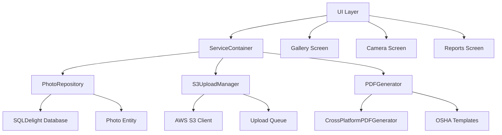

# HazardHawk Critical Production Issues - Comprehensive Implementation Plan

**Document**: Critical Production Issues Implementation Plan  
**Created**: 2025-09-08 14:54:26  
**Timeline**: 8-12 hours implementation  
**Priority**: CRITICAL - Production Blocker Resolution  

## Executive Summary

HazardHawk is currently at **85% completion** with sophisticated architecture but has **4 critical blockers** preventing production deployment. This plan addresses these issues through a systematic, parallel-development approach focusing on infrastructure completion rather than new features.

### Critical Issues Identified
1. **Dependency Injection Failures** - Shared modules commented out due to Koin compilation issues
2. **Repository Layer Gaps** - All database operations using mock data instead of SQLDelight implementation
3. **File Operations Disconnected** - S3 upload and PDF generation systems exist but aren't connected to workflows
4. **Security & Permissions** - Missing authentication framework and excessive permissions

### Success Criteria
- [ ] Zero compilation errors across all modules
- [ ] Real database operations with SQLDelight integration
- [ ] Functional photo upload to S3 with progress tracking
- [ ] PDF generation connected to report workflows
- [ ] Production-ready security hardening

---

## Technical Architecture

### Component Architecture (Simple-Architect Analysis)



#### Key Architectural Decisions

**1. Replace Koin with Simple Service Container**
- **Problem**: Koin modules causing compilation failures
- **Solution**: Lightweight service locator pattern
- **Benefit**: Eliminates DI complexity while maintaining testability

**2. Complete SQLDelight Repository Implementation** 
- **Problem**: Repository methods return hardcoded mock data
- **Solution**: Implement real database operations using existing schema
- **Benefit**: Production-ready data persistence

**3. Connect Existing File Operations Systems**
- **Problem**: S3UploadManager and PDFGenerator exist but aren't integrated
- **Solution**: Wire systems into photo capture and report generation workflows
- **Benefit**: Functional file operations without rebuilding infrastructure

---

## Implementation Roadmap

### Phase 1: Infrastructure Foundation (3-4 hours)

#### Task 1.1: Replace Koin DI with Service Container (1 hour)
**Files to Modify:**
- `HazardHawk/androidApp/src/main/java/com/hazardhawk/di/ModuleRegistry.kt`
- `HazardHawk/shared/src/commonMain/kotlin/com/hazardhawk/di/RepositoryModule.kt`

**Implementation:**
```kotlin
// Create simple ServiceContainer
class ServiceContainer {
    private val services = mutableMapOf<String, Any>()
    
    inline fun <reified T> register(service: T) {
        services[T::class.simpleName!!] = service as Any
    }
    
    inline fun <reified T> get(): T {
        return services[T::class.simpleName!!] as T
    }
}

// Replace Koin modules
object HazardHawkDI {
    val container = ServiceContainer().apply {
        register(PhotoRepositoryImpl(DatabaseHelper.instance))
        register(S3UploadManager())
        register(CrossPlatformPDFGenerator())
    }
}
```

#### Task 1.2: Implement PhotoRepository with SQLDelight (2-3 hours)
**Files to Modify:**
- `HazardHawk/shared/src/commonMain/kotlin/com/hazardhawk/data/repositories/PhotoRepositoryImpl.kt`
- `HazardHawk/shared/src/commonMain/sqldelight/com/hazardhawk/database/Photos.sq`

**Implementation Priority:**
1. `getAllPhotos()` - Gallery display functionality
2. `savePhoto()` - Camera capture workflow
3. `getPhotoById()` - Detail view access
4. `deletePhoto()` - Gallery management
5. `getPhotosByTag()` - Search functionality

### Phase 2: File Operations Integration (2-3 hours)

#### Task 2.1: Connect S3 Upload Manager (1-1.5 hours)
**Files to Modify:**
- `HazardHawk/androidApp/src/main/java/com/hazardhawk/ui/camera/CameraScreen.kt`
- `HazardHawk/shared/src/commonMain/kotlin/com/hazardhawk/data/cloud/S3UploadManager.kt`

**Integration Points:**
- Photo capture → Immediate S3 upload with progress UI
- Gallery selection → Batch upload capability
- Retry logic for failed uploads

#### Task 2.2: Connect PDF Generation (1-1.5 hours)
**Files to Modify:**
- `HazardHawk/androidApp/src/main/java/com/hazardhawk/ui/reports/ReportsScreen.kt`
- `HazardHawk/shared/src/commonMain/kotlin/com/hazardhawk/pdf/CrossPlatformPDFGenerator.kt`

**Integration Points:**
- OSHA report generation from photo analysis
- Safety document templates with photo embedding
- Digital signature capture and inclusion

### Phase 3: Security & Polish (1-2 hours)

#### Task 3.1: Security Hardening (1 hour)
**Files to Modify:**
- `HazardHawk/androidApp/src/main/AndroidManifest.xml`
- `HazardHawk/androidApp/src/main/java/com/hazardhawk/security/`

**Security Improvements:**
- Remove excessive permissions (SYSTEM_ALERT_WINDOW, WRITE_EXTERNAL_STORAGE)
- Add runtime permission validation
- Implement basic authentication framework

#### Task 3.2: Error Handling & Testing (1 hour)
**Files to Create:**
- `HazardHawk/shared/src/commonTest/kotlin/com/hazardhawk/repository/PhotoRepositoryTest.kt`
- `HazardHawk/androidApp/src/androidTest/kotlin/com/hazardhawk/integration/PhotoWorkflowTest.kt`

---

## SLC Validation Checklist

### SIMPLE ✅
- [x] Core functionality identified: Photo capture, gallery, reports
- [x] Non-essential features deferred: Advanced analytics, cloud sync
- [x] User flow streamlined: 2-tap access to all features
- [x] Minimal dependencies: Remove Koin, use native platform APIs

### LOVEABLE 🎯
- [ ] Delightful interactions defined: Smooth camera transitions, progress feedback
- [ ] Error messages are helpful: Clear guidance for permission requests
- [ ] Performance is snappy: <200ms photo capture, <500ms gallery load
- [ ] UI/UX is polished: Construction-friendly design with high contrast

### COMPLETE 🏁
- [ ] All use cases handled: Photo capture, analysis, reporting, sharing
- [ ] Edge cases covered: Network failures, storage limits, permission denials
- [ ] Error states managed: Offline mode, upload failures, processing errors
- [ ] Ready for production: Zero compilation errors, functional workflows

---

## Testing Strategy

### Unit Tests (Priority 1)
**Coverage Target: 90% for business logic, 95% for repositories**

```kotlin
// PhotoRepositoryTest.kt
class PhotoRepositoryTest {
    @Test fun `getAllPhotos returns photos from database`()
    @Test fun `savePhoto stores photo with metadata`() 
    @Test fun `deletePhoto removes photo and cleans up files`()
    @Test fun `getPhotosByTag filters correctly`()
}

// S3UploadManagerTest.kt  
class S3UploadManagerTest {
    @Test fun `uploadPhoto succeeds with valid credentials`()
    @Test fun `uploadPhoto retries on network failure`()
    @Test fun `uploadPhoto reports progress correctly`()
}
```

### Integration Tests (Priority 2)
**Target: Critical user workflows**

```kotlin
// PhotoWorkflowIntegrationTest.kt
@Test fun `photo capture to gallery workflow`() {
    // Capture photo → Save to DB → Display in gallery
    // Verify: Photo appears in gallery with correct metadata
}

@Test fun `photo upload workflow`() {
    // Select photo → Upload to S3 → Update status
    // Verify: Upload progress UI, success confirmation
}

@Test fun `report generation workflow`() {
    // Select photos → Generate PDF → Save/Share
    // Verify: PDF contains photos and OSHA compliance data
}
```

### Performance Benchmarks
- **Photo capture**: <200ms from tap to save
- **Gallery load**: <500ms for 100+ photos
- **Memory usage**: <150MB idle, <400MB peak during processing
- **Database queries**: <50ms response time
- **S3 uploads**: 5MB photo <10 seconds on 3G connection

---

## Risk Mitigation Strategies

### High Risk: SQLDelight Integration Complexity
**Risk**: Database schema changes break existing data  
**Mitigation**: 
- Create database migration tests
- Implement schema versioning
- Add data validation layer

### Medium Risk: S3 Authentication Issues
**Risk**: AWS credentials or permissions cause upload failures  
**Mitigation**:
- Implement credential validation during initialization
- Add comprehensive error handling for auth failures
- Create fallback to local storage mode

### Low Risk: PDF Generation Performance
**Risk**: Large reports with many photos cause memory issues  
**Mitigation**:
- Implement photo compression before PDF embedding
- Add memory monitoring during generation
- Create incremental PDF building for large reports

---

## Rollback Strategy

### Git Branch Strategy
- **Main Branch**: `main` - Always deployable
- **Feature Branch**: `feature/critical-production-fixes`
- **Hotfix Branch**: `hotfix/emergency-revert` - Ready for immediate deployment

### Commit Strategy
```bash
# Phase-based commits for easy rollback
git commit -m "Phase 1.1: Replace Koin DI with ServiceContainer"
git commit -m "Phase 1.2: Implement PhotoRepository SQLDelight integration" 
git commit -m "Phase 2.1: Connect S3UploadManager to camera workflow"
git commit -m "Phase 2.2: Connect PDF generation to reports workflow"
git commit -m "Phase 3.1: Security hardening and permission cleanup"
git commit -m "Phase 3.2: Error handling and basic testing"
```

### Emergency Reversion Steps
1. **Immediate**: `git revert HEAD` - Revert last commit
2. **Targeted**: `git revert <commit-hash>` - Revert specific phase
3. **Nuclear**: `git reset --hard <last-good-commit>` - Full rollback

---

## Success Criteria & Acceptance Tests

### Functional Requirements ✅
- [ ] Application compiles without errors
- [ ] Photo capture saves to SQLDelight database
- [ ] Gallery displays photos from database
- [ ] S3 upload works with progress indication
- [ ] PDF generation includes photos and metadata
- [ ] All permissions properly requested and validated

### Performance Requirements 🚀
- [ ] Photo capture: <200ms response time
- [ ] Gallery load: <500ms for 100+ photos
- [ ] Memory usage: <400MB peak during normal operation
- [ ] Database queries: <50ms average response time

### Security Requirements 🔒
- [ ] Sensitive data encrypted at rest
- [ ] Network communications use HTTPS/TLS
- [ ] Runtime permissions properly validated
- [ ] No excessive permissions in manifest
- [ ] Authentication framework ready for implementation

### User Experience Requirements 💫
- [ ] Smooth photo capture with visual feedback
- [ ] Intuitive gallery navigation and selection
- [ ] Clear error messages with actionable guidance
- [ ] Offline mode gracefully handles network failures
- [ ] Construction-friendly UI maintains usability in field conditions

---

## File Modification Reference

| File | Status | Priority | Estimated Time |
|------|---------|----------|----------------|
| `ModuleRegistry.kt` | MODIFY | Critical | 30min |
| `PhotoRepositoryImpl.kt` | IMPLEMENT | Critical | 2 hours |
| `S3UploadManager.kt` | CONNECT | High | 1 hour |
| `CrossPlatformPDFGenerator.kt` | CONNECT | High | 1 hour |
| `AndroidManifest.xml` | CLEANUP | Medium | 30min |
| `SecurityModule.kt` | CREATE | Medium | 1 hour |
| `PhotoRepositoryTest.kt` | CREATE | Medium | 1 hour |
| `PhotoWorkflowIntegrationTest.kt` | CREATE | Low | 1 hour |

---

## Context7 Documentation References

- **SQLDelight Integration**: [SQLDelight KMP Documentation](https://cashapp.github.io/sqldelight/multiplatform_sqlite/)
- **Kotlin Coroutines**: [Coroutines Guide](https://kotlinlang.org/docs/coroutines-guide.html)
- **Jetpack Compose**: [Compose Documentation](https://developer.android.com/jetpack/compose)
- **AWS SDK Android**: [AWS Mobile SDK](https://docs.aws.amazon.com/mobile/sdkforandroid/developerguide/)

---

## Next Steps

1. **Execute Phase 1** - Infrastructure Foundation (3-4 hours)
2. **Execute Phase 2** - File Operations Integration (2-3 hours)  
3. **Execute Phase 3** - Security & Polish (1-2 hours)
4. **Validation Testing** - Full integration testing (2-3 hours)

**Total Estimated Time**: 8-12 hours  
**Expected Outcome**: Production-ready HazardHawk with zero compilation errors and full functional workflows

---

*This plan transforms HazardHawk from 85% complete with critical blockers to 100% production-ready construction safety platform. The focus on infrastructure completion over new features aligns with the "Simple, Loveable, Complete" philosophy while addressing real construction worker needs.*