# HazardHawk Critical Production Issues - Implementation Plan
*Generated: 2025-09-08 15:00:24*

## Executive Summary

HazardHawk is 85% production-ready with four critical blockers preventing deployment. This plan provides an 8-12 hour roadmap to transform the app from its current state to full production readiness, focusing on infrastructure completion rather than new features.

### Critical Issues Identified
1. **Dependency Injection Failures** - Shared modules commented out (3-4 hours)
2. **Repository Layer Stubs** - Database operations are TODO mocks (2-3 hours)  
3. **File Operations Disconnected** - S3/PDF systems exist but aren't wired (2-3 hours)
4. **Security Gaps** - Missing permissions and encryption (1-2 hours)

### Success Criteria
- ✅ Zero compilation errors
- ✅ Real database operations (no mocks)
- ✅ Working photo capture → storage → gallery flow
- ✅ Functional S3 upload and PDF generation
- ✅ Production-ready security

## Technical Architecture

### Current State Analysis


### Target Architecture (Post-Implementation)

```mermaid
graph TB
    A[Android App] -->|✅| B[Service Container DI]
    B -->|✅| C[Repository Layer]
    C -->|✅| D[SQLDelight Database]
    
    E[Photo Workflow] -->|✅| F[Capture]
    F -->|✅| G[Storage]
    G -->|✅| H[Gallery]
    G -->|✅| I[S3 Upload]
    
    J[Security Layer] -->|✅| K[Authentication]
    J -->|✅| L[Permissions]
    J -->|✅| M[Encryption]
```


## Implementation Roadmap

### Phase 1: Infrastructure Foundation (3-4 hours)

#### 1.1 Replace Koin DI with Service Container (1 hour)
**Priority: Critical Path**

**Files to Modify:**
- `HazardHawk/androidApp/src/main/java/com/hazardhawk/di/ModuleRegistry.kt`
- `HazardHawk/shared/build.gradle.kts`

**Tasks:**
- [ ] Remove commented Koin modules
- [ ] Implement simple ServiceContainer pattern
- [ ] Update dependency registration
- [ ] Test module loading

**Implementation Details:**
```kotlin
// ServiceContainer implementation
class ServiceContainer {
    private val services = mutableMapOf<String, Any>()
    
    inline fun <reified T> register(service: T) {
        services[T::class.simpleName!!] = service as Any
    }
    
    inline fun <reified T> get(): T {
        return services[T::class.simpleName!!] as T
    }
}
```

#### 1.2 Implement Real Repository Layer (2-3 hours)
**Priority: Critical Path**

**Files to Modify:**
- `HazardHawk/shared/src/commonMain/kotlin/com/hazardhawk/data/repositories/PhotoRepositoryImpl.kt`
- `HazardHawk/shared/src/commonMain/sqldelight/com/hazardhawk/database/Photos.sq`

**Tasks:**
- [ ] Complete PhotoRepositoryImpl with SQLDelight integration
- [ ] Add data mappers (SQLDelight ↔ Domain models)
- [ ] Implement proper error handling with Result pattern
- [ ] Add batch operations for gallery loading
- [ ] Test database operations

**Critical Methods to Implement:**
```kotlin
suspend fun savePhoto(photo: Photo): Result<Long>
suspend fun getPhotos(limit: Int = 50): Result<List<Photo>>
suspend fun deletePhoto(id: Long): Result<Unit>
suspend fun updatePhotoAnalysis(id: Long, analysis: AIAnalysis): Result<Unit>
```

### Phase 2: File Operations Integration (2-3 hours)

#### 2.1 Connect S3 Upload Manager (1-1.5 hours)
**Files to Modify:**
- `HazardHawk/androidApp/src/main/java/com/hazardhawk/camera/CameraViewModel.kt`
- `HazardHawk/shared/src/commonMain/kotlin/com/hazardhawk/data/network/S3UploadManager.kt`

**Tasks:**
- [ ] Integrate existing S3UploadManager into photo capture workflow
- [ ] Add upload progress tracking
- [ ] Implement retry logic for failed uploads
- [ ] Add upload queue management

#### 2.2 Integrate PDF Generation (1-1.5 hours)
**Files to Modify:**
- `HazardHawk/shared/src/commonMain/kotlin/com/hazardhawk/utils/CrossPlatformPDFGenerator.kt`
- `HazardHawk/androidApp/src/main/java/com/hazardhawk/ui/reports/ReportGenerationScreen.kt`

**Tasks:**
- [ ] Connect CrossPlatformPDFGenerator to report UI
- [ ] Test OSHA document templates
- [ ] Add signature capture integration
- [ ] Implement PDF export workflow

### Phase 3: Security Hardening (1-2 hours)

#### 3.1 Security Implementation (1 hour)
**Files to Modify:**
- `HazardHawk/androidApp/src/main/AndroidManifest.xml`
- `HazardHawk/shared/src/commonMain/kotlin/com/hazardhawk/security/SecurityManager.kt`

**Tasks:**
- [ ] Remove excessive permissions from manifest
- [ ] Add runtime permission checks
- [ ] Implement authentication framework
- [ ] Enable hardware-backed keystore encryption

### Phase 4: Testing & Validation (2-3 hours)

#### 4.1 End-to-End Testing (1.5 hours)
**Tasks:**
- [ ] Test photo capture → database storage → gallery display flow
- [ ] Validate S3 upload workflow
- [ ] Test PDF generation end-to-end
- [ ] Verify error handling across all workflows

#### 4.2 Performance Optimization (1-1.5 hours)
**Tasks:**
- [ ] Implement thumbnail generation for gallery
- [ ] Add lazy loading for photo lists
- [ ] Optimize memory usage during photo operations
- [ ] Test performance on low-end devices

## SLC Validation Checklist

### SIMPLE ✅
- [ ] Core functionality identified and prioritized
- [ ] Non-essential features deferred (focus on infrastructure)
- [ ] User flow streamlined (capture → analyze → document)
- [ ] Minimal dependencies (Service Container vs Koin)
- [ ] Complex UI components broken down (2,856-line CameraScreen.kt)

### LOVEABLE 💝
- [ ] Delightful error messages for construction workers
- [ ] Smooth performance (< 200ms photo capture)
- [ ] Intuitive gallery navigation with bulk selection
- [ ] Helpful loading states during AI analysis
- [ ] Construction-friendly high contrast UI maintained

### COMPLETE 🎯
- [ ] All critical workflows functional (no mocks)
- [ ] Real database persistence with SQLDelight
- [ ] Working S3 upload with retry logic
- [ ] PDF generation with OSHA templates
- [ ] Production security (authentication + encryption)
- [ ] Cross-platform testing strategy implemented

## Testing Strategy

### Unit Tests (Priority 1)
```kotlin
// Critical test coverage areas
class PhotoRepositoryTest {
    @Test fun `should save photo to database`()
    @Test fun `should handle database errors gracefully`()
    @Test fun `should retrieve photos with pagination`()
}

class S3UploadManagerTest {
    @Test fun `should upload photo with retry logic`()
    @Test fun `should handle network failures`()
    @Test fun `should track upload progress`()
}
```

### Integration Tests (Priority 2)
- [ ] Photo capture → database → gallery workflow
- [ ] S3 upload integration with real AWS endpoints
- [ ] PDF generation with template rendering
- [ ] Authentication flow validation

### Performance Benchmarks
- **Photo Capture**: < 200ms from tap to database save
- **Gallery Load**: < 500ms for 100+ photos with thumbnails
- **Memory Usage**: < 150MB idle, < 400MB during photo processing
- **S3 Upload**: 5MB photo < 10 seconds on 3G connection

### Platform Testing Matrix
| Platform | Unit Tests | Integration | E2E | Performance |
|----------|------------|-------------|-----|-------------|
| Android Phone | ✅ | ✅ | ✅ | ✅ |
| Android Tablet | ✅ | ✅ | ✅ | ✅ |
| Android TV | ⏳ | ⏳ | ⏳ | ⏳ |
| iOS | ⏳ | ⏳ | ⏳ | ⏳ |

## Risk Mitigation & Rollback Strategy

### Risk Assessment
| Risk | Impact | Probability | Mitigation |
|------|--------|-------------|------------|
| DI Migration Issues | High | Low | Incremental migration with fallback |
| SQLDelight Integration | High | Medium | Comprehensive testing with sample data |
| S3 Connectivity | Medium | Low | Local fallback, retry mechanisms |
| Performance Regression | Medium | Medium | Benchmark testing, profiling |

### Rollback Plan
1. **Git Branch Strategy**: `feature/production-fixes-YYYYMMDD`
2. **Commit Strategy**: One feature per commit with detailed messages
3. **Database Migration**: All schema changes are additive (no data loss)
4. **Feature Flags**: Critical changes behind feature toggles
5. **Quick Reversion**: `git revert <commit-hash>` for individual fixes

### Emergency Rollback Commands
```bash
# Revert DI changes
git revert <di-commit-hash>

# Revert repository implementation
git revert <repo-commit-hash>

# Reset to pre-fix state
git reset --hard <starting-commit>
```

## Success Metrics & KPIs

### Development Metrics
- [ ] **Build Success**: 100% clean compilation
- [ ] **Test Coverage**: >90% for business logic, >95% for repositories
- [ ] **Performance**: All benchmarks within SLA targets
- [ ] **Memory**: No memory leaks in 1-hour stress test

### User Experience Metrics
- [ ] **Photo Capture Flow**: End-to-end success rate >99%
- [ ] **Gallery Performance**: Load time <500ms for 100 photos
- [ ] **Error Recovery**: Clear error messages with action guidance
- [ ] **Offline Resilience**: Queue functionality with automatic retry

### Production Readiness Metrics
- [ ] **Security**: All OSHA compliance requirements met
- [ ] **Reliability**: Zero crashes in 24-hour automated testing
- [ ] **Scalability**: Support for 1000+ photos without performance degradation
- [ ] **Documentation**: All public APIs documented with examples

## Implementation Timeline


## Reference Documentation

### Context7 Library Documentation
- **SQLDelight**: For database operations and query generation
- **Kotlin Coroutines**: For async repository operations  
- **Ktor**: For S3 HTTP client configuration
- **Compose**: For UI component architecture

### Project Files Referenced
- **Research Document**: `/docs/research/20250908-142922-critical-production-issues-research.html`
- **SQLDelight Schema**: `/HazardHawk/shared/src/commonMain/sqldelight/com/hazardhawk/database/Photos.sq`
- **DI Registry**: `/HazardHawk/androidApp/src/main/java/com/hazardhawk/di/ModuleRegistry.kt`
- **Repository Implementation**: `/HazardHawk/shared/src/commonMain/kotlin/com/hazardhawk/data/repositories/PhotoRepositoryImpl.kt`

### Development Commands
```bash
# Build validation
./gradlew clean build

# Run tests
./gradlew allTests

# Android deployment
./gradlew :androidApp:assembleDebug
./gradlew :androidApp:installDebug

# Code quality
./gradlew ktlintCheck detekt
```

## Next Steps

1. **Immediate Action**: Begin Phase 1 with dependency injection fixes
2. **Resource Allocation**: Assign specialized agents to parallel workstreams
3. **Progress Tracking**: Use TodoWrite for granular task management
4. **Quality Gates**: Run full test suite after each phase
5. **Production Deployment**: Schedule after Phase 4 completion and 24-hour testing

---

*This implementation plan transforms HazardHawk from 85% complete to 100% production-ready through focused infrastructure completion. The approach prioritizes stability and reliability over feature expansion, ensuring construction workers have a dependable safety documentation tool.*

**Implementation Ready**: This plan provides everything needed to begin development immediately with clear success criteria and objective measurement of completion.