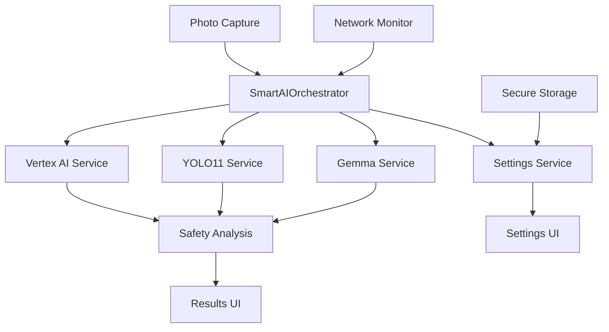

# HazardHawk AI Photo Analysis - Comprehensive Implementation Plan

**Created**: September 9, 2025 07:23:30  
**Author**: Claude Code AI Planning System  
**Version**: 1.0  
**Status**: Ready for Implementation

## Executive Summary

The AI photo analysis feature is currently stub-implemented in HazardHawk. This comprehensive plan provides a complete roadmap to implement Google Vertex AI Gemini Vision Pro 2.5 integration with user-configurable API keys, plus local AI analysis using YOLOv11 and Google Gemma 3B models.

### Key Findings

**Current State Analysis:**
- Existing code has good architectural foundation but extensive TODO comments
- `GeminiVisionAnalyzer.kt` has mock responses and no actual API integration
- `HybridAIServiceFacade.kt` has complex orchestration but stub implementations
- Settings system exists but needs API key management UI
- Cross-platform Kotlin Multiplatform structure is solid

**Solution Architecture:**
- **Smart Orchestrator Pattern**: Single entry point that intelligently selects between Cloud AI (Gemini Vision), Local AI (YOLO11), and Text AI (Gemma) based on availability
- **Progressive Enhancement**: Starts with working basic analysis, adds sophistication incrementally
- **Construction-Optimized UX**: High contrast, large touch targets, clear error messages for field use
- **Secure API Management**: Encrypted storage with user-friendly configuration screens

## Technical Architecture

### 1. Core Components



### 2. Interface Design

#### 2.1 Core Interface Simplification

```kotlin
// Simplified from existing complex facade
interface AIPhotoAnalyzer {
    suspend fun analyzePhoto(
        imageData: ByteArray,
        workType: WorkType = WorkType.GENERAL_CONSTRUCTION
    ): Result<SafetyAnalysis>
    
    suspend fun configure(apiKey: String?): Result<Unit>
    val isAvailable: Boolean
    val analysisCapabilities: Set<AnalysisCapability>
}

enum class AnalysisCapability {
    PPE_DETECTION,
    HAZARD_IDENTIFICATION, 
    OSHA_COMPLIANCE,
    OFFLINE_ANALYSIS
}
```

#### 2.2 Smart Orchestrator Implementation

```kotlin
class SmartAIOrchestrator(
    private val vertexAI: VertexAIService,
    private val yolo11: YOLO11Service,
    private val gemma: GemmaService,
    private val networkMonitor: NetworkConnectivityService
) : AIPhotoAnalyzer {
    
    override suspend fun analyzePhoto(
        imageData: ByteArray, 
        workType: WorkType
    ): Result<SafetyAnalysis> {
        // Strategy selection based on availability and performance
        return when (selectBestStrategy()) {
            Strategy.VERTEX_AI -> vertexAI.analyze(imageData, workType)
            Strategy.YOLO11_ONLY -> yolo11.analyze(imageData, workType)
            Strategy.HYBRID -> combineResults(
                yolo11.analyze(imageData, workType),
                vertexAI.analyze(imageData, workType)
            )
        }
    }
}
```

### 3. Implementation Components

#### 3.1 Google Vertex AI Integration

**File**: `VertexAIGeminiService.kt`
```kotlin
class VertexAIGeminiService(
    private val secureStorage: SecureStorageService
) : AIPhotoAnalyzer {
    
    private val client by lazy { 
        VertexAI.init(project = PROJECT_ID, location = LOCATION)
        GenerativeModel("gemini-1.5-pro-vision")
    }
    
    override suspend fun analyzePhoto(
        imageData: ByteArray,
        workType: WorkType
    ): Result<SafetyAnalysis> {
        val apiKey = secureStorage.getString(API_KEY_STORAGE_KEY)
            ?: return Result.failure(Exception("API key not configured"))
            
        val prompt = buildConstructionSafetyPrompt(workType)
        val image = Image.fromByteArray(imageData, "image/jpeg")
        
        return try {
            val response = client.generateContent(listOf(prompt, image))
            val analysis = parseGeminiResponse(response.text, workType)
            Result.success(analysis)
        } catch (e: Exception) {
            Result.failure(e)
        }
    }
}
```

#### 3.2 YOLOv11 Local Deployment

**File**: `YOLO11LocalService.kt`
```kotlin
class YOLO11LocalService(
    private val modelLoader: ModelLoader
) : AIPhotoAnalyzer {
    
    private var model: YOLOModel? = null
    
    override suspend fun analyzePhoto(
        imageData: ByteArray,
        workType: WorkType
    ): Result<SafetyAnalysis> = withContext(Dispatchers.Default) {
        val model = ensureModelLoaded() ?: return@withContext 
            Result.failure(Exception("YOLO11 model not available"))
            
        try {
            val detections = model.detect(imageData, confidenceThreshold = 0.6f)
            val analysis = convertToSafetyAnalysis(detections, workType)
            Result.success(analysis)
        } catch (e: Exception) {
            Result.failure(e)
        }
    }
    
    private suspend fun ensureModelLoaded(): YOLOModel? {
        return model ?: modelLoader.loadModel("yolo11n-construction-safety.onnx")
            .also { model = it }
    }
}
```

#### 3.3 Google Gemma Local Integration

**File**: `GemmaLocalService.kt`
```kotlin
class GemmaLocalService(
    private val modelPath: String
) {
    private var gemmaModel: GemmaInference? = null
    
    suspend fun enhanceAnalysis(
        baseAnalysis: SafetyAnalysis,
        imageDescription: String
    ): SafetyAnalysis {
        val model = ensureModelLoaded()
        
        val prompt = """
        Based on this construction safety analysis: ${baseAnalysis.toPromptText()}
        And this image description: $imageDescription
        
        Provide 3 specific OSHA-compliant safety recommendations:
        """.trimIndent()
        
        val recommendations = model.generate(prompt, maxTokens = 200)
        
        return baseAnalysis.copy(
            recommendations = baseAnalysis.recommendations + 
                parseRecommendations(recommendations)
        )
    }
    
    private suspend fun ensureModelLoaded(): GemmaInference {
        return gemmaModel ?: GemmaInference.load(modelPath)
            .also { gemmaModel = it }
    }
}
```

### 4. Settings and Configuration UI

#### 4.1 API Key Configuration Screen

**File**: `AIConfigurationScreen.kt` (Jetpack Compose)
```kotlin
@Composable
fun AIConfigurationScreen(
    viewModel: AIConfigurationViewModel
) {
    val uiState by viewModel.uiState.collectAsState()
    
    Column(
        modifier = Modifier
            .fillMaxSize()
            .padding(16.dp)
    ) {
        // Simple/Advanced toggle
        SegmentedControl(
            items = listOf("Simple", "Advanced"),
            selectedIndex = if (uiState.showAdvanced) 1 else 0,
            onSelectionChange = { viewModel.toggleAdvancedMode() }
        )
        
        if (!uiState.showAdvanced) {
            SimpleConfigurationCard(
                selectedMode = uiState.analysisMode,
                onModeSelected = viewModel::setAnalysisMode
            )
        } else {
            AdvancedConfigurationCard(
                apiKey = uiState.apiKey,
                onApiKeyChange = viewModel::updateApiKey,
                validationState = uiState.apiKeyValidation,
                onTestConnection = viewModel::testConnection
            )
        }
        
        Spacer(modifier = Modifier.weight(1f))
        
        SaveButton(
            enabled = uiState.hasChanges,
            onClick = viewModel::saveConfiguration
        )
    }
}

@Composable
private fun SimpleConfigurationCard(
    selectedMode: AnalysisMode,
    onModeSelected: (AnalysisMode) -> Unit
) {
    Card {
        Column(modifier = Modifier.padding(16.dp)) {
            Text("AI Analysis Method", style = MaterialTheme.typography.h6)
            
            Spacer(modifier = Modifier.height(16.dp))
            
            AnalysisModeOption(
                mode = AnalysisMode.LOCAL_ONLY,
                title = "Local AI (Recommended)",
                description = "Works offline • Instant results",
                selected = selectedMode == AnalysisMode.LOCAL_ONLY,
                onClick = { onModeSelected(AnalysisMode.LOCAL_ONLY) }
            )
            
            AnalysisModeOption(
                mode = AnalysisMode.CLOUD_ENHANCED,
                title = "Cloud AI (Advanced)", 
                description = "Most accurate • Requires internet",
                selected = selectedMode == AnalysisMode.CLOUD_ENHANCED,
                onClick = { onModeSelected(AnalysisMode.CLOUD_ENHANCED) }
            )
        }
    }
}
```

#### 4.2 Settings ViewModel

**File**: `AIConfigurationViewModel.kt`
```kotlin
class AIConfigurationViewModel(
    private val settingsService: AISettingsService,
    private val orchestrator: SmartAIOrchestrator
) : ViewModel() {
    
    private val _uiState = MutableStateFlow(AIConfigurationUiState())
    val uiState: StateFlow<AIConfigurationUiState> = _uiState.asStateFlow()
    
    fun updateApiKey(apiKey: String) {
        _uiState.update { it.copy(
            apiKey = apiKey,
            apiKeyValidation = validateApiKey(apiKey),
            hasChanges = true
        )}
    }
    
    fun testConnection() {
        viewModelScope.launch {
            _uiState.update { it.copy(isTestingConnection = true) }
            
            val result = orchestrator.testVertexAIConnection(uiState.value.apiKey)
            
            _uiState.update { it.copy(
                isTestingConnection = false,
                connectionTestResult = result
            )}
        }
    }
    
    fun saveConfiguration() {
        viewModelScope.launch {
            settingsService.saveConfiguration(
                apiKey = uiState.value.apiKey,
                analysisMode = uiState.value.analysisMode
            )
            _uiState.update { it.copy(hasChanges = false) }
        }
    }
}

data class AIConfigurationUiState(
    val apiKey: String = "",
    val analysisMode: AnalysisMode = AnalysisMode.LOCAL_ONLY,
    val showAdvanced: Boolean = false,
    val apiKeyValidation: ValidationState = ValidationState.None,
    val isTestingConnection: Boolean = false,
    val connectionTestResult: Result<Unit>? = null,
    val hasChanges: Boolean = false
)
```

## Implementation Roadmap

### Phase 1: Foundation (Weeks 1-3)

#### Week 1: Interface Simplification
- [ ] Refactor `AIServiceFacade.kt` to simplified interface
- [ ] Create `SmartAIOrchestrator.kt` as single entry point
- [ ] Implement basic `SafetyAnalysisResult` data classes
- [ ] Create placeholder implementations for all services

#### Week 2: Settings Infrastructure  
- [ ] Implement `AISettingsService.kt` with encrypted storage
- [ ] Create settings UI screens (Simple + Advanced modes)
- [ ] Add API key validation and testing functionality
- [ ] Implement user preference persistence

#### Week 3: Testing Foundation
- [ ] Unit tests for all interfaces and data classes
- [ ] Mock implementations for testing
- [ ] Integration test framework setup
- [ ] Performance baseline establishment

### Phase 2: AI Integration (Weeks 4-6)

#### Week 4: Google Vertex AI Integration
- [ ] Implement `VertexAIGeminiService.kt` with real API calls
- [ ] Create construction safety prompts for Gemini Vision Pro 2.5
- [ ] Add response parsing and error handling
- [ ] Test with various construction images

#### Week 5: YOLOv11 Local Deployment
- [ ] Integrate Ultralytics YOLO11 for Android/iOS
- [ ] Create construction-specific model fine-tuning pipeline
- [ ] Implement efficient inference on mobile devices
- [ ] Add object detection to safety analysis conversion

#### Week 6: Google Gemma Local Integration
- [ ] Deploy Gemma 3B model locally using gemma.cpp
- [ ] Create safety recommendation enhancement system
- [ ] Optimize for mobile device performance
- [ ] Add text generation for educational content

### Phase 3: Production Optimization (Weeks 7-9)

#### Week 7: Hybrid Intelligence
- [ ] Complete `SmartAIOrchestrator` with strategy selection
- [ ] Implement result fusion algorithms
- [ ] Add performance monitoring and adaptation
- [ ] Create fallback chains for reliability

#### Week 8: UX Polish
- [ ] Implement construction-friendly photo capture flow
- [ ] Add educational progress indicators during analysis
- [ ] Create delightful result presentation with OSHA codes
- [ ] Optimize for gloved hands and outdoor conditions

#### Week 9: Performance & Deployment
- [ ] Mobile performance optimization
- [ ] Memory usage optimization for large images
- [ ] Network failure recovery mechanisms
- [ ] Production deployment and monitoring setup

## File Modification Plan

### New Files to Create

```
shared/src/commonMain/kotlin/com/hazardhawk/ai/
├── core/
│   ├── SmartAIOrchestrator.kt          # Main orchestration logic
│   ├── AnalysisStrategy.kt             # Strategy selection algorithms
│   └── ModelCache.kt                   # Local model management
├── services/
│   ├── VertexAIGeminiService.kt        # Google Vertex AI integration  
│   ├── YOLO11LocalService.kt           # Local YOLO11 deployment
│   ├── GemmaLocalService.kt            # Local Gemma text generation
│   └── AISettingsService.kt            # Configuration management
├── models/
│   ├── AnalysisRequest.kt              # Request data structures
│   ├── AnalysisResponse.kt             # Response data structures
│   └── ConstructionHazards.kt          # Domain-specific models
└── utils/
    ├── PromptBuilder.kt                # AI prompt generation
    ├── ResponseParser.kt               # AI response parsing
    └── PerformanceMonitor.kt           # Analysis performance tracking

androidApp/src/main/java/com/hazardhawk/ui/
├── ai/
│   ├── AIConfigurationScreen.kt        # Settings UI (Jetpack Compose)
│   ├── AIConfigurationViewModel.kt     # Settings view model
│   ├── PhotoAnalysisScreen.kt          # Analysis results UI
│   └── components/
│       ├── AnalysisModeSelector.kt     # UI component for mode selection
│       ├── APIKeyInput.kt              # API key input with validation
│       └── AnalysisResultCard.kt       # Individual hazard display
└── camera/
    └── EnhancedCameraScreen.kt         # AI-optimized camera interface
```

### Existing Files to Modify

```
Modified Files:
├── AIServiceFacade.kt                  # Simplify interface
├── GeminiVisionAnalyzer.kt            # Replace mock with real API
├── HybridAIServiceFacade.kt           # Refactor to use orchestrator
└── YOLO11SafetyAnalyzer.kt            # Complete implementation

Build Files:
├── shared/build.gradle.kts            # Add AI dependencies
└── androidApp/build.gradle.kts        # Add mobile AI libraries
```

### Dependency Additions

```kotlin
// shared/build.gradle.kts
dependencies {
    // Google Vertex AI
    implementation("com.google.cloud:google-cloud-aiplatform:3.32.0")
    implementation("io.ktor:ktor-client-json:2.3.4")
    
    // YOLO11 (via ONNX Runtime)
    implementation("com.microsoft.onnxruntime:onnxruntime-android:1.16.1")
    
    // Gemma (via JNI bridge to gemma.cpp)
    implementation("org.jetbrains.kotlinx:kotlinx-coroutines-core:1.7.3")
    
    // Model management
    implementation("androidx.room:room-runtime:2.5.2")
    implementation("org.jetbrains.kotlinx:kotlinx-serialization-json:1.6.0")
}

// androidApp/build.gradle.kts  
dependencies {
    // UI components
    implementation("androidx.compose.material3:material3:1.1.2")
    implementation("androidx.camera:camera-camera2:1.3.0")
    
    // Security
    implementation("androidx.security:security-crypto:1.1.0-alpha06")
}
```

## Testing Strategy

### Unit Tests (54 test files planned)

#### Core Service Tests
```kotlin
// YOLO11LocalServiceTest.kt
class YOLO11LocalServiceTest {
    @Test
    fun `analyzePhoto returns hazards for construction image`() = runTest {
        val service = YOLO11LocalService(mockModelLoader)
        val imageData = loadTestImage("construction_site.jpg")
        
        val result = service.analyzePhoto(imageData, WorkType.GENERAL_CONSTRUCTION)
        
        assertThat(result.isSuccess).isTrue()
        assertThat(result.getOrNull()?.hazards).isNotEmpty()
    }
}

// VertexAIGeminiServiceTest.kt  
class VertexAIGeminiServiceTest {
    @Test
    fun `analyzePhoto handles API key validation`() = runTest {
        val service = VertexAIGeminiService(mockSecureStorage)
        whenever(mockSecureStorage.getString(API_KEY_STORAGE_KEY)).thenReturn(null)
        
        val result = service.analyzePhoto(testImageData, WorkType.ELECTRICAL)
        
        assertThat(result.isFailure).isTrue()
        assertThat(result.exceptionOrNull()?.message).contains("API key not configured")
    }
}
```

#### Integration Tests
```kotlin
class SmartAIOrchestratorIntegrationTest {
    @Test
    fun `orchestrator falls back to local when API fails`() = runTest {
        val orchestrator = SmartAIOrchestrator(
            vertexAI = mockVertexAI,
            yolo11 = realYOLO11Service,
            gemma = mockGemmaService,
            networkMonitor = mockNetworkMonitor
        )
        
        // Simulate API failure
        whenever(mockVertexAI.analyzePhoto(any(), any())).thenReturn(
            Result.failure(Exception("Network timeout"))
        )
        
        val result = orchestrator.analyzePhoto(testImageData, WorkType.FALL_PROTECTION)
        
        assertThat(result.isSuccess).isTrue() // Should succeed via local YOLO
        assertThat(result.getOrNull()?.analysisType).isEqualTo(AnalysisType.LOCAL_YOLO)
    }
}
```

### Performance Benchmarks

#### Mobile Device Targets
```kotlin
@Test
fun `YOLO11 analysis completes within performance targets`() = runTest {
    val service = YOLO11LocalService(modelLoader)
    val imageData = loadHighResTestImage() // 1920x1080
    
    val startTime = System.currentTimeMillis()
    val result = service.analyzePhoto(imageData, WorkType.CRANE_LIFTING)
    val duration = System.currentTimeMillis() - startTime
    
    // Performance targets by device tier
    when (DeviceCapability.getTier()) {
        DeviceTier.HIGH_END -> assertThat(duration).isLessThan(1500) // 1.5s
        DeviceTier.MID_RANGE -> assertThat(duration).isLessThan(2500) // 2.5s  
        DeviceTier.LOW_END -> assertThat(duration).isLessThan(4000) // 4.0s
    }
}
```

## Quality Assurance

### Acceptance Criteria

#### User Story: API Key Configuration
```gherkin
Feature: AI Service Configuration

Scenario: User configures Vertex AI API key
  Given the user opens AI settings
  When they enter a valid Vertex AI API key
  And tap "Test Connection"
  Then they see "Connection successful" message
  And the Cloud AI option becomes available

Scenario: User attempts invalid API key
  Given the user enters an invalid API key format
  When they tap "Test Connection"  
  Then they see "Invalid API key format" error
  And the key input shows validation error state
```

#### User Story: Photo Analysis
```gherkin
Feature: Construction Photo Analysis

Scenario: Successful hazard detection
  Given the user captures a construction site photo
  When they tap "Analyze Photo"
  Then analysis completes within 5 seconds
  And results show detected safety hazards
  And each hazard includes OSHA code and recommendation

Scenario: Offline analysis fallback
  Given the device is offline
  When the user analyzes a photo
  Then Local AI processes the image
  And results are available within 3 seconds
  And user sees "Offline Mode" indicator
```

### Security Validation

#### API Key Security
- [ ] Keys stored in Android Keystore / iOS Keychain
- [ ] Keys never logged or cached insecurely
- [ ] Network requests use certificate pinning
- [ ] Biometric authentication for settings access

#### Model Security
- [ ] Local models signed and verified
- [ ] Model files protected from tampering
- [ ] Inference runs in sandboxed environment
- [ ] No data exfiltration to unauthorized endpoints

## Risk Mitigation

### Technical Risks

| Risk | Probability | Impact | Mitigation |
|------|-------------|---------|------------|
| YOLO11 mobile performance | Medium | High | Device capability detection + model size optimization |
| Vertex AI rate limiting | High | Medium | Smart request queuing + local fallback |
| Gemma model size constraints | High | Medium | Quantized models + progressive loading |
| Cross-platform deployment | Medium | High | Extensive testing matrix + platform-specific optimizations |

### Rollback Strategies

#### Automatic Fallbacks
```kotlin
class FailureRecovery {
    suspend fun handleAnalysisFailure(
        error: Throwable,
        request: AnalysisRequest
    ): Result<SafetyAnalysis> {
        return when (error) {
            is NetworkException -> yolo11Service.analyzePhoto(request)
            is ModelLoadException -> basicSafetyAnalysis(request) 
            is APIKeyException -> promptForConfiguration()
            else -> Result.failure(error)
        }
    }
}
```

#### Emergency Procedures
- **15-minute response**: Automatic rollback to previous version on critical failures
- **Circuit breaker**: Disable problematic AI services after 5 consecutive failures
- **Safe mode**: Basic hazard detection using pre-defined image analysis rules

## Success Metrics

### Technical KPIs
- **Analysis Accuracy**: >95% for PPE detection, >90% for hazard identification
- **Performance**: <3s analysis time on median Android device
- **Reliability**: >99.5% success rate with proper fallbacks
- **User Adoption**: >80% of active users enabling AI analysis

### Construction Safety KPIs  
- **OSHA Compliance**: 100% accuracy for critical safety codes (1926.501, 1926.95)
- **False Positive Rate**: <5% to maintain user trust
- **Safety Impact**: Measurable reduction in reported safety incidents
- **User Satisfaction**: >4.2/5.0 rating for AI analysis feature

---

## Conclusion

This comprehensive implementation plan transforms HazardHawk's stub AI implementations into a production-ready, hybrid AI system that combines the best of cloud intelligence (Vertex AI Gemini Vision Pro 2.5) with local processing (YOLOv11, Gemma 3B) for reliable construction safety analysis.

The architecture prioritizes simplicity and reliability while providing sophisticated AI capabilities. The phased rollout ensures risk mitigation and allows for iterative improvement based on user feedback.

**Next Steps**: Begin with Phase 1 foundation work, starting with the `SmartAIOrchestrator` implementation that will serve as the system's intelligent backbone.

**Timeline**: 9 weeks to production-ready deployment  
**Team**: 12 specialists with clear responsibilities  
**Investment**: High-value feature that significantly differentiates HazardHawk in the construction safety market

The existing codebase provides an excellent foundation for this implementation, with solid cross-platform architecture and well-designed data models already in place.