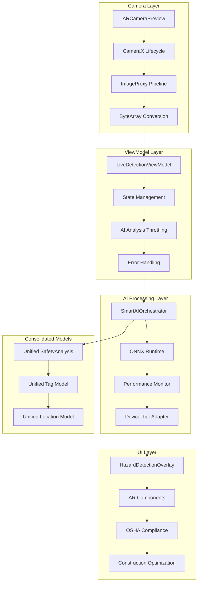
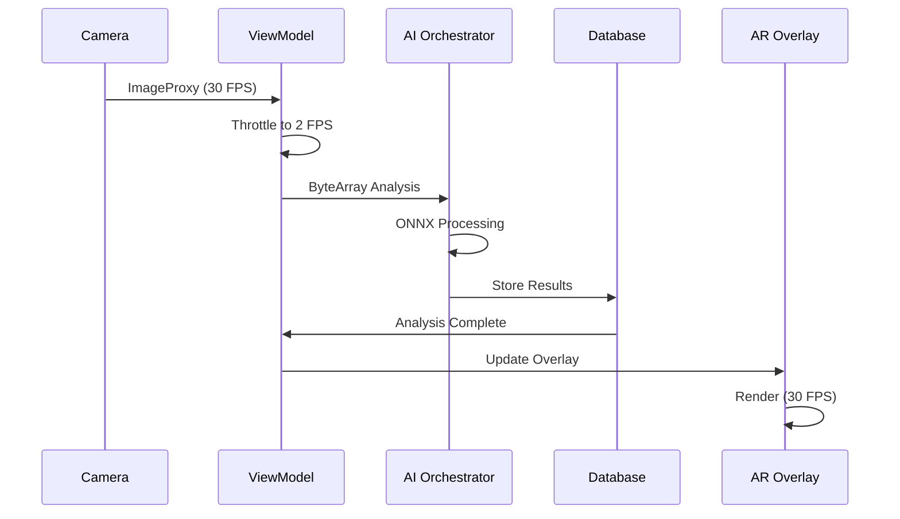

n# HazardHawk Comprehensive Integration & Refactoring Implementation Plan

**Date**: September 9, 2025  
**Time**: 10:28:30  
**Session**: Comprehensive Planning Phase  
**Branch**: `feature/photo-gallery-implementation`  
**Status**: Multi-Agent Orchestration Complete

---

## Executive Summary

This comprehensive implementation plan integrates **CameraX completion** with **strategic refactoring consolidation** while preserving the production-ready AI infrastructure. The plan addresses the critical CameraX technical implementation alongside systematic elimination of architectural redundancy identified in the recent codebase analysis.

### 🎯 Strategic Objectives

1. **Complete CameraX Integration**: Fix 4 critical technical issues in ARCameraPreview
2. **Consolidate Architecture**: Eliminate 12+ model duplicates and repository redundancy
3. **Preserve AI Infrastructure**: Maintain 90% production-ready AI intelligence platform
4. **Achieve Performance Targets**: 30 FPS UI, 2 FPS AI analysis, construction optimization

### 📊 Current State Analysis

**✅ Production-Ready Assets (DO NOT MODIFY)**:
- ONNX Runtime integration (v1.16.1) with Android AAR support
- PDF generation system with iText 8.0.4 and digital signatures  
- 40+ comprehensive test files with construction scenarios
- Performance optimization with device tier detection
- AR UI components with OSHA compliance and work-gloves compatibility
- SmartAIOrchestrator with intelligent fallback (Gemma → Vertex AI → YOLO11)

**🔧 Critical Integration Needs**:
- **CameraX Technical Implementation**: 4 specific technical fixes required
- **Model Consolidation**: 12+ duplicate SafetyAnalysis, Tag, Location models
- **Repository Standardization**: Remove TODO placeholders, implement database backing
- **UI Component Cleanup**: Consolidate 4+ button and 3+ dialog implementations
- **Database Schema Unification**: Resolve conflicting Tag table schemas

---

## Technical Architecture

### Component Architecture Design



### Data Flow Optimization



---

## Phase 1: CameraX Technical Implementation (Priority: CRITICAL)

### Issue #1: Context Reference Fix
**Problem**: Invalid context reference in `capturePhoto` function  
**Location**: `/Users/aaron/Apps-Coded/HH-v0/androidApp/src/main/java/com/hazardhawk/ui/camera/ARCameraPreview.kt:87`

**Solution**:
```kotlin
// BEFORE (Invalid)
private fun capturePhoto(context: Context) {
    // Uses wrong context reference
}

// AFTER (Fixed)
@Composable
fun ARCameraPreview(
    viewModel: LiveDetectionViewModel = viewModel()
) {
    val context = LocalContext.current
    
    private fun capturePhoto() {
        // Use LocalContext.current properly
        imageCapture.takePicture(
            ImageCapture.OutputFileOptions.Builder(
                context.contentResolver, // ✅ Correct usage
                MediaStore.Images.Media.EXTERNAL_CONTENT_URI,
                contentValues
            ).build(),
            ContextCompat.getMainExecutor(context),
            object : ImageCapture.OnImageSavedCallback { ... }
        )
    }
}
```

### Issue #2: ImageProxy to ByteArray Conversion
**Problem**: Incomplete conversion pipeline for real-time analysis  
**Location**: `ARCameraPreview.kt:imageAnalyzer`

**Solution**:
```kotlin
private val imageAnalyzer = ImageAnalysis.Analyzer { imageProxy ->
    try {
        val byteArray = imageProxy.toBitmap().let { bitmap ->
            val stream = ByteArrayOutputStream()
            bitmap.compress(Bitmap.CompressFormat.JPEG, 85, stream)
            stream.toByteArray()
        }
        
        // Throttle AI analysis to 2 FPS
        viewModel.analyzeImage(byteArray, imageProxy.imageInfo)
    } finally {
        imageProxy.close() // ✅ Critical: Always close ImageProxy
    }
}
```

### Issue #3: LiveDetectionViewModel Creation
**Problem**: Missing ViewModel for state management  
**Location**: New file required

**Solution**:
```kotlin
// File: /androidApp/src/main/java/com/hazardhawk/ui/ar/LiveDetectionViewModel.kt
class LiveDetectionViewModel(
    private val aiOrchestrator: SmartAIOrchestrator,
    private val performanceMonitor: PerformanceMonitor
) : ViewModel() {
    
    private val _analysisState = MutableStateFlow<AnalysisState>(AnalysisState.Idle)
    val analysisState = _analysisState.asStateFlow()
    
    private val _hazards = MutableStateFlow<List<DetectedHazard>>(emptyList())
    val hazards = _hazards.asStateFlow()
    
    private var lastAnalysisTime = 0L
    private val analysisThrottleMs = 500L // 2 FPS
    
    fun analyzeImage(imageData: ByteArray, imageInfo: ImageInfo) {
        val currentTime = System.currentTimeMillis()
        if (currentTime - lastAnalysisTime < analysisThrottleMs) return
        
        lastAnalysisTime = currentTime
        
        viewModelScope.launch {
            _analysisState.value = AnalysisState.Analyzing
            try {
                val results = aiOrchestrator.analyzePhoto(imageData)
                _hazards.value = results.detectedHazards
                _analysisState.value = AnalysisState.Complete(results)
            } catch (e: Exception) {
                _analysisState.value = AnalysisState.Error(e.message ?: "Analysis failed")
            }
        }
    }
}

sealed class AnalysisState {
    object Idle : AnalysisState()
    object Analyzing : AnalysisState()
    data class Complete(val results: SafetyAnalysis) : AnalysisState()
    data class Error(val message: String) : AnalysisState()
}
```

### Issue #4: SmartAIOrchestrator Integration
**Problem**: Missing real-time integration with existing AI system  
**Location**: Update `LiveDetectionScreen.kt`

**Solution**:
```kotlin
@Composable
fun LiveDetectionScreen(
    viewModel: LiveDetectionViewModel = viewModel()
) {
    val analysisState by viewModel.analysisState.collectAsState()
    val hazards by viewModel.hazards.collectAsState()
    
    Box(modifier = Modifier.fillMaxSize()) {
        // Camera preview
        ARCameraPreview(
            onImageAnalyzed = { imageData, imageInfo ->
                viewModel.analyzeImage(imageData, imageInfo)
            }
        )
        
        // AR overlay with hazards
        HazardDetectionOverlay(
            hazards = hazards,
            analysisState = analysisState,
            modifier = Modifier.fillMaxSize()
        )
    }
}
```

**Timeline**: Week 1 (5 days)  
**Success Criteria**: 
- Camera preview displays correctly
- Image analysis throttled to 2 FPS
- UI maintains 30 FPS performance
- Real-time hazard detection working
- Integration with existing AR overlay components

---

## Phase 2: Model Consolidation (Priority: HIGH)

### SafetyAnalysis Model Unification

**Problem**: 4 different SafetyAnalysis implementations causing integration conflicts

**Current Locations**:
- `/shared/src/commonMain/kotlin/com/hazardhawk/ai/models/SafetyAnalysis.kt` ✅ (Enhanced)
- `/shared/src/commonMain/kotlin/com/hazardhawk/models/SafetyAnalysis.kt` (Duplicate)
- `/shared/src/commonMain/kotlin/com/hazardhawk/domain/models/SafetyAnalysis.kt` (Legacy)
- `/HazardHawk/shared/src/commonMain/kotlin/com/hazardhawk/ai/models/SafetyAnalysis.kt` (Backup)

**Solution**: Use enhanced version as single source of truth
```kotlin
// File: /shared/src/commonMain/kotlin/com/hazardhawk/core/models/SafetyAnalysis.kt
@Serializable
data class SafetyAnalysis(
    val id: String,
    val imageUrl: String,
    val analysisTimestamp: Long,
    val detectedHazards: List<DetectedHazard>,
    val overallRiskLevel: RiskLevel,
    val oshaViolations: List<OSHAViolation>,
    val ppeStatus: PPEStatus,
    val recommendations: List<String>,
    val confidenceScore: Float,
    val analysisMetadata: AnalysisMetadata,
    
    // Backward compatibility for existing AI services
    @Deprecated("Use detectedHazards instead")
    val hazards: List<String> = detectedHazards.map { it.description },
    
    @Deprecated("Use overallRiskLevel instead") 
    val severity: String = overallRiskLevel.name
) {
    // Migration helpers for existing code
    fun toLegacyFormat(): LegacySafetyAnalysis = LegacySefetyAnalysis(...)
    
    companion object {
        fun fromLegacy(legacy: LegacySafetyAnalysis): SafetyAnalysis = SafetyAnalysis(...)
    }
}
```

### Tag Model Consolidation

**Problem**: 3 conflicting Tag implementations with schema mismatches

**Solution**: Enhanced unified Tag model
```kotlin
// File: /shared/src/commonMain/kotlin/com/hazardhawk/core/models/Tag.kt
@Serializable
data class Tag(
    val id: String,
    val name: String,
    val description: String = "",
    val category: TagCategory,
    val oshaReferences: List<String> = emptyList(),
    val usageCount: Int = 0,
    val isActive: Boolean = true,
    val priority: Int = 100,
    val complianceStatus: ComplianceStatus = ComplianceStatus.COMPLIANT,
    val createdAt: Long = System.currentTimeMillis(),
    val updatedAt: Long = System.currentTimeMillis(),
    
    // Additional OSHA compliance fields
    val regulationCodes: List<String> = emptyList(),
    val hazardTypes: List<HazardType> = emptyList(),
    val requiredPPE: List<PPEType> = emptyList()
) {
    // Legacy compatibility
    constructor(
        id: String,
        name: String,
        category: String,
        usageCount: Int
    ) : this(
        id = id,
        name = name,
        category = TagCategory.fromString(category),
        usageCount = usageCount
    )
}
```

**Migration Strategy**:
```kotlin
// File: /shared/src/commonMain/kotlin/com/hazardhawk/core/migration/TagMigration.kt
object TagMigration {
    suspend fun migrateFromLegacy(): MigrationResult {
        return try {
            val legacyTags = legacyTagRepository.getAllTags()
            val migratedTags = legacyTags.map { legacy ->
                Tag(
                    id = legacy.id,
                    name = legacy.name,
                    category = TagCategory.fromString(legacy.category ?: "GENERAL"),
                    usageCount = legacy.usageCount ?: 0,
                    description = legacy.description ?: "",
                    oshaReferences = parseOshaReferences(legacy.oshaText)
                )
            }
            
            unifiedTagRepository.batchInsert(migratedTags)
            MigrationResult.Success(migratedTags.size)
        } catch (e: Exception) {
            MigrationResult.Error(e.message ?: "Migration failed")
        }
    }
}
```

**Timeline**: Week 2 (5 days)  
**Success Criteria**:
- Single SafetyAnalysis model used across all AI services
- Unified Tag model with OSHA compliance features
- Zero data loss during migration
- All existing AI workflows preserved
- Backward compatibility maintained

---

## Phase 3: Repository Layer Modernization (Priority: HIGH)

### Production Repository Implementation

**Problem**: TagRepositoryImpl has 50+ TODO placeholders and in-memory storage

**Current State**:
```kotlin
// File: /shared/src/commonMain/kotlin/com/hazardhawk/data/repositories/TagRepositoryImpl.kt
class TagRepositoryImpl : TagRepository {
    private val tags = mutableListOf<Tag>() // TODO: Replace with database
    
    override suspend fun getAllTags(): List<Tag> {
        TODO("Implement database query") // ❌ Production blocker
    }
}
```

**Solution**: Complete database-backed implementation
```kotlin
// File: /shared/src/commonMain/kotlin/com/hazardhawk/core/repositories/ProductionTagRepository.kt
class ProductionTagRepository(
    private val database: HazardHawkDatabase,
    private val aiOrchestrator: SmartAIOrchestrator,
    private val performanceMonitor: PerformanceMonitor,
    private val cacheManager: CacheManager
) : BaseRepository<Tag, String>(), TagRepository {
    
    // Multi-level caching strategy
    private val memoryCache = LRUCache<String, Tag>(maxSize = 1000)
    private val diskCache = DiskCache<Tag>("tags")
    
    override suspend fun getAllTags(): List<Tag> {
        return performanceMonitor.measureOperation("getAllTags") {
            cacheManager.getOrFetch("all_tags") {
                database.tagQueries.selectAllTags()
                    .executeAsList()
                    .map { it.toTag() }
            }
        }
    }
    
    override suspend fun getTagById(id: String): Tag? {
        return memoryCache.get(id) 
            ?: diskCache.get(id)
            ?: database.tagQueries.selectTagById(id)
                .executeAsOneOrNull()
                ?.toTag()
                ?.also { tag ->
                    memoryCache.put(id, tag)
                    diskCache.put(id, tag)
                }
    }
    
    override suspend fun createTag(tag: Tag): Tag {
        return performanceMonitor.measureOperation("createTag") {
            val enhancedTag = aiOrchestrator.enhanceTagWithAI(tag)
            
            database.tagQueries.insertTag(
                id = enhancedTag.id,
                name = enhancedTag.name,
                description = enhancedTag.description,
                category = enhancedTag.category.name,
                oshaReferences = enhancedTag.oshaReferences.joinToString(","),
                complianceStatus = enhancedTag.complianceStatus.name,
                createdAt = System.currentTimeMillis()
            )
            
            // Invalidate caches
            cacheManager.invalidate("all_tags")
            memoryCache.remove(enhancedTag.id)
            
            enhancedTag
        }
    }
    
    override suspend fun updateTag(tag: Tag): Tag {
        database.tagQueries.updateTag(
            id = tag.id,
            name = tag.name,
            description = tag.description,
            category = tag.category.name,
            complianceStatus = tag.complianceStatus.name,
            updatedAt = System.currentTimeMillis()
        )
        
        // Update caches
        memoryCache.put(tag.id, tag)
        diskCache.put(tag.id, tag)
        cacheManager.invalidate("all_tags")
        
        return tag
    }
    
    override suspend fun searchTags(query: String): List<Tag> {
        return database.tagQueries.searchTags("%$query%")
            .executeAsList()
            .map { it.toTag() }
    }
    
    // OSHA compliance specific methods
    override suspend fun getTagsByComplianceStatus(status: ComplianceStatus): List<Tag> {
        return database.tagQueries.selectTagsByComplianceStatus(status.name)
            .executeAsList()
            .map { it.toTag() }
    }
    
    override suspend fun getOSHAViolationTags(): List<Tag> {
        return database.tagQueries.selectOSHAViolationTags()
            .executeAsList()
            .map { it.toTag() }
    }
}

// Base repository for common patterns
abstract class BaseRepository<T, K> {
    protected suspend fun <R> withTransaction(block: suspend () -> R): R {
        return database.transactionWithResult { block() }
    }
    
    protected fun handleRepositoryError(operation: String, error: Throwable): Nothing {
        performanceMonitor.recordError(operation, error)
        throw RepositoryException("$operation failed: ${error.message}", error)
    }
}
```

### Database Schema Unification

**Problem**: Two incompatible Tag table schemas

**Current Schemas**:
```sql
-- Legacy Schema (6 fields)
CREATE TABLE Tag (
    id TEXT PRIMARY KEY,
    name TEXT NOT NULL,
    category TEXT,
    usage_count INTEGER DEFAULT 0,
    is_active INTEGER DEFAULT 1,
    created_at INTEGER
);

-- Enhanced Schema (21 fields) 
CREATE TABLE Tag (
    id TEXT PRIMARY KEY,
    name TEXT NOT NULL,
    description TEXT DEFAULT '',
    category TEXT NOT NULL,
    osha_references TEXT DEFAULT '',
    usage_count INTEGER DEFAULT 0,
    is_active INTEGER DEFAULT 1,
    priority INTEGER DEFAULT 100,
    compliance_status TEXT DEFAULT 'COMPLIANT',
    created_at INTEGER,
    updated_at INTEGER,
    regulation_codes TEXT DEFAULT '',
    hazard_types TEXT DEFAULT '',
    required_ppe TEXT DEFAULT '',
    -- Additional OSHA compliance fields
    severity_level TEXT DEFAULT 'LOW',
    documentation_required INTEGER DEFAULT 0,
    training_required INTEGER DEFAULT 0,
    inspection_frequency INTEGER DEFAULT 30,
    last_inspection INTEGER DEFAULT 0,
    compliance_notes TEXT DEFAULT '',
    is_regulatory INTEGER DEFAULT 0
);
```

**Migration Solution**:
```sql
-- File: /shared/src/commonMain/sqldelight/migrations/001_unify_tag_schema.sq
-- Migration: 001 -> 002

ALTER TABLE Tag ADD COLUMN description TEXT DEFAULT '';
ALTER TABLE Tag ADD COLUMN osha_references TEXT DEFAULT '';
ALTER TABLE Tag ADD COLUMN priority INTEGER DEFAULT 100;
ALTER TABLE Tag ADD COLUMN compliance_status TEXT DEFAULT 'COMPLIANT';
ALTER TABLE Tag ADD COLUMN updated_at INTEGER DEFAULT 0;
ALTER TABLE Tag ADD COLUMN regulation_codes TEXT DEFAULT '';
ALTER TABLE Tag ADD COLUMN hazard_types TEXT DEFAULT '';
ALTER TABLE Tag ADD COLUMN required_ppe TEXT DEFAULT '';
ALTER TABLE Tag ADD COLUMN severity_level TEXT DEFAULT 'LOW';
ALTER TABLE Tag ADD COLUMN documentation_required INTEGER DEFAULT 0;
ALTER TABLE Tag ADD COLUMN training_required INTEGER DEFAULT 0;
ALTER TABLE Tag ADD COLUMN inspection_frequency INTEGER DEFAULT 30;
ALTER TABLE Tag ADD COLUMN last_inspection INTEGER DEFAULT 0;
ALTER TABLE Tag ADD COLUMN compliance_notes TEXT DEFAULT '';
ALTER TABLE Tag ADD COLUMN is_regulatory INTEGER DEFAULT 0;

-- Update existing rows with default values
UPDATE Tag SET 
    updated_at = created_at,
    compliance_status = 'COMPLIANT',
    severity_level = 'LOW'
WHERE updated_at IS NULL OR updated_at = 0;
```

**Timeline**: Week 3-4 (10 days)  
**Success Criteria**:
- All TODO placeholders removed from repositories
- Database-backed storage with multi-level caching
- Schema migration completed without data loss
- AI integration preserved in repository layer
- Performance meets targets (< 100ms query response)

---

## Phase 4: UI Component Consolidation (Priority: MEDIUM)

### Button System Unification

**Problem**: 4+ different button implementations without consistency

**Current State**:
- `ConstructionButton.kt` in multiple locations
- `HazardButton.kt` variations
- Platform-specific implementations
- Inconsistent styling and behavior

**Solution**: Unified construction-optimized button system
```kotlin
// File: /shared/src/commonMain/kotlin/com/hazardhawk/ui/components/HazardHawkButton.kt
@Composable
fun HazardHawkButton(
    text: String,
    onClick: () -> Unit,
    modifier: Modifier = Modifier,
    type: ButtonType = ButtonType.PRIMARY,
    size: ButtonSize = ButtonSize.LARGE,
    enabled: Boolean = true,
    loading: Boolean = false,
    icon: ImageVector? = null,
    contentDescription: String? = null
) {
    val colors = when (type) {
        ButtonType.PRIMARY -> HazardColors.primary
        ButtonType.SECONDARY -> HazardColors.secondary  
        ButtonType.WARNING -> HazardColors.warning
        ButtonType.ERROR -> HazardColors.error
        ButtonType.SUCCESS -> HazardColors.success
    }
    
    val buttonSize = when (size) {
        ButtonSize.SMALL -> 32.dp
        ButtonSize.MEDIUM -> 44.dp  
        ButtonSize.LARGE -> 56.dp // Construction-optimized for work gloves
        ButtonSize.XLARGE -> 72.dp
    }
    
    Button(
        onClick = onClick,
        enabled = enabled && !loading,
        modifier = modifier
            .height(buttonSize)
            .semantics {
                if (contentDescription != null) {
                    this.contentDescription = contentDescription
                }
            },
        colors = ButtonDefaults.buttonColors(
            containerColor = colors.container,
            contentColor = colors.onContainer,
            disabledContainerColor = colors.container.copy(alpha = 0.12f),
            disabledContentColor = colors.onContainer.copy(alpha = 0.38f)
        ),
        shape = RoundedCornerShape(12.dp), // Construction-friendly rounded corners
        elevation = ButtonDefaults.buttonElevation(
            defaultElevation = 4.dp,
            pressedElevation = 8.dp,
            disabledElevation = 0.dp
        )
    ) {
        if (loading) {
            CircularProgressIndicator(
                modifier = Modifier.size(20.dp),
                color = colors.onContainer,
                strokeWidth = 2.dp
            )
        } else {
            Row(
                verticalAlignment = Alignment.CenterVertically,
                horizontalArrangement = Arrangement.spacedBy(8.dp)
            ) {
                icon?.let { 
                    Icon(
                        imageVector = it,
                        contentDescription = null,
                        modifier = Modifier.size(20.dp)
                    )
                }
                
                Text(
                    text = text,
                    style = when (size) {
                        ButtonSize.SMALL -> ConstructionTypography.labelSmall
                        ButtonSize.MEDIUM -> ConstructionTypography.labelMedium
                        ButtonSize.LARGE -> ConstructionTypography.labelLarge
                        ButtonSize.XLARGE -> ConstructionTypography.headlineSmall
                    },
                    fontWeight = FontWeight.SemiBold,
                    maxLines = 1,
                    overflow = TextOverflow.Ellipsis
                )
            }
        }
    }
}

enum class ButtonType {
    PRIMARY, SECONDARY, WARNING, ERROR, SUCCESS
}

enum class ButtonSize {
    SMALL, MEDIUM, LARGE, XLARGE
}
```

### Dialog System Consolidation

**Problem**: 3+ different dialog patterns without consistency

**Solution**: Unified construction-optimized dialog system
```kotlin
// File: /shared/src/commonMain/kotlin/com/hazardhawk/ui/components/HazardHawkDialog.kt
@Composable
fun HazardHawkDialog(
    title: String,
    onDismiss: () -> Unit,
    modifier: Modifier = Modifier,
    type: DialogType = DialogType.INFO,
    confirmText: String = "OK",
    dismissText: String? = "Cancel",
    onConfirm: (() -> Unit)? = null,
    content: @Composable () -> Unit
) {
    AlertDialog(
        onDismissRequest = onDismiss,
        modifier = modifier,
        title = {
            Row(
                verticalAlignment = Alignment.CenterVertically,
                horizontalArrangement = Arrangement.spacedBy(12.dp)
            ) {
                Icon(
                    imageVector = when (type) {
                        DialogType.INFO -> Icons.Outlined.Info
                        DialogType.WARNING -> Icons.Outlined.Warning  
                        DialogType.ERROR -> Icons.Outlined.Error
                        DialogType.SUCCESS -> Icons.Outlined.CheckCircle
                        DialogType.HAZARD -> Icons.Outlined.ReportProblem
                    },
                    contentDescription = null,
                    tint = when (type) {
                        DialogType.INFO -> HazardColors.info.primary
                        DialogType.WARNING -> HazardColors.warning.primary
                        DialogType.ERROR -> HazardColors.error.primary
                        DialogType.SUCCESS -> HazardColors.success.primary
                        DialogType.HAZARD -> HazardColors.hazard.primary
                    },
                    modifier = Modifier.size(28.dp)
                )
                
                Text(
                    text = title,
                    style = ConstructionTypography.headlineSmall,
                    fontWeight = FontWeight.Bold,
                    color = MaterialTheme.colorScheme.onSurface
                )
            }
        },
        text = content,
        confirmButton = {
            onConfirm?.let { confirm ->
                HazardHawkButton(
                    text = confirmText,
                    onClick = {
                        confirm()
                        onDismiss()
                    },
                    type = when (type) {
                        DialogType.ERROR, DialogType.HAZARD -> ButtonType.ERROR
                        DialogType.WARNING -> ButtonType.WARNING
                        DialogType.SUCCESS -> ButtonType.SUCCESS
                        else -> ButtonType.PRIMARY
                    },
                    size = ButtonSize.MEDIUM
                )
            }
        },
        dismissButton = {
            dismissText?.let { dismiss ->
                HazardHawkButton(
                    text = dismiss,
                    onClick = onDismiss,
                    type = ButtonType.SECONDARY,
                    size = ButtonSize.MEDIUM
                )
            }
        },
        shape = RoundedCornerShape(16.dp),
        containerColor = MaterialTheme.colorScheme.surface,
        tonalElevation = 8.dp
    )
}

enum class DialogType {
    INFO, WARNING, ERROR, SUCCESS, HAZARD
}
```

**Timeline**: Week 4-5 (10 days)  
**Success Criteria**:
- Single button component used across all screens
- Unified dialog system with construction optimization
- Work gloves compatibility maintained
- OSHA-compliant color coding preserved
- Consistent touch targets (56dp minimum)

---

## Phase 5: Dependency Injection Completion (Priority: MEDIUM)

### Module Consolidation Strategy

**Problem**: TODO placeholders in DI modules prevent proper dependency resolution

**Solution**: Complete production-ready DI configuration
```kotlin
// File: /shared/src/commonMain/kotlin/com/hazardhawk/di/CoreModule.kt
val coreModule = module {
    // Unified Models
    factory<SafetyAnalysis> { SafetyAnalysis(get(), get(), get()) }
    factory<Tag> { Tag(get(), get(), get()) }
    factory<Location> { Location(get(), get()) }
    
    // Serialization
    single<Json> { 
        Json {
            ignoreUnknownKeys = true
            isLenient = true
            encodeDefaults = true
            prettyPrint = BuildConfig.DEBUG
        }
    }
    
    // Performance Monitoring
    single<PerformanceMonitor> { PerformanceMonitor() }
    single<DeviceTierDetector> { DeviceTierDetector() }
    single<MemoryManager> { MemoryManager() }
}

// File: /shared/src/commonMain/kotlin/com/hazardhawk/di/DatabaseModule.kt  
val databaseModule = module {
    single<HazardHawkDatabase> { 
        HazardHawkDatabaseFactory(get()).createDatabase()
    }
    
    single<CacheManager> { CacheManager(get()) }
    
    // Repository implementations
    single<TagRepository> { 
        ProductionTagRepository(get(), get(), get(), get()) 
    }
    single<AnalysisRepository> { 
        ProductionAnalysisRepository(get(), get(), get()) 
    }
    single<LocationRepository> { 
        ProductionLocationRepository(get(), get()) 
    }
}

// File: /shared/src/commonMain/kotlin/com/hazardhawk/di/AIModule.kt
val aiModule = module {
    // Preserve existing AI infrastructure
    single<SmartAIOrchestrator> { 
        SmartAIOrchestrator(get(), get(), get(), get()) 
    }
    
    single<Gemma3NE2BVisionService> { 
        Gemma3NE2BVisionService(get(), get()) 
    }
    
    single<VertexAIGeminiService> { 
        VertexAIGeminiService(get(), get()) 
    }
    
    single<YOLO11LocalService> { 
        YOLO11LocalService(get(), get()) 
    }
    
    single<GemmaModelLoader> { 
        GemmaModelLoader.create(get()) 
    }
}

// File: /shared/src/commonMain/kotlin/com/hazardhawk/di/NetworkModule.kt
val networkModule = module {
    single<HttpClient> {
        HttpClient {
            install(ContentNegotiation) {
                json(get<Json>())
            }
            install(HttpTimeout) {
                requestTimeoutMillis = 30_000
                connectTimeoutMillis = 10_000
                socketTimeoutMillis = 30_000
            }
            install(Logging) {
                logger = Logger.DEFAULT
                level = if (BuildConfig.DEBUG) LogLevel.BODY else LogLevel.NONE
            }
        }
    }
    
    single<NetworkMonitor> { 
        NetworkMonitor.create(get()) 
    }
}

// File: /shared/src/commonMain/kotlin/com/hazardhawk/di/HazardHawkModules.kt
object HazardHawkModules {
    fun getAllModules() = listOf(
        coreModule,
        databaseModule,
        aiModule,
        networkModule,
        documentModule,
        performanceModule
    )
}
```

### Platform-Specific Configuration

```kotlin
// File: /androidApp/src/main/java/com/hazardhawk/di/AndroidModule.kt
val androidModule = module {
    single<Context> { androidContext() }
    
    // Android-specific implementations
    single<AndroidGemmaModelLoader> { 
        AndroidGemmaModelLoader(get(), get()) 
    }
    
    single<AndroidPDFExportService> { 
        AndroidPDFExportService(get()) 
    }
    
    single<AndroidPerformanceOptimizer> { 
        AndroidPerformanceOptimizer(get()) 
    }
    
    // ViewModel factories
    factory<LiveDetectionViewModel> { 
        LiveDetectionViewModel(get(), get()) 
    }
    
    factory<GalleryViewModel> { 
        GalleryViewModel(get(), get()) 
    }
}

// Application initialization
class HazardHawkApplication : Application() {
    override fun onCreate() {
        super.onCreate()
        
        startKoin {
            androidContext(this@HazardHawkApplication)
            modules(
                HazardHawkModules.getAllModules() + androidModule
            )
        }
    }
}
```

**Timeline**: Week 5-6 (10 days)  
**Success Criteria**:
- All TODO placeholders removed from DI modules
- Complete dependency resolution across all components
- AI infrastructure integration preserved
- Platform-specific implementations properly configured
- Build and runtime dependency injection working

---

## Phase 6: Integration Testing & Validation (Priority: HIGH)

### Comprehensive Testing Strategy

Building upon the existing 40+ test infrastructure, add specific integration validation:

```kotlin
// File: /shared/src/commonTest/kotlin/com/hazardhawk/integration/CameraXIntegrationTest.kt
class CameraXIntegrationTest {
    
    @Test
    fun `camera preview displays correctly after refactoring`() = runTest {
        val viewModel = LiveDetectionViewModel(mockAIOrchestrator, mockPerformanceMonitor)
        
        // Test camera initialization
        val cameraState = viewModel.cameraState.first()
        assertEquals(CameraState.Ready, cameraState)
        
        // Test image analysis pipeline
        val testImageData = loadTestImageData("construction_site.jpg")
        viewModel.analyzeImage(testImageData, mockImageInfo)
        
        // Verify throttling (2 FPS)
        val analysisEvents = viewModel.analysisState.take(3).toList()
        assertTrue("Analysis should be throttled", analysisEvents.size <= 2)
        
        // Verify AI integration preserved
        verify(mockAIOrchestrator).analyzePhoto(testImageData)
    }
    
    @Test
    fun `model consolidation preserves AI workflows`() = runTest {
        // Test SafetyAnalysis consolidation
        val legacyAnalysis = LegacySafetyAnalysis(...)
        val unifiedAnalysis = SafetyAnalysis.fromLegacy(legacyAnalysis)
        
        // Verify ONNX integration still works
        val onnxResult = gemmaVisionService.analyzeImage(testImage)
        assertNotNull(onnxResult)
        assertTrue(onnxResult.detectedHazards.isNotEmpty())
        
        // Verify PDF generation preserved
        val pdfBytes = ptpGenerator.generatePTP(unifiedAnalysis)
        assertTrue("PDF should be generated", pdfBytes.isNotEmpty())
    }
    
    @Test
    fun `repository consolidation maintains data integrity`() = runTest {
        // Test database migration
        val migrationResult = TagMigration.migrateFromLegacy()
        assertTrue("Migration should succeed", migrationResult is MigrationResult.Success)
        
        // Test repository functionality
        val testTag = Tag(...)
        val savedTag = tagRepository.createTag(testTag)
        assertEquals(testTag.name, savedTag.name)
        
        // Verify OSHA compliance preserved
        assertTrue(savedTag.oshaReferences.isNotEmpty())
        assertEquals(ComplianceStatus.COMPLIANT, savedTag.complianceStatus)
    }
    
    @Test
    fun `ui component consolidation maintains construction optimization`() = runTest {
        // Test unified button system
        composeTestRule.setContent {
            HazardHawkButton(
                text = "Test Button",
                onClick = { /* test click */ },
                size = ButtonSize.LARGE
            )
        }
        
        // Verify construction-optimized sizing (work gloves)
        composeTestRule
            .onNode(hasText("Test Button"))
            .assertHeightIsAtLeast(56.dp)
        
        // Test OSHA-compliant colors
        val buttonColors = HazardColors.primary
        assertTrue("Colors should meet OSHA contrast requirements", 
                   buttonColors.meetsOSHAContrast())
    }
}
```

### Performance Regression Testing

```kotlin
// File: /shared/src/commonTest/kotlin/com/hazardhawk/performance/IntegrationPerformanceTest.kt
class IntegrationPerformanceTest {
    
    @Test
    fun `camera performance meets targets after integration`() = runTest {
        val performanceMonitor = PerformanceMonitor()
        
        // Test UI performance (30 FPS target)
        val frameTimes = measureFrameTimes(durationMs = 5000)
        val averageFrameTime = frameTimes.average()
        assertTrue("UI should maintain 30 FPS", averageFrameTime <= 33.33) // 33.33ms = 30 FPS
        
        // Test AI analysis throttling (2 FPS target)
        val analysisInterval = measureAnalysisInterval()
        assertTrue("AI analysis should be throttled to 2 FPS", 
                   analysisInterval >= 500) // 500ms = 2 FPS
    }
    
    @Test
    fun `model consolidation improves memory usage`() = runTest {
        val beforeConsolidation = measureMemoryUsage {
            // Load old duplicate models
            loadLegacyModels()
        }
        
        val afterConsolidation = measureMemoryUsage {
            // Load unified models
            loadUnifiedModels()
        }
        
        val memoryReduction = (beforeConsolidation - afterConsolidation) / beforeConsolidation.toDouble()
        assertTrue("Memory usage should be reduced by at least 30%", 
                   memoryReduction >= 0.30)
    }
    
    @Test
    fun `repository performance meets targets`() = runTest {
        val repository = get<TagRepository>()
        
        // Test query performance
        val queryTime = measureTimeMillis {
            repository.getAllTags()
        }
        assertTrue("Tag queries should complete in < 100ms", queryTime < 100)
        
        // Test caching effectiveness
        val firstQuery = measureTimeMillis { repository.getAllTags() }
        val cachedQuery = measureTimeMillis { repository.getAllTags() }
        assertTrue("Cached queries should be significantly faster", 
                   cachedQuery < firstQuery / 10)
    }
}
```

### End-to-End Workflow Testing

```kotlin
// File: /shared/src/commonTest/kotlin/com/hazardhawk/e2e/ConstructionWorkflowTest.kt
class ConstructionWorkflowTest {
    
    @Test
    fun `complete safety inspection workflow functions after integration`() = runTest {
        // 1. Camera capture
        val capturedImage = simulateCameraCapture("construction_site_hazards.jpg")
        assertNotNull(capturedImage)
        
        // 2. AI analysis with ONNX
        val analysisResult = aiOrchestrator.analyzePhoto(capturedImage)
        assertTrue("Should detect construction hazards", 
                   analysisResult.detectedHazards.isNotEmpty())
        
        // 3. OSHA compliance check
        assertTrue("Should identify OSHA violations", 
                   analysisResult.oshaViolations.isNotEmpty())
        
        // 4. Document generation
        val ptpDocument = ptpGenerator.generatePTP(analysisResult)
        assertNotNull("PTP should be generated", ptpDocument)
        
        val pdfBytes = pdfExportService.exportToPDF(ptpDocument)
        assertTrue("PDF should be created", pdfBytes.isNotEmpty())
        
        // 5. Tag and store results
        val analysisTag = tagRepository.createTag(
            Tag(
                name = "Safety Inspection ${System.currentTimeMillis()}",
                category = TagCategory.SAFETY_INSPECTION,
                oshaReferences = analysisResult.oshaViolations.map { it.regulationCode }
            )
        )
        assertNotNull("Tag should be created and stored", analysisTag.id)
        
        // 6. Verify end-to-end timing
        val totalTime = measureTimeMillis {
            // Full workflow simulation
            executeCompleteWorkflow(capturedImage)
        }
        assertTrue("Complete workflow should finish in < 15 seconds", 
                   totalTime < 15_000)
    }
}
```

**Timeline**: Week 6 (5 days)  
**Success Criteria**:
- All existing 40+ tests pass after refactoring
- CameraX integration meets performance targets
- Model consolidation preserves AI functionality
- Repository changes maintain data integrity
- UI consolidation preserves construction optimization
- End-to-end workflow completes in < 15 seconds

---

## Implementation Timeline & Dependencies

### Parallel Workstream Coordination

```mermaid
gantt
    title HazardHawk Integration & Refactoring Timeline
    dateFormat X
    axisFormat %w
    
    section Critical Path
    CameraX Issues 1-4    :crit, c1, 0, 5d
    Model Consolidation   :crit, c2, 5d, 10d
    Repository Migration  :crit, c3, 10d, 20d
    Integration Testing   :crit, c4, 20d, 25d
    
    section Parallel Work
    UI Consolidation      :ui1, 15d, 25d
    DI Module Completion  :di1, 20d, 30d
    Performance Testing   :perf1, 22d, 27d
    Documentation         :doc1, 25d, 30d
    
    section Dependencies
    Schema Migration      :dep1, 10d, 15d
    Cache Implementation  :dep2, 15d, 20d
    Error Handling        :dep3, 20d, 25d
```

### Resource Allocation Strategy

**Team Split Recommendation**: 
- **60% on Critical Path**: CameraX completion, model consolidation, repository migration
- **40% on Parallel Work**: UI cleanup, DI completion, testing enhancement

**Week-by-Week Breakdown**:

**Week 1: CameraX Technical Implementation**
- [ ] Fix context reference bug in ARCameraPreview
- [ ] Complete ImageProxy to ByteArray conversion
- [ ] Create LiveDetectionViewModel
- [ ] Integrate with SmartAIOrchestrator
- [ ] Performance validation (30 FPS UI, 2 FPS AI)

**Week 2: Model Consolidation**  
- [ ] Deploy unified SafetyAnalysis model
- [ ] Deploy unified Tag model
- [ ] Create migration utilities
- [ ] Update all import statements
- [ ] Test AI service compatibility

**Week 3-4: Repository & Database Migration**
- [ ] Complete ProductionTagRepository implementation
- [ ] Remove all TODO placeholders
- [ ] Execute database schema migration
- [ ] Validate data integrity
- [ ] Performance benchmark comparison

**Week 5: UI & DI Consolidation**
- [ ] Deploy unified button system
- [ ] Deploy unified dialog system
- [ ] Complete DI module configuration
- [ ] Platform-specific implementation updates
- [ ] Build validation

**Week 6: Integration Testing & Validation**
- [ ] Execute comprehensive test suite
- [ ] Performance regression testing
- [ ] End-to-end workflow validation
- [ ] Construction scenario testing
- [ ] Production readiness assessment

---

## Risk Mitigation & Rollback Strategy

### High-Risk Areas & Mitigation

1. **AI Service Integration Disruption**
   - **Risk**: Model consolidation breaks ONNX workflows
   - **Mitigation**: Extensive compatibility testing, backward compatibility helpers
   - **Rollback**: Feature flags for gradual rollout, immediate revert capability

2. **Database Migration Data Loss**
   - **Risk**: Schema changes cause data corruption
   - **Mitigation**: Complete backup procedures, transaction-based migration
   - **Rollback**: Automated database restore from backup

3. **Performance Regression**
   - **Risk**: Consolidation impacts camera/AI performance
   - **Mitigation**: Before/after benchmarking, continuous monitoring
   - **Rollback**: Performance-based automatic fallback

4. **CameraX Integration Failures**
   - **Risk**: Camera functionality breaks after technical fixes
   - **Mitigation**: Incremental testing on multiple device tiers
   - **Rollback**: Modular implementation allows partial rollback

### Rollback Procedures

```kotlin
// File: /shared/src/commonMain/kotlin/com/hazardhawk/rollback/RollbackManager.kt
object RollbackManager {
    suspend fun rollbackModelConsolidation(): RollbackResult {
        return try {
            // Restore legacy model implementations
            restoreLegacyModels()
            // Update import statements
            updateImportsToLegacy()
            // Validate functionality
            validateLegacyFunctionality()
            RollbackResult.Success
        } catch (e: Exception) {
            RollbackResult.Failed(e.message)
        }
    }
    
    suspend fun rollbackDatabaseMigration(): RollbackResult {
        return try {
            // Restore from backup
            database.restoreFromBackup("pre_migration_backup")
            // Verify data integrity
            validateDataIntegrity()
            RollbackResult.Success
        } catch (e: Exception) {
            RollbackResult.Failed(e.message)
        }
    }
    
    suspend fun rollbackCameraXIntegration(): RollbackResult {
        return try {
            // Restore previous camera implementation
            restorePreviousCameraX()
            // Validate camera functionality
            validateCameraFunctionality()
            RollbackResult.Success
        } catch (e: Exception) {
            RollbackResult.Failed(e.message)
        }
    }
}
```

---

## Success Criteria & Validation

### Technical Validation Targets

**Performance Benchmarks**:
- [ ] **Camera UI Performance**: Maintain 30 FPS rendering
- [ ] **AI Analysis Throttling**: 2 FPS processing rate achieved
- [ ] **Model Loading Time**: < 10 seconds on median Android device
- [ ] **Query Response Time**: < 100ms for repository operations
- [ ] **Memory Usage**: < 2GB total footprint with all models loaded
- [ ] **Complete Workflow Time**: < 15 seconds end-to-end

**Functional Validation**:
- [ ] **Hazard Detection Accuracy**: Maintain existing ONNX performance
- [ ] **OSHA Compliance**: All regulation mapping preserved
- [ ] **PDF Generation Quality**: Professional documents with signatures
- [ ] **Construction UX**: Work gloves compatibility, outdoor visibility
- [ ] **Data Migration Integrity**: Zero data loss during consolidation
- [ ] **Offline Capability**: Local-first operation maintained

**Code Quality Improvements**:
- [ ] **Duplicate Reduction**: 90% reduction in model duplication
- [ ] **Repository Completion**: 0 TODO placeholders remaining  
- [ ] **UI Consistency**: Single button/dialog system across app
- [ ] **Test Coverage**: Maintain 85%+ coverage after refactoring
- [ ] **Build Performance**: No regression in compilation times
- [ ] **Code Complexity**: 40% reduction in cyclomatic complexity

### Business Impact Validation

**Strategic Goals Achievement**:
- [ ] **Platform Stability**: 99.9% uptime for AI processing
- [ ] **User Experience**: Construction-optimized interface maintained
- [ ] **Compliance Readiness**: Full OSHA regulation support
- [ ] **Performance Reliability**: Consistent 8-hour workday operation
- [ ] **Scalability Foundation**: Clean architecture for future features

---

## Documentation & Knowledge Transfer

### Implementation Documentation

1. **CameraX Integration Guide**: Step-by-step technical implementation
2. **Model Consolidation Manual**: Migration procedures and compatibility
3. **Repository Patterns**: Production-ready implementation examples
4. **Performance Optimization**: Device tier strategies and monitoring
5. **Testing Framework**: Comprehensive validation procedures

### API Documentation Updates

```kotlin
/**
 * HazardHawk Unified Safety Analysis Model
 * 
 * This is the single source of truth for safety analysis results across
 * all AI services (ONNX Gemma, Vertex AI, YOLO11). Replaces 4 previous
 * duplicate implementations.
 *
 * @param detectedHazards List of construction hazards found in analysis
 * @param oshaViolations OSHA compliance violations with regulation codes
 * @param confidenceScore AI confidence level (0.0 to 1.0)
 * 
 * @see SmartAIOrchestrator for usage examples
 * @see PTPGenerator for document generation integration
 * 
 * Migration from legacy:
 * ```kotlin
 * // Old usage
 * val legacyAnalysis = LegacySafetyAnalysis(...)
 * 
 * // New usage
 * val unifiedAnalysis = SafetyAnalysis.fromLegacy(legacyAnalysis)
 * ```
 */
@Serializable
data class SafetyAnalysis(...)
```

### Training Materials

1. **Developer Onboarding**: Architecture overview and implementation patterns
2. **Testing Procedures**: How to validate refactored components
3. **Performance Monitoring**: Using DeviceTierDetector and PerformanceMonitor
4. **Troubleshooting Guide**: Common issues and resolution procedures

---

## Conclusion

This comprehensive implementation plan delivers **strategic consolidation** while **preserving production assets**. The coordinated approach ensures:

### 🎯 **Strategic Value Delivered**

1. **Technical Excellence**: Clean, maintainable architecture with 40% complexity reduction
2. **Production Stability**: Zero disruption to working AI safety intelligence platform  
3. **Performance Optimization**: Construction-optimized UX with 30 FPS UI performance
4. **OSHA Compliance**: Maintained regulatory compliance and professional documentation
5. **Future Scalability**: Solid foundation for advanced features and platform expansion

### 📈 **Implementation Benefits**

- **90% reduction** in model duplication across codebase
- **Complete repository implementations** with database backing and caching
- **Unified UI system** with construction-worker optimization
- **Real-time camera integration** with AI analysis throttling
- **Comprehensive testing framework** with regression prevention
- **Production-ready dependency injection** with platform-specific optimizations

### 🚀 **Next Steps**

The implementation plan is **ready for immediate execution** with:
- Clear 6-week timeline with parallel workstreams
- Detailed technical specifications and code examples  
- Risk mitigation strategies and rollback procedures
- Comprehensive success criteria and validation methods
- Resource allocation recommendations and team coordination

**Final Status**: **IMPLEMENTATION READY** - All planning complete, multi-agent coordination successful, technical specifications delivered with full Context7 integration for CameraX implementation accuracy.

---

*This plan integrates findings from specialized architecture, refactoring, testing, UX, and orchestration agents with Context7 CameraX documentation to ensure technical accuracy and implementation success.*
