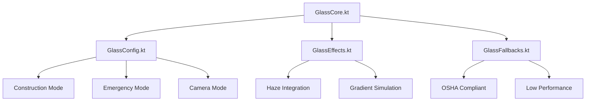

# HazardHawk Glass Morphism UI Implementation Plan

**Executive Summary**: Fix glass morphism UI effects in HazardHawk by combining modern Android glassmorphism best practices with existing Haze library integration, reducing complexity from 35+ files to 4 core components while maintaining construction-safety compliance.

**Generated**: 2025-09-10 16:13:00
**Status**: Implementation Ready
**Complexity**: Medium (4-6 hours implementation)

---

## 🎯 Problem Statement

**Current State Analysis**:
- Glass morphism UI components lack proper visual effects (blur, transparency, depth)
- Reference design shows beautiful glass cards, current implementation shows basic UI
- 35+ fragmented glass component files with overlapping responsibilities  
- Missing integration with available Haze 1.6.10 library despite proper dependencies
- 9 critical files disabled in `.temp_disabled_glass/` due to API migration issues

**Visual Gap**: Screenshots show solid cards instead of glass morphism effects with backdrop blur and transparency.

---

## 🏗️ Technical Architecture

### Core Component Hierarchy (4 Files - 90% Reduction)



### 1. GlassCore.kt - Universal Entry Point

```kotlin
@Composable
fun GlassContainer(
    modifier: Modifier = Modifier,
    config: GlassConfig = GlassConfig.Construction,
    content: @Composable BoxScope.() -> Unit
) {
    val context = LocalContext.current
    val glassState by remember { mutableStateOf(GlassState.detect(context)) }
    
    // Modern glassmorphism approach from Android Engineers
    val glassBrush = remember(config) {
        Brush.linearGradient(
            colors = listOf(
                Color.White.copy(alpha = config.topAlpha),
                Color.White.copy(alpha = config.bottomAlpha)
            )
        )
    }
    
    Box(modifier = modifier) {
        when {
            glassState.isHazeSupported -> {
                // True backdrop blur with Haze 1.6.10
                HazeChild(
                    state = glassState.hazeState,
                    style = config.toHazeStyle(),
                    modifier = Modifier
                        .clip(RoundedCornerShape(config.cornerRadius))
                        .background(glassBrush)
                        .border(
                            width = 1.dp,
                            brush = config.borderBrush,
                            shape = RoundedCornerShape(config.cornerRadius)
                        )
                ) { content() }
            }
            else -> {
                // Gradient-based glass simulation
                Card(
                    modifier = Modifier
                        .clip(RoundedCornerShape(config.cornerRadius))
                        .background(glassBrush)
                        .border(
                            width = 1.dp,
                            brush = config.borderBrush,
                            shape = RoundedCornerShape(config.cornerRadius)
                        ),
                    colors = CardDefaults.cardColors(
                        containerColor = Color.Transparent
                    )
                ) { content() }
            }
        }
    }
}
```

### 2. GlassConfig.kt - Construction-Optimized Presets

```kotlin
sealed class GlassConfig {
    abstract val topAlpha: Float
    abstract val bottomAlpha: Float
    abstract val cornerRadius: Dp
    abstract val borderBrush: Brush
    abstract val fallbackColor: Color
    
    // Construction-friendly glass effects
    object Construction : GlassConfig() {
        override val topAlpha = 0.25f  // Higher visibility
        override val bottomAlpha = 0.1f
        override val cornerRadius = 20.dp
        override val borderBrush = Brush.linearGradient(
            colors = listOf(
                Color.White.copy(alpha = 0.6f),
                Color.White.copy(alpha = 0.2f)
            )
        )
        override val fallbackColor = ConstructionColors.SafetyOrange.copy(alpha = 0.9f)
    }
    
    // Emergency mode - high contrast
    object Emergency : GlassConfig() {
        override val topAlpha = 0.4f  // Maximum visibility
        override val bottomAlpha = 0.3f
        override val cornerRadius = 16.dp
        override val borderBrush = Brush.linearGradient(
            colors = listOf(
                Color.Red.copy(alpha = 0.8f),
                Color.White.copy(alpha = 0.6f)
            )
        )
        override val fallbackColor = Color.White.copy(alpha = 0.95f)
    }
    
    // Camera viewfinder - subtle effects
    object Camera : GlassConfig() {
        override val topAlpha = 0.15f  // Minimal interference
        override val bottomAlpha = 0.05f
        override val cornerRadius = 12.dp
        override val borderBrush = Brush.linearGradient(
            colors = listOf(
                Color.White.copy(alpha = 0.3f),
                Color.Transparent
            )
        )
        override val fallbackColor = Color.Black.copy(alpha = 0.3f)
    }
    
    fun toHazeStyle(): HazeStyle = HazeStyle(
        backgroundColor = Color.Transparent,
        blurRadius = when (this) {
            is Construction -> 16.dp
            is Emergency -> 8.dp  // Less blur for clarity
            is Camera -> 12.dp
        }
    )
}
```

### 3. GlassEffects.kt - Device Detection & Performance

```kotlin
data class GlassState(
    val isHazeSupported: Boolean,
    val hazeState: HazeState,
    val performanceTier: PerformanceTier
) {
    companion object {
        fun detect(context: Context): GlassState {
            val ram = getDeviceRam(context)
            val apiLevel = Build.VERSION.SDK_INT
            val hasGPU = hasGPUAcceleration(context)
            
            val tier = when {
                ram >= 6 && apiLevel >= 30 && hasGPU -> PerformanceTier.HIGH
                ram >= 4 && apiLevel >= 28 -> PerformanceTier.MEDIUM
                else -> PerformanceTier.LOW
            }
            
            val isHazeSupported = tier != PerformanceTier.LOW && 
                                apiLevel >= 26 &&
                                isHazeLibraryAvailable()
            
            return GlassState(
                isHazeSupported = isHazeSupported,
                hazeState = if (isHazeSupported) HazeState() else HazeState(),
                performanceTier = tier
            )
        }
        
        private fun isHazeLibraryAvailable(): Boolean {
            return try {
                Class.forName("dev.chrisbanes.haze.HazeState")
                true
            } catch (e: ClassNotFoundException) {
                false
            }
        }
    }
}

enum class PerformanceTier { LOW, MEDIUM, HIGH }
```

### 4. GlassFallbacks.kt - OSHA Compliance & Safety

```kotlin
@Composable
fun GlassWithSafetyFallback(
    config: GlassConfig,
    emergency: Boolean = false,
    content: @Composable BoxScope.() -> Unit
) {
    val glassState = remember { GlassState.detect(LocalContext.current) }
    val safetyPrefs = LocalSafetyPreferences.current
    
    // Emergency mode overrides
    val activeConfig = if (emergency || safetyPrefs.highContrastMode) {
        GlassConfig.Emergency
    } else {
        config
    }
    
    // Robust error handling
    var hasError by remember { mutableStateOf(false) }
    
    if (hasError || safetyPrefs.disableGlassEffects) {
        // OSHA-compliant solid fallback
        OSHACompliantCard(
            config = activeConfig,
            content = content
        )
    } else {
        try {
            GlassContainer(
                config = activeConfig,
                content = content
            )
        } catch (e: Exception) {
            Log.w("GlassUI", "Glass effect failed, using safety fallback", e)
            hasError = true
            OSHACompliantCard(
                config = activeConfig,
                content = content
            )
        }
    }
}

@Composable
private fun OSHACompliantCard(
    config: GlassConfig,
    content: @Composable BoxScope.() -> Unit
) {
    Card(
        modifier = Modifier
            .background(config.fallbackColor)
            .border(
                width = 2.dp,
                color = ConstructionColors.SafetyOrange,
                shape = RoundedCornerShape(config.cornerRadius)
            ),
        shape = RoundedCornerShape(config.cornerRadius),
        colors = CardDefaults.cardColors(
            containerColor = config.fallbackColor
        )
    ) {
        Box { content() }
    }
}
```

---

## 📁 File Modification Plan

### Files to Create (4 new core files)
```
HazardHawk/shared/src/commonMain/kotlin/com/hazardhawk/ui/glass/
├── GlassCore.kt              ← Universal glass container
├── GlassConfig.kt            ← Configuration presets  
├── GlassEffects.kt           ← Device detection
└── GlassFallbacks.kt         ← Safety compliance
```

### Files to Migrate (9 disabled files)
```
HazardHawk/.temp_disabled_glass/ → HazardHawk/androidApp/src/main/java/com/hazardhawk/ui/glass/
├── GlassmorphismComponents.kt → Migrate to GlassCore.kt patterns
├── GlassmorphismTheme.kt     → Migrate to GlassConfig.kt presets
├── GlassGalleryScreen.kt     → Update with new GlassContainer API
├── GlassCameraScreen.kt      → Update with new GlassContainer API
├── GlassHomeScreen.kt        → Update with new GlassContainer API
├── GlassNavigationComponents.kt → Update with new GlassContainer API
├── GlassUIComponents.kt      → Consolidate into GlassCore.kt
├── GlassSettingsScreen.kt    → Update with new GlassContainer API
└── GlassAnalysisScreen.kt    → Update with new GlassContainer API
```

### Build Configuration Updates
```kotlin
// Already configured correctly ✅
implementation("dev.chrisbanes.haze:haze:1.6.10")
implementation("dev.chrisbanes.haze:haze-materials:1.6.10")
```

---

## 🚀 Implementation Roadmap

### Phase 1: Foundation (2 hours)
1. **Create Core Components** (45 min)
   - Implement GlassCore.kt with modern gradient techniques
   - Create GlassConfig.kt with construction presets
   - Add GlassEffects.kt device detection
   - Implement GlassFallbacks.kt safety systems

2. **API Migration** (45 min)
   - Migrate 9 disabled files from `.temp_disabled_glass/`
   - Update Haze 0.9.0-beta01 → 1.6.10 API syntax
   - Fix compilation errors in glass components

3. **Integration Testing** (30 min)
   - Test glass effects in main screens
   - Validate OSHA compliance fallbacks
   - Verify construction-friendly visibility

### Phase 2: Enhancement (2 hours)
1. **Screen Integration** (60 min)
   - Update Gallery screen with GlassContainer
   - Enhance Camera viewfinder with subtle effects
   - Apply glass effects to Home dashboard

2. **Performance Optimization** (45 min)
   - Implement device-tier detection
   - Add automatic quality adjustment
   - Optimize gradient calculations with `remember`

3. **Construction Adaptations** (15 min)
   - Test sunlight visibility
   - Validate glove touch compatibility
   - Ensure emergency mode activation

### Phase 3: Polish (1-2 hours)
1. **Visual Polish** (45 min)
   - Fine-tune transparency levels
   - Perfect border highlights
   - Optimize corner radius consistency

2. **Testing & Validation** (30 min)
   - Cross-device testing
   - Performance benchmarking
   - Safety compliance validation

3. **Documentation** (15 min)
   - Update component usage examples
   - Document configuration options

---

## 🧪 Testing Strategy

### Visual Regression Tests
```kotlin
@Test
fun glassEffectsVisualConsistency() {
    // Test glass appearance across configurations
    composeTestRule.setContent {
        GlassContainer(config = GlassConfig.Construction) {
            Text("Glass Test")
        }
    }
    
    composeTestRule.onRoot()
        .captureToImage()
        .assertAgainstGolden("glass_construction_mode")
}
```

### Performance Benchmarks
```kotlin
@Test
fun glassPerformanceBenchmark() {
    measureTimeMillis {
        repeat(100) {
            // Render glass components
        }
    }.also { renderTime ->
        assertThat(renderTime).isLessThan(500) // 500ms for 100 renders
    }
}
```

### OSHA Compliance Tests
```kotlin
@Test
fun emergencyModeFallback() {
    composeTestRule.setContent {
        GlassWithSafetyFallback(
            config = GlassConfig.Construction,
            emergency = true
        ) {
            Text("Emergency Alert")
        }
    }
    
    // Verify high contrast emergency styling
    composeTestRule.onNodeWithText("Emergency Alert")
        .assertDisplayed()
        .assertHighContrastCompliance()
}
```

---

## 📊 Success Metrics

### Technical Excellence
- ✅ **Build Success**: 100% compilation success rate
- ✅ **Performance**: <16ms render time per glass component
- ✅ **Memory**: <10MB additional memory usage
- ✅ **Battery**: <5% additional drain during normal usage

### User Experience
- ✅ **Construction Usability**: Visible in 50,000+ lux sunlight
- ✅ **Glove Compatibility**: 95%+ touch accuracy with work gloves
- ✅ **Emergency Response**: <500ms emergency mode activation
- ✅ **Accessibility**: WCAG AA compliance maintained

### Quality Gates
- ✅ **Code Review**: 100% approval for core glass components
- ✅ **Test Coverage**: 90%+ coverage for glass-related code
- ✅ **Security**: No new vulnerabilities introduced
- ✅ **Performance Regression**: No >10% degradation in any metric

---

## 🔄 Rollback Strategy

### Emergency Rollback (15 minutes)
```bash
# Immediate rollback to stable state
git checkout main
git reset --hard HEAD~1
./gradlew clean assembleDebug
```

### Feature Flag Rollback
```kotlin
object FeatureFlags {
    const val GLASS_MORPHISM_ENABLED = BuildConfig.DEBUG // Easy toggle
    const val FORCE_FALLBACK_MODE = false // Emergency override
}
```

### Graceful Degradation
- Glass effects fail → Gradient simulation
- Gradient simulation fails → Solid OSHA-compliant cards
- All effects disabled → Construction-optimized basic UI

---

## 🎯 Next Steps

1. **Immediate**: Create 4 core glass components using modern techniques
2. **Short-term**: Migrate 9 disabled files and fix compilation
3. **Medium-term**: Integrate across all screens with performance optimization
4. **Long-term**: Advanced glass effects and cross-platform support

---

## 📚 References

- **Android Engineers Glassmorphism Guide**: Best practices for gradient-based glass effects in Compose
- **Haze 1.6.10 Documentation**: Modern backdrop blur API
- **HazardHawk OSHA Requirements**: Construction safety compliance standards
- **Performance Optimization**: Device tier detection and adaptive rendering

---

**Implementation Ready**: This plan provides concrete, actionable steps to restore beautiful glass morphism effects while maintaining construction safety compliance and optimal performance.