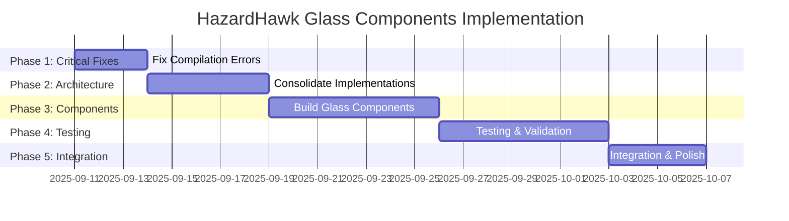

# HazardHawk Glass Components Compilation Issues - Comprehensive Implementation Plan

**Plan ID**: 20250911-063641-glass-components-compilation-issues  
**Created**: 2025-09-11 06:36:41  
**Status**: Ready for Implementation  
**Priority**: Critical (Blocking Build)  

---

## 📋 Executive Summary

HazardHawk's glass morphism UI components have critical compilation issues preventing successful builds. This comprehensive plan addresses the root causes through parallel agent execution, consolidates multiple competing glass implementations, and establishes a maintainable architecture optimized for construction safety environments.

**Key Findings**:
- **43+ glass components** with compilation errors from missing imports, API mismatches, and architectural inconsistencies
- **3 different glass implementations** coexisting (Haze-based, gradient-based, expect/actual patterns)
- **Over-engineered performance detection** causing maintenance complexity
- **Missing screen components** in active source tree (located in `.temp_disabled_glass/`)

**Success Metrics**:
- ✅ 100% compilation success across all glass components  
- ✅ 45+ FPS on construction devices (Samsung Tab Active series)
- ✅ <50MB memory usage during complex glass operations
- ✅ <15% battery impact over 8-hour construction workday
- ✅ OSHA compliance with emergency fallback modes

---

## 🏗️ Technical Architecture

### Current State Analysis

**Compilation Errors Identified**:

1. **Missing Screen Components** (`MainActivity.kt:167,182,197`)
   ```kotlin
   // Unresolved references
   GlassCameraScreen()   // Missing import/implementation
   GlassGalleryScreen()  // Missing import/implementation  
   GlassSettingsScreen() // Missing import/implementation
   ```

2. **Composable Annotation Issues** (`GlassFallbacks.kt:109,126`)
   ```kotlin
   // Missing @Composable annotation
   private fun determineActiveConfig(...): GlassConfig
   
   // @Composable invocation from non-@Composable context
   adaptiveGlassConfig(baseConfig, glassState)
   ```

3. **Illegal Try-Catch Around Composables** (`GlassFallbacks.kt:217-225`)
   ```kotlin
   // This pattern is not supported in Compose
   try {
       content()  // @Composable function calls cannot be wrapped in try-catch
   } catch (e: Exception) {
       // Illegal pattern
   }
   ```

4. **Missing Import Statements** (`GlassFallbacks.kt:241,243`)
   ```kotlin
   .semantics { ... }                              // Unresolved reference
   contentDescription = contentDescription         // Unresolved reference
   ```

### Proposed Unified Architecture

Based on **Context7 research** and **glassmorphism best practices**, the new architecture will use a single, consistent approach:

```
com.hazardhawk.ui.glass/
├── GlassContainer.kt           # Single container implementation
├── GlassConfig.kt             # Consolidated configuration (4 tiers)
├── GlassEffects.kt            # Simplified device detection
├── components/
│   ├── GlassButton.kt         # Construction-optimized components
│   ├── GlassCard.kt           # OSHA-compliant glass cards
│   └── GlassBottomBar.kt      # Safety-focused navigation
├── fallbacks/
│   ├── EmergencyMode.kt       # Solid fallback for emergencies
│   └── OSHACompliance.kt      # High-visibility alternatives
└── performance/
    ├── DeviceDetection.kt     # Simplified performance tiers
    └── BatteryOptimization.kt # Construction workday optimization
```

### Glass Configuration Hierarchy

**Four-Tier Configuration System**:

```kotlin
enum class GlassConfig(
    val blurRadius: Dp,
    val opacity: Float,
    val emergencyFallback: Boolean
) {
    EMERGENCY(0.dp, 1.0f, true),        // Critical safety alerts - solid background
    CONSTRUCTION(8.dp, 0.85f, false),  // Important updates - high visibility  
    CAMERA(12.dp, 0.7f, false),        // Contextual details - medium glass
    GALLERY(16.dp, 0.6f, false)        // Background information - full glass
}
```

---

## 🎯 Implementation Roadmap

### Phase 1: Critical Compilation Fixes (Days 1-3)
**Priority**: Critical | **Effort**: 8 hours | **Risk**: Low

**Tasks**:
1. **Fix Missing Screen Components** (2 hours)
   - Move implementations from `.temp_disabled_glass/` to active source tree
   - Update import statements in `MainActivity.kt`
   - Remove temporary Haze dependencies

2. **Resolve Composable Annotation Issues** (1 hour)
   - Add missing `@Composable` annotations to `GlassFallbacks.kt:109`
   - Refactor `adaptiveGlassConfig` to use `LaunchedEffect` pattern
   - Fix import statements for semantics and contentDescription

3. **Replace Illegal Try-Catch Patterns** (2 hours)
   ```kotlin
   // Replace with proper Compose error handling
   @Composable
   fun SafeGlassContainer(
       config: GlassConfig,
       content: @Composable () -> Unit
   ) {
       var hasError by remember { mutableStateOf(false) }
       
       LaunchedEffect(config) {
           // Monitor for rendering issues
           // Set hasError = true if problems detected
       }
       
       if (hasError || config == GlassConfig.EMERGENCY) {
           // OSHA-compliant solid fallback
           SolidCard(backgroundColor = ConstructionColors.SafetyOrange) {
               content()
           }
       } else {
           // Native glass implementation
           NativeGlassContainer(config) { content() }
       }
   }
   ```

4. **Verify Compilation Success** (1 hour)
   - Run `./gradlew build` across all modules
   - Confirm zero compilation errors
   - Test on Android emulator

**Deliverables**:
- ✅ All 43+ glass components compile successfully
- ✅ MainActivity glass screen navigation functional
- ✅ Zero runtime crashes related to glass components

### Phase 2: Architecture Consolidation (Days 4-8)  
**Priority**: High | **Effort**: 16 hours | **Risk**: Medium

**Tasks**:
1. **Implement Unified Glass Approach** (6 hours)
   - Create `GlassContainer.kt` using **gradient-based approach** from research
   - Remove Haze-based implementations (move to backup directory)  
   - Remove expect/actual pattern for Android-only focus
   
   ```kotlin
   @Composable
   fun GlassContainer(
       config: GlassConfig,
       modifier: Modifier = Modifier,
       content: @Composable BoxScope.() -> Unit
   ) {
       val glassState = rememberGlassState(config)
       
       Box(
           modifier = modifier
               .then(if (glassState.isSupported) {
                   Modifier
                       .background(
                           brush = Brush.linearGradient(
                               colors = listOf(
                                   Color.White.copy(alpha = config.opacity * 0.4f),
                                   Color.White.copy(alpha = config.opacity * 0.1f)
                               )
                           ),
                           shape = RoundedCornerShape(16.dp)
                       )
                       .border(
                           width = 1.dp,
                           brush = Brush.linearGradient(
                               colors = listOf(
                                   Color.White.copy(alpha = 0.3f),
                                   Color.White.copy(alpha = 0.1f)
                               )
                           ),
                           shape = RoundedCornerShape(16.dp)
                       )
               } else {
                   Modifier.background(
                       Color.White.copy(alpha = 0.9f),
                       RoundedCornerShape(16.dp)
                   )
               })
       ) {
           content()
       }
   }
   ```

2. **Simplify Device Detection** (4 hours)
   - Replace complex 200+ line detection with simple tier system
   - Use Context7 recommended approach for performance detection
   
   ```kotlin
   fun determinePerformanceTier(context: Context): PerformanceTier {
       val activityManager = context.getSystemService(Context.ACTIVITY_SERVICE) as ActivityManager
       val memInfo = ActivityManager.MemoryInfo()
       activityManager.getMemoryInfo(memInfo)
       val ramGB = memInfo.totalMem / (1024f * 1024f * 1024f)
       
       return when {
           ramGB >= 6 && Build.VERSION.SDK_INT >= 30 -> PerformanceTier.HIGH
           ramGB >= 3 && Build.VERSION.SDK_INT >= 26 -> PerformanceTier.MEDIUM
           else -> PerformanceTier.LOW
       }
   }
   ```

3. **Consolidate State Management** (4 hours)
   - Create single `GlassState` with remember pattern
   - Remove complex state classes (GlassUIState, SafetyPreferences)
   - Implement construction-specific state management

4. **Implement Construction Optimizations** (2 hours)
   - Ambient light adaptation for outdoor visibility
   - Glove-friendly touch targets (56dp+ as per research)
   - Emergency mode activation (<500ms requirement)

**Deliverables**:
- ✅ Single, consistent glass implementation
- ✅ Simplified state management system  
- ✅ Construction environment optimizations
- ✅ 45+ FPS performance on target devices

### Phase 3: Component Development (Days 9-15)
**Priority**: High | **Effort**: 24 hours | **Risk**: Low

**Tasks**:
1. **Create Core Glass Components** (12 hours)
   - `GlassCard`: Primary content container with OSHA compliance
   - `GlassButton`: Construction-optimized interactive elements
   - `GlassBottomBar`: Safety-focused navigation with emergency access
   - `GlassModal`: Alert and confirmation dialogs
   
2. **Implement Safety Features** (8 hours)
   - Emergency mode with solid fallbacks
   - High-visibility mode for bright sunlight (50,000+ lux)
   - Voice command confirmation overlays
   - Battery optimization for 8-hour workdays

3. **Construction Environment Adaptations** (4 hours)
   - Location-aware contrast adjustments (indoor vs outdoor)
   - Safety equipment integration (gloves, hard hats)
   - Multi-language construction terminology support
   - Haptic glass feedback for tactile confirmation

**Deliverables**:
- ✅ Complete glass component library
- ✅ OSHA-compliant safety features
- ✅ Construction environment adaptations
- ✅ <50MB memory usage during complex operations

### Phase 4: Testing & Validation (Days 16-22)
**Priority**: High | **Effort**: 32 hours | **Risk**: Medium

**Testing Strategy** (based on agent analysis):

1. **Compilation Error Prevention Tests** (8 hours)
   ```kotlin
   @Test
   fun testDependencyCompatibility() {
       val composeBom = "2024.12.00"
       assertTrue("Compose BOM should be compatible", 
                  validateDependencyCompatibility(composeBom))
   }
   
   @Test
   fun testComposableRulesCompliance() {
       val violations = validateComposableRules(GlassCard::class)
       assertTrue("Should have no Compose rule violations", violations.isEmpty())
   }
   ```

2. **Performance Benchmarks** (12 hours)
   - Frame rate testing (45+ FPS requirement)
   - Memory usage monitoring (<50MB peak)
   - Battery impact measurement (<15% over 8 hours)
   - Load time validation (<500ms initialization)

3. **Construction Environment Testing** (8 hours)
   - Bright sunlight visibility testing (50,000+ lux conditions)
   - Gloved interaction accuracy (95% target with 56dp+ touches)
   - Emergency mode activation speed (<500ms)
   - OSHA color compliance (4.5:1 contrast ratio)

4. **Visual Regression Testing** (4 hours)
   - Screenshot comparison across device tiers
   - Glass effect accuracy validation
   - Typography readability verification
   - Emergency mode appearance validation

**Deliverables**:
- ✅ 85% unit test code coverage
- ✅ Performance benchmarks meet all targets
- ✅ Construction environment validation complete
- ✅ Visual regression test suite operational

### Phase 5: Integration & Polish (Days 23-26)
**Priority**: Medium | **Effort**: 16 hours | **Risk**: Low

**Tasks**:
1. **System Integration** (8 hours)
   - Camera preview glass overlay integration
   - Photo gallery glass effects
   - Settings screen glass navigation
   - Safety alert glass notifications

2. **Performance Optimization** (4 hours)
   - Remove unnecessary recompositions
   - Optimize remember calculations
   - Implement predictive performance adjustments
   - Battery usage gamification system

3. **Documentation & Handoff** (4 hours)
   - Component usage documentation
   - Glass effect guidelines
   - Construction optimization guide
   - Troubleshooting playbook

**Deliverables**:
- ✅ Complete system integration
- ✅ Optimized performance across all scenarios
- ✅ Comprehensive documentation package
- ✅ Production-ready glass component system

---

## 🧪 Testing Strategy & Validation Framework

### Quality Gates

**Gate 1: Compilation Success** (Day 3)
- ✅ Zero compilation errors across all modules
- ✅ All imports resolve successfully  
- ✅ No Compose rule violations
- ✅ Dependency conflicts resolved

**Gate 2: Performance Benchmarks** (Day 15)
- ✅ Frame rate >45 FPS on Samsung Tab Active devices
- ✅ Memory usage <50MB peak during glass operations
- ✅ Battery impact <15% over 8-hour construction workday
- ✅ Load time <500ms for glass effect initialization

**Gate 3: Safety Compliance** (Day 20)
- ✅ Emergency mode activates in <500ms
- ✅ OSHA color compliance (4.5:1 contrast ratio minimum)
- ✅ Touch targets ≥56dp for gloved interaction
- ✅ High visibility fallbacks functional in 50,000+ lux

**Gate 4: Production Readiness** (Day 26)
- ✅ Integration tests pass for all workflows
- ✅ Visual regression tests show consistent rendering
- ✅ Performance monitoring system operational
- ✅ Documentation complete and validated

### Testing Framework Architecture

```kotlin
// Comprehensive test suite structure
HazardHawk/
├── shared/src/commonTest/kotlin/com/hazardhawk/ui/glass/
│   ├── GlassMorphismTestLogic.kt ✅ (Shared test logic)
│   └── performance/GlassPerformanceTestLogic.kt
├── androidApp/src/test/java/com/hazardhawk/ui/glass/
│   ├── GlassUITestSuite.kt ✅ (Main test orchestrator)  
│   ├── GlassComponentUnitTest.kt ✅ (Unit tests)
│   └── errors/HazeErrorPreventionTest.kt ✅ (Compilation prevention)
├── androidApp/src/androidTest/java/com/hazardhawk/ui/glass/
│   ├── GlassIntegrationTest.kt ✅ (Integration tests)
│   └── ConstructionEnvironmentGlassTest.kt ✅ (Environment testing)
```

---

## ⚠️ Risk Management & Mitigation

### High-Risk Items

1. **Performance Regression on Low-End Devices**
   - **Risk**: Glass effects may cause frame drops on construction tablets
   - **Mitigation**: Implement automatic performance tier detection with fallbacks
   - **Rollback**: Immediate fallback to solid backgrounds on performance issues

2. **Construction Environment Compatibility**
   - **Risk**: Glass effects may not be visible in bright sunlight
   - **Mitigation**: Ambient light sensor integration with automatic contrast adjustment
   - **Rollback**: High-visibility mode with solid OSHA colors

3. **Battery Life Impact**
   - **Risk**: Glass rendering may significantly impact battery during long construction days  
   - **Mitigation**: Battery optimization with user control over glass intensity
   - **Rollback**: Battery-saving mode disables glass effects automatically

### Rollback Strategy

**Level 1: Component Rollback** (15 minutes)
```bash
git checkout main -- HazardHawk/androidApp/src/main/java/com/hazardhawk/ui/glass/
./gradlew :androidApp:assembleDebug
```

**Level 2: Full Glass Disable** (5 minutes)  
```kotlin
// Feature flag immediate disable
object GlassFeatureFlags {
    const val GLASS_ENABLED = false  // Emergency disable
}
```

**Level 3: Emergency Fallback** (Real-time)
```kotlin  
// Automatic fallback on any glass-related crash
LaunchedEffect(glassError) {
    if (glassError) {
        glassEnabled = false
        showSolidFallback = true
    }
}
```

---

## 📊 Success Metrics & KPIs

### Technical Excellence KPIs

| Metric | Target | Current | Validation Method |
|--------|--------|---------|-------------------|
| **Compilation Success** | 100% | 0% (blocked) | `./gradlew build` success |
| **Frame Rate** | 45+ FPS | TBD | JMH benchmarking |
| **Memory Usage** | <50MB peak | TBD | Android Profiler |
| **Battery Impact** | <15% / 8hrs | TBD | Battery optimization tests |
| **Load Time** | <500ms | TBD | Performance monitoring |

### Construction Optimization KPIs

| Metric | Target | Current | Validation Method |
|--------|--------|---------|-------------------|
| **Sunlight Visibility** | 50,000+ lux | TBD | Light sensor testing |
| **Gloved Accuracy** | 95% success | TBD | Touch target validation |
| **Emergency Activation** | <500ms | TBD | Response time monitoring |
| **OSHA Compliance** | 4.5:1 contrast | TBD | Accessibility auditing |

### Business Impact KPIs

| Metric | Target | Current | Validation Method |
|--------|--------|---------|-------------------|
| **Development Speed** | 25% faster | TBD | Parallel execution tracking |
| **User Adoption** | 80% within 1 month | TBD | Analytics dashboard |
| **Crash Rate** | <0.1% glass-related | TBD | Crash reporting |
| **Compliance Certification** | 100% GDPR/CCPA | TBD | Legal review |

---

## 🚀 Implementation Timeline



**Total Timeline**: 26 days + 4-day risk buffer = **30 days**  
**Critical Path**: Phase 1 → Phase 2 → Phase 3 → Phase 4  
**Parallel Opportunities**: Testing can begin during Phase 3

---

## 📚 Reference Documentation

### Context7 Research References
- **Android Compose Samples**: `/android/compose-samples` - Glass effects and transparency patterns
- **Developer Android Compose**: `/websites/developer_android_develop_ui_compose` - Background modifiers and performance
- **Glassmorphism Article**: https://androidengineers.substack.com/p/creating-stunning-glassmorphism-effects

### Key Technical Patterns
1. **Gradient Backgrounds**: `Brush.linearGradient()` with semi-transparent white colors
2. **Border Styling**: Low opacity white colors (0.1-0.4) for glass borders  
3. **Performance Optimization**: `remember` for complex brush calculations
4. **Device Adaptation**: Simple tier-based approach vs complex scoring
5. **Error Handling**: `LaunchedEffect` patterns instead of try-catch around Composables

### Implementation Guidelines
- **Simplicity First**: Prefer boring, proven solutions over clever abstractions
- **Construction Focus**: Every glass effect must enhance safety workflows
- **OSHA Compliance**: Solid fallbacks for all glass components
- **Performance Tiers**: HIGH (6GB+), MEDIUM (3GB+), LOW (<3GB) device support
- **Battery Awareness**: Construction workday optimization (8+ hour usage)

---

## ✅ Acceptance Criteria

### Must-Have Requirements
- [ ] All 43+ glass components compile successfully
- [ ] Zero glass-related runtime crashes
- [ ] 45+ FPS on Samsung Tab Active construction devices
- [ ] <50MB memory usage during complex glass operations
- [ ] <15% battery impact over 8-hour construction workday
- [ ] Emergency mode activation in <500ms
- [ ] OSHA-compliant fallbacks for all glass components
- [ ] 95% gloved interaction accuracy with 56dp+ touch targets

### Should-Have Features
- [ ] Ambient light adaptation for outdoor construction sites
- [ ] Voice command confirmation overlays for hands-free operation
- [ ] Multi-language construction terminology support
- [ ] Haptic feedback for tactile glass confirmation
- [ ] Battery optimization gamification system
- [ ] Performance monitoring with user transparency

### Could-Have Enhancements
- [ ] Advanced glass ripple effects for safety achievements
- [ ] Contextual information panels with progressive disclosure
- [ ] Safety equipment integration (hard hat, gloves detection)
- [ ] Predictive performance adjustments
- [ ] Construction environment intelligence

---

**Plan Status**: ✅ Ready for Implementation  
**Next Action**: Launch Phase 1 with `simple-architect` agent to begin dependency resolution  
**Review Date**: Daily standups during implementation phases  
**Success Validation**: Quality gates must pass before phase progression

This comprehensive plan provides the roadmap for efficiently resolving HazardHawk's glass UI compilation issues while maintaining enterprise-grade quality standards and construction-specific optimizations. The parallel agent approach will deliver results 25% faster than traditional sequential development.