# Implementation Plan: Token Tracking, PDF Fixes & Improvements

**Date:** October 8, 2025 04:38:20
**Feature:** Multi-Priority Implementation
**Estimated Time:** 7-9 hours total
**Status:** Planning Complete

---

## Executive Summary

This implementation plan covers three interconnected priorities for HazardHawk's Pre-Task Plan (PTP) generation system:

1. **Token Tracking Implementation** (2-3 hours) - Add transparent AI usage cost tracking
2. **PDF Fixes Phase 1** (3-4 hours) - Fix critical PDF generation bugs
3. **PDF Improvements Phase 2** (2-3 hours) - Professional polish and branding

### Key Objectives

- **Transparency**: Users see AI costs before generation
- **Reliability**: PDFs never truncate critical safety information
- **Professionalism**: Documents reflect company brand standards

### Success Criteria

✅ Token usage tracked with <10% error margin
✅ No text overflow or truncation in PDFs
✅ Generation time <5s for typical PTPs
✅ Professional branding integration
✅ All existing tests pass + new coverage >85%

### Risk Assessment

| Risk | Impact | Mitigation |
|------|--------|------------|
| Token estimation inaccuracy | Medium | Use conservative ranges, track actual vs estimated |
| PDF layout breaks on edge cases | High | Comprehensive text measurement, overflow detection |
| Performance degradation | Medium | Progressive photo loading, Paint object caching |
| Breaking existing functionality | High | Comprehensive test suite, feature flags |

---

## Table of Contents

1. [Technical Architecture](#technical-architecture)
2. [Priority 1: Token Tracking](#priority-1-token-tracking-implementation)
3. [Priority 2: PDF Fixes](#priority-2-pdf-fixes-phase-1)
4. [Priority 3: PDF Improvements](#priority-3-pdf-improvements-phase-2)
5. [Testing Strategy](#testing-strategy)
6. [Implementation Sequence](#implementation-sequence)
7. [Rollback Strategy](#rollback-strategy)

---

## Technical Architecture

### System Overview


### Data Model Changes

#### New Models

```kotlin
// File: shared/src/commonMain/kotlin/com/hazardhawk/domain/models/ptp/TokenUsage.kt

@Serializable
data class TokenUsageMetadata(
    val promptTokenCount: Int,
    val candidatesTokenCount: Int,
    val totalTokenCount: Int,
    val modelVersion: String = "gemini-2.5-flash",
    val estimatedCost: Double,
    val timestamp: Long = Clock.System.now().toEpochMilliseconds()
) {
    companion object {
        // Gemini 2.5 Flash pricing (as of Jan 2025)
        const val INPUT_COST_PER_MILLION = 0.30
        const val OUTPUT_COST_PER_MILLION = 1.20

        fun calculateCost(inputTokens: Int, outputTokens: Int): Double {
            val inputCost = (inputTokens / 1_000_000.0) * INPUT_COST_PER_MILLION
            val outputCost = (outputTokens / 1_000_000.0) * OUTPUT_COST_PER_MILLION
            return inputCost + outputCost
        }
    }
}

@Serializable
data class TokenUsageRecord(
    val id: String = uuid4().toString(),
    val ptpId: String,
    val promptTokens: Int,
    val completionTokens: Int,
    val totalTokens: Int,
    val estimatedCost: Double,
    val modelName: String,
    val timestamp: Long,
    val successful: Boolean
)
```

#### Modified Models

```kotlin
// File: shared/src/commonMain/kotlin/com/hazardhawk/domain/models/ptp/PTPAIModels.kt
// Lines 42-52

@Serializable
data class PtpAIResponse(
    val success: Boolean,
    val content: PtpContent? = null,
    val confidence: Double = 0.0,
    val processingTimeMs: Long = 0,
    val warnings: List<String> = emptyList(),
    val errorMessage: String? = null,
    val tokenUsage: TokenUsageMetadata? = null  // NEW FIELD
)
```

### Database Schema Changes

```sql
-- File: shared/src/commonMain/sqldelight/com/hazardhawk/database/TokenUsage.sq

CREATE TABLE IF NOT EXISTS token_usage (
    id TEXT PRIMARY KEY NOT NULL,
    ptp_id TEXT NOT NULL,
    prompt_tokens INTEGER NOT NULL,
    completion_tokens INTEGER NOT NULL,
    total_tokens INTEGER NOT NULL,
    estimated_cost REAL NOT NULL,
    model_name TEXT NOT NULL,
    timestamp INTEGER NOT NULL,
    successful INTEGER NOT NULL DEFAULT 1,
    FOREIGN KEY (ptp_id) REFERENCES pre_task_plans(id) ON DELETE CASCADE
);

CREATE INDEX idx_token_usage_ptp_id ON token_usage(ptp_id);
CREATE INDEX idx_token_usage_timestamp ON token_usage(timestamp);

selectByPtpId:
SELECT * FROM token_usage WHERE ptp_id = ? ORDER BY timestamp DESC;

selectDailyUsage:
SELECT
    SUM(total_tokens) as total_tokens,
    SUM(estimated_cost) as total_cost,
    COUNT(*) as request_count
FROM token_usage
WHERE timestamp >= ? AND timestamp < ?;

selectMonthlyUsage:
SELECT
    SUM(total_tokens) as total_tokens,
    SUM(estimated_cost) as total_cost,
    COUNT(*) as request_count
FROM token_usage
WHERE timestamp >= ? AND timestamp < ?;

insertTokenUsage:
INSERT INTO token_usage(
    id, ptp_id, prompt_tokens, completion_tokens,
    total_tokens, estimated_cost, model_name, timestamp, successful
)
VALUES (?, ?, ?, ?, ?, ?, ?, ?, ?);

selectRecentUsage:
SELECT * FROM token_usage
ORDER BY timestamp DESC
LIMIT ?;
```

### PDF Layout Configuration

```kotlin
// File: shared/src/commonMain/kotlin/com/hazardhawk/documents/PDFLayoutConfig.kt

object PDFLayoutConfig {
    // Page dimensions (US Letter)
    const val PAGE_WIDTH = 612f
    const val PAGE_HEIGHT = 792f

    // Margins (increased for field readability)
    const val MARGIN_TOP = 48f
    const val MARGIN_BOTTOM = 48f
    const val MARGIN_LEFT = 36f
    const val MARGIN_RIGHT = 36f

    // Typography (increased for outdoor visibility)
    const val FONT_SIZE_TITLE = 22f        // Was 20f
    const val FONT_SIZE_HEADING = 18f      // Was 16f
    const val FONT_SIZE_SUBHEADING = 14f   // Was 12f
    const val FONT_SIZE_BODY = 13f         // Was 12f
    const val FONT_SIZE_SMALL = 11f        // Was 10f

    // Line spacing (improved readability)
    const val LINE_SPACING_TITLE = 28f
    const val LINE_SPACING_HEADING = 24f
    const val LINE_SPACING_BODY = 18f      // Was 16f
    const val LINE_SPACING_SMALL = 15f     // Was 13f

    // Section spacing
    const val SECTION_SPACING = 24f
    const val SUBSECTION_SPACING = 16f
    const val PARAGRAPH_SPACING = 8f

    // Colors (high contrast for field conditions)
    const val COLOR_BLACK = 0xFF000000.toInt()
    const val COLOR_DARK_GRAY = 0xFF212121.toInt()    // Was 0xFF424242
    const val COLOR_MEDIUM_GRAY = 0xFF757575.toInt()
    const val COLOR_LIGHT_GRAY = 0xFFBDBDBD.toInt()   // Was 0xFFE0E0E0

    // Severity colors (extra saturated for visibility)
    const val COLOR_CRITICAL = 0xFFD32F2F.toInt()     // Deep red
    const val COLOR_MAJOR = 0xFFFF8F00.toInt()        // Safety orange
    const val COLOR_MINOR = 0xFFFBC02D.toInt()        // Warning yellow

    // Background colors (very light, optimized for printing)
    const val COLOR_BG_CRITICAL = 0xFFFFEBEE.toInt()
    const val COLOR_BG_MAJOR = 0xFFFFF3E0.toInt()
    const val COLOR_BG_MINOR = 0xFFFFFDE7.toInt()

    // Branding
    const val COLOR_PRIMARY = 0xFF1976D2.toInt()
    const val COLOR_ACCENT = 0xFFFF8F00.toInt()

    // Hazard box styling
    const val HAZARD_BOX_PADDING = 16f
    const val HAZARD_BOX_BORDER_WIDTH = 4f            // Was 3f
    const val HAZARD_BOX_CORNER_RADIUS = 4f

    // Photo sizing
    const val PHOTO_MAX_WIDTH = 500f
    const val PHOTO_MAX_HEIGHT = 350f
    const val PHOTO_CAPTION_SPACING = 8f
}
```

---

## Priority 1: Token Tracking Implementation

**Estimated Time:** 2-3 hours
**Complexity:** Medium
**Dependencies:** None (can start immediately)

### Overview

Implement transparent AI usage tracking to show users the cost of PTP generation before and after API calls. This builds trust and helps companies manage their AI budget.

### Implementation Steps

#### Step 1.1: Create Token Usage Data Models (20 min)

**Files to modify:**
- `shared/src/commonMain/kotlin/com/hazardhawk/domain/models/ptp/TokenUsage.kt` (NEW)
- `shared/src/commonMain/kotlin/com/hazardhawk/domain/models/ptp/PTPAIModels.kt` (MODIFY lines 42-52)

**Implementation:**

```kotlin
// TokenUsage.kt (NEW FILE)
package com.hazardhawk.domain.models.ptp

import kotlinx.serialization.Serializable
import kotlinx.datetime.Clock

@Serializable
data class TokenUsageMetadata(
    val promptTokenCount: Int,
    val candidatesTokenCount: Int,
    val totalTokenCount: Int,
    val modelVersion: String = "gemini-2.5-flash"
) {
    val estimatedCost: Double
        get() = calculateCost(promptTokenCount, candidatesTokenCount)

    companion object {
        const val INPUT_COST_PER_MILLION = 0.30
        const val OUTPUT_COST_PER_MILLION = 1.20

        fun calculateCost(inputTokens: Int, outputTokens: Int): Double {
            return (inputTokens / 1_000_000.0 * INPUT_COST_PER_MILLION) +
                   (outputTokens / 1_000_000.0 * OUTPUT_COST_PER_MILLION)
        }

        fun estimateTokens(text: String): Int {
            // Rough heuristic: 1 token ≈ 4 characters
            val baseTokens = (text.length / 4.0).toInt()
            val systemPromptTokens = 450
            val oshaReferenceTokens = 200
            return baseTokens + systemPromptTokens + oshaReferenceTokens
        }
    }
}

@Serializable
data class TokenUsageRecord(
    val id: String,
    val ptpId: String,
    val promptTokens: Int,
    val completionTokens: Int,
    val totalTokens: Int,
    val estimatedCost: Double,
    val modelName: String,
    val timestamp: Long,
    val successful: Boolean = true
)
```

**Testing:**
- Unit test for cost calculation accuracy
- Test token estimation algorithm
- Verify serialization/deserialization

---

#### Step 1.2: Extract Token Usage from Gemini API (45 min)

**Files to modify:**
- `shared/src/commonMain/kotlin/com/hazardhawk/domain/services/ptp/PTPAIService.kt` (MODIFY lines 153-239)

**Current Issue:**
The `callGeminiAPI()` method returns only `String` and discards the `usageMetadata` from Gemini's response.

**Solution:**

```kotlin
// Lines 153-156 - Change return type
private data class GeminiAPIResponse(
    val textContent: String,
    val tokenUsage: TokenUsageMetadata?
)

private suspend fun callGeminiAPI(prompt: String): GeminiAPIResponse {
    // ... existing setup code ...

    // Lines 218-239 - Extract usage metadata
    val responseJson = json.parseToJsonElement(responseBody).jsonObject

    // NEW: Extract token usage
    val usageMetadata = responseJson["usageMetadata"]?.jsonObject?.let { metadata ->
        TokenUsageMetadata(
            promptTokenCount = metadata["promptTokenCount"]?.jsonPrimitive?.int ?: 0,
            candidatesTokenCount = metadata["candidatesTokenCount"]?.jsonPrimitive?.int ?: 0,
            totalTokenCount = metadata["totalTokenCount"]?.jsonPrimitive?.int ?: 0,
            modelVersion = MODEL_NAME
        )
    }

    // Extract text content (existing logic)
    val candidates = responseJson["candidates"]?.jsonArray
        ?: throw Exception("No candidates in Gemini response")

    val content = candidates[0].jsonObject["content"]?.jsonObject
        ?: throw Exception("No content in candidate")

    val parts = content["parts"]?.jsonArray
        ?: throw Exception("No parts in content")

    val text = parts[0].jsonObject["text"]?.jsonPrimitive?.content
        ?: throw Exception("No text in part")

    return GeminiAPIResponse(
        textContent = text,
        tokenUsage = usageMetadata
    )
}
```

**Update `generatePtp()` method (lines 65-102):**

```kotlin
override suspend fun generatePtp(request: PtpAIRequest): Result<PtpAIResponse> {
    return try {
        val startTime = Clock.System.now().toEpochMilliseconds()

        val prompt = buildPrompt(request)
        val geminiResponse = callGeminiAPI(prompt)  // Now returns GeminiAPIResponse
        val content = parseGeminiResponse(geminiResponse.textContent)

        val processingTime = Clock.System.now().toEpochMilliseconds() - startTime

        Result.success(
            PtpAIResponse(
                success = true,
                content = content,
                confidence = calculateConfidence(content),
                processingTimeMs = processingTime,
                warnings = validateContent(content),
                tokenUsage = geminiResponse.tokenUsage  // NEW
            )
        )
    } catch (e: Exception) {
        Result.failure(e)
    }
}
```

**Testing:**
- Mock Gemini API responses with `usageMetadata`
- Verify token extraction accuracy
- Test with missing metadata (graceful fallback)

---

#### Step 1.3: Add Database Storage (30 min)

**Files to modify:**
- `shared/src/commonMain/sqldelight/com/hazardhawk/database/TokenUsage.sq` (NEW)
- `shared/src/commonMain/kotlin/com/hazardhawk/data/local/HazardHawkDatabase.kt` (MODIFY)

**Implementation:**

Create SQLDelight queries (see Database Schema Changes section above).

**Repository Layer:**

```kotlin
// File: shared/src/commonMain/kotlin/com/hazardhawk/data/repositories/ptp/PTPRepository.kt
// Add around line 68

class PTPRepositoryImpl(
    private val database: HazardHawkDatabase,
    private val ptpAIService: PTPAIService
) : PTPRepository {

    override suspend fun generatePtpWithAI(request: PtpAIRequest): Result<PtpAIResponse> {
        val response = ptpAIService.generatePtp(request)

        // NEW: Store token usage
        response.getOrNull()?.let { aiResponse ->
            aiResponse.tokenUsage?.let { usage ->
                storeTokenUsage(
                    ptpId = request.projectId,  // Or generated PTP ID
                    usage = usage,
                    successful = true
                )
            }
        }

        return response
    }

    private suspend fun storeTokenUsage(
        ptpId: String,
        usage: TokenUsageMetadata,
        successful: Boolean
    ) {
        database.tokenUsageQueries.insertTokenUsage(
            id = uuid4().toString(),
            ptp_id = ptpId,
            prompt_tokens = usage.promptTokenCount.toLong(),
            completion_tokens = usage.candidatesTokenCount.toLong(),
            total_tokens = usage.totalTokenCount.toLong(),
            estimated_cost = usage.estimatedCost,
            model_name = usage.modelVersion,
            timestamp = Clock.System.now().toEpochMilliseconds(),
            successful = if (successful) 1L else 0L
        )
    }

    override suspend fun getTokenUsageForPtp(ptpId: String): List<TokenUsageRecord> {
        return database.tokenUsageQueries.selectByPtpId(ptpId)
            .executeAsList()
            .map { it.toTokenUsageRecord() }
    }

    override suspend fun getDailyTokenUsage(date: Long): TokenUsageSummary {
        val startOfDay = getStartOfDay(date)
        val endOfDay = getEndOfDay(date)

        return database.tokenUsageQueries.selectDailyUsage(
            startOfDay, endOfDay
        ).executeAsOne().toTokenUsageSummary()
    }
}
```

**Testing:**
- Test token storage after successful generation
- Test retrieval by PTP ID
- Test daily/monthly aggregation queries

---

#### Step 1.4: Add UI Components (45 min)

**Files to modify:**
- `androidApp/src/main/java/com/hazardhawk/ui/safety/ptp/PTPCreationScreen.kt` (MODIFY lines 192-230)
- `androidApp/src/main/java/com/hazardhawk/ui/safety/ptp/PTPViewModel.kt` (MODIFY lines 183-230)
- `androidApp/src/main/java/com/hazardhawk/ui/safety/ptp/components/TokenUsageCard.kt` (NEW)

**A. Pre-Generation Cost Estimate:**

```kotlin
// TokenUsageCard.kt (NEW FILE)
@Composable
fun TokenCostEstimateCard(
    taskDescription: String,
    modifier: Modifier = Modifier
) {
    val estimatedTokens = remember(taskDescription) {
        TokenUsageMetadata.estimateTokens(taskDescription)
    }

    val estimatedCost = remember(estimatedTokens) {
        TokenUsageMetadata.calculateCost(estimatedTokens, 2000) // Assume 2k output
    }

    val costRange = remember(estimatedCost) {
        val low = (estimatedCost * 0.7).roundToDecimal(2)
        val high = (estimatedCost * 1.3).roundToDecimal(2)
        "$${low} - $${high}"
    }

    Card(
        modifier = modifier.fillMaxWidth(),
        colors = CardDefaults.cardColors(
            containerColor = MaterialTheme.colorScheme.primaryContainer.copy(alpha = 0.3f)
        ),
        border = BorderStroke(1.dp, MaterialTheme.colorScheme.primaryContainer)
    ) {
        Column(
            modifier = Modifier.padding(16.dp)
        ) {
            Row(verticalAlignment = Alignment.CenterVertically) {
                Text(
                    text = "💡",
                    style = MaterialTheme.typography.titleMedium
                )
                Spacer(modifier = Modifier.width(8.dp))
                Text(
                    text = "AI Analysis Cost Estimate",
                    style = MaterialTheme.typography.bodyMedium,
                    color = MaterialTheme.colorScheme.onSurfaceVariant
                )
            }

            Spacer(modifier = Modifier.height(8.dp))

            Text(
                text = costRange,
                style = MaterialTheme.typography.titleLarge,
                fontWeight = FontWeight.Bold,
                color = MaterialTheme.colorScheme.primary
            )

            Text(
                text = "Based on your questionnaire length",
                style = MaterialTheme.typography.bodySmall,
                color = MaterialTheme.colorScheme.onSurfaceVariant.copy(alpha = 0.7f)
            )
        }
    }
}
```

**B. Post-Generation Receipt:**

```kotlin
// Add to PTPCreationScreen.kt after successful generation

@Composable
fun TokenUsageReceiptCard(
    tokenUsage: TokenUsageMetadata,
    processingTimeMs: Long,
    modifier: Modifier = Modifier
) {
    Card(
        modifier = modifier.fillMaxWidth(),
        colors = CardDefaults.cardColors(
            containerColor = MaterialTheme.colorScheme.secondaryContainer
        )
    ) {
        Column(modifier = Modifier.padding(16.dp)) {
            Row(verticalAlignment = Alignment.CenterVertically) {
                Icon(
                    imageVector = Icons.Default.CheckCircle,
                    contentDescription = null,
                    tint = MaterialTheme.colorScheme.secondary
                )
                Spacer(modifier = Modifier.width(8.dp))
                Text(
                    text = "PTP Generated Successfully",
                    style = MaterialTheme.typography.titleMedium,
                    fontWeight = FontWeight.Bold
                )
            }

            Spacer(modifier = Modifier.height(12.dp))

            Row(
                modifier = Modifier.fillMaxWidth(),
                horizontalArrangement = Arrangement.SpaceBetween
            ) {
                Column {
                    Text(
                        text = "AI Analysis Cost",
                        style = MaterialTheme.typography.bodySmall,
                        color = MaterialTheme.colorScheme.onSurfaceVariant
                    )
                    Text(
                        text = "$${String.format("%.3f", tokenUsage.estimatedCost)}",
                        style = MaterialTheme.typography.bodyLarge,
                        fontWeight = FontWeight.Bold
                    )
                }

                Column {
                    Text(
                        text = "Tokens Used",
                        style = MaterialTheme.typography.bodySmall,
                        color = MaterialTheme.colorScheme.onSurfaceVariant
                    )
                    Text(
                        text = "${tokenUsage.totalTokenCount}",
                        style = MaterialTheme.typography.bodyLarge
                    )
                }

                Column {
                    Text(
                        text = "Processing Time",
                        style = MaterialTheme.typography.bodySmall,
                        color = MaterialTheme.colorScheme.onSurfaceVariant
                    )
                    Text(
                        text = "${(processingTimeMs / 1000.0).roundToDecimal(1)}s",
                        style = MaterialTheme.typography.bodyLarge
                    )
                }
            }
        }
    }
}
```

**Testing:**
- Visual regression tests for cards
- Test cost calculation updates
- Test with various text lengths

---

### Token Tracking Acceptance Criteria

- [ ] Token usage extracted from 100% of API responses
- [ ] Cost estimation within 30% of actual usage
- [ ] Pre-generation estimate visible to user
- [ ] Post-generation receipt shows actual cost
- [ ] Database stores all token records
- [ ] Daily/monthly aggregation queries work correctly
- [ ] UI updates in <100ms after debounce
- [ ] No performance impact on API calls (<5ms overhead)

---

## Priority 2: PDF Fixes Phase 1

**Estimated Time:** 3-4 hours
**Complexity:** High
**Dependencies:** None (independent from Priority 1)

### Overview

Fix critical bugs in PDF generation that cause text truncation, layout inconsistencies, and memory leaks. These bugs affect document reliability and user trust.

### Critical Issues Identified

1. **Text Overflow** - Long hazard descriptions get cut off
2. **Inconsistent Pagination** - Content sometimes split mid-section
3. **Missing Null Checks** - Crashes on missing content
4. **Poor Contrast** - Light gray text hard to read in field
5. **Memory Leaks** - Bitmaps not recycled on error

### Implementation Steps

#### Step 2.1: Fix Text Wrapping Logic (60 min)

**Files to modify:**
- `shared/src/androidMain/kotlin/com/hazardhawk/documents/AndroidPTPPDFGenerator.kt` (MODIFY lines 992-1060)

**Current Problem:**
The `drawMultilineText()` function doesn't handle edge cases like empty strings, long words, or insufficient space.

**Solution:**

```kotlin
// Lines 992-1060 - Enhanced text wrapping
private fun drawMultilineText(
    canvas: Canvas,
    text: String,
    x: Float,
    startY: Float,
    maxWidth: Float,
    paint: Paint,
    lineSpacing: Float,
    maxLines: Int = Int.MAX_VALUE  // NEW: Add line limit
): TextDrawResult {
    // NEW: Handle empty/blank text
    if (text.isBlank()) {
        return TextDrawResult(
            endY = startY,
            linesDrawn = 0,
            truncated = false
        )
    }

    var y = startY
    val words = text.trim().split(Regex("\\s+"))  // Handle multiple spaces
    var currentLine = ""
    var linesDrawn = 0
    val drawnLines = mutableListOf<String>()

    for (word in words) {
        val testLine = if (currentLine.isEmpty()) word else "$currentLine $word"
        val testWidth = paint.measureText(testLine)

        if (testWidth > maxWidth) {
            if (currentLine.isEmpty()) {
                // NEW: Word too long - break it character by character
                val (brokenWord, remainder) = breakLongWord(word, maxWidth, paint)
                if (linesDrawn < maxLines) {
                    canvas.drawText(brokenWord, x, y, paint)
                    drawnLines.add(brokenWord)
                    y += lineSpacing
                    linesDrawn++
                }
                currentLine = remainder
            } else {
                // Draw current line
                if (linesDrawn < maxLines) {
                    canvas.drawText(currentLine, x, y, paint)
                    drawnLines.add(currentLine)
                    y += lineSpacing
                    linesDrawn++
                }
                currentLine = word
            }
        } else {
            currentLine = testLine
        }
    }

    // Draw last line
    if (currentLine.isNotEmpty() && linesDrawn < maxLines) {
        canvas.drawText(currentLine, x, y, paint)
        drawnLines.add(currentLine)
        y += lineSpacing
        linesDrawn++
    }

    val truncated = linesDrawn >= maxLines &&
                    drawnLines.joinToString(" ").length < text.length

    return TextDrawResult(
        endY = y,
        linesDrawn = linesDrawn,
        truncated = truncated,
        drawnText = drawnLines.joinToString("\n")
    )
}

private data class TextDrawResult(
    val endY: Float,
    val linesDrawn: Int,
    val truncated: Boolean,
    val drawnText: String = ""
)

private fun breakLongWord(
    word: String,
    maxWidth: Float,
    paint: Paint
): Pair<String, String> {
    var breakPoint = word.length

    while (breakPoint > 0 && paint.measureText(word.substring(0, breakPoint)) > maxWidth) {
        breakPoint--
    }

    return if (breakPoint > 0) {
        word.substring(0, breakPoint) to word.substring(breakPoint)
    } else {
        word to ""
    }
}
```

**Testing:**
- Test with empty strings
- Test with very long words (>50 chars)
- Test with multiple consecutive spaces
- Test with maxLines constraint
- Verify no text is lost

---

#### Step 2.2: Add Overflow Detection (45 min)

**Files to modify:**
- `shared/src/androidMain/kotlin/com/hazardhawk/documents/AndroidPTPPDFGenerator.kt` (MODIFY lines 459-557)

**Current Problem:**
Hazard boxes are drawn without checking if they fit on the page, causing content to overflow.

**Solution:**

```kotlin
// Lines 459-557 - Enhanced hazard list drawing
private fun drawHazardList(
    canvas: Canvas,
    hazards: List<PtpHazard>,
    startY: Float,
    pageNumber: Int
): DrawResult {
    var y = startY
    val maxY = PDFLayoutConfig.PAGE_HEIGHT - PDFLayoutConfig.MARGIN_BOTTOM - 50f
    val drawnHazards = mutableListOf<PtpHazard>()
    val overflowHazards = mutableListOf<PtpHazard>()

    for (hazard in hazards) {
        // Pre-calculate box height
        val boxHeight = calculateHazardBoxHeight(hazard)

        // Check if hazard fits on page with buffer
        if (y + boxHeight + PDFLayoutConfig.SUBSECTION_SPACING > maxY) {
            // Hazard won't fit - add to overflow list
            overflowHazards.add(hazard)
            continue
        }

        // Draw hazard box
        y = drawHazardBox(canvas, hazard, y)
        drawnHazards.add(hazard)

        y += PDFLayoutConfig.SUBSECTION_SPACING
    }

    return DrawResult(
        endY = y,
        itemsDrawn = drawnHazards.size,
        overflowItems = overflowHazards
    )
}

private data class DrawResult(
    val endY: Float,
    val itemsDrawn: Int,
    val overflowItems: List<Any> = emptyList()
)

private fun calculateHazardBoxHeight(hazard: PtpHazard): Float {
    val paint = createTextPaint(
        PDFLayoutConfig.FONT_SIZE_BODY,
        PDFLayoutConfig.COLOR_BLACK,
        false
    )

    val contentWidth = PDFLayoutConfig.PAGE_WIDTH -
                      PDFLayoutConfig.MARGIN_LEFT -
                      PDFLayoutConfig.MARGIN_RIGHT -
                      (PDFLayoutConfig.HAZARD_BOX_PADDING * 2)

    // Measure all text elements
    val descriptionHeight = measureMultilineTextHeight(
        hazard.description,
        contentWidth,
        paint,
        PDFLayoutConfig.LINE_SPACING_BODY
    )

    val controlsHeight = measureMultilineTextHeight(
        hazard.controlMeasures ?: "",
        contentWidth,
        paint,
        PDFLayoutConfig.LINE_SPACING_BODY
    )

    val ppeHeight = if (hazard.requiredPpe.isNotEmpty()) {
        PDFLayoutConfig.LINE_SPACING_BODY * 2  // PPE section
    } else 0f

    // Total height with padding and spacing
    return PDFLayoutConfig.HAZARD_BOX_PADDING * 2 +
           PDFLayoutConfig.FONT_SIZE_HEADING +
           PDFLayoutConfig.LINE_SPACING_BODY +
           descriptionHeight +
           PDFLayoutConfig.SUBSECTION_SPACING +
           controlsHeight +
           ppeHeight +
           20f  // Buffer for borders/labels
}
```

**Testing:**
- Test with 1 hazard (should fit)
- Test with 10 hazards (should paginate)
- Test with varying description lengths
- Verify no hazards are lost
- Test page break boundaries

---

#### Step 2.3: Fix Memory Leaks (30 min)

**Files to modify:**
- `shared/src/androidMain/kotlin/com/hazardhawk/documents/AndroidPTPPDFGenerator.kt` (MODIFY lines 697-763, 842-857)

**Current Problem:**
Bitmaps are not recycled in catch blocks, causing memory leaks.

**Solution:**

```kotlin
// Create safe bitmap drawing helper
private fun drawBitmapSafe(
    canvas: Canvas,
    imageBytes: ByteArray,
    destRect: RectF,
    placeholder: String? = null
): Boolean {
    var bitmap: Bitmap? = null
    return try {
        // Validate image bytes
        if (imageBytes.isEmpty()) {
            drawPlaceholder(canvas, destRect, placeholder ?: "⚠ Photo data missing")
            return false
        }

        // Decode bitmap
        bitmap = BitmapFactory.decodeByteArray(imageBytes, 0, imageBytes.size)

        if (bitmap == null) {
            drawPlaceholder(canvas, destRect, placeholder ?: "⚠ Photo corrupted")
            return false
        }

        // Draw bitmap
        canvas.drawBitmap(bitmap, null, destRect, null)
        true

    } catch (e: OutOfMemoryError) {
        drawPlaceholder(canvas, destRect, "⚠ Photo too large")
        false
    } catch (e: Exception) {
        drawPlaceholder(canvas, destRect, "⚠ Photo error")
        false
    } finally {
        bitmap?.recycle()
    }
}

private fun drawPlaceholder(
    canvas: Canvas,
    rect: RectF,
    message: String
) {
    val paint = Paint().apply {
        color = PDFLayoutConfig.COLOR_LIGHT_GRAY
        style = Paint.Style.FILL
    }
    canvas.drawRect(rect, paint)

    val textPaint = createTextPaint(
        PDFLayoutConfig.FONT_SIZE_BODY,
        PDFLayoutConfig.COLOR_DARK_GRAY,
        false
    )

    val textWidth = textPaint.measureText(message)
    val textX = rect.centerX() - (textWidth / 2)
    val textY = rect.centerY()

    canvas.drawText(message, textX, textY, textPaint)
}

// Update drawPhotos() method (lines 697-763)
private fun drawPhotos(
    canvas: Canvas,
    photos: List<PhotoData>,
    startY: Float
): Float {
    var y = startY + PDFLayoutConfig.SUBSECTION_SPACING

    for ((index, photo) in photos.withIndex()) {
        // Calculate photo size
        val photoWidth = min(
            PDFLayoutConfig.PHOTO_MAX_WIDTH,
            PDFLayoutConfig.PAGE_WIDTH - PDFLayoutConfig.MARGIN_LEFT - PDFLayoutConfig.MARGIN_RIGHT
        )

        val destRect = RectF(
            PDFLayoutConfig.MARGIN_LEFT,
            y,
            PDFLayoutConfig.MARGIN_LEFT + photoWidth,
            y + PDFLayoutConfig.PHOTO_MAX_HEIGHT
        )

        // Use safe drawing method
        val success = drawBitmapSafe(
            canvas,
            photo.imageBytes,
            destRect,
            "Photo ${index + 1}"
        )

        y += PDFLayoutConfig.PHOTO_MAX_HEIGHT + PDFLayoutConfig.PHOTO_CAPTION_SPACING

        // Draw caption
        photo.caption?.let { caption ->
            val captionPaint = createTextPaint(
                PDFLayoutConfig.FONT_SIZE_SMALL,
                PDFLayoutConfig.COLOR_DARK_GRAY,
                false
            )

            val captionResult = drawMultilineText(
                canvas,
                caption,
                PDFLayoutConfig.MARGIN_LEFT,
                y,
                photoWidth,
                captionPaint,
                PDFLayoutConfig.LINE_SPACING_SMALL,
                maxLines = 3
            )

            y = captionResult.endY + PDFLayoutConfig.SUBSECTION_SPACING
        }
    }

    return y
}
```

**Testing:**
- Test with missing image bytes
- Test with corrupted image data
- Test with oversized images (trigger OOM)
- Verify bitmap recycling with memory profiler
- Test multiple photos in sequence

---

#### Step 2.4: Improve Field Readability (30 min)

**Files to modify:**
- `shared/src/commonMain/kotlin/com/hazardhawk/documents/PTPPDFGenerator.kt` (MODIFY lines 138-200)

**Solution:**

Already covered in PDFLayoutConfig section above. Key changes:
- Increase font sizes (+1-2pt across the board)
- Darken text colors (better contrast)
- Increase line spacing (more breathing room)
- Make hazard borders thicker (more prominent)

**Testing:**
- Print sample PDFs and test in sunlight
- Compare readability at arm's length
- Test with safety glasses (reduced contrast)
- Get feedback from actual construction workers

---

#### Step 2.5: Add Error Recovery (30 min)

**Files to modify:**
- `shared/src/androidMain/kotlin/com/hazardhawk/documents/AndroidPTPPDFGenerator.kt` (MODIFY lines 45-142)

**Current Problem:**
If any step fails, the entire PDF generation fails with no partial recovery.

**Solution:**

```kotlin
// Lines 45-142 - Enhanced error recovery
override suspend fun generatePDFWithMetadata(
    ptp: PreTaskPlan,
    photos: List<PhotoData>,
    metadata: PDFMetadata
): Result<ByteArray> = withContext(Dispatchers.IO) {

    val errors = mutableListOf<String>()
    val warnings = mutableListOf<String>()

    try {
        // Early validation
        val content = ptp.userModifiedContent ?: ptp.aiGeneratedContent
        if (content == null) {
            return@withContext Result.failure(
                IllegalStateException("PTP has no content to generate PDF")
            )
        }

        val document = PdfDocument()
        var currentPage = 1

        // Page 1: Cover page (non-critical)
        try {
            val coverPage = document.startPage(
                PdfDocument.PageInfo.Builder(
                    PDFLayoutConfig.PAGE_WIDTH.toInt(),
                    PDFLayoutConfig.PAGE_HEIGHT.toInt(),
                    currentPage
                ).create()
            )
            drawCoverPage(coverPage.canvas, ptp, metadata)
            document.finishPage(coverPage)
            currentPage++
        } catch (e: Exception) {
            warnings.add("Cover page skipped: ${e.message}")
        }

        // Page 2+: Executive Summary (critical)
        try {
            val summaryPage = document.startPage(
                PdfDocument.PageInfo.Builder(
                    PDFLayoutConfig.PAGE_WIDTH.toInt(),
                    PDFLayoutConfig.PAGE_HEIGHT.toInt(),
                    currentPage
                ).create()
            )
            drawExecutiveSummary(summaryPage.canvas, content, ptp)
            document.finishPage(summaryPage)
            currentPage++
        } catch (e: Exception) {
            errors.add("Executive summary failed: ${e.message}")
            // Critical section - continue but log error
        }

        // Hazards (critical)
        try {
            var hazardsToProcess = content.hazards

            while (hazardsToProcess.isNotEmpty()) {
                val hazardPage = document.startPage(
                    PdfDocument.PageInfo.Builder(
                        PDFLayoutConfig.PAGE_WIDTH.toInt(),
                        PDFLayoutConfig.PAGE_HEIGHT.toInt(),
                        currentPage
                    ).create()
                )

                val result = drawHazardList(
                    hazardPage.canvas,
                    hazardsToProcess,
                    PDFLayoutConfig.MARGIN_TOP + 40f,
                    currentPage
                )

                document.finishPage(hazardPage)
                currentPage++

                // Process overflow on next page
                hazardsToProcess = result.overflowItems.filterIsInstance<PtpHazard>()
            }
        } catch (e: Exception) {
            errors.add("Hazard section failed: ${e.message}")
        }

        // Photos (non-critical)
        if (photos.isNotEmpty()) {
            try {
                val photoPage = document.startPage(
                    PdfDocument.PageInfo.Builder(
                        PDFLayoutConfig.PAGE_WIDTH.toInt(),
                        PDFLayoutConfig.PAGE_HEIGHT.toInt(),
                        currentPage
                    ).create()
                )
                drawPhotos(photoPage.canvas, photos, PDFLayoutConfig.MARGIN_TOP)
                document.finishPage(photoPage)
                currentPage++
            } catch (e: Exception) {
                warnings.add("Photo section skipped: ${e.message}")
            }
        }

        // Write to ByteArray
        val outputStream = ByteArrayOutputStream()
        document.writeTo(outputStream)
        document.close()

        // Log errors/warnings if any
        if (errors.isNotEmpty() || warnings.isNotEmpty()) {
            println("PDF generated with issues:")
            errors.forEach { println("ERROR: $it") }
            warnings.forEach { println("WARNING: $it") }
        }

        Result.success(outputStream.toByteArray())

    } catch (e: Exception) {
        Result.failure(e)
    }
}
```

**Testing:**
- Test with null content
- Test with missing photos
- Test with empty hazards list
- Verify partial PDFs are still valid
- Check error logging

---

### PDF Fixes Acceptance Criteria

- [ ] No text truncation in any section
- [ ] All hazards fit properly or paginate correctly
- [ ] No memory leaks (verified with profiler)
- [ ] Readable in outdoor conditions (tested in field)
- [ ] Graceful error recovery (partial PDFs valid)
- [ ] Generation completes in <5s for typical PTP
- [ ] All existing tests pass
- [ ] Visual regression tests pass (>95% similarity)

---

## Priority 3: PDF Improvements Phase 2

**Estimated Time:** 2-3 hours
**Complexity:** Medium
**Dependencies:** Priority 2 (must fix bugs first)

### Overview

Enhance PDF visual appeal with professional branding, better typography, and polished finishing touches. These improvements increase document credibility and user satisfaction.

### Implementation Steps

#### Step 3.1: Enhanced Header Design (45 min)

**Files to modify:**
- `shared/src/androidMain/kotlin/com/hazardhawk/documents/AndroidPTPPDFGenerator.kt` (MODIFY lines 336-380)

**Solution:**

```kotlin
// Lines 336-380 - Professional header
private fun drawHeader(
    canvas: Canvas,
    metadata: PDFMetadata,
    pageNumber: Int
): Float {
    var y = 0f

    // Colored header band
    val headerBarPaint = Paint().apply {
        color = PDFLayoutConfig.COLOR_PRIMARY
        style = Paint.Style.FILL
    }
    canvas.drawRect(
        0f, 0f,
        PDFLayoutConfig.PAGE_WIDTH,
        60f,
        headerBarPaint
    )

    // Company logo (if provided)
    metadata.companyLogo?.let { logoBytes ->
        try {
            // White circle background for logo
            val circlePaint = Paint().apply {
                color = Color.WHITE
                style = Paint.Style.FILL
                isAntiAlias = true
            }
            canvas.drawCircle(
                PDFLayoutConfig.MARGIN_LEFT + 20f,
                30f,
                22f,
                circlePaint
            )

            // Draw logo
            drawBitmapSafe(
                canvas,
                logoBytes,
                RectF(
                    PDFLayoutConfig.MARGIN_LEFT + 2f,
                    12f,
                    PDFLayoutConfig.MARGIN_LEFT + 38f,
                    48f
                ),
                placeholder = null
            )
        } catch (e: Exception) {
            // Fallback: Company initials
            val initialsPaint = createTextPaint(16f, Color.WHITE, true)
            val initials = metadata.companyName
                .split(" ")
                .take(2)
                .mapNotNull { it.firstOrNull() }
                .joinToString("")
            canvas.drawText(
                initials,
                PDFLayoutConfig.MARGIN_LEFT + 12f,
                35f,
                initialsPaint
            )
        }
    }

    // Title (white text on colored bar)
    val titlePaint = createTextPaint(
        PDFLayoutConfig.FONT_SIZE_TITLE,
        Color.WHITE,
        true
    )
    canvas.drawText(
        "PRE-TASK SAFETY PLAN",
        PDFLayoutConfig.MARGIN_LEFT + 60f,
        35f,
        titlePaint
    )

    y = 70f

    // Metadata line (below header bar)
    val metaPaint = createTextPaint(
        PDFLayoutConfig.FONT_SIZE_SMALL,
        PDFLayoutConfig.COLOR_DARK_GRAY,
        false
    )

    val metadataText = buildString {
        append(metadata.companyName)
        append(" | ")
        append(metadata.projectName)
        append(" | ")
        append(metadata.projectLocation)
    }

    canvas.drawText(
        metadataText,
        PDFLayoutConfig.MARGIN_LEFT,
        y,
        metaPaint
    )

    y += PDFLayoutConfig.LINE_SPACING_SMALL + PDFLayoutConfig.SECTION_SPACING

    return y
}
```

**Testing:**
- Test with logo
- Test without logo (initials fallback)
- Test with long company names
- Visual regression test

---

#### Step 3.2: Severity-Coded Hazard Cards (45 min)

**Files to modify:**
- `shared/src/androidMain/kotlin/com/hazardhawk/documents/AndroidPTPPDFGenerator.kt` (MODIFY lines 506-557)

**Solution:**

```kotlin
// Enhanced hazard box drawing
private fun drawHazardBox(
    canvas: Canvas,
    hazard: PtpHazard,
    startY: Float
): Float {
    var y = startY

    val boxLeft = PDFLayoutConfig.MARGIN_LEFT
    val boxRight = PDFLayoutConfig.PAGE_WIDTH - PDFLayoutConfig.MARGIN_RIGHT
    val boxTop = y

    // Calculate height
    val boxHeight = calculateHazardBoxHeight(hazard)
    val boxBottom = boxTop + boxHeight

    // Background color based on severity
    val bgPaint = Paint().apply {
        color = when (hazard.severity) {
            HazardSeverity.CRITICAL -> PDFLayoutConfig.COLOR_BG_CRITICAL
            HazardSeverity.MAJOR -> PDFLayoutConfig.COLOR_BG_MAJOR
            HazardSeverity.MINOR -> PDFLayoutConfig.COLOR_BG_MINOR
        }
        style = Paint.Style.FILL
    }
    canvas.drawRect(boxLeft, boxTop, boxRight, boxBottom, bgPaint)

    // Colored left edge badge
    val badgePaint = Paint().apply {
        color = when (hazard.severity) {
            HazardSeverity.CRITICAL -> PDFLayoutConfig.COLOR_CRITICAL
            HazardSeverity.MAJOR -> PDFLayoutConfig.COLOR_MAJOR
            HazardSeverity.MINOR -> PDFLayoutConfig.COLOR_MINOR
        }
        style = Paint.Style.FILL
    }
    canvas.drawRect(
        boxLeft,
        boxTop,
        boxLeft + 8f,
        boxBottom,
        badgePaint
    )

    // Border
    val borderPaint = Paint().apply {
        color = when (hazard.severity) {
            HazardSeverity.CRITICAL -> PDFLayoutConfig.COLOR_CRITICAL
            HazardSeverity.MAJOR -> PDFLayoutConfig.COLOR_MAJOR
            HazardSeverity.MINOR -> PDFLayoutConfig.COLOR_MINOR
        }
        style = Paint.Style.STROKE
        strokeWidth = PDFLayoutConfig.HAZARD_BOX_BORDER_WIDTH
    }
    canvas.drawRect(boxLeft, boxTop, boxRight, boxBottom, borderPaint)

    // Content (indented from left edge)
    val contentLeft = boxLeft + 20f
    val contentRight = boxRight - PDFLayoutConfig.HAZARD_BOX_PADDING
    val contentWidth = contentRight - contentLeft

    y = boxTop + PDFLayoutConfig.HAZARD_BOX_PADDING

    // Severity badge text
    val severityPaint = createTextPaint(
        PDFLayoutConfig.FONT_SIZE_SMALL,
        when (hazard.severity) {
            HazardSeverity.CRITICAL -> PDFLayoutConfig.COLOR_CRITICAL
            HazardSeverity.MAJOR -> PDFLayoutConfig.COLOR_MAJOR
            HazardSeverity.MINOR -> PDFLayoutConfig.COLOR_MINOR
        },
        true
    )

    val severityText = when (hazard.severity) {
        HazardSeverity.CRITICAL -> "⚠️ CRITICAL HAZARD"
        HazardSeverity.MAJOR -> "⚡ MAJOR HAZARD"
        HazardSeverity.MINOR -> "ℹ️ MINOR HAZARD"
    }

    canvas.drawText(severityText, contentLeft, y, severityPaint)
    y += PDFLayoutConfig.LINE_SPACING_HEADING

    // OSHA code
    hazard.oshaCode?.let { code ->
        val codePaint = createTextPaint(
            PDFLayoutConfig.FONT_SIZE_HEADING,
            PDFLayoutConfig.COLOR_BLACK,
            true
        )
        canvas.drawText(code, contentLeft, y, codePaint)
        y += PDFLayoutConfig.LINE_SPACING_HEADING
    }

    // Hazard name
    val namePaint = createTextPaint(
        PDFLayoutConfig.FONT_SIZE_HEADING,
        PDFLayoutConfig.COLOR_BLACK,
        true
    )
    canvas.drawText(hazard.name, contentLeft, y, namePaint)
    y += PDFLayoutConfig.LINE_SPACING_HEADING + 8f

    // Description section
    val descLabelPaint = createTextPaint(
        PDFLayoutConfig.FONT_SIZE_BODY,
        PDFLayoutConfig.COLOR_DARK_GRAY,
        true
    )
    canvas.drawText("📋 HAZARD:", contentLeft, y, descLabelPaint)
    y += PDFLayoutConfig.LINE_SPACING_BODY

    val descPaint = createTextPaint(
        PDFLayoutConfig.FONT_SIZE_BODY,
        PDFLayoutConfig.COLOR_BLACK,
        false
    )

    val descResult = drawMultilineText(
        canvas,
        hazard.description,
        contentLeft,
        y,
        contentWidth,
        descPaint,
        PDFLayoutConfig.LINE_SPACING_BODY
    )
    y = descResult.endY + 12f

    // Controls section
    canvas.drawText("✅ CONTROLS:", contentLeft, y, descLabelPaint)
    y += PDFLayoutConfig.LINE_SPACING_BODY

    hazard.controlMeasures?.let { controls ->
        val controlResult = drawMultilineText(
            canvas,
            controls,
            contentLeft,
            y,
            contentWidth,
            descPaint,
            PDFLayoutConfig.LINE_SPACING_BODY
        )
        y = controlResult.endY + 12f
    }

    // PPE section
    if (hazard.requiredPpe.isNotEmpty()) {
        canvas.drawText("🦺 REQUIRED PPE:", contentLeft, y, descLabelPaint)
        y += PDFLayoutConfig.LINE_SPACING_BODY

        val ppeText = hazard.requiredPpe.joinToString("\n") { "• $it" }
        val ppeResult = drawMultilineText(
            canvas,
            ppeText,
            contentLeft,
            y,
            contentWidth,
            descPaint,
            PDFLayoutConfig.LINE_SPACING_BODY
        )
        y = ppeResult.endY + 8f
    }

    return boxBottom
}
```

**Testing:**
- Test all severity levels
- Verify color contrast ratios (WCAG AA)
- Test with missing optional fields
- Visual regression test

---

#### Step 3.3: Professional Footer (20 min)

**Files to modify:**
- `shared/src/androidMain/kotlin/com/hazardhawk/documents/AndroidPTPPDFGenerator.kt` (MODIFY lines 936-967)

**Solution:**

```kotlin
// Lines 936-967 - Enhanced footer
private fun drawFooter(
    canvas: Canvas,
    pageNumber: Int,
    totalPages: Int,
    metadata: PDFMetadata
) {
    val footerY = PDFLayoutConfig.PAGE_HEIGHT - PDFLayoutConfig.MARGIN_BOTTOM + 15f

    // Divider line (thicker, colored)
    val linePaint = Paint().apply {
        color = PDFLayoutConfig.COLOR_PRIMARY
        strokeWidth = 2f
        style = Paint.Style.STROKE
    }
    canvas.drawLine(
        PDFLayoutConfig.MARGIN_LEFT,
        footerY - 15f,
        PDFLayoutConfig.PAGE_WIDTH - PDFLayoutConfig.MARGIN_RIGHT,
        footerY - 15f,
        linePaint
    )

    val footerPaint = createTextPaint(
        PDFLayoutConfig.FONT_SIZE_SMALL,
        PDFLayoutConfig.COLOR_DARK_GRAY,
        false
    )

    val boldFooterPaint = createTextPaint(
        PDFLayoutConfig.FONT_SIZE_SMALL,
        PDFLayoutConfig.COLOR_PRIMARY,
        true
    )

    // Left: Project name
    canvas.drawText(
        "${metadata.projectName} - ${metadata.taskDescription}",
        PDFLayoutConfig.MARGIN_LEFT,
        footerY,
        footerPaint
    )

    // Center: Page number (bold, colored)
    val pageText = "Page $pageNumber of $totalPages"
    val pageTextWidth = boldFooterPaint.measureText(pageText)
    canvas.drawText(
        pageText,
        (PDFLayoutConfig.PAGE_WIDTH - pageTextWidth) / 2,
        footerY,
        boldFooterPaint
    )

    // Right: Generation date
    val dateText = formatDate(metadata.generatedAt)
    val dateTextWidth = footerPaint.measureText(dateText)
    canvas.drawText(
        dateText,
        PDFLayoutConfig.PAGE_WIDTH - PDFLayoutConfig.MARGIN_RIGHT - dateTextWidth,
        footerY,
        footerPaint
    )

    // Bottom right: Branding (subtle)
    val brandingY = footerY + 12f
    val brandingPaint = createTextPaint(
        PDFLayoutConfig.FONT_SIZE_SMALL - 2f,
        PDFLayoutConfig.COLOR_MEDIUM_GRAY,
        false
    )
    val brandingText = "Powered by HazardHawk AI"
    val brandingWidth = brandingPaint.measureText(brandingText)
    canvas.drawText(
        brandingText,
        PDFLayoutConfig.PAGE_WIDTH - PDFLayoutConfig.MARGIN_RIGHT - brandingWidth,
        brandingY,
        brandingPaint
    )
}
```

**Testing:**
- Test with various project names
- Test single page vs multi-page
- Verify text doesn't overlap

---

#### Step 3.4: Cover Page Design (45 min)

**Files to modify:**
- `shared/src/androidMain/kotlin/com/hazardhawk/documents/AndroidPTPPDFGenerator.kt` (ADD new method)

**Solution:**

```kotlin
// NEW METHOD - Add around line 250
private fun drawCoverPage(
    canvas: Canvas,
    ptp: PreTaskPlan,
    metadata: PDFMetadata
) {
    var y = PDFLayoutConfig.PAGE_HEIGHT * 0.15f

    // Company logo (larger, centered)
    metadata.companyLogo?.let { logoBytes ->
        val logoSize = 80f
        val logoX = (PDFLayoutConfig.PAGE_WIDTH - logoSize) / 2

        drawBitmapSafe(
            canvas,
            logoBytes,
            RectF(logoX, y, logoX + logoSize, y + logoSize),
            placeholder = null
        )

        y += logoSize + 30f
    }

    // Title
    val titlePaint = createTextPaint(
        28f,
        PDFLayoutConfig.COLOR_PRIMARY,
        true
    )
    titlePaint.textAlign = Paint.Align.CENTER

    canvas.drawText(
        "PRE-TASK SAFETY PLAN",
        PDFLayoutConfig.PAGE_WIDTH / 2,
        y,
        titlePaint
    )

    y += 50f

    // Divider
    val linePaint = Paint().apply {
        color = PDFLayoutConfig.COLOR_PRIMARY
        strokeWidth = 3f
        style = Paint.Style.STROKE
    }
    canvas.drawLine(
        PDFLayoutConfig.PAGE_WIDTH * 0.25f,
        y,
        PDFLayoutConfig.PAGE_WIDTH * 0.75f,
        y,
        linePaint
    )

    y += 40f

    // Project details
    val detailsPaint = createTextPaint(
        14f,
        PDFLayoutConfig.COLOR_BLACK,
        false
    )
    detailsPaint.textAlign = Paint.Align.CENTER

    val centerX = PDFLayoutConfig.PAGE_WIDTH / 2

    canvas.drawText("Project: ${metadata.projectName}", centerX, y, detailsPaint)
    y += 24f

    canvas.drawText("Work Type: ${ptp.workType}", centerX, y, detailsPaint)
    y += 24f

    canvas.drawText("Date: ${formatDate(ptp.createdAt)}", centerX, y, detailsPaint)
    y += 24f

    canvas.drawText("Crew Size: ${ptp.crewSize ?: "TBD"}", centerX, y, detailsPaint)
    y += 50f

    // Competent person
    val boldDetailsPaint = createTextPaint(14f, PDFLayoutConfig.COLOR_BLACK, true)
    boldDetailsPaint.textAlign = Paint.Align.CENTER

    canvas.drawText("Competent Person:", centerX, y, boldDetailsPaint)
    y += 20f

    canvas.drawText(
        "${metadata.competentPerson ?: "TBD"}",
        centerX,
        y,
        detailsPaint
    )

    y += 50f

    // Hazard summary
    val content = ptp.userModifiedContent ?: ptp.aiGeneratedContent
    content?.let {
        val hazardCounts = it.hazards.groupBy { h -> h.severity }

        // Critical hazards
        hazardCounts[HazardSeverity.CRITICAL]?.size?.let { count ->
            val criticalPaint = createTextPaint(16f, PDFLayoutConfig.COLOR_CRITICAL, true)
            criticalPaint.textAlign = Paint.Align.CENTER
            canvas.drawText("⚠️ CRITICAL HAZARDS: $count", centerX, y, criticalPaint)
            y += 28f
        }

        // Major hazards
        hazardCounts[HazardSeverity.MAJOR]?.size?.let { count ->
            val majorPaint = createTextPaint(16f, PDFLayoutConfig.COLOR_MAJOR, true)
            majorPaint.textAlign = Paint.Align.CENTER
            canvas.drawText("⚡ MAJOR HAZARDS: $count", centerX, y, majorPaint)
            y += 28f
        }

        // Minor hazards
        hazardCounts[HazardSeverity.MINOR]?.size?.let { count ->
            val minorPaint = createTextPaint(16f, PDFLayoutConfig.COLOR_MINOR, true)
            minorPaint.textAlign = Paint.Align.CENTER
            canvas.drawText("ℹ️ MINOR HAZARDS: $count", centerX, y, minorPaint)
            y += 28f
        }

        y += 20f

        // Document stats
        canvas.drawText("📋 Total Job Steps: ${it.jobSteps.size}", centerX, y, detailsPaint)
        y += 24f
    }

    // Footer with generation info
    val footerY = PDFLayoutConfig.PAGE_HEIGHT - 80f
    val footerPaint = createTextPaint(
        PDFLayoutConfig.FONT_SIZE_SMALL,
        PDFLayoutConfig.COLOR_MEDIUM_GRAY,
        false
    )
    footerPaint.textAlign = Paint.Align.CENTER

    canvas.drawText(
        "Generated by HazardHawk AI",
        centerX,
        footerY,
        footerPaint
    )

    canvas.drawText(
        formatDateTime(metadata.generatedAt),
        centerX,
        footerY + 16f,
        footerPaint
    )
}
```

**Testing:**
- Test with/without logo
- Test with various hazard counts
- Visual regression test
- Print quality check

---

#### Step 3.5: Performance Optimization (30 min)

**Files to modify:**
- `shared/src/androidMain/kotlin/com/hazardhawk/documents/AndroidPTPPDFGenerator.kt` (ADD new methods)

**Solution:**

```kotlin
// Paint cache to reduce object allocation
private class PaintCache {
    private val cache = mutableMapOf<PaintKey, Paint>()

    data class PaintKey(
        val size: Float,
        val color: Int,
        val bold: Boolean
    )

    fun getPaint(size: Float, color: Int, bold: Boolean): Paint {
        val key = PaintKey(size, color, bold)
        return cache.getOrPut(key) {
            Paint().apply {
                textSize = size
                this.color = color
                typeface = if (bold) {
                    Typeface.create(Typeface.DEFAULT, Typeface.BOLD)
                } else {
                    Typeface.DEFAULT
                }
                isAntiAlias = true
            }
        }
    }

    fun clear() {
        cache.clear()
    }
}

private val paintCache = PaintCache()

// Update createTextPaint to use cache
private fun createTextPaint(
    size: Float,
    color: Int,
    bold: Boolean
): Paint {
    return paintCache.getPaint(size, color, bold)
}

// Photo optimization
private fun optimizePhotoData(photos: List<PhotoData>): List<PhotoData> {
    return photos.map { photo ->
        try {
            val options = BitmapFactory.Options().apply {
                inJustDecodeBounds = true
            }
            BitmapFactory.decodeByteArray(photo.imageBytes, 0, photo.imageBytes.size, options)

            val maxDimension = 1200
            val sampleSize = calculateInSampleSize(
                options.outWidth,
                options.outHeight,
                maxDimension,
                maxDimension
            )

            if (sampleSize == 1) return@map photo

            val decodeOptions = BitmapFactory.Options().apply {
                inSampleSize = sampleSize
            }

            val bitmap = BitmapFactory.decodeByteArray(
                photo.imageBytes, 0, photo.imageBytes.size, decodeOptions
            ) ?: return@map photo

            val outputStream = ByteArrayOutputStream()
            bitmap.compress(Bitmap.CompressFormat.JPEG, 85, outputStream)
            bitmap.recycle()

            photo.copy(imageBytes = outputStream.toByteArray())
        } catch (e: Exception) {
            photo
        }
    }
}

private fun calculateInSampleSize(
    width: Int,
    height: Int,
    reqWidth: Int,
    reqHeight: Int
): Int {
    var inSampleSize = 1

    if (height > reqHeight || width > reqWidth) {
        val halfHeight = height / 2
        val halfWidth = width / 2

        while ((halfHeight / inSampleSize) >= reqHeight &&
               (halfWidth / inSampleSize) >= reqWidth) {
            inSampleSize *= 2
        }
    }

    return inSampleSize
}

// Update generatePDFWithMetadata to use optimization
override suspend fun generatePDFWithMetadata(
    ptp: PreTaskPlan,
    photos: List<PhotoData>,
    metadata: PDFMetadata
): Result<ByteArray> = withContext(Dispatchers.IO) {
    try {
        // Optimize photos upfront
        val optimizedPhotos = if (photos.size > 5) {
            optimizePhotoData(photos)
        } else {
            photos
        }

        // ... rest of generation logic ...

        // Clear paint cache after generation
        paintCache.clear()

        Result.success(outputStream.toByteArray())
    } catch (e: Exception) {
        paintCache.clear()
        Result.failure(e)
    }
}
```

**Testing:**
- Benchmark generation time before/after
- Memory profiler analysis
- Test with 20+ photos
- Verify no quality degradation

---

### PDF Improvements Acceptance Criteria

- [ ] Professional header with branding
- [ ] Severity-coded hazard cards
- [ ] Enhanced footer design
- [ ] Cover page for professional appearance
- [ ] Generation time <3s for medium PTPs
- [ ] Paint caching reduces allocations by 90%
- [ ] Photo optimization reduces memory usage by 60%
- [ ] Visual consistency across all sections
- [ ] Print quality acceptable at 300 DPI

---

## Testing Strategy

### Unit Tests

**Coverage Goal:** 85% of new/modified code

#### Token Tracking Tests

```kotlin
// File: shared/src/commonTest/kotlin/com/hazardhawk/domain/models/TokenUsageTest.kt

class TokenUsageTest {

    @Test
    fun `calculateCost returns accurate cost for known token counts`() {
        val inputTokens = 1000
        val outputTokens = 2000

        val cost = TokenUsageMetadata.calculateCost(inputTokens, outputTokens)

        val expectedCost = (1000 / 1_000_000.0 * 0.30) + (2000 / 1_000_000.0 * 1.20)
        assertEquals(expectedCost, cost, 0.0001)
    }

    @Test
    fun `estimateTokens provides reasonable estimates`() {
        val shortText = "Install scaffolding"
        val mediumText = "Install scaffolding with proper fall protection on the east side of building 3"
        val longText = "Install scaffolding with proper fall protection on the east side of building 3. Ensure all workers wear hard hats and harnesses. Verify lockout/tagout procedures before beginning work."

        val shortTokens = TokenUsageMetadata.estimateTokens(shortText)
        val mediumTokens = TokenUsageMetadata.estimateTokens(mediumText)
        val longTokens = TokenUsageMetadata.estimateTokens(longText)

        assertTrue(shortTokens < mediumTokens)
        assertTrue(mediumTokens < longTokens)
        assertTrue(shortTokens in 650..750)  // Base prompt + small text
    }
}
```

#### PDF Generation Tests

```kotlin
// File: shared/src/androidTest/kotlin/com/hazardhawk/documents/PDFGenerationTest.kt

@RunWith(AndroidJUnit4::class)
class PDFGenerationTest {

    private lateinit var pdfGenerator: AndroidPTPPDFGenerator

    @Before
    fun setup() {
        pdfGenerator = AndroidPTPPDFGenerator()
    }

    @Test
    fun `generatePDF succeeds with valid PTP`() = runTest {
        val ptp = createTestPTP()
        val result = pdfGenerator.generatePDF(ptp, emptyList())

        assertTrue(result.isSuccess)
        val pdfBytes = result.getOrNull()!!
        assertTrue(pdfBytes.isNotEmpty())
        assertTrue(pdfBytes.size < 10 * 1024 * 1024)  // < 10MB
    }

    @Test
    fun `text wrapping handles long words correctly`() {
        val longWord = "a".repeat(100)
        val canvas = Canvas()
        val paint = Paint().apply { textSize = 12f }

        val result = pdfGenerator.drawMultilineText(
            canvas,
            longWord,
            0f,
            0f,
            100f,
            paint,
            16f
        )

        assertTrue(result.linesDrawn > 1)
        assertFalse(result.truncated)
    }

    @Test
    fun `bitmap resources are properly recycled`() {
        val initialMemory = getUsedMemory()

        val photos = List(10) { createMockPhoto() }
        val result = pdfGenerator.generatePDF(createTestPTP(), photos)

        System.gc()
        val finalMemory = getUsedMemory()

        val memoryIncrease = finalMemory - initialMemory
        assertTrue(memoryIncrease < 50 * 1024 * 1024)  // < 50MB increase
    }
}
```

### Integration Tests

#### End-to-End Token Tracking

```kotlin
@Test
fun `token tracking flow from API to UI`() = runTest {
    // Given: Mock Gemini response with token metadata
    val mockResponse = mockGeminiResponse(
        promptTokens = 850,
        completionTokens = 2100,
        totalTokens = 2950
    )

    // When: Generate PTP
    val viewModel = PTPViewModel(repository, aiService)
    viewModel.generatePTP(createTestRequest())

    // Then: Token usage stored and displayed
    val state = viewModel.generationState.value as GenerationState.Success
    assertNotNull(state.tokenUsage)
    assertEquals(2950, state.tokenUsage?.totalTokenCount)

    // Verify database storage
    val storedUsage = repository.getTokenUsageForPtp(state.ptpId)
    assertEquals(1, storedUsage.size)
    assertEquals(2950, storedUsage[0].totalTokens)
}
```

#### End-to-End PDF Generation

```kotlin
@Test
fun `complete PDF generation with all sections`() = runTest {
    val ptp = PreTaskPlan(
        id = "test-1",
        aiGeneratedContent = PtpContent(
            hazards = createTestHazards(6),
            jobSteps = createTestJobSteps(8),
            ppeRequirements = createTestPPE(),
            emergencyContacts = createTestContacts()
        )
    )

    val photos = createTestPhotos(4)
    val metadata = createTestMetadata()

    val result = pdfGenerator.generatePDFWithMetadata(ptp, photos, metadata)

    assertTrue(result.isSuccess)

    val pdfContent = parsePDF(result.getOrNull()!!)
    assertTrue(pdfContent.containsSection("IDENTIFIED HAZARDS"))
    assertTrue(pdfContent.containsSection("JOB STEPS"))
    assertTrue(pdfContent.containsSection("PHOTO DOCUMENTATION"))
    assertEquals(6, pdfContent.hazardCount)
}
```

### UI Tests

```kotlin
@Test
fun `token usage card displays correct estimate`() {
    composeTestRule.setContent {
        TokenCostEstimateCard(
            taskDescription = "Install scaffolding with fall protection"
        )
    }

    composeTestRule.onNodeWithText("AI Analysis Cost Estimate")
        .assertIsDisplayed()

    composeTestRule.onNodeWithText(
        text = "$",
        substring = true
    ).assertIsDisplayed()
}

@Test
fun `PDF generation shows progress stages`() {
    composeTestRule.setContent {
        PDFGenerationProgressDialog(
            currentStage = PDFGenerationStage.FORMATTING_HAZARDS,
            progress = 0.6f
        )
    }

    composeTestRule.onNodeWithText("Formatting hazards...")
        .assertIsDisplayed()

    composeTestRule.onNodeWithTag("progress_indicator")
        .assertIsDisplayed()
}
```

### Performance Tests

```kotlin
@Test
fun `PDF generation meets performance targets`() = runTest {
    val scenarios = listOf(
        TestScenario("Small", createSmallPTP(), emptyList(), targetMs = 1000L),
        TestScenario("Medium", createMediumPTP(), createPhotos(5), targetMs = 3000L),
        TestScenario("Large", createLargePTP(), createPhotos(10), targetMs = 5000L)
    )

    scenarios.forEach { scenario ->
        val (result, duration) = measureTime {
            pdfGenerator.generatePDF(scenario.ptp, scenario.photos)
        }

        assertTrue(result.isSuccess, "${scenario.name} failed")
        assertTrue(
            duration.inWholeMilliseconds < scenario.targetMs,
            "${scenario.name} took ${duration.inWholeMilliseconds}ms, target was ${scenario.targetMs}ms"
        )
    }
}
```

---

## Implementation Sequence

### Parallel Workstreams

The three priorities can be implemented with some parallelization:

```mermaid
gantt
    title Implementation Timeline
    dateFormat HH:mm
    axisFormat %H:%M

    section Priority 1: Token Tracking
    Data Models :p1_1, 00:00, 20m
    API Extraction :p1_2, after p1_1, 45m
    Database Storage :p1_3, after p1_2, 30m
    UI Components :p1_4, after p1_3, 45m
    Testing :p1_5, after p1_4, 30m

    section Priority 2: PDF Fixes
    Text Wrapping :p2_1, 00:00, 60m
    Overflow Detection :p2_2, after p2_1, 45m
    Memory Leaks :p2_3, after p2_2, 30m
    Field Readability :p2_4, after p2_3, 30m
    Error Recovery :p2_5, after p2_4, 30m
    Testing :p2_6, after p2_5, 45m

    section Priority 3: PDF Polish
    Wait for P2 :p3_wait, 00:00, 240m
    Enhanced Header :p3_1, after p2_6, 45m
    Hazard Cards :p3_2, after p3_1, 45m
    Footer Design :p3_3, after p3_2, 20m
    Cover Page :p3_4, after p3_3, 45m
    Performance :p3_5, after p3_4, 30m
    Testing :p3_6, after p3_5, 30m
```



### Recommended Order

**Phase 1: Parallel Start (Hour 0-2)**
- **Stream A**: Token Tracking (Steps 1.1 - 1.2)
- **Stream B**: PDF Fixes (Steps 2.1 - 2.2)

**Phase 2: Convergence (Hour 2-4)**
- **Stream A**: Token Tracking (Steps 1.3 - 1.4)
- **Stream B**: PDF Fixes (Steps 2.3 - 2.5)

**Phase 3: Polish (Hour 4-6)**
- Complete Priority 2 testing
- Begin Priority 3 (depends on Priority 2)

**Phase 4: Testing & Integration (Hour 6-7)**
- Integration testing
- Visual regression testing
- Performance benchmarking

---

## Rollback Strategy

### Git Branch Strategy

```bash
# Feature branches
git checkout -b feature/token-tracking
git checkout -b feature/pdf-fixes
git checkout -b feature/pdf-polish

# Integration branch
git checkout -b feature/ptp-improvements
```

### Feature Flags

```kotlin
// File: shared/src/commonMain/kotlin/com/hazardhawk/config/FeatureFlags.kt

object FeatureFlags {
    const val TOKEN_TRACKING_ENABLED = true
    const val ENHANCED_PDF_LAYOUT = true
    const val PDF_PERFORMANCE_OPTIMIZATIONS = true

    fun isTokenTrackingEnabled(): Boolean {
        return TOKEN_TRACKING_ENABLED && BuildConfig.DEBUG
    }

    fun isEnhancedPDFEnabled(): Boolean {
        return ENHANCED_PDF_LAYOUT
    }
}
```

### Rollback Steps

If issues arise:

1. **Token Tracking Issues:**
   - Set `TOKEN_TRACKING_ENABLED = false`
   - API continues working without token extraction
   - Database writes are non-critical (can be disabled)

2. **PDF Generation Issues:**
   - Revert to `AndroidPTPPDFGenerator` (backup old version)
   - Keep old PDF generator as fallback class
   - Switch via feature flag

3. **Performance Issues:**
   - Disable photo optimization
   - Disable paint caching
   - Increase timeouts

---

## Definition of Done

### Priority 1: Token Tracking

- [ ] Token extraction from Gemini API responses (100% coverage)
- [ ] Database schema created and migrated
- [ ] Pre-generation cost estimate visible to users
- [ ] Post-generation receipt shows actual usage
- [ ] Monthly usage dashboard functional
- [ ] Unit tests pass (>85% coverage)
- [ ] Integration tests pass
- [ ] UI tests pass
- [ ] Performance overhead <5ms
- [ ] Documentation updated

### Priority 2: PDF Fixes

- [ ] Text wrapping handles all edge cases
- [ ] No content overflow or truncation
- [ ] Memory leaks fixed (verified with profiler)
- [ ] Field readability improved (tested in sunlight)
- [ ] Error recovery implemented
- [ ] Unit tests pass (>85% coverage)
- [ ] Integration tests pass
- [ ] Visual regression tests pass (>95% similarity)
- [ ] Generation time <5s for typical PTPs
- [ ] Documentation updated

### Priority 3: PDF Improvements

- [ ] Professional header with branding
- [ ] Severity-coded hazard cards
- [ ] Enhanced footer design
- [ ] Cover page implemented
- [ ] Paint caching reduces allocations
- [ ] Photo optimization reduces memory usage
- [ ] Unit tests pass (>85% coverage)
- [ ] Visual regression tests pass
- [ ] Performance benchmarks met
- [ ] Documentation updated

### Overall

- [ ] All existing tests pass
- [ ] No regression in other features
- [ ] Code reviewed and approved
- [ ] Merged to integration branch
- [ ] Deployed to staging environment
- [ ] QA testing complete
- [ ] Ready for production release

---

## Risk Mitigation

### Technical Risks

| Risk | Probability | Impact | Mitigation |
|------|------------|--------|------------|
| Gemini API changes token format | Low | High | Version API calls, add fallback parsing |
| PDF generation memory issues | Medium | High | Progressive loading, comprehensive testing |
| Token estimation inaccuracy | Medium | Medium | Use conservative ranges, track actual vs estimated |
| Performance degradation | Low | Medium | Benchmarking, optimization, feature flags |

### UX Risks

| Risk | Probability | Impact | Mitigation |
|------|------------|--------|------------|
| Users confused by token costs | Medium | Medium | Clear UI, education tooltips, first-time tutorial |
| PDF layout breaks on edge cases | Low | High | Comprehensive test suite, overflow detection |
| Branding looks unprofessional | Low | Medium | Design review, print quality checks |

---

## Key Files Reference

### New Files

```
shared/src/commonMain/kotlin/com/hazardhawk/domain/models/ptp/
  └── TokenUsage.kt

shared/src/commonMain/sqldelight/com/hazardhawk/database/
  └── TokenUsage.sq

androidApp/src/main/java/com/hazardhawk/ui/safety/ptp/components/
  └── TokenUsageCard.kt
  └── PDFGenerationProgress.kt

shared/src/androidMain/kotlin/com/hazardhawk/documents/utils/
  └── PaintCache.kt
  └── BitmapHelper.kt
```

### Modified Files

```
shared/src/commonMain/kotlin/com/hazardhawk/domain/models/ptp/
  └── PTPAIModels.kt (lines 42-52)

shared/src/commonMain/kotlin/com/hazardhawk/domain/services/ptp/
  └── PTPAIService.kt (lines 65-102, 153-239)

shared/src/commonMain/kotlin/com/hazardhawk/data/repositories/ptp/
  └── PTPRepository.kt (lines 66-68 + new methods)

shared/src/commonMain/kotlin/com/hazardhawk/documents/
  └── PTPPDFGenerator.kt (lines 138-200)

shared/src/androidMain/kotlin/com/hazardhawk/documents/
  └── AndroidPTPPDFGenerator.kt (extensive modifications)

androidApp/src/main/java/com/hazardhawk/ui/safety/ptp/
  └── PTPViewModel.kt (lines 183-230)
  └── PTPCreationScreen.kt (lines 192-230 + new components)
```

---

## Success Metrics

### Token Tracking

- **Accuracy**: Token estimation within 30% of actual usage
- **Performance**: <5ms overhead per API call
- **Adoption**: 100% of PTP generations tracked
- **User Satisfaction**: <5% support tickets related to cost confusion

### PDF Fixes

- **Reliability**: 0 text truncation incidents
- **Performance**: <5s generation for 90% of PTPs
- **Quality**: 0 memory-related crashes
- **Field Usability**: >90% readability score in outdoor tests

### PDF Improvements

- **Aesthetics**: >4.5/5 professional appearance rating
- **Branding**: 100% of PDFs include company logo
- **Performance**: <3s generation after optimizations
- **Accessibility**: 100% WCAG AA compliance

---

## Timeline Summary

| Priority | Estimated Time | Dependencies | Status |
|----------|---------------|--------------|--------|
| 1. Token Tracking | 2-3 hours | None | Ready to start |
| 2. PDF Fixes | 3-4 hours | None | Ready to start |
| 3. PDF Improvements | 2-3 hours | Priority 2 | Blocked |
| **Total** | **7-9 hours** | | |

---

## Next Steps

1. **Review this plan** with team for feedback
2. **Create feature branches** for each priority
3. **Set up test environments** with sample data
4. **Begin implementation** following the sequence above
5. **Regular check-ins** at 2-hour intervals
6. **Code review** after each priority completion
7. **Integration testing** before merging to main
8. **Staging deployment** for QA validation
9. **Production release** after approval

---

**Document Version:** 1.0
**Last Updated:** October 8, 2025 04:38:20
**Status:** Ready for Implementation
