# Phase 2 Backend Integration - Comprehensive Implementation Plan

**Date**: October 9, 2025 10:34:00
**Status**: Planning Complete - Ready for Implementation
**Timeline**: 4 weeks with parallel agent execution
**Risk Level**: Medium (mitigated via feature flags and quality gates)

---

## Table of Contents

1. [Executive Summary](#executive-summary)
2. [Architecture Overview](#architecture-overview)
3. [Technical Debt Cleanup Strategy](#technical-debt-cleanup-strategy)
4. [Testing Strategy](#testing-strategy)
5. [UX Excellence Guidelines](#ux-excellence-guidelines)
6. [Implementation Roadmap](#implementation-roadmap)
7. [Agent Coordination Matrix](#agent-coordination-matrix)
8. [Quality Gates & Success Criteria](#quality-gates--success-criteria)
9. [Risk Mitigation](#risk-mitigation)
10. [Rollback Strategy](#rollback-strategy)

---

## Executive Summary

### Project Scope

Complete Phase 2 Backend Integration by implementing three critical systems while eliminating technical debt:

1. **Backend Service Integration**
   - AWS S3 file upload (presigned URLs)
   - Google Document AI OCR
   - SendGrid email + Twilio SMS + FCM push notifications

2. **Web Portal Integration**
   - Next.js certification upload portal
   - QR code scanning for worker onboarding
   - Admin verification dashboard

3. **Technical Debt Cleanup**
   - Eliminate 20 duplicate model files
   - Migrate from in-memory to API-backed repositories
   - Consolidate pagination systems

### Key Metrics

| Metric | Current | Target | Timeline |
|--------|---------|--------|----------|
| Duplicate Models | 20 files | 0 files | Week 1 |
| Test Coverage | 0% | 85%+ | Week 4 |
| Total Tests | 0 | 155 tests | Week 4 |
| API Response Time (p95) | N/A | <200ms | Week 4 |
| Error Rate | N/A | <0.5% | Week 4 |

### Implementation Strategy

**Parallel Agent Execution**: 6 specialized Claude Code sub-agents work simultaneously to maximize efficiency:

- **Week 1**: Foundation layer (refactor-master + simple-architect + test-guardian)
- **Weeks 2-3**: Service integration (3 general-purpose agents in parallel)
- **Week 4**: Validation & rollout (test-guardian + loveable-ux)

**Key Innovation**: Use feature flags to enable safe rollback at any point without code deployment.

---

## Architecture Overview

### 4-Layer Architecture


### Component Breakdown

#### 1. Client Layer (Platform-Specific)
- **Android**: Jetpack Compose UI (CertificationUploadScreen, CertificationVerificationScreen)
- **Web**: Next.js 15 React UI (QR scanner, upload wizard, admin dashboard)
- **Responsibility**: User interaction, local state management

#### 2. Services Layer (Shared - 90%)
**Location**: `/shared/src/commonMain/kotlin/com/hazardhawk/domain/services/`

**FileUploadService**:
```kotlin
interface FileUploadService {
    suspend fun uploadFile(
        file: ByteArray,
        fileName: String,
        contentType: String,
        onProgress: (Float) -> Unit = {}
    ): Result<UploadResult>

    suspend fun compressImage(
        imageData: ByteArray,
        maxSizeKB: Int = 500
    ): Result<ByteArray>
}
```

**OCRService**:
```kotlin
interface OCRService {
    suspend fun extractCertificationData(
        documentUrl: String
    ): Result<ExtractedCertification>

    suspend fun batchExtract(
        documentUrls: List<String>
    ): Result<List<ExtractedCertification>>
}
```

**NotificationService**:
```kotlin
interface NotificationService {
    suspend fun sendCertificationExpirationAlert(
        workerId: String,
        certification: WorkerCertification,
        daysUntilExpiration: Int
    ): Result<Unit>

    suspend fun sendEmail(to: String, subject: String, body: String): Result<Unit>
    suspend fun sendSMS(to: String, message: String): Result<Unit>
    suspend fun sendPushNotification(userId: String, title: String, body: String): Result<Unit>
}
```

#### 3. Transport Layer (HTTP Clients)
**Location**: `/shared/src/commonMain/kotlin/com/hazardhawk/data/storage/`

**ApiClient** (Base HTTP client):
```kotlin
interface ApiClient {
    suspend fun <T> get(
        path: String,
        headers: Map<String, String> = emptyMap()
    ): Result<T>

    suspend fun <T> post(
        path: String,
        body: Any,
        headers: Map<String, String> = emptyMap()
    ): Result<T>
}

class HttpApiClient(
    private val baseUrl: String,
    private val authProvider: AuthProvider
) : ApiClient {
    private val client = HttpClient(CIO) {
        install(ContentNegotiation) { json() }
        install(Logging) { level = LogLevel.INFO }
    }

    // Automatic retry with exponential backoff
    // Token refresh on 401 responses
    // Error mapping to domain exceptions
}
```

**S3Client**:
```kotlin
interface S3Client {
    suspend fun getPresignedUploadUrl(
        bucket: String,
        key: String,
        contentType: String
    ): Result<PresignedUrl>

    suspend fun uploadToPresignedUrl(
        presignedUrl: String,
        data: ByteArray,
        contentType: String,
        onProgress: (Float) -> Unit
    ): Result<String> // Returns CDN URL
}
```

#### 4. Backend API Layer
**Endpoints Required**:

1. **Storage Service**
   ```
   POST /api/storage/presigned-url
   Body: { bucket, key, contentType }
   Response: { uploadUrl, cdnUrl, expiresIn }
   ```

2. **OCR Service**
   ```
   POST /api/ocr/extract-certification
   Body: { documentUrl }
   Response: { holderName, certificationType, certificationNumber, expirationDate, confidence }
   ```

3. **Notification Service**
   ```
   POST /api/notifications/certification-expiring
   Body: { workerId, certificationId, daysUntilExpiration }
   Response: { sent: true, channels: ["email", "sms"] }
   ```

### Data Flow: Certification Upload

```mermaid
sequenceDiagram
    participant User
    participant UI as CertificationUploadScreen
    participant Service as FileUploadService
    participant S3 as S3Client
    participant API as Backend API
    participant OCR as OCRService
    participant DB as Database

    User->>UI: Capture Photo
    UI->>Service: uploadFile(photo)
    Service->>Service: Compress Image (500KB)
    Service->>S3: getPresignedUploadUrl()
    S3->>API: POST /api/storage/presigned-url
    API-->>S3: { uploadUrl, cdnUrl }
    S3-->>Service: PresignedUrl
    Service->>S3: uploadToPresignedUrl()
    S3->>AWS: PUT to S3 (with progress)
    AWS-->>S3: 200 OK
    S3-->>Service: cdnUrl
    Service-->>UI: UploadResult { url: cdnUrl }

    UI->>OCR: extractCertificationData(cdnUrl)
    OCR->>API: POST /api/ocr/extract-certification
    API->>Google: Document AI API
    Google-->>API: Extracted Data
    API-->>OCR: ExtractedCertification { confidence: 0.92 }
    OCR-->>UI: ExtractedCertification

    UI->>User: Review OCR Results (confidence: 92%)
    User->>UI: Confirm
    UI->>API: POST /api/certifications
    API->>DB: INSERT certification
    DB-->>API: certification_id
    API-->>UI: CertificationRecord
    UI->>User: Success! ✅
```



### Platform-Specific Code (10%)

**Android Image Compression**:
```kotlin
// /shared/src/androidMain/kotlin/com/hazardhawk/domain/services/AndroidFileUploadService.kt
class AndroidFileUploadService : FileUploadService {
    override suspend fun compressImage(
        imageData: ByteArray,
        maxSizeKB: Int
    ): Result<ByteArray> {
        return runCatching {
            val bitmap = BitmapFactory.decodeByteArray(imageData, 0, imageData.size)
            val stream = ByteArrayOutputStream()
            var quality = 90

            do {
                stream.reset()
                bitmap.compress(Bitmap.CompressFormat.JPEG, quality, stream)
                quality -= 10
            } while (stream.size() > maxSizeKB * 1024 && quality > 10)

            stream.toByteArray()
        }
    }
}
```

**Web Image Compression**:
```typescript
// /hazardhawk-web/src/lib/utils/image-compression.ts
import imageCompression from 'browser-image-compression';

export async function compressImage(
  file: File,
  maxSizeKB: number = 500
): Promise<Blob> {
  return await imageCompression(file, {
    maxSizeMB: maxSizeKB / 1024,
    maxWidthOrHeight: 1920,
    useWebWorker: true
  });
}
```

---

## Technical Debt Cleanup Strategy

### Problem Analysis

**Current Issues**:
1. **20 Duplicate Model Files**: Models exist in both `/shared/` and `/HazardHawk/shared/`
2. **Two Pagination Systems**: Cursor-based (scalable) vs page-based (legacy)
3. **In-Memory Repositories**: All repositories use `mutableMapOf()` instead of API calls
4. **Stubbed Services**: OCRService has 500 lines of mock code

### 6-Phase Refactoring Plan

#### Phase 1: Fix Compilation Blockers (1 hour, Low Risk)
**Owner**: refactor-master agent

**Tasks**:
1. Fix import statements in `PTPCrewIntegrationService.kt` (76 unresolved references)
2. Replace `System.currentTimeMillis()` with `Clock.System.now()` (Kotlin Multiplatform compatible)
3. Run compilation check: `./gradlew :shared:build`

**Deliverable**: Clean compilation

#### Phase 2: Consolidate Duplicate Models (2 hours, Low Risk)
**Owner**: refactor-master agent

**Tasks**:
1. Delete 20 duplicate files from `/HazardHawk/shared/src/commonMain/kotlin/com/hazardhawk/models/`
2. Keep `/shared/src/commonMain/kotlin/com/hazardhawk/models/` as single source of truth
3. Update import statements across codebase (estimate: 500+ files)
4. Create migration guide for developers

**Before**:
```
/shared/src/commonMain/kotlin/com/hazardhawk/models/crew/Crew.kt ✅
/HazardHawk/shared/src/commonMain/kotlin/com/hazardhawk/models/crew/Crew.kt ❌ DELETE
```

**After**:
```
/shared/src/commonMain/kotlin/com/hazardhawk/models/crew/Crew.kt ✅ (single source)
```

**Git Strategy**: Atomic commits per model file for instant rollback
```bash
git commit -m "refactor: Remove duplicate Company.kt model"
git commit -m "refactor: Remove duplicate Crew.kt model"
```

**Deliverable**: Zero duplicate models

#### Phase 3: Resolve Pagination Conflict (3 hours, Medium Risk)
**Owner**: refactor-master + simple-architect agents

**Decision**: Keep cursor-based pagination (more scalable)

**Tasks**:
1. Create `PaginationAdapter` for backward compatibility with page-based backends
2. Update repository interfaces to use cursor-based pagination
3. Implement adapter layer that converts between cursor ↔ page

**Pagination Adapter**:
```kotlin
// /shared/src/commonMain/kotlin/com/hazardhawk/data/adapters/PaginationAdapter.kt
class PaginationAdapter {
    fun cursorToPage(cursor: String?, pageSize: Int): PaginationRequest {
        val pageNumber = cursor?.toIntOrNull() ?: 1
        return PaginationRequest(page = pageNumber, limit = pageSize)
    }

    fun pageToResponse(pageResponse: PageResponse<T>): CursorResponse<T> {
        val nextCursor = if (pageResponse.hasNextPage) {
            (pageResponse.currentPage + 1).toString()
        } else null

        return CursorResponse(
            items = pageResponse.items,
            nextCursor = nextCursor
        )
    }
}
```

**Benefit**: Frontend and backend can use different pagination styles without breaking changes

**Deliverable**: Unified pagination system with adapter layer

#### Phase 4: Migrate to API-Backed Repositories (4-6 hours, High Risk)
**Owner**: simple-architect + 3 service agents

**Feature Flag Strategy**:
```kotlin
// /shared/src/commonMain/kotlin/com/hazardhawk/FeatureFlags.kt
object FeatureFlags {
    var USE_API_REPOSITORIES: Boolean = false // Master flag
    var API_CERTIFICATION_ENABLED: Boolean = false
    var API_CREW_ENABLED: Boolean = false
    var API_DASHBOARD_ENABLED: Boolean = false
}
```

**Repository Factory Pattern**:
```kotlin
// /shared/src/commonMain/kotlin/com/hazardhawk/di/RepositoryFactory.kt
object RepositoryFactory {
    fun createCertificationRepository(): CertificationRepository {
        return if (FeatureFlags.USE_API_REPOSITORIES && FeatureFlags.API_CERTIFICATION_ENABLED) {
            CertificationApiRepository(
                apiClient = HttpApiClient(...),
                localCache = CertificationCache()
            )
        } else {
            CertificationInMemoryRepository() // Safe fallback
        }
    }
}
```

**Hybrid Repository Pattern**:
```kotlin
class CertificationApiRepository(
    private val apiClient: ApiClient,
    private val localCache: CertificationCache,
    private val fallbackRepo: CertificationInMemoryRepository
) : CertificationRepository {

    override suspend fun getCertifications(): Result<List<Certification>> {
        return apiClient.get<List<Certification>>("/api/certifications")
            .onSuccess { certifications ->
                localCache.save(certifications) // Cache for offline
            }
            .recoverCatching { error ->
                // Fallback to cache or in-memory
                localCache.getAll() ?: fallbackRepo.getCertifications().getOrThrow()
            }
    }
}
```

**Gradual Rollout**:
- Week 1-3: All flags = false (development only)
- Week 4 Day 4: Master flag 10% users
- Week 4 Day 5: Master flag 50% → 100%
- Week 5: Remove in-memory repositories

**Rollback**: Flip feature flag to false (instant rollback without code deployment)

**Deliverable**: API-backed repositories with automatic fallback

#### Phase 5: Implement Real Service Integrations (2-3 hours, Medium Risk)
**Owner**: 3 service agents (certification, crew, dashboard)

**Tasks**:
1. Replace OCRService stub with Google Document AI API
2. Implement FileUploadService with platform-specific image compression
3. Integrate NotificationService with SendGrid/Twilio/FCM

**OCR Integration Example**:
```kotlin
// Before: Stubbed
suspend fun extractCertificationData(documentUrl: String): Result<ExtractedCertification> {
    delay(1000) // Simulate API call
    return Result.success(ExtractedCertification(...)) // Fake data
}

// After: Real Google Document AI
suspend fun extractCertificationData(documentUrl: String): Result<ExtractedCertification> {
    return apiClient.post<DocumentAIResponse>(
        path = "/api/ocr/extract-certification",
        body = mapOf("documentUrl" to documentUrl)
    ).map { response ->
        ExtractedCertification(
            holderName = response.holderName,
            certificationType = response.certificationType,
            certificationNumber = response.certificationNumber,
            expirationDate = response.expirationDate,
            confidence = response.confidence
        )
    }
}
```

**Deliverable**: Production-ready service integrations

#### Phase 6: Cleanup and Documentation (1-2 hours, Low Risk)
**Owner**: refactor-master agent

**Tasks**:
1. Remove all TODO comments
2. Delete deprecated in-memory repositories
3. Update architecture documentation
4. Generate migration completion report

**Deliverable**: Clean, production-ready codebase

### Safety Mechanisms

1. **Feature Flags**: Every major change uses feature flags for instant rollback
2. **Adapter Pattern**: Pagination adapter allows backend and frontend to use different styles
3. **Fallback Mechanisms**: Hybrid repositories automatically fall back to in-memory if API fails
4. **Atomic Commits**: Each refactoring step uses single Git commits for easy reversion
5. **Gradual Rollout**: API repositories roll out to 10% → 50% → 100% over time

---

## Testing Strategy

### Test Pyramid (155 Total Tests)

```
         E2E Tests (15 - 10%)
    ═══════════════════════════
         ║  Critical Paths  ║
    Integration Tests (30 - 20%)
  ═══════════════════════════════════
    ║  Cross-Service Workflows  ║
    Unit Tests (110 - 70%)
═══════════════════════════════════════════
  ║  Individual Components/Functions  ║
```

### Unit Testing Strategy (110 tests - Already Written ✅)

**FileUploadService** (30 tests):
```kotlin
@Test
fun `uploadFile compresses image if over 500KB`() = runTest {
    val largeImage = ByteArray(1024 * 1024) // 1MB
    val result = fileUploadService.uploadFile(largeImage, "photo.jpg", "image/jpeg")

    assertTrue(result.isSuccess)
    val uploadResult = result.getOrThrow()
    assertTrue(uploadResult.sizeBytes < 500 * 1024) // Compressed to <500KB
}

@Test
fun `uploadFile retries 3 times on network failure`() = runTest {
    val mockS3Client = MockS3Client(failureCount = 2) // Fail twice, succeed third time
    val service = FileUploadServiceImpl(mockS3Client)

    val result = service.uploadFile(byteArrayOf(), "file.jpg", "image/jpeg")

    assertTrue(result.isSuccess)
    assertEquals(3, mockS3Client.attemptCount) // Retried 3 times
}

@Test
fun `uploadFile fails after 3 retries`() = runTest {
    val mockS3Client = MockS3Client(failureCount = 5) // Always fail
    val service = FileUploadServiceImpl(mockS3Client)

    val result = service.uploadFile(byteArrayOf(), "file.jpg", "image/jpeg")

    assertTrue(result.isFailure)
    assertIs<FileUploadError.RetryExhausted>(result.exceptionOrNull())
}
```

**OCRService** (40 tests):
```kotlin
@Test
fun `extractCertificationData recognizes OSHA-10 certification`() = runTest {
    val documentUrl = "https://cdn.example.com/osha10.pdf"
    val mockOCRClient = MockOCRClient(
        response = DocumentAIResponse(
            text = "OSHA 10-Hour Construction Safety",
            holderName = "John Doe",
            certificationType = "OSHA 10",
            expirationDate = "2026-05-15"
        )
    )
    val service = OCRServiceImpl(mockOCRClient)

    val result = service.extractCertificationData(documentUrl)

    assertTrue(result.isSuccess)
    val certification = result.getOrThrow()
    assertEquals("OSHA 10", certification.certificationType)
    assertEquals("John Doe", certification.holderName)
    assertTrue(certification.confidence > 0.85) // High confidence
}

@Test
fun `extractCertificationData handles low confidence results`() = runTest {
    val mockOCRClient = MockOCRClient(
        response = DocumentAIResponse(confidence = 0.42) // Low confidence
    )
    val service = OCRServiceImpl(mockOCRClient)

    val result = service.extractCertificationData("poor-quality.jpg")

    assertTrue(result.isSuccess)
    val certification = result.getOrThrow()
    assertTrue(certification.needsReview) // Flagged for manual review
}
```

**NotificationService** (15 tests):
```kotlin
@Test
fun `sendCertificationExpirationAlert sends email only for 90-day reminder`() = runTest {
    val mockEmailClient = MockEmailClient()
    val mockSMSClient = MockSMSClient()
    val service = NotificationServiceImpl(mockEmailClient, mockSMSClient)

    service.sendCertificationExpirationAlert(
        workerId = "worker123",
        certification = sampleCertification,
        daysUntilExpiration = 90
    )

    assertEquals(1, mockEmailClient.sentCount)
    assertEquals(0, mockSMSClient.sentCount) // No SMS for 90-day reminder
}

@Test
fun `sendCertificationExpirationAlert sends email + SMS for 7-day reminder`() = runTest {
    val mockEmailClient = MockEmailClient()
    val mockSMSClient = MockSMSClient()
    val service = NotificationServiceImpl(mockEmailClient, mockSMSClient)

    service.sendCertificationExpirationAlert(
        workerId = "worker123",
        certification = sampleCertification,
        daysUntilExpiration = 7
    )

    assertEquals(1, mockEmailClient.sentCount)
    assertEquals(1, mockSMSClient.sentCount) // Urgent: use both channels
}
```

### Integration Testing Strategy (30 tests - To Be Written)

**AWS S3 Integration** (8 tests):
```kotlin
@Test
fun `integration - upload to real S3 bucket succeeds`() = runTest {
    val s3Client = HttpS3Client(
        apiClient = RealApiClient(),
        bucketName = "hazardhawk-test-certifications"
    )

    val testImage = loadTestResource("sample-certification.jpg")
    val result = s3Client.uploadFile(testImage, "test-${UUID()}.jpg", "image/jpeg")

    assertTrue(result.isSuccess)
    val url = result.getOrThrow()
    assertTrue(url.startsWith("https://cdn.hazardhawk.com/"))

    // Cleanup: delete test file
    s3Client.deleteFile(url)
}

@Test
fun `integration - presigned URL expires after 15 minutes`() = runTest {
    val s3Client = HttpS3Client(...)
    val presignedUrl = s3Client.getPresignedUploadUrl("test-bucket", "key", "image/jpeg")

    // Wait 16 minutes
    delay(16 * 60 * 1000)

    val result = s3Client.uploadToPresignedUrl(presignedUrl.uploadUrl, byteArrayOf(), "image/jpeg")
    assertTrue(result.isFailure) // URL expired
}
```

**Google Document AI Integration** (10 tests):
```kotlin
@Test
fun `integration - Document AI extracts OSHA-30 data correctly`() = runTest {
    val ocrService = OCRServiceImpl(RealDocumentAIClient())
    val testDocUrl = "https://cdn.hazardhawk.com/test-osha30.pdf"

    val result = ocrService.extractCertificationData(testDocUrl)

    assertTrue(result.isSuccess)
    val certification = result.getOrThrow()
    assertEquals("OSHA 30", certification.certificationType)
    assertNotNull(certification.holderName)
    assertNotNull(certification.expirationDate)
    assertTrue(certification.confidence > 0.75) // Reasonable confidence
}

@Test
fun `integration - Document AI handles poor quality image gracefully`() = runTest {
    val ocrService = OCRServiceImpl(RealDocumentAIClient())
    val testDocUrl = "https://cdn.hazardhawk.com/test-blurry.jpg"

    val result = ocrService.extractCertificationData(testDocUrl)

    assertTrue(result.isSuccess)
    val certification = result.getOrThrow()
    assertTrue(certification.needsReview) // Low confidence, needs manual review
}
```

**SendGrid Email Integration** (4 tests):
```kotlin
@Test
fun `integration - SendGrid sends expiration alert email`() = runTest {
    val notificationService = NotificationServiceImpl(RealSendGridClient())

    val result = notificationService.sendEmail(
        to = "test@hazardhawk.com",
        subject = "Certification Expiring Soon",
        body = "Your OSHA 10 expires in 7 days."
    )

    assertTrue(result.isSuccess)
    // Verify email received (check test inbox via SendGrid API)
}
```

### End-to-End Testing Strategy (15 tests)

**Android App E2E** (8 tests using Espresso):
```kotlin
@Test
fun `e2e - upload certification from camera to approval`() {
    // Launch app
    ActivityScenario.launch(MainActivity::class.java)

    // Navigate to certification upload
    onView(withId(R.id.nav_certifications)).perform(click())
    onView(withId(R.id.btn_upload)).perform(click())

    // Capture photo (mock camera)
    onView(withId(R.id.btn_capture)).perform(click())

    // Wait for upload progress
    onView(withId(R.id.upload_progress))
        .check(matches(isDisplayed()))

    // Wait for OCR processing
    Thread.sleep(5000) // Real API call

    // Verify OCR results displayed
    onView(withText(containsString("OSHA")))
        .check(matches(isDisplayed()))

    // Confirm submission
    onView(withId(R.id.btn_confirm)).perform(click())

    // Verify success screen
    onView(withText("Success!"))
        .check(matches(isDisplayed()))
}

@Test
fun `e2e - admin approves pending certification`() {
    // Login as admin
    loginAsAdmin()

    // Navigate to verification queue
    onView(withId(R.id.nav_verify)).perform(click())

    // Select first pending certification
    onRecyclerView(R.id.verification_queue)
        .atPosition(0)
        .perform(click())

    // View document and data
    onView(withId(R.id.document_viewer))
        .check(matches(isDisplayed()))

    // Approve
    onView(withId(R.id.btn_approve)).perform(click())

    // Verify removed from queue
    onRecyclerView(R.id.verification_queue)
        .check(matches(not(hasItem())))
}
```

**Web Portal E2E** (7 tests using Playwright):
```typescript
test('e2e - worker scans QR and uploads certification', async ({ page }) => {
  // Navigate to QR scanner
  await page.goto('http://localhost:3000/upload/session123');

  // Scan QR code (mock)
  await page.fill('[data-testid="qr-input"]', 'WORKER_ID_123');
  await page.click('[data-testid="qr-submit"]');

  // Upload certification file
  await page.setInputFiles('[data-testid="file-upload"]', 'test-osha10.pdf');

  // Wait for upload progress
  await page.waitForSelector('[data-testid="upload-progress"]');
  await page.waitForSelector('[data-testid="ocr-results"]', { timeout: 15000 });

  // Verify OCR results
  await expect(page.locator('[data-testid="cert-type"]')).toContainText('OSHA 10');

  // Submit
  await page.click('[data-testid="btn-submit"]');

  // Verify success
  await expect(page.locator('[data-testid="success-message"]')).toBeVisible();
});
```

### Performance Testing Strategy

**Load Testing** (using Gatling or k6):
```javascript
// /load-tests/phase2-certification-upload.js
import http from 'k6/http';
import { check, sleep } from 'k6';

export let options = {
  stages: [
    { duration: '2m', target: 10 }, // Ramp up to 10 users
    { duration: '5m', target: 100 }, // Stay at 100 users
    { duration: '2m', target: 0 }, // Ramp down
  ],
  thresholds: {
    http_req_duration: ['p(95)<200'], // 95% of requests < 200ms
    http_req_failed: ['rate<0.01'], // <1% error rate
  },
};

export default function() {
  // Test presigned URL endpoint
  let presignedResponse = http.post('http://api.hazardhawk.com/api/storage/presigned-url', {
    bucket: 'hazardhawk-certifications',
    key: `test-${Date.now()}.jpg`,
    contentType: 'image/jpeg'
  });

  check(presignedResponse, {
    'presigned URL status is 200': (r) => r.status === 200,
    'presigned URL response time < 200ms': (r) => r.timings.duration < 200,
  });

  // Test OCR endpoint
  let ocrResponse = http.post('http://api.hazardhawk.com/api/ocr/extract-certification', {
    documentUrl: 'https://cdn.hazardhawk.com/test-cert.pdf'
  });

  check(ocrResponse, {
    'OCR status is 200': (r) => r.status === 200,
    'OCR response time < 15s': (r) => r.timings.duration < 15000,
  });

  sleep(1);
}
```

**Performance Targets**:

| Metric | Target | Measurement Method |
|--------|--------|-------------------|
| Presigned URL (p50) | <100ms | k6 load test |
| Presigned URL (p95) | <200ms | k6 load test |
| OCR Processing (p50) | <10s | Integration tests |
| OCR Processing (p95) | <15s | Integration tests |
| File Upload (100KB) | <2s | Integration tests |
| File Upload (5MB) | <10s | Integration tests |
| API Error Rate | <0.5% | Production monitoring |

### CI/CD Integration

**GitHub Actions Workflow** (`.github/workflows/phase2-tests.yml`):
```yaml
name: Phase 2 Tests

on: [push, pull_request]

jobs:
  unit-tests:
    runs-on: ubuntu-latest
    steps:
      - uses: actions/checkout@v3
      - name: Setup JDK 17
        uses: actions/setup-java@v3
        with:
          java-version: '17'
      - name: Run Unit Tests
        run: ./gradlew :shared:test --tests "com.hazardhawk.domain.services.*"
      - name: Generate Coverage Report
        run: ./gradlew :shared:jacocoTestReport
      - name: Upload Coverage
        uses: codecov/codecov-action@v3
    timeout-minutes: 10

  integration-tests:
    runs-on: ubuntu-latest
    services:
      localstack:
        image: localstack/localstack
        ports:
          - 4566:4566
    steps:
      - uses: actions/checkout@v3
      - name: Run Integration Tests
        run: ./gradlew :shared:integrationTest
        env:
          AWS_ENDPOINT: http://localhost:4566
          SENDGRID_API_KEY: ${{ secrets.SENDGRID_TEST_KEY }}
    timeout-minutes: 15

  e2e-tests:
    runs-on: ubuntu-latest
    steps:
      - uses: actions/checkout@v3
      - name: Run Android E2E Tests
        run: ./gradlew :androidApp:connectedAndroidTest
      - name: Run Web E2E Tests
        run: |
          cd hazardhawk-web
          npm install
          npm run test:e2e
    timeout-minutes: 20

  performance-tests:
    runs-on: ubuntu-latest
    if: github.ref == 'refs/heads/main'
    steps:
      - uses: actions/checkout@v3
      - name: Run Load Tests
        run: |
          docker run --rm -v $PWD:/workspace loadimpact/k6 run /workspace/load-tests/phase2-certification-upload.js
    timeout-minutes: 15
```

### Test Execution Timeline

**Week 1-3**: Continuous unit testing during implementation
**Week 4 Day 1**: Integration testing (30 tests)
**Week 4 Day 2**: E2E testing (15 tests)
**Week 4 Day 3**: Performance testing
**Week 4 Day 4-5**: Production monitoring during rollout

---

## UX Excellence Guidelines

### Error Message Design

**Principle**: Errors should guide, not confuse

#### Network Errors
❌ **Bad**: `Error: S3_UPLOAD_FAILED. Status Code: 503`

✅ **Good**:
```
⚠️ Upload Failed

We tried uploading 3 times but couldn't complete it.

This usually means:
• Storage service is temporarily down
• Your connection is unstable

What to do:
• Try again in a few minutes
• Or save this for later (we'll remind you)

[Try Again] [Save for Later]
```

#### File Size Errors
❌ **Bad**: `Error: FILE_TOO_LARGE. Max: 10485760 bytes`

✅ **Good**:
```
📁 File Too Large

Your file is 12.3 MB, but the limit is 10 MB.

What to do:
• Use your phone's camera instead (auto-compresses)
• Or email the file to safety@yourcompany.com

[Use Camera] [Email Instead]
```

#### OCR Low Confidence
❌ **Bad**: `Error: OCR_CONFIDENCE_THRESHOLD_NOT_MET. Score: 0.42`

✅ **Good**:
```
👀 We Need Your Help

We tried reading your document but aren't confident about some details.

What we found:
✓ Name: John Doe (confident)
⚠️ Cert #: 12345 (not sure - please verify)
✓ Expires: 2026-05-15 (confident)

Please review and correct any mistakes below.

[Review & Fix →]
```

### Loading State Design

**Principle**: Make wait time feel shorter than it is

#### Upload Progress (Perceived: 2s, Actual: 5s)
```
Stage 1: Compressing Image (0-20%)
├─ Pre-fill to 5% instantly (feels immediate)
├─ Smooth animation from 5% → 20%
└─ Show: "Compressing image... 15 MB → 0.5 MB"

Stage 2: Uploading to Cloud (20-70%)
├─ Smooth animation from 20% → 70%
├─ Show: "Uploading... 45% complete"
└─ Real-time progress (updated every 100ms)

Stage 3: Processing with AI (70-95%)
├─ Smooth animation from 70% → 95%
├─ Show: "Reading certification details..."
└─ Animated sparkles ✨ around text

Stage 4: Finalizing (95-100%)
├─ Quick animation from 95% → 100%
└─ Show: "Almost done... ✓"
```

**Implementation**:
```kotlin
@Composable
fun UploadProgress(progress: Float, stage: UploadStage) {
    Column {
        LinearProgressIndicator(
            progress = progress,
            modifier = Modifier.fillMaxWidth(),
            color = MaterialTheme.colorScheme.primary
        )

        Spacer(modifier = Modifier.height(8.dp))

        when (stage) {
            UploadStage.COMPRESSING -> {
                Row(verticalAlignment = Alignment.CenterVertically) {
                    Icon(Icons.Default.Compress, contentDescription = null)
                    Spacer(modifier = Modifier.width(8.dp))
                    Text("Compressing image... 15 MB → 0.5 MB")
                }
            }
            UploadStage.UPLOADING -> {
                Text("Uploading... ${(progress * 100).toInt()}% complete")
            }
            UploadStage.PROCESSING -> {
                Row(verticalAlignment = Alignment.CenterVertically) {
                    Icon(Icons.Default.AutoAwesome, contentDescription = null)
                    Spacer(modifier = Modifier.width(8.dp))
                    Text("Reading certification details...")
                }
            }
            UploadStage.FINALIZING -> {
                Text("Almost done... ✓")
            }
        }
    }
}
```

### Success State Celebrations

**Principle**: Make success feel rewarding

#### Certification Approved
```
Animation: Confetti falls from top of screen
Haptic: Vibrate(HapticFeedbackConstants.CONFIRM)
Visual: Green checkmark scales from 0 → 1.2 → 1.0 with bounce
Sound: Optional success chime (if enabled in settings)

Message:
✅ Certification Approved!

John Doe's OSHA 10 is now active.
Workers will be notified by email.

[View Certification] [Approve Next →]
```

**Implementation**:
```kotlin
@Composable
fun SuccessScreen(certificationName: String, workerName: String) {
    val scale = remember { Animatable(0f) }

    LaunchedEffect(Unit) {
        // Bounce animation
        scale.animateTo(1.2f, animationSpec = spring(dampingRatio = 0.3f))
        scale.animateTo(1.0f)
    }

    Column(
        modifier = Modifier.fillMaxSize(),
        horizontalAlignment = Alignment.CenterHorizontally,
        verticalArrangement = Arrangement.Center
    ) {
        Icon(
            imageVector = Icons.Default.CheckCircle,
            contentDescription = "Success",
            tint = MaterialTheme.colorScheme.primary,
            modifier = Modifier
                .size(120.dp)
                .scale(scale.value)
        )

        Spacer(modifier = Modifier.height(24.dp))

        Text(
            text = "Certification Approved!",
            style = MaterialTheme.typography.headlineMedium,
            color = MaterialTheme.colorScheme.primary
        )

        Spacer(modifier = Modifier.height(8.dp))

        Text(
            text = "$workerName's $certificationName is now active.",
            style = MaterialTheme.typography.bodyLarge,
            color = MaterialTheme.colorScheme.onSurface.copy(alpha = 0.7f)
        )
    }
}
```

### Notification UX

#### Email Template (Expiration Alert)
```html
<!DOCTYPE html>
<html>
<head>
  <meta name="viewport" content="width=device-width, initial-scale=1.0">
  <style>
    @media (prefers-color-scheme: dark) {
      body { background-color: #1a1a1a; color: #e0e0e0; }
      .card { background-color: #2d2d2d; }
    }
  </style>
</head>
<body style="font-family: system-ui, sans-serif; padding: 20px;">
  <div class="card" style="max-width: 600px; margin: 0 auto; padding: 24px; border-radius: 12px; border: 1px solid #e0e0e0;">
    <div style="text-align: center; margin-bottom: 24px;">
      <span style="font-size: 48px;">⚠️</span>
    </div>

    <h1 style="font-size: 24px; margin-bottom: 16px;">Certification Expiring Soon</h1>

    <p style="font-size: 16px; line-height: 1.5; margin-bottom: 16px;">
      Hi <strong>John</strong>,
    </p>

    <p style="font-size: 16px; line-height: 1.5; margin-bottom: 16px;">
      Your <strong>OSHA 10-Hour Construction Safety</strong> certification expires in <strong style="color: #f59e0b;">7 days</strong> on <strong>October 16, 2025</strong>.
    </p>

    <div style="background-color: #fef3c7; padding: 16px; border-radius: 8px; margin-bottom: 24px;">
      <p style="font-size: 14px; margin: 0; color: #92400e;">
        <strong>Important:</strong> You won't be able to work on active projects after expiration until you renew.
      </p>
    </div>

    <a href="https://app.hazardhawk.com/certifications/renew?id=12345"
       style="display: inline-block; background-color: #3b82f6; color: white; padding: 12px 24px; border-radius: 8px; text-decoration: none; font-weight: 600;">
      Renew Now →
    </a>

    <p style="font-size: 14px; color: #6b7280; margin-top: 24px;">
      Questions? Contact your safety manager or reply to this email.
    </p>
  </div>
</body>
</html>
```

#### SMS Template (160 characters max)
```
⚠️ OSHA 10 expires in 7 days (Oct 16). Renew now: hazardhawk.com/renew/12345 - HazardHawk
```

#### Push Notification (with actions)
```json
{
  "title": "Certification Expiring Soon",
  "body": "Your OSHA 10 expires in 7 days (Oct 16)",
  "icon": "warning",
  "color": "#f59e0b",
  "actions": [
    {
      "action": "renew",
      "title": "Renew Now",
      "icon": "refresh"
    },
    {
      "action": "dismiss",
      "title": "Remind Me Later",
      "icon": "schedule"
    }
  ],
  "data": {
    "certificationId": "12345",
    "deepLink": "hazardhawk://certifications/renew/12345"
  }
}
```

### Performance Perception Strategies

**Optimistic UI Updates**:
```kotlin
viewModelScope.launch {
    // 1. Update UI immediately (optimistic)
    setState { copy(
        certifications = certifications - certification, // Remove from list
        showSuccessAnimation = true
    ) }

    // 2. Make API call in background
    val result = certificationRepository.approve(certification.id)

    // 3. Rollback if API fails
    if (result.isFailure) {
        setState { copy(
            certifications = certifications + certification, // Re-add to list
            error = "Failed to approve. Please try again."
        ) }
    }
}
```

**Pre-fetching**:
```kotlin
// When user hovers over "Next" button, pre-fetch next certification
LaunchedEffect(isNextButtonHovered) {
    if (isNextButtonHovered) {
        certificationRepository.prefetch(nextCertificationId)
    }
}
```

**Skeleton Loading**:
```kotlin
@Composable
fun CertificationListSkeleton() {
    repeat(5) {
        Card(modifier = Modifier.fillMaxWidth().padding(8.dp)) {
            Column(modifier = Modifier.padding(16.dp)) {
                Box(
                    modifier = Modifier
                        .fillMaxWidth(0.7f)
                        .height(20.dp)
                        .background(Color.Gray.copy(alpha = 0.3f), RoundedCornerShape(4.dp))
                        .shimmer() // Animated shimmer effect
                )
                Spacer(modifier = Modifier.height(8.dp))
                Box(
                    modifier = Modifier
                        .fillMaxWidth(0.5f)
                        .height(16.dp)
                        .background(Color.Gray.copy(alpha = 0.3f), RoundedCornerShape(4.dp))
                        .shimmer()
                )
            }
        }
    }
}
```

---

## Implementation Roadmap

### Week-by-Week Timeline


### Week 1: Foundation Phase (CRITICAL PATH)

**Goal**: Establish clean architecture foundation for all service integration work

**Days 1-2: Model Consolidation** (refactor-master)
- [ ] Audit 20 duplicate model files
- [ ] Create consolidation matrix
- [ ] Delete duplicates from `/HazardHawk/shared/`
- [ ] Update 500+ import statements
- [ ] Generate migration guide
- [ ] **Gate**: Zero duplicate models

**Days 2-4: Transport Layer** (simple-architect + refactor-master in parallel)
- [ ] Design `ApiClient` interface with Ktor
- [ ] Implement `HttpApiClient` with authentication
- [ ] Add `RequestBuilder` and `ResponseParser` utilities
- [ ] Write 15 unit tests for transport layer
- [ ] **Gate**: Transport layer tests pass

**Day 5: Repository Interfaces + Feature Flags** (simple-architect)
- [ ] Define repository contracts (Certification, Crew, Dashboard)
- [ ] Implement `FeatureFlags.kt` with `USE_API_REPOSITORIES`
- [ ] Create `RepositoryFactory` for dependency injection
- [ ] Document migration strategy
- [ ] **Gate**: Foundation layer handoff approved

**Parallel Tasks** (test-guardian)
- [ ] Set up CI/CD pipeline (GitHub Actions)
- [ ] Create test fixtures and mock API responses
- [ ] Configure Localstack for S3 testing
- [ ] Document test execution guide

**Week 1 Deliverables**:
- ✅ Zero duplicate models (down from 20)
- ✅ Working transport layer with auth
- ✅ Feature flag system operational
- ✅ 30+ unit tests passing
- ✅ CI/CD pipeline running
- ✅ `foundation-layer-handoff.md` approved

**Checkpoint**: Orchestrator reviews all deliverables. If any gate fails, extend Week 1 by 1-2 days.

---

### Week 2: Parallel Service Integration (Phase 1)

**Goal**: Implement API repositories and basic functionality for all three services

**All 3 service agents work in PARALLEL - no blocking**

#### Certification Agent (general-purpose)

**Days 1-2: Repository + OCR Integration**
- [ ] Implement `CertificationApiRepository`
- [ ] Integrate `/api/ocr/analyze` endpoint
- [ ] Add S3 upload via `FileUploadService`
- [ ] Write 10 unit tests
- [ ] **Output**: Basic certification upload working

**Days 3-4: Verification Flow**
- [ ] Handle verification states (pending/approved/rejected)
- [ ] Integrate QR code generation endpoint
- [ ] Implement manual DOB verification
- [ ] Write 8 integration tests
- [ ] **Output**: Verification workflow functional

**Day 5: Polish + Handoff**
- [ ] Review error handling with loveable-ux
- [ ] Optimize performance (<500ms target for dev env)
- [ ] Write `certification-integration-complete.md`
- [ ] **Gate**: Handoff document approved

#### Crew Agent (general-purpose)

**Days 1-2: Repository + CRUD Operations**
- [ ] Implement `CrewApiRepository`
- [ ] Integrate crew member endpoints (create/read/update/delete)
- [ ] Add role/permission synchronization
- [ ] Write 10 unit tests
- [ ] **Output**: Basic crew management working

**Days 3-4: QR + Assignments**
- [ ] Integrate QR code generation endpoint
- [ ] Handle crew-to-project assignments
- [ ] Add validation rules for crew data
- [ ] Write 8 integration tests
- [ ] **Output**: Crew assignment functional

**Day 5: Polish + Handoff**
- [ ] Review error handling with loveable-ux
- [ ] Optimize performance (<500ms target for dev env)
- [ ] Write `crew-integration-complete.md`
- [ ] **Gate**: Handoff document approved

#### Dashboard Agent (general-purpose)

**Days 1-2: Repository + Analytics**
- [ ] Implement `DashboardApiRepository`
- [ ] Integrate safety metrics endpoint
- [ ] Add compliance summary endpoint
- [ ] Write 10 unit tests
- [ ] **Output**: Basic dashboard working

**Days 3-4: Real-time Data**
- [ ] Add activity feed endpoint
- [ ] Implement auto-refresh (30s polling)
- [ ] Handle graceful degradation on API errors
- [ ] Write 8 integration tests
- [ ] **Output**: Real-time dashboard functional

**Day 5: Polish + Handoff**
- [ ] Review error handling with loveable-ux
- [ ] Optimize performance (<500ms target for dev env)
- [ ] Write `dashboard-integration-complete.md`
- [ ] **Gate**: Handoff document approved

#### Supporting Agents

**loveable-ux** (Continuous)
- [ ] Review all error messages daily
- [ ] Design loading states for each service
- [ ] Create success animations
- [ ] Write `api-ux-guidelines.md`

**test-guardian** (Continuous)
- [ ] Provide mock API responses to service agents
- [ ] Review test coverage daily (target: 80%+)
- [ ] Identify integration test gaps
- [ ] Maintain CI/CD pipeline

**Week 2 Deliverables**:
- ✅ 3 service repositories implemented
- ✅ 90+ unit tests passing (30 per service)
- ✅ 24+ integration tests written
- ✅ All error states have UX designs
- ✅ 3 handoff documents approved

**Checkpoint**: test-guardian validates test coverage. If <75%, extend Week 2 by 2 days.

---

### Week 3: Service Integration (Phase 2) + Web Portal

**Goal**: Advanced features, web integration, and production readiness

**All 3 service agents continue in PARALLEL**

#### Certification Agent

**Days 1-2: Advanced Features**
- [ ] Implement expiration notification endpoints
- [ ] Add bulk import endpoint (CSV parsing)
- [ ] Create filtering/search UI with API integration
- [ ] Write 8 additional tests
- [ ] **Output**: Advanced certification features complete

**Days 3-4: Web Portal Integration**
- [ ] Build web-specific upload endpoint
- [ ] Add QR scanning via web camera
- [ ] Test cross-platform compatibility (Android + Web)
- [ ] Write 6 web-specific tests
- [ ] **Output**: Web portal integration functional

**Day 5: Final Polish**
- [ ] Performance optimization (<200ms target)
- [ ] Accessibility review with loveable-ux
- [ ] Update API documentation
- [ ] **Gate**: Service ready for production

#### Crew Agent

**Days 1-2: Attendance + Analytics**
- [ ] Integrate attendance tracking endpoints
- [ ] Add crew analytics (active/inactive counts)
- [ ] Create crew performance metrics API
- [ ] Write 8 additional tests
- [ ] **Output**: Advanced crew features complete

**Days 3-4: Multi-Project Support**
- [ ] Handle crew assignments across multiple projects
- [ ] Add crew availability calendar endpoint
- [ ] Implement conflict detection (double-booked crew)
- [ ] Write 6 edge-case tests
- [ ] **Output**: Multi-project crew management functional

**Day 5: Final Polish**
- [ ] Performance optimization (<200ms target)
- [ ] Accessibility review with loveable-ux
- [ ] Update API documentation
- [ ] **Gate**: Service ready for production

#### Dashboard Agent

**Days 1-2: Visualization**
- [ ] Integrate chart rendering endpoints (time series)
- [ ] Add date range picker with API filtering
- [ ] Create comparison views (week-over-week)
- [ ] Write 8 visualization tests
- [ ] **Output**: Advanced dashboard visuals complete

**Days 3-4: Export + Sharing**
- [ ] Implement PDF export endpoint
- [ ] Add email/share functionality
- [ ] Create scheduled report endpoints (daily/weekly)
- [ ] Write 6 export tests
- [ ] **Output**: Dashboard export functional

**Day 5: Final Polish**
- [ ] Performance optimization (<100ms for cached data)
- [ ] Accessibility review with loveable-ux
- [ ] Update API documentation
- [ ] **Gate**: Service ready for production

#### Supporting Agents

**test-guardian** (Days 1-3)
- [ ] Write 15 cross-service integration tests
- [ ] Create E2E test scenarios (10 tests)
- [ ] Set up performance benchmarks
- [ ] Document test execution guide

**loveable-ux** (Days 1-5)
- [ ] Conduct user testing with 5 beta users
- [ ] Iterate on feedback
- [ ] Finalize all animations/transitions
- [ ] Write `ux-approval-document.md`

**Week 3 Deliverables**:
- ✅ All advanced features implemented
- ✅ 60+ additional tests (20 per service)
- ✅ Web portal integration complete
- ✅ 15 integration tests + 10 E2E tests written
- ✅ UX approval document signed off

**Checkpoint**: loveable-ux validates user experience. If major issues found, allocate 2 days for fixes.

---

### Week 4: Validation + Production Rollout (SERIAL EXECUTION)

**Goal**: Validate all systems, roll out to production with feature flags

**Day 1: Integration Testing** (test-guardian + all service agents)
- [ ] Run full integration test suite (15 tests)
- [ ] Verify all API endpoints respond correctly
- [ ] Test error handling and retry logic
- [ ] Generate `integration-test-report.md`
- [ ] **Gate**: All integration tests must pass (100%)

**Blocker Protocol**: If any test fails, responsible agent fixes immediately. No progression until 100% pass rate.

**Day 2: E2E Testing** (test-guardian + loveable-ux)
- [ ] Run E2E test suite (10 critical paths)
- [ ] Test multi-service workflows
- [ ] Verify UI/backend synchronization
- [ ] Generate `e2e-test-report.md`
- [ ] Manual UX validation by loveable-ux
- [ ] Generate `ux-validation-report.md`
- [ ] **Gate**: All E2E tests pass + UX approval

**Day 3: Performance Testing** (test-guardian + simple-architect)
- [ ] Load test with 100 concurrent users
- [ ] Measure response times (p50, p95, p99)
- [ ] Detect memory leaks
- [ ] Test network error simulation
- [ ] Generate `performance-baseline-report.md`
- [ ] Optimize hot paths if needed
- [ ] **Gate**: Performance targets met (<200ms p95)

**Day 4: Canary Rollout 10% → 50%** (simple-architect)
- [ ] Enable `USE_API_REPOSITORIES = true` for 10% of users
- [ ] Monitor error rates (<1% required to proceed)
- [ ] Monitor performance (<200ms p95)
- [ ] Collect user feedback
- [ ] If healthy, increase to 50% of users
- [ ] **Gate**: Error rate <1%, no crash reports

**Day 5: Full Rollout 100% + Retrospective** (all agents)
- [ ] Enable `USE_API_REPOSITORIES = true` for 100% of users
- [ ] Monitor for 2 hours with heightened alerting
- [ ] Remove in-memory repository code
- [ ] Document migration completion
- [ ] Retrospective meeting (document lessons learned)
- [ ] Generate `phase2-completion-report.md`
- [ ] **Final Gate**: Production stable, all tests passing

**Week 4 Deliverables**:
- ✅ 155 tests passing (110 unit + 30 integration + 15 E2E)
- ✅ Zero duplicate models
- ✅ API integration at 100% rollout
- ✅ Performance SLA met (<200ms p95)
- ✅ Error rate <0.5%
- ✅ Documentation complete
- ✅ Phase 2 completion report

---

## Agent Coordination Matrix

### Agent Roles & Responsibilities

| Agent | Primary Focus | Key Outputs | Dependencies |
|-------|---------------|-------------|--------------|
| **refactor-master** | Model consolidation, code cleanup | Consolidated models, migration scripts | None (Week 1 starter) |
| **simple-architect** | Transport layer, API contracts, architecture | ApiClient, repository interfaces, feature flags | Models from refactor-master |
| **certification-agent** | Certification service integration | CertificationApiRepository, OCR integration, 50+ tests | Foundation layer |
| **crew-agent** | Crew service integration | CrewApiRepository, QR integration, 50+ tests | Foundation layer |
| **dashboard-agent** | Dashboard service integration | DashboardApiRepository, analytics endpoints, 50+ tests | Foundation layer |
| **test-guardian** | Testing strategy, CI/CD, quality gates | 155 tests, performance reports, test infrastructure | Test fixtures from all agents |
| **loveable-ux** | UX polish, error handling, user validation | UX guidelines, approval documents, user testing reports | Service implementations |

### Communication Protocols

#### Daily Standups (Async Documentation)
Each agent updates `/docs/implementation/phase2/status/daily-status-{agent}-{date}.md`:

```markdown
## Progress
- ✅ Implemented CertificationApiRepository
- 🔄 Writing integration tests (10/18 complete)

## Blockers
- ⚠️ Backend /api/ocr/analyze endpoint not ready
  - **Impact**: Cannot test OCR integration
  - **Workaround**: Using mock responses for now
  - **ETA**: Backend team says Friday

## Handoffs Needed
- ✅ foundation-layer-handoff.md reviewed and approved
- 🔄 certification-integration-complete.md in progress

## Tomorrow
- Complete integration tests
- Begin web portal integration
```

#### Handoff Documents
Located in `/docs/implementation/phase2/handoffs/`

Required sections:
1. **Work Completed**: What was built/refactored
2. **File Paths**: All modified files with line numbers
3. **API Contracts**: Endpoint definitions, request/response schemas
4. **Test Coverage**: Number of tests, coverage percentage
5. **Known Limitations**: Issues deferred to Phase 3
6. **Next Agent Actions**: Clear tasks for receiving agent

Example: `foundation-layer-handoff.md`
```markdown
# Foundation Layer Handoff

**From**: refactor-master + simple-architect
**To**: certification-agent, crew-agent, dashboard-agent
**Date**: October 13, 2025
**Status**: ✅ APPROVED

## Work Completed
- Eliminated 20 duplicate model files
- Implemented transport layer with Ktor
- Created feature flag system
- Defined repository interfaces

## File Paths
- `/shared/src/commonMain/kotlin/com/hazardhawk/data/network/ApiClient.kt` (new, 210 lines)
- `/shared/src/commonMain/kotlin/com/hazardhawk/data/network/HttpApiClient.kt` (new, 340 lines)
- `/shared/src/commonMain/kotlin/com/hazardhawk/FeatureFlags.kt` (new, 25 lines)
- `/shared/src/commonMain/kotlin/com/hazardhawk/di/RepositoryFactory.kt` (new, 85 lines)

## API Contracts

### ApiClient Interface
```kotlin
interface ApiClient {
    suspend fun <T> get(path: String, headers: Map<String, String>): Result<T>
    suspend fun <T> post(path: String, body: Any, headers: Map<String, String>): Result<T>
}
```

### Usage Example
```kotlin
val apiClient = HttpApiClient(
    baseUrl = "https://api.hazardhawk.com",
    authProvider = CognitoAuthProvider()
)

val result = apiClient.get<List<Certification>>("/api/certifications")
result.onSuccess { certifications -> ... }
```

## Test Coverage
- 15 unit tests for transport layer ✅ PASSING
- 5 tests for feature flags ✅ PASSING
- **Total: 20/20 tests passing (100%)**

## Known Limitations
- Retry logic uses fixed exponential backoff (not configurable)
- No request cancellation support (defer to Phase 3)
- Auth token refresh tested manually (no automated test)

## Next Agent Actions

### For Service Agents
1. Inject `ApiClient` via constructor
2. Implement repository interface using API calls
3. Use feature flags in `RepositoryFactory`
4. Write unit tests with `MockApiClient`

### Example
```kotlin
class CertificationApiRepository(
    private val apiClient: ApiClient
) : CertificationRepository {
    override suspend fun getCertifications(): Result<List<Certification>> {
        return apiClient.get("/api/certifications")
    }
}
```

## Questions?
Contact: simple-architect agent or check `/docs/implementation/phase2/architecture/transport-layer-design.md`
```

#### Blocking Issue Protocol

When an agent encounters a blocker:

1. **Create Blocker Document**: `/docs/implementation/phase2/blockers/blocker-{id}.md`
   ```markdown
   # Blocker: Backend OCR Endpoint Not Ready

   **ID**: BLOCKER-001
   **Severity**: HIGH
   **Reported By**: certification-agent
   **Date**: October 15, 2025

   ## Issue
   Backend endpoint `/api/ocr/extract-certification` returns 404.
   Cannot proceed with OCR integration testing.

   ## Impact
   - Blocks: certification-agent (Day 3-4 tasks)
   - Workaround: Using mock responses temporarily
   - Timeline Risk: If not resolved by October 17, delays Week 2 completion

   ## Resolution Owner
   Backend team (external)

   ## Next Steps
   1. Backend team to prioritize OCR endpoint
   2. certification-agent continues with mock data
   3. Switch to real endpoint when ready
   ```

2. **Orchestrator Assigns Resolution**: Tag responsible party, set deadline

3. **Blocking Agent Pivots**: Work on non-blocked tasks or help other agents

4. **Resolution Tracking**: Update blocker document when resolved

#### Quality Gate Protocol

When a quality gate is reached:

1. **test-guardian Runs Validation**: Execute relevant test suite

2. **Generate Gate Report**: `/docs/implementation/phase2/gates/gate-{name}-{pass/fail}.md`
   ```markdown
   # Quality Gate: Week 1 Foundation Approval

   **Date**: October 13, 2025
   **Status**: ✅ PASS

   ## Criteria
   - [x] Zero duplicate models (Target: 0, Actual: 0)
   - [x] Transport layer tests passing (Target: 15, Actual: 15)
   - [x] Feature flag system functional (Target: Yes, Actual: Yes)
   - [x] Repository interfaces defined (Target: 3, Actual: 3)
   - [x] Foundation handoff approved (Target: Yes, Actual: Yes)

   ## Test Results
   ```
   ./gradlew :shared:test
   BUILD SUCCESSFUL in 12s
   20 tests completed, 20 passed, 0 failed
   ```

   ## Performance Metrics
   - Transport layer response time: 45ms average ✅
   - Memory usage: 120MB baseline ✅

   ## Decision
   **PROCEED TO WEEK 2** - All gates passed

   ## Next Gate
   Week 2: Service Integration Phase 1 (October 20, 2025)
   ```

3. **If PASS**: Orchestrator authorizes next phase

4. **If FAIL**: Orchestrator halts progression, assigns fixes to relevant agents

### Agent Utilization Timeline


---

## Quality Gates & Success Criteria

### Gate 1: Foundation Approval (End of Week 1)

**Criteria** (ALL must pass):
- ✅ Zero duplicate models in codebase
- ✅ Transport layer passes 15+ unit tests
- ✅ Feature flag system functional
- ✅ Repository interfaces defined and documented
- ✅ Migration guide reviewed and approved
- ✅ Test infrastructure operational

**Checkpoint Owner**: Orchestrator
**Review Date**: October 13, 2025 (Day 5)
**Decision**: Pass → Week 2 / Fail → Extend Week 1 by 1-2 days

### Gate 2: Service Integration Phase 1 (End of Week 2)

**Criteria** (ALL must pass):
- ✅ 3 service repositories implemented
- ✅ 90+ unit tests passing (30 per service)
- ✅ 24+ integration tests written
- ✅ All error states have UX designs
- ✅ API endpoints respond within 500ms (lenient for dev env)
- ✅ 3 handoff documents approved

**Checkpoint Owner**: test-guardian
**Review Date**: October 20, 2025
**Decision**: Pass → Week 3 / Fail → Pause Week 3, remediate issues

### Gate 3: Service Integration Phase 2 (End of Week 3)

**Criteria** (ALL must pass):
- ✅ All advanced features implemented
- ✅ 150+ unit tests passing (50 per service)
- ✅ 30+ integration tests passing
- ✅ Web portal integration functional
- ✅ Performance <200ms for 95% of requests
- ✅ UX approval document signed off

**Checkpoint Owner**: test-guardian + loveable-ux
**Review Date**: October 27, 2025
**Decision**: Pass → Week 4 / Fail → Week 4 becomes optimization week

### Gate 4: Integration Testing (Week 4 Day 1)

**Criteria**:
- ✅ 15 integration tests passing (100%)
- ✅ All API endpoints return valid responses
- ✅ Error handling tested for all failure modes
- ✅ Zero blocking bugs

**Checkpoint Owner**: test-guardian
**Decision**: Pass → E2E testing / Fail → Fix blocking issues

### Gate 5: E2E Testing (Week 4 Day 2)

**Criteria**:
- ✅ 10 E2E tests passing (100%)
- ✅ Multi-service workflows functional
- ✅ UI/backend synchronization verified
- ✅ UX validation approved by loveable-ux

**Checkpoint Owner**: test-guardian + loveable-ux
**Decision**: Pass → Performance testing / Fail → Fix critical UX issues

### Gate 6: Performance Testing (Week 4 Day 3)

**Criteria**:
- ✅ Load testing: 100 concurrent users supported
- ✅ Response times: p50 <100ms, p95 <200ms, p99 <500ms
- ✅ No memory leaks detected
- ✅ Network error handling graceful

**Checkpoint Owner**: test-guardian
**Decision**: Pass → Canary rollout / Fail → Optimization sprint

### Gate 7: Canary Rollout (Week 4 Day 4)

**Criteria**:
- ✅ Error rate <1% for 10% of users
- ✅ No crash reports related to API integration
- ✅ User feedback neutral or positive
- ✅ Rollback procedures tested

**Checkpoint Owner**: simple-architect
**Decision**: Pass → 50% rollout / Fail → Investigate and fix

### Final Success Criteria (Week 4 Day 5)

**Criteria** (ALL must pass):
- ✅ 155 tests passing (110 unit + 30 integration + 15 E2E)
- ✅ Zero duplicate models
- ✅ API integration at 100% rollout
- ✅ Performance SLA met (<200ms p95)
- ✅ Error rate <0.5%
- ✅ Documentation complete
- ✅ Retrospective completed

**Checkpoint Owner**: Orchestrator
**Deliverable**: `phase2-completion-report.md`

---

## Risk Mitigation

### High-Priority Risks

#### Risk 1: API Endpoint Not Ready
**Probability**: Medium | **Impact**: High

**Mitigation**:
1. **Mock API Responses**: test-guardian provides complete mock library
2. **Feature Flag Fallback**: `USE_API_REPOSITORIES = false` reverts to in-memory
3. **Graceful Degradation**: Service layer handles API failures automatically

**Rollback**: Disable feature flag (instant rollback, no code deployment)

**Owner**: simple-architect

#### Risk 2: Model Migration Breaks Existing Features
**Probability**: Medium | **Impact**: High

**Mitigation**:
1. **Atomic Commits**: Each model deletion in separate Git commit
2. **Regression Tests**: test-guardian runs after each migration step
3. **Deprecation Period**: Keep old models in `deprecated/` for 1 release

**Rollback**: `git revert <commit-hash>` (instant)

**Owner**: refactor-master

#### Risk 3: Performance Degradation
**Probability**: Low | **Impact**: High

**Mitigation**:
1. **Performance Baseline**: test-guardian establishes baseline in Week 1
2. **Continuous Monitoring**: All agents measure response times in tests
3. **Caching Layer**: simple-architect implements if needed

**Rollback**: Feature flag to in-memory repositories

**Owner**: test-guardian + simple-architect

#### Risk 4: Authentication Failures
**Probability**: Low | **Impact**: Critical

**Mitigation**:
1. **Token Refresh Logic**: simple-architect implements automatic refresh
2. **Auth Failure Tests**: Test 401 scenarios in Week 1
3. **Retry Authentication UI**: Provide "retry authentication" button

**Rollback**: Emergency bypass mode with local-only access

**Owner**: simple-architect

#### Risk 5: Cross-Service Data Inconsistency
**Probability**: Medium | **Impact**: Medium

**Mitigation**:
1. **Integration Tests**: test-guardian writes cross-service workflow tests
2. **Eventually-Consistent UI**: Implement loading states for data sync
3. **Clear Error Messages**: loveable-ux designs synchronization errors

**Rollback**: Disable multi-service features, operate in single-service mode

**Owner**: test-guardian

### Medium-Priority Risks

#### Risk 6: Agent Coordination Failure
**Probability**: Low | **Impact**: Medium

**Mitigation**:
1. **Strict Handoff Requirements**: Orchestrator enforces handoff template
2. **Daily Status Updates**: All agents post progress daily
3. **Blocking Issue Protocol**: Clear escalation path for blockers

**Rollback**: Pause parallel work, serialize workstreams

**Owner**: Orchestrator

#### Risk 7: Scope Creep
**Probability**: Medium | **Impact**: Low

**Mitigation**:
1. **Strict Scope Definition**: Each agent has fixed task list
2. **"Nice to Have" Deferred**: Non-critical features → Phase 3
3. **Timeline Enforcement**: Orchestrator enforces deadline gates

**Rollback**: Cut non-critical features, focus on MVP

**Owner**: Orchestrator

### Feature Flags (Primary Risk Mitigation Tool)

**Master Flag**: `USE_API_REPOSITORIES`
```kotlin
// Location: /shared/src/commonMain/kotlin/com/hazardhawk/FeatureFlags.kt
object FeatureFlags {
    var USE_API_REPOSITORIES: Boolean = false // Master on/off switch
    var API_CERTIFICATION_ENABLED: Boolean = false
    var API_CREW_ENABLED: Boolean = false
    var API_DASHBOARD_ENABLED: Boolean = false

    // Rollout percentage (for gradual deployment)
    var ROLLOUT_PERCENTAGE: Int = 0 // 0 = disabled, 100 = all users
}
```

**Rollout Timeline**:
- Week 1-3: All flags = `false` (development only)
- Week 4 Day 4: `ROLLOUT_PERCENTAGE = 10` (canary)
- Week 4 Day 5: `ROLLOUT_PERCENTAGE = 50` → `100` (full)
- Week 5: Remove in-memory repositories entirely

**Instant Rollback** (no code deployment):
```kotlin
// If production issues detected:
FeatureFlags.USE_API_REPOSITORIES = false // Instant revert
```

---

## Rollback Strategy

### Emergency Rollback Scenarios

#### Scenario 1: High Error Rate (>5%)
**Trigger**: Production monitoring detects >5% error rate

**Actions**:
1. Orchestrator declares "Code Red"
2. simple-architect flips `USE_API_REPOSITORIES = false`
3. All users revert to in-memory repositories (instant)
4. test-guardian investigates root cause
5. Service agents fix issue in development
6. Re-test in staging before re-enabling

**Expected Downtime**: <1 minute (flag flip)

#### Scenario 2: Performance Crisis (p95 > 1s)
**Trigger**: Response times exceed 1 second for p95

**Actions**:
1. Orchestrator declares "Code Orange"
2. simple-architect + test-guardian form optimization squad
3. Profile slow endpoints
4. Implement caching or query optimization
5. Re-deploy optimized version
6. Monitor for 1 hour before increasing rollout

**Expected Downtime**: 0 (gradual degradation, not outage)

#### Scenario 3: Data Corruption Detected
**Trigger**: Data inconsistency reports from users

**Actions**:
1. Orchestrator declares "Code Red"
2. simple-architect disables affected service feature flag
3. Database team investigates data integrity
4. Service agents fix data sync logic
5. Run data migration script to repair corrupted records
6. Extensive testing before re-enabling

**Expected Downtime**: Service-specific (other services continue)

### Rollback Procedures

#### Feature Flag Rollback (Instant)
```bash
# 1. Access feature flag admin panel
# 2. Set USE_API_REPOSITORIES = false
# 3. Verify in monitoring that in-memory repositories are active
# 4. Monitor error rate for 10 minutes
```

**Time to Execute**: <1 minute

#### Code Rollback (Fast)
```bash
# 1. Identify last stable commit
git log --oneline

# 2. Revert to stable commit
git revert <commit-hash> --no-commit
git commit -m "Rollback: Revert Phase 2 integration due to <issue>"

# 3. Deploy to production
./deploy.sh production

# 4. Monitor for 30 minutes
```

**Time to Execute**: 10-15 minutes (CI/CD deploy time)

#### Database Migration Rollback (Slow)
```bash
# 1. Identify migration version
./migrate status

# 2. Rollback to previous version
./migrate down

# 3. Verify data integrity
./migrate verify

# 4. Deploy code compatible with old schema
```

**Time to Execute**: 30-60 minutes (depends on data volume)

### Rollback Testing

**Pre-Rollout Validation** (Week 3):
- [ ] Test feature flag toggle 10 times (ensure instant effect)
- [ ] Test Git revert of each major commit
- [ ] Test database migration rollback on staging
- [ ] Document rollback procedures for on-call team

---

## Documentation Structure

All Phase 2 documentation lives in `/docs/implementation/phase2/`:

```
phase2/
├── handoffs/
│   ├── foundation-layer-handoff.md
│   ├── certification-integration-complete.md
│   ├── crew-integration-complete.md
│   └── dashboard-integration-complete.md
├── status/
│   ├── daily-status-refactor-master-2025-10-09.md
│   ├── daily-status-simple-architect-2025-10-09.md
│   ├── daily-status-certification-agent-2025-10-14.md
│   └── ... (one per agent per day)
├── gates/
│   ├── gate-week1-foundation-PASS.md
│   ├── gate-week2-integration-phase1-PASS.md
│   ├── gate-week3-integration-phase2-PASS.md
│   ├── gate-integration-testing-PASS.md
│   ├── gate-e2e-testing-PASS.md
│   ├── gate-performance-testing-PASS.md
│   └── gate-canary-rollout-PASS.md
├── blockers/
│   ├── blocker-001-backend-ocr-endpoint.md
│   └── ... (as needed)
├── testing/
│   ├── integration-test-report.md
│   ├── e2e-test-report.md
│   └── performance-baseline-report.md
├── ux/
│   ├── api-ux-guidelines.md
│   ├── user-testing-report.md
│   └── ux-validation-report.md
├── architecture/
│   ├── transport-layer-design.md
│   ├── consolidation-plan.md
│   ├── migration-guide.md
│   └── feature-flag-strategy.md
├── metrics/
│   └── metrics-dashboard.md
└── final/
    ├── phase2-completion-report.md
    └── lessons-learned.md
```

---

## Success Metrics Dashboard

Track these metrics in `/docs/implementation/phase2/metrics/metrics-dashboard.md`:

### Code Quality Metrics

| Metric | Baseline | Target | Current | Status |
|--------|----------|--------|---------|--------|
| Duplicate Models | 20 | 0 | TBD | 🔄 |
| Test Coverage | 0% | 85%+ | TBD | 🔄 |
| Test Count | 0 | 155 | TBD | 🔄 |
| Linter Warnings | TBD | <10 | TBD | 🔄 |
| Cyclomatic Complexity | TBD | <15 avg | TBD | 🔄 |

### Performance Metrics

| Metric | Target | Current | Status |
|--------|--------|---------|--------|
| API Response (p50) | <100ms | TBD | 🔄 |
| API Response (p95) | <200ms | TBD | 🔄 |
| API Response (p99) | <500ms | TBD | 🔄 |
| Error Rate | <0.5% | TBD | 🔄 |
| Crash Rate | 0% | TBD | 🔄 |

### Process Metrics

| Metric | Target | Current | Status |
|--------|--------|---------|--------|
| Gates Passed on Time | 100% | TBD | 🔄 |
| Blocker Resolution Time | <4 hours | TBD | 🔄 |
| Handoff Rejection Rate | <20% | TBD | 🔄 |
| Agent Utilization | 80%+ | TBD | 🔄 |

### User Metrics (Week 4)

| Metric | Target | Current | Status |
|--------|--------|---------|--------|
| Rollout Error Rate (10%) | <1% | TBD | 🔄 |
| Rollout Error Rate (50%) | <0.5% | TBD | 🔄 |
| User Feedback Score | 4.0+/5.0 | TBD | 🔄 |
| Feature Adoption Rate | 50%+ | TBD | 🔄 |

---

## Next Steps

### Immediate Actions (Today)

1. **Orchestrator**: Review this plan with stakeholders
2. **Orchestrator**: Create `/docs/implementation/phase2/` directory structure
3. **Orchestrator**: Assign initial agent task to refactor-master (model consolidation)
4. **All Agents**: Review relevant sections of this plan

### Week 1 Kickoff (October 9, 2025)

1. **refactor-master**: Begin model audit and consolidation
2. **simple-architect**: Design transport layer architecture
3. **test-guardian**: Set up CI/CD pipeline and test infrastructure
4. **loveable-ux**: Write UX guidelines for error messages
5. **Orchestrator**: Daily status review and blocker resolution

### Post-Phase 2 (Week 5+)

1. **Phase 3 Planning**: Worker onboarding with magic links
2. **Phase 4 Planning**: Crew assignment drag-and-drop UI
3. **Technical Debt**: Address any issues deferred during Phase 2
4. **Performance Optimization**: Based on production metrics

---

## Conclusion

This comprehensive implementation plan delivers Phase 2 Backend Integration through:

- **Parallel Execution**: 3 service integrations (Weeks 2-3) running simultaneously
- **Specialized Agents**: 6 agents working on focused tasks with clear handoffs
- **Quality Gates**: 7 checkpoints ensuring production readiness
- **Feature Flags**: Safe rollout and instant rollback without code deployment
- **Comprehensive Testing**: 155 tests across unit/integration/E2E/performance

**Timeline**: 4 weeks
**Risk Level**: Medium (mitigated via flags, gates, rollback plans)
**Success Criteria**: Zero duplicate models, 155 passing tests, <200ms API response times, <0.5% error rate

**Final Deliverable**: Production-ready backend integration with comprehensive documentation and validated performance.

---

**Document Version**: 1.0
**Created**: October 9, 2025 10:34:00
**Next Review**: End of Week 1 (Foundation Approval Gate)
**Owner**: Project Orchestrator

---

## Appendix

### Mermaid Diagram Sources

All Mermaid diagrams in this document can be rendered using:
- GitHub Markdown preview
- VS Code Markdown Preview Enhanced extension
- [Mermaid Live Editor](https://mermaid.live)

### Reference Documentation

- [Phase 2 UI Implementation Complete](/docs/implementation/20251008-210000-phase2-ui-implementation-complete.md)
- [Phase 2 Implementation Log](/docs/implementation/20251008-161500-phase2-implementation-log.md)
- [Crew Management Next Steps](/docs/plan/20251008-150900-crew-management-next-steps.md)
- [Web Certification Portal Implementation](/docs/implementation/20251009-071400-web-certification-portal-implementation.md)
- [Backend API Requirements](/docs/implementation/phase2-backend-api-requirements.md)

### Contact

For questions or clarifications:
- **Orchestrator**: Primary contact for coordination
- **simple-architect**: Architecture and API design questions
- **test-guardian**: Testing strategy and CI/CD questions
- **loveable-ux**: UX design and user experience questions
