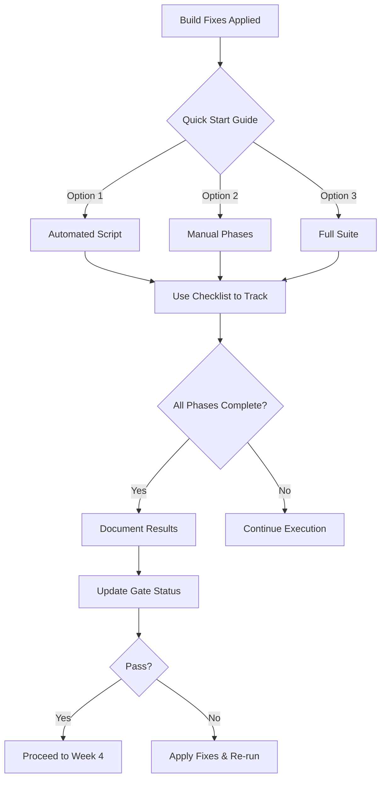

# Phase 2 Testing Documentation Index

**Last Updated**: October 9, 2025  
**Owner**: test-guardian agent

---

## Quick Navigation

### 🚀 Getting Started
- **[Quick Start Guide](QUICK-START-TEST-EXECUTION.md)** - Fast track to running tests
- **[Test Validation Checklist](TEST-VALIDATION-CHECKLIST.md)** - Track progress

### 📋 Research & Strategy
- **[Test Research Summary](TEST-RESEARCH-SUMMARY.md)** - Complete infrastructure analysis
- **[Test Execution Strategy](test-execution-strategy-post-build-fix.md)** - Comprehensive 11-section guide

### 📖 User Guides
- **[Test Execution Guide](test-execution-guide.md)** - How-to for daily use
- **[README](README.md)** - Overview and context

### 🤖 Automation
- **[Test Execution Script](../../scripts/run-phase2-tests.sh)** - Automated test runner

---

## Document Purposes

### Quick Start Guide
**File**: `QUICK-START-TEST-EXECUTION.md`  
**Purpose**: Get tests running in < 5 minutes  
**When to use**: First time running tests after build fix  
**Contents**:
- 3 execution options (automated, manual, full suite)
- Success criteria checklist
- Failure handling
- Command reference

**Audience**: Any developer needing to run tests quickly

---

### Test Validation Checklist
**File**: `TEST-VALIDATION-CHECKLIST.md`  
**Purpose**: Track test execution progress and gate validation  
**When to use**: During test execution to record results  
**Contents**:
- Pre-execution checklist
- 7 phase tracking (smoke, services, repos, integration, new tests, coverage, performance)
- Failure triage tables
- Sign-off section

**Audience**: test-guardian agent, QA lead, project manager

---

### Test Research Summary
**File**: `TEST-RESEARCH-SUMMARY.md`  
**Purpose**: Complete analysis of test infrastructure  
**When to use**: Understanding test architecture, planning improvements  
**Contents**:
- Test framework stack
- Test organization (124 files, 892 methods)
- Mock infrastructure (5 clients)
- Test quality assessment
- Risk analysis
- Key metrics

**Audience**: Architects, senior developers, test-guardian agent

---

### Test Execution Strategy
**File**: `test-execution-strategy-post-build-fix.md`  
**Purpose**: Comprehensive test execution plan (11 sections)  
**When to use**: Detailed test execution planning  
**Contents**:
- 7 phased execution plan (6-8 hours)
- Command reference for every scenario
- Failure triage process
- Success criteria
- Automation potential
- Time estimates

**Audience**: test-guardian agent, technical leads

---

### Test Execution Guide
**File**: `test-execution-guide.md`  
**Purpose**: Daily how-to guide for developers  
**When to use**: Learning how to run tests, debugging  
**Contents**:
- Quick start commands
- Test categories (unit, integration, E2E)
- Running tests locally
- CI/CD integration
- Coverage reports
- Debugging tests
- Troubleshooting

**Audience**: All developers on the team

---

### README
**File**: `README.md`  
**Purpose**: Overview and context  
**When to use**: First-time orientation  
**Contents**:
- Test target summary
- Documentation structure
- Quick reference commands
- Test infrastructure overview
- Quality gates
- Success criteria
- **CRITICAL ALERT**: Week 4 Day 1 gate FAILED

**Audience**: New team members, stakeholders

---

## Recommended Reading Order

### For First-Time Users
1. README.md (5 min) - Get context
2. QUICK-START-TEST-EXECUTION.md (5 min) - Run tests
3. Test Execution Guide (as needed) - Learn details

### For Test Execution After Build Fix
1. QUICK-START-TEST-EXECUTION.md (2 min) - Choose execution method
2. TEST-VALIDATION-CHECKLIST.md (track progress) - Record results
3. test-execution-strategy-post-build-fix.md (reference) - Detailed guidance

### For Understanding Architecture
1. TEST-RESEARCH-SUMMARY.md (20 min) - Complete analysis
2. test-execution-strategy-post-build-fix.md (30 min) - Execution details
3. Test Execution Guide (10 min) - Practical commands

---

## File Locations

```
/Users/aaron/Apps-Coded/HH-v0-fresh/
├── docs/
│   └── testing/
│       ├── INDEX.md (this file)
│       ├── README.md
│       ├── QUICK-START-TEST-EXECUTION.md
│       ├── TEST-VALIDATION-CHECKLIST.md
│       ├── TEST-RESEARCH-SUMMARY.md
│       ├── test-execution-strategy-post-build-fix.md
│       └── test-execution-guide.md
└── scripts/
    └── run-phase2-tests.sh
```

---

## Test Execution Workflow



---

## Key Metrics at a Glance

| Metric | Current | Target | Status |
|--------|---------|--------|--------|
| Test Files | 124 | N/A | ✅ |
| Test Methods | ~892 | 155+ | ✅ |
| Pass Rate | 0% (blocked) | 95%+ | ❌ |
| Coverage | Unknown | 80%+ | ❓ |
| Execution Time | Unknown | < 30 min | ❓ |
| Mock Infrastructure | Complete | Complete | ✅ |
| Documentation | Complete | Complete | ✅ |

---

## Contact & Support

### Primary Contacts
- **test-guardian agent**: Test execution and results
- **refactor-master agent**: Build fixes and compilation
- **simple-architect agent**: Architecture and models

### Escalation Path
1. Compilation errors → refactor-master (P0)
2. Test failures > 20% → simple-architect (P0)
3. Integration failures → All agents (P0)
4. Coverage < 70% → test-guardian (P1)

---

## Recent Updates

### October 9, 2025
- ✅ Created comprehensive test execution strategy
- ✅ Created test research summary
- ✅ Created quick start guide
- ✅ Created validation checklist
- ✅ Created automated test execution script
- ✅ Updated README with critical alert

### Next Actions
- ⏳ Execute tests after build fix
- ⏳ Document results in checklist
- ⏳ Update gate status (PASS/FAIL)
- ⏳ Write 15+ new cross-service tests

---

## Version History

| Version | Date | Changes | Author |
|---------|------|---------|--------|
| 1.0 | Oct 9, 2025 | Initial documentation suite | test-guardian |

---

**Maintained by**: test-guardian agent  
**Last Review**: October 9, 2025  
**Next Review**: After test execution (post-build fix)

---
